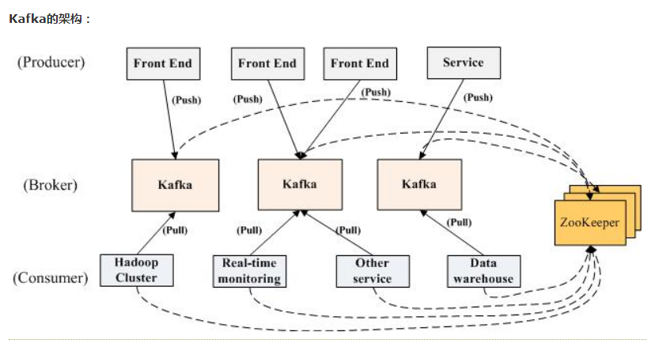
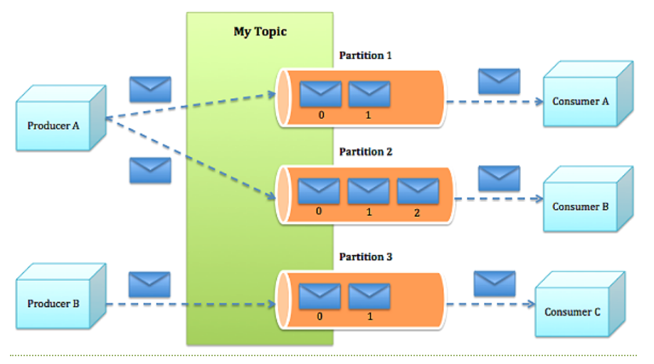

####Kafka简介

Kafka是一个发布-订阅分布式消息系统，它最初由LinkedIn公司开发，之后成为Apache项目的一部分。 **Kafka是一个分布式的，可划分的，冗余备份的持久性的日志服务。它主要用于处理活跃的流式数据。** 

在大数据系统中，常常会碰到一个问题，整个大数据是由各个子系统组成，数据需要在各个子系统中高性能，低延迟的不停流转。传统的企业消息系统并不是非常适合大规模的数据处理。为了同时搞定在线应用（消息）和离线应用（数据文件，日志）Kafka就出现了 。

Kafka可以起到两个作用： 

1. 降低系统组网复杂度。
2. 降低编程复杂度，各个子系统不在是相互协商接口，各个子系统类似插口插在插座上，Kafka承担高速数据总线的作用 

#### Kafka主要特点

1. 同时为发布和订阅提供**高吞吐量**。据了解，Kafka每秒可以生产约25万消息（50 MB），每秒处理55万消息（110 MB）。
2. 可进行持久化操作。将**消息持久化**到磁盘，因此可用于批量消费，例如ETL，以及实时应用程序。通过将数据持久化到硬盘以及replication防止数据丢失。
3. 分布式系统，易于向外扩展。所有的producer、broker和consumer都会有多个，均为分布式的。无需停机即可扩展机器。
4. 消息被处理的状态是在consumer端维护，而不是由server端维护。当失败时能自动平衡
5. 支持online和offline的场景 

#### Kafka架构

Kafka的整体架构非常简单，是显式分布式架构，producer、broker（kafka）和consumer都可以有多个。Producer，consumer实现Kafka注册的接口，数据从producer发送到broker，broker承担一个中间缓存和分发的作用 ;

几个基本概念：

1. Topic：特指Kafka处理的消息源（feeds of messages）的不同分类。
2. Partition：Topic物理上的分组，一个topic可以分为多个partition，每个partition是一个有序的队列。partition中的每条消息都会被分配一个有序的id（offset）。
3. Message：消息，是通信的基本单位，每个producer可以向一个topic（主题）发布一些消息。
4. Producers：消息和数据生产者，向Kafka的一个topic发布消息的过程叫做producers。
5. Consumers：消息和数据消费者，订阅topics并处理其发布的消息的过程叫做consumers。
6. Broker：缓存代理，Kafka集群中的一台或多台服务器统称为broker。

#### 消息发送的流程

1. Producer根据指定的partition方法（round-robin、hash等），将消息发布到指定topic的partition里面
2. kafka集群接收到Producer发过来的消息后，将其持久化到硬盘，并保留消息指定时长（可配置），而不关注消息是否被消费。
3. Consumer从kafka集群pull数据，并控制获取消息的offset

#### Kafka的设计

高吞吐是kafka需要实现的核心目标之一，为此kafka做了以下一些设计：

#####高吞吐 

1. 数据磁盘持久化：消息不在内存中cache，直接写入到磁盘，充分利用磁盘的顺序读写性能
2. zero-copy：减少IO操作步骤
3. 数据批量发送
4. 数据压缩
5. Topic划分为多个partition，提高parallelism

##### 负载均衡

1. producer根据用户指定的算法，将消息发送到指定的partition
2. 存在多个partiiton，每个partition有自己的replica，每个replica分布在不同的Broker节点上
3. 多个partition需要选取出lead partition，lead partition负责读写，并由zookeeper负责fail over
4. 通过zookeeper管理broker与consumer的动态加入与离开

##### Pull 拉去数据

由于kafka broker会持久化数据，broker没有内存压力，因此，consumer非常适合采取pull的方式消费数据，具有以下几点好处 

1. 简化kafka设计
2. consumer根据消费能力自主控制消息拉取速度
3. consumer根据自身情况自主选择消费模式，例如批量，重复消费，从尾端开始消费等

##### 自动扩展

当需要增加broker结点时，新增的broker会向zookeeper注册，而producer及consumer会根据注册在zookeeper上的watcher感知这些变化，并及时作出调整。 

#### Kafka的应用场景

- **消息队列**

  ​	比起大多数的消息系统来说，Kafka有更好的吞吐量，内置的分区，冗余及容错性，这让Kafka成为了一个很好的大规模消息处理应用的解决方案。消息系统一般吞吐量相对较低，但是需要更小的端到端延时，并常常依赖于Kafka提供的强大的持久性保障。在这个领域，Kafka足以媲美传统消息系统，如ActiveMQ或RabbitMQ。

- **行为跟踪** 

  ​	Kafka的另一个应用场景是跟踪用户浏览页面、搜索及其他行为，以发布-订阅的模式实时记录到对应的topic里。那么这些结果被订阅者拿到后，就可以做进一步的实时处理，或实时监控，或放到hadoop/离线数据仓库里处理。 

- **日志收集** 

  ​	日志收集方面，其实开源产品有很多，包括Scribe、Apache Flume。很多人使用Kafka代替日志聚合（log aggregation）。日志聚合一般来说是从服务器上收集日志文件，然后放到一个集中的位置（文件服务器或HDFS）进行处理。然而Kafka忽略掉文件的细节，将其更清晰地抽象成一个个日志或事件的消息流。这就让Kafka处理过程延迟更低，更容易支持多数据源和分布式数据处理。比起以日志为中心的系统比如Scribe或者Flume来说，Kafka提供同样高效的性能和因为复制导致的更高的耐用性保证，以及**更低的端到端延迟** 

- **流处理** 

  ​	这个场景可能比较多，也很好理解。保存收集流数据，以提供之后对接的Storm或其他流式计算框架进行处理。很多用户会将那些从原始topic来的数据进行阶段性处理，汇总，扩充或者以其他的方式转换到新的topic下再继续后面的处理。例如一个文章推荐的处理流程，可能是先从RSS数据源中抓取文章的内容，然后将其丢入一个叫做“文章”的topic中；后续操作可能是需要对这个内容进行清理，比如回复正常数据或者删除重复数据，最后再将内容匹配的结果返还给用户。这就在一个独立的topic之外，产生了一系列的实时数据处理的流程。Strom和Samza是非常著名的实现这种类型数据转换的框架。

- **事件源** 

  ​	事件源是一种应用程序设计的方式，该方式的状态转移被记录为按时间顺序排序的记录序列。Kafka可以存储大量的日志数据，这使得它成为一个对这种方式的应用来说绝佳的后台。比如动态汇总（News feed）。 

- **持久性日志** 

  ​	Kafka可以为一种外部的持久性日志的分布式系统提供服务。这种日志可以在节点间备份数据，并为故障节点数据回复提供一种重新同步的机制。Kafka中日志压缩功能为这种用法提供了条件。在这种用法中，Kafka类似于Apache BookKeeper项目。 

https://blog.csdn.net/lingbo229/article/details/80761778

https://www.jianshu.com/p/d3e963ff8b70