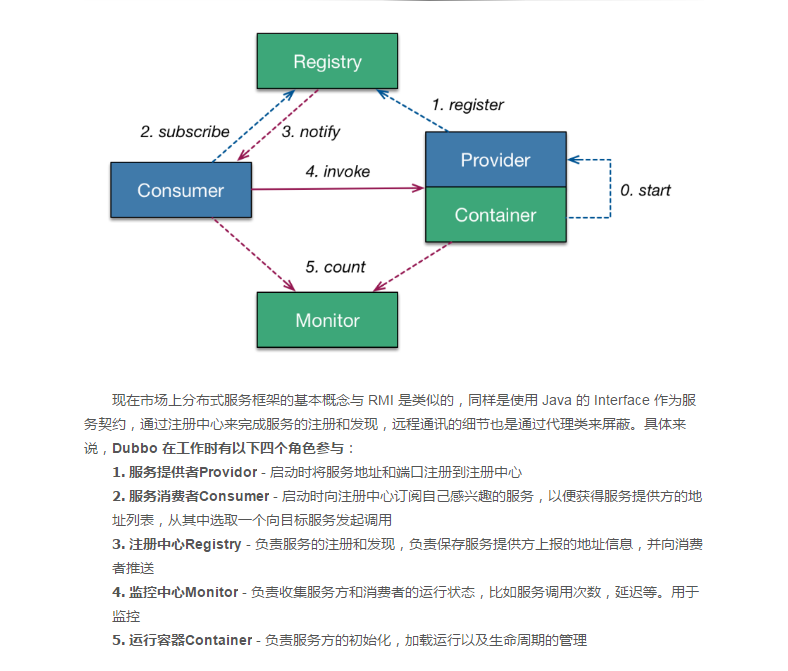

[TOC]


### Dubbo 框架一览

开发中需要建立dubbo模块： interface 模块、provider 模块、consumer 模块，它们都是 DubboDemo 的子模块。其中nterface 模块存放所有的接口、provider 模块提供服务、consumer 消费服务 



### Dubbo常用配置

- application 应用配置，用于配置当前应用信息，不管该应用是提供者还是消费者，主要用来给 zookeeper 注册中心计算应用间依赖关系。

- registry 注册中心配置，用于配置连接注册中心相关信息，可以是zookeper或redis等

- protocol 协议配置，用于配置提供服务的协议信息，协议由提供方指定，消费方被动接受。可以是dubbo协议，hessian协议等

- service  用于服务配置，定义服务的元信息，一个服务可以用多个协议暴露，一个服务也可以注册到多个注册中心。provider 模块用来声明需要暴露的服务接口

- reference 引用服务配置，用于创建一个远程服务代理，一个引用可以指向多个注册中心。 consumer 消费服务模块用来引入要调用的接口

- monitor  监控中心配置，用于配置连接监控中心相关信息，可选

- method 方法配置，用于ServiceConfig和ReferenceConfig指定方法级的配置信息。 可选

- consumer 消费方缺省配置，当ReferenceConfig某属性没有配置时，采用此缺省值，可选。

- provider  提供方的缺省值，当ProtocolConfig和ServiceConfig某属性没有配置时，采用此缺省值，可选。

  

####XML配置方式

dubbo服务端配置：

```xml
<?xml version="1.0" encoding="UTF-8"?>
<!-- 添加 DUBBO SCHEMA -->
<beans xmlns="http://www.springframework.org/schema/beans"
       xmlns:xsi="http://www.w3.org/2001/XMLSchema-instance"
       xmlns:dubbo="http://code.alibabatech.com/schema/dubbo"
       xsi:schemaLocation="http://www.springframework.org/schema/beans
        http://www.springframework.org/schema/beans/spring-beans.xsd http://code.alibabatech.com/schema/dubbo
        http://code.alibabatech.com/schema/dubbo/dubbo.xsd">

    <!-- 应用名：主要用来给 zookeeper 注册中心计算应用间依赖关系 -->
    <dubbo:application name="dubbodemo-provider"/>
    <!-- 注册中心：连接到哪个本地注册中心 -->
    <dubbo:registry id="dubbodemo" address="zookeeper://localhost:2181"/>
    <!-- 协议：用dubbo协议在20880端口暴露服务 -->
    <dubbo:protocol name="dubbo" port="28080"/>
    <!-- service：  用来声明需要暴露的服务接口，这里暴露了IUserService 接口，并将接口注册到 id 为 dubbodemo 的注册中心，它引用了 Spring 中名为 userService 的类，超时时间为 3 秒。 -->
    <dubbo:service registry="dubbodemo" timeout="3000" interface="com.chanshuyi.service.IUserService" ref="userService"/>
</beans>
```

dubbo客户端配置：

其他都与服务端相同，唯一不同的是 ：service配置替换成了reference配置

```xml
 <!-- 需要引入的接口调用 -->
    <dubbo:reference id="userService" interface="com.chanshuyi.service.IUserService"/>
```

#### properties配置文件方式

dubbo 在读取配置的时候会先读取 XML文件中的配置，如果没找到才会去读取resources目录下的 dubbo.properties 文件。如下：

```properties
# 应用名
dubbo.application.name=dubbodemo-provider
# 注册中心地址
dubbo.registry.address=zookeeper://localhost:2181
# 调用协议地址
dubbo.protocol.name=dubbo
dubbo.protocol.port=28080
```

服务的声明和引入还需在xml中配置

#### annotation 配置方式

与xml的区别在于赋予声明和引入的配置使用类注解

```xml
//将 <dubbo:service>  节点换成 <dubbo:annotation> 节点：
<dubbo:annotation package="com.chanshuyi.service.impl" />
```


#### 服务调用超时设置 

配置生效优先级：


- 上图中以timeout为例，显示了配置的查找顺序，其它retries, loadbalance, actives也类似。
- 方法级优先 -> 接口级次之 -> 全局配置再次之 .  如果级别一样，则消费方优先，提供方次之。
-  建议由服务提供方设置超时，因为一个方法需要执行多长时间，服务提供方更清楚，如果一个消费方同时引用多个服务，就不需要关心每个服务的超时设置 

####启动检查设置

- Dubbo缺省会在启动时检查依赖的服务是否可用，不可用时会抛出异常，阻止Spring初始化完成，默认check=true 

- 如果你的Spring容器是懒加载的，或者通过API编程延迟引用服务，请关闭check，否则服务临时不可用时，会抛出异常，拿到null引用.    

- 设置check=false关闭检查，dubbo不会去检查服务状态，总是会返回引用，当服务恢复时，能自动连上 

  ```xml
  1、关闭某个服务的启动时检查：(没有提供者时报错) 写在定义服务消费者一方
  <dubbo:reference interface="com.foo.BarService" check="false" />
  2、关闭所有服务的启动时检查：(没有提供者时报错)  写在定义服务消费者一方
  <dubbo:consumer check="false" />
  3、关闭注册中心启动时检查：(注册订阅失败时报错)
  <dubbo:registry check="false" />
  
  ```

引用缺省是延迟初始化的，只有引用被注入到其它Bean，或被getBean()获取，才会初始化。 如果需要饥饿加载，即没有人引用也立即生成动态代理，可以配置： 

```xml
<dubbo:reference interface="com.foo.BarService" init="true" />
```

#### 令牌验证

防止消费者绕过注册中心访问提供者，在注册中心控制权限，以决定要不要下发令牌给消费者，注册中心可灵活改变授权方式，而不需修改或升级提供者 

```xml
1、全局设置开启令牌验证：
<!--随机token令牌，使用UUID生成-->
<dubbo:provider interface="com.foo.BarService" token="true" />

<!--固定token令牌，相当于密码-->
<dubbo:provider interface="com.foo.BarService" token="123456" />

2、服务级别设置开启令牌验证：
<!--随机token令牌，使用UUID生成-->
<dubbo:service interface="com.foo.BarService" token="true" />

<!--固定token令牌，相当于密码-->
<dubbo:service interface="com.foo.BarService" token="123456" />

3、协议级别设置开启令牌验证：
<!--随机token令牌，使用UUID生成-->
<dubbo:protocol name="dubbo" token="true" />

<!--固定token令牌，相当于密码-->
<dubbo:protocol name="dubbo" token="123456" />
```

####多版本配置

设置不同版本的目的，就是要考虑到接口升级以后带来的兼容问题。在Dubbo中配置不同版本的接口，会在Zookeeper地址中有多个协议url的体现 

服务端provider提供者配置：主要是配置多个相同接口的服务有不同的实现，并指定其版本号

```xml
    <!--发布服务和实现-->
    <dubbo:service interface="com.shuailee.IHello" ref="helloService" version="1.0.0" />
    <bean id="helloService" class="com.shuailee.provider.HelloImpl"></bean>

    <!--发布服务和实现 版本号为2-->
    <dubbo:service interface="com.shuailee.IHello" ref="helloService2" version="1.0.1" />
    <bean id="helloService2" class="com.shuailee.provider.HelloTwoImpl"></bean>
```

客户端consumer消费者配置：只需要指定版本号即可,根据不同版本号调用不同的远程接口

```xml
 <dubbo:reference id="helloService"  interface="com.shuailee.IHello" version="1.0.1"/>
```

#### 集群容错

​	容错机制指的是在系统允许范围内的错误情况的发生，限制系统错误的影响范围一种手段 ，在分布式架构下，网络、硬件、应用都可能发生故障，由于各个服务之间可能存在依赖关系，如果一条链路中的其中一个节点出现故障，将会导致雪崩效应。为了减少某一个节点故障的影响范围，所以我们才需要去构建容错服务，来优雅的处理这种中断的响应结果 ；

fDubbo提供了6种容错机制，分别如下

1. failsafe 失败安全，可以认为是把错误吞掉（记录日志）; 此时返回null
2. failover(默认)   重试其他服务器； 重试次数默认2次  retries（2） 失败返回异常
3. failfast 快速失败， 失败以后立马报错   失败返回异常
4. failback  失败后自动恢复。
5. forking  forks. 设置并行数
6. broadcast  广播，任意一台报错，则执行的方法报错

配置在消费方，通过cluster方式，配置指定的容错方案，方式如下：

```xml
<dubbo:reference id="helloService"  interface="com.shuailee.IHello" version="1.0.1" cluster="failover"/>
```

#### 服务降级

降级的目的是为了保证核心服务可用。降级可以有几个层面的分类： 自动降级和人工降级； 按照功能可以分为：读服务降级和写服务降级；

1. 对一些非核心服务进行人工降级，在大促之前通过降级开关关闭哪些推荐内容、评价等对主流程没有影响的功能 
2. 故障降级，比如调用的远程服务挂了，网络故障、或者RPC服务返回异常。 那么可以直接降级，降级的方案比如设置默认值、采用兜底数据（系统推荐的行为广告挂了，可以提前准备静态页面做返回）等等 
3. 限流降级，在秒杀这种流量比较集中并且流量特别大的情况下，因为突发访问量特别大可能会导致系统支撑不了。这个时候可以采用限流来限制访问量。当达到阀值时，后续的请求被降级，比如进入排队页面，比如跳转到错误页（活动太火爆，稍后重试等） 

dubbo的降级方式： Mock ，当接口超时或者异常时，通过返回固定数据来让接口继续可用，而不至于引发服务集群的崩溃。类似于故障降级；

配置在消费方：

```xml
<!--1 在客户端创建Mock类HelloTestMock-->
<!--2 在消费方配置中加入mock节点，并指向HelloTestMock-->
<!--3 模拟错误，超时时间设置2毫秒。集群容错策略为默认或报错情况下会走mock，如果配置成failsafe不会走mock，会立马返回null -->
    <dubbo:reference id="helloService"  interface="com.shuailee.IHello"
                     version="1.0.1"
                     cluster="failover"
                     mock="com.shuailee.mock.HelloTestMock" timeout="2"/>


```

