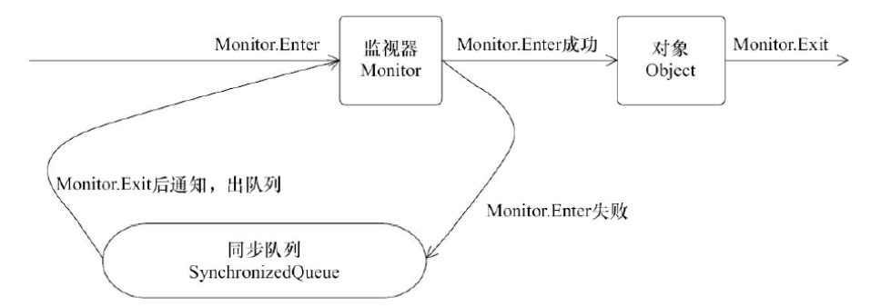
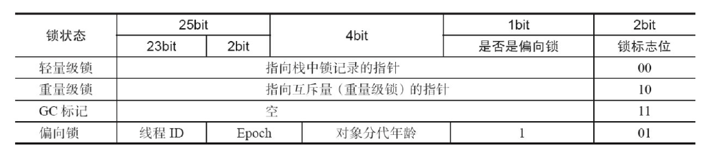

## synchronized的实现原理

###synchronized简介

synchronized是JAVA语言的一个关键字，使用 synchronized 来修饰方法或代码块的时候，能够保证多个线程中最多只有一个线程执行该段代码 。synchronized·关键字加在方法上还是对象上，它获取的都是对象锁，而不是将一段代码或一个函数当作锁，而且同步方法很可能还会被其他线程的对象访问。

多个线程同时访问该对象的synchronized 方法，如果该对象实例有多个synchronized方法，任意线程访问了其中的一个synchronized方法，剩余线程则不能并发访问该对象中任何一个synchronized方法（不同对象实例的 synchronized方法是互不干扰的。其它线程依然可以并发访问相同对象类不同实例中的synchronized方法，如果想做到在不同对象实例同步需要使用class literal的方式，即synchronized 括号后放Bank4.class）

##### synchronized有三种方式来加锁：

1. 实例方法加锁（同步方法）：作用于当前实例加锁，进入同步代码前要获得当前实例的锁
2. 静态方法加锁：作用于当前类对象加锁，进入同步代码前要获得当前类对象的锁
3. 代码块加锁（同步代码块）：指定加锁对象，对给定对象加锁，进入同步代码库前要获得给定对象的锁。

##### 获取锁的线程释放锁只会有两种情况：

1. 获取锁的线程执行完了该代码块，然后线程释放对锁的占有；
2. 线程执行发生异常，此时JVM会让线程自动释放锁。

##### 看一个静态方法使用synchronized 实现同步访问的案例：

```java
class Bank1 {
     synchronized static void transferAccount() {
        System.out.println("开始转账：" + Thread.currentThread().getName());
        try {
            Thread.sleep(3 * 1000);
        } catch (InterruptedException e) {
            e.printStackTrace();
        }
        System.out.println("转账完毕");
    }

     synchronized static void debit() {
        System.out.println("开始扣款：" + Thread.currentThread().getName());
        try {
            Thread.sleep(3 * 1000);
        } catch (InterruptedException e) {
            e.printStackTrace();
        }
        System.out.println("扣款完毕");
    }
}

public class BankMain {

    public static void main(String[] args) {
        new Thread(Bank1::transferAccount, "北京银行").start();
        new Thread(Bank1::debit, "上海银行").start();
    }
}
////////////////////////日志////////////////////////
开始转账：北京银行
转账完毕
开始扣款：上海银行
扣款完毕
////////////////////////日志////////////////////////
```

##### synchronized实例方法加锁案例：

```java
class Bank2 implements Runnable {

    @Override
    public synchronized void run() {
        System.out.println("查询数据：" + Thread.currentThread().getName());
        System.out.println("开始转账：" + Thread.currentThread().getName());
        try {
            Thread.sleep(5 * 1000);
        } catch (InterruptedException e) {
            e.printStackTrace();
        }
        System.out.println("转账完毕");
    }
}

public class BankMain {

    public static void main(String[] args) {
        Bank2 bank2 = new Bank2();
        new Thread(bank2, "北京银行").start();
        new Thread(bank2, "上海银行").start();
    }
}
////////////////////////日志////////////////////////
查询数据：北京银行
开始转账：北京银行
转账完毕
查询数据：上海银行
开始转账：上海银行
转账完毕
////////////////////////日志////////////////////////
```

##### 代码块加锁案例：

```java
class Bank3 implements Runnable {
    private final byte[] LOCKOBJ = new byte[0]; // 特殊的实例化变量

    @Override
    public void run() {
        System.out.println("查询数据：" + Thread.currentThread().getName());
        synchronized (LOCKOBJ) {//互斥部分上锁，查询数据部分则并发执行
            System.out.println("开始转账：" + Thread.currentThread().getName());
            try {
                Thread.sleep(5 * 1000);
            } catch (InterruptedException e) {
                e.printStackTrace();
            }
            System.out.println("转账完毕");
        }
    }
}

public class BankMain {

    public static void main(String[] args) {
        Bank3 bank = new Bank3();
        new Thread(bank, "北京银行").start();
        new Thread(bank, "上海银行").start();
    }
}
////////////////////////日志////////////////////////
查询数据：北京银行
查询数据：上海银行
开始转账：北京银行
转账完毕
开始转账：上海银行
转账完毕
////////////////////////日志////////////////////////
```

##### synchronized 是对象锁，他只会锁当前实例，如果多实例情况下需使用`class literal `的方式 ,锁当前类

```java
class Bank4 implements Runnable {
    @Override
    public void run() {
        System.out.println("查询数据：" + Thread.currentThread().getName());
        synchronized (Bank4.class) {
            System.out.println("开始转账：" + Thread.currentThread().getName());
            try {
                Thread.sleep(5 * 1000);
            } catch (InterruptedException e) {
                e.printStackTrace();
            }
            System.out.println("转账完毕");
        }
    }
}

public class BankMain {

    public static void main(String[] args) {
        new Thread(new Bank4(), "北京银行").start();
        new Thread(new Bank4(), "上海银行").start();
    }
}

////////////////////////日志////////////////////////
查询数据：北京银行
查询数据：上海银行
开始转账：北京银行
转账完毕
开始转账：上海银行
转账完毕
////////////////////////日志////////////////////////
```

#### synchronized的锁的原理

##### monitor监视器

​	通过javap -v 来查看对应代码的字节码指令，对于同步块的实现使用了monitorenter和monitorexit指令，前面我
们在讲JMM的时候，提到过这两个指令，他们隐式的执行了主内存和工作内存八中交互中的Lock和UnLock操作，用于提供原子性保证。monitorenter指令插入到同步代码块开始的位置、monitorexit指令插入到同步代码块结束位置，jvm需要保证每个monitorenter都有一个monitorexit对应。这两个指令，本质上都是对一个对象的监视器(monitor)进行获取，这个过程是排他的，也就是说同一时刻只能有一个线程获取到由synchronized所保护对象的监视器,线程执行到monitorenter指令时，会尝试获取对象所对应的monitor所有权，也就是尝试获取对象的锁；而执行monitorexit，就是释放monitor的所有权

​	monitor 的重要特点是，同一个时刻，只有一个 进程/线程 能进入 monitor 中定义的临界区，这使得 monitor 能够达到互斥的效果。无法进入 monitor 临界区的 进程/线程，它们会被阻塞，并且在必要的时候会被唤醒。被 synchronized 关键字修饰的方法、代码块，就是 monitor 机制的临界区。 

monitor 机制需要几个元素来配合 ：

1. 临界区
2. monitor 对象及锁
3. 条件变量以及定义在 monitor 对象上的 wait，signal 操作。

​      使用 monitor 机制的目的主要是为了互斥进入临界区，为了做到能够阻塞无法进入临界区的 进程/线程，还需要一个 monitor object 来协助，这个 monitor object 内部会有相应的数据结构，例如列表，来保存被阻塞的线程； 同时由于 monitor 机制本质上是基于 mutex 这种基本原语的，所以 monitor object 还必须维护一个基于 mutex 的锁。 为了在适当的时候能够阻塞和唤醒 进程/线程，还需要引入一个条件变量，这个条件变量用来决定什么时候是“适当的时候”，这个条件可以来自程序代码的逻辑，也可以是在 monitor object 的内部，总而言之，程序员对条件变量的定义有很大的自主性。不过，由于 monitor object 内部采用了数据结构来保存被阻塞的队列，因此它也必须对外提供两个 API 来让线程进入阻塞状态以及之后被唤醒，分别是 wait 和 notify。 

##### monitor object

​	分析之前的synchronized得使用，往往需要指定一个对象与之关联，例如 synchronized(this)，或者 synchronized(ANOTHER_LOCK)，synchronized 如果修饰的是实例方法，那么其关联的对象实际上是 this，如果修饰的是类方法，那么其关联的对象是 this.class。总之，synchronzied 需要关联一个对象，而这个对象就是 monitor object。 monitor 的机制中，monitor object 充当着维护 mutex以及定义 wait/signal API 来管理线程的阻塞和唤醒的角色。Java 语言中的 java.lang.Object 类，便是满足这个要求的对象，任何一个 Java 对象都可以作为 monitor 机制的 monitor object。  

​	Java 对象存储在内存中，分别分为三个部分，即对象头、实例数据和对齐填充，而在其对象头中，保存了锁标识；同时，java.lang.Object 类定义了 wait()，notify()，notifyAll() 方法，这些方法的具体实现，依赖于一个叫 ObjectMonitor 模式的实现，基本原理：

​	当一个线程需要获取 Object 的锁时，会被放入 EntrySet 中进行等待，如果该线程获取到了锁，成为当前锁的 owner。如果根据程序逻辑，一个已经获得了锁的线程缺少某些外部条件，而无法继续进行下去（例如生产者发现队列已满或者消费者发现队列为空），那么该线程可以通过调用 wait 方法将锁释放，进入 wait set 中阻塞进行等待，其它线程在这个时候有机会获得锁，去干其它的事情，从而使得之前不成立的外部条件成立，这样先前被阻塞的线程就可以重新进入 EntrySet 去竞争锁。这个外部条件在 monitor 机制中称为条件变量。 




##### 对象头Mawrk Word	

Mark Word用于存储对象自身的运行时数据，如哈希码（HashCode）、GC分代年龄、锁状态标志、线程持有的
锁、偏向线程 ID、偏向时间戳等等。Java对象头一般占有两个机器码（在32位虚拟机中，1个机器码等于4字节，
也就是32bit）



#### synchronized的锁升级和获取过程

synchronized的锁是进行过优化的，引入了偏向锁、轻量级锁；锁的级别从低到高逐步升级， 无锁->偏向锁->轻量级锁->重量级锁

##### 自旋锁（CAS）

自旋锁就是让不满足条件的线程等待一段时间，而不是立即挂起。看持有锁的线程是否能够很快释放锁。怎么自旋呢？其实就是一段没有任何意义的循环。虽然它通过占用处理器的时间来避免线程切换带来的开销，但是如果持有锁的线程不能在很快释放锁，那么自旋的线程就会浪费处理器的资源，因为它不会做任何有意义的工作。所以，自旋等待的时间或者次数是有一个限度的，如果自旋超过了定义的时间仍然没有获取到锁，则该线程应该被挂起

##### 偏向锁

大多数情况下，锁不仅不存在多线程竞争，而且总是由同一线程多次获得，为了让线程获得锁的代价更低而引入了偏向锁。当一个线程访问同步块并获取锁时，会在对象头和栈帧中的锁记录里存储锁偏向的线程ID，以后该线程在进入和退出同步块时不需要进行CAS操作来加锁和解锁，只需简单地测试一下对象头的Mark Word里是否存储着指向当前线程的偏向锁。如果测试成功，表示线程已经获得了锁。如果测试失败，则需要再测试一下Mark Word中偏向锁的标识是否设置成1（表示当前是偏向锁）：如果没有设置，则使用CAS竞争锁；如果设置了，则尝试使用CAS将对象头的偏向锁指向当前线程

#### 轻量级锁

引入轻量级锁的主要目的是在多没有多线程竞争的前提下，减少传统的重量级锁使用操作系统互斥量产生的性能消耗。当关闭偏向锁功能或者多个线程竞争偏向锁导致偏向锁升级为轻量级锁，则会尝试获取轻量级锁

#### 重量级锁

重量级锁通过对象内部的监视器（monitor）实现，其中monitor的本质是依赖于底层操作系统的Mutex Lock实现，操作系统实现线程之间的切换需要从用户态到内核态的切换，切换成本非常高。前面我们在讲Java对象头的时候，讲到了monitor这个对象，在hotspot虚拟机中，通过ObjectMonitor类来实现monitor。他的锁的获取过程的体现会简单很多


#### 一 synchronized的缺陷，为什么要使用锁


那么如果这个获取锁的线程由于要等待IO或者其他原因（比如调用sleep方法）被阻塞了，但是又没有释放锁，其他线程便只能干巴巴地等待.因此就需要有一种机制可以不让等待的线程一直无期限地等待下去（比如只等待一定的时间或者能够响应中断），通过Lock就可以办到（可中断锁）,通过Lock可以知道线程有没有成功获取到锁。这个是synchronized无法办到的.

1. Lock不是Java语言内置的，synchronized是Java语言的关键字，因此是内置特性。Lock是一个类，通过这个类可以实现同步访问；
2. Lock和synchronized有一点非常大的不同，采用synchronized不需要用户去手动释放锁，当synchronized方法或者synchronized代码块执行完之后，系统会自动让线程释放对锁的占用；而Lock则必须要用户去手动释放锁，如果没有主动释放锁，就有可能导致出现死锁现象。

#### 二 锁 Lock
锁像synchronized同步块一样，是一种线程同步机制，但比Java中的synchronized同步块更复杂。因为锁（以及其它更高级的线程同步机制）是由synchronized同步块的方式实现的，所以我们还不能完全摆脱synchronized关键字.
从Java 5之后，在java.util.concurrent.locks包下提供了另外一种方式来实现同步访问，那就是Lock
##### Lock的实现原理
```
 //一个Lock类的简单实现

public class Lock{
    private boolean isLocked = false;
    public synchronized void lock()
        throws InterruptedException{
        while(isLocked){
            wait();
        }
        isLocked = true;
    }
    public synchronized void unlock(){
        isLocked = false;
        notify();
    }
}

//Lock的使用
//lock()方法会对Lock实例对象进行加锁，因此所有对该对象调用lock()方法的线程都会被阻塞，直到该Lock对象的unlock()方法被调用
public class Counter{
    private Lock lock = new Lock();
    private int count = 0;
    public int inc(){
        lock.lock();
        int newCount = ++count;
        lock.unlock();
        return newCount;
    }
}

```
##### 锁的可重入性
Java中的synchronized同步块是可重入的。这意味着如果一个java线程进入了代码中的synchronized同步块，并因此获得了该同步块使用的同步对象对应的管程上的锁，那么这个线程可以进入由同一个管程对象所同步的另一个java代码块.
```
public class ReentrantDemo{
    public synchronized outer(){
        inner();
    }
    public synchronized inner(){
        //do something
    }
}

```
注意outer()和inner()都被声明为synchronized，这在Java中和synchronized(this)块等效。如果一个线程调用了outer()，在outer()里调用inner()就没有什么问题，因为这两个方法（代码块）都由同一个管程对象（”this”)所同步。==如果一个线程已经拥有了一个管程对象上的锁，那么它就有权访问被这个管程对象同步的所有代码块。这就是可重入。线程可以进入任何一个它已经拥有的锁所同步着的代码块。==

由synchronized于存在可重入性，所以上面Lock类的实现在某种场景下会存在问题，例如：
```
//前面给出的锁实现不是可重入的。如果我们像下面这样重写Reentrant类，当线程调用outer()时，会在inner()方法的lock.lock()处阻塞住。
public class Reentrant2{
    Lock lock = new Lock();
    public outer(){
        lock.lock();
        inner();
        lock.unlock();
    }
    public synchronized inner(){
        lock.lock();
        //do something
        lock.unlock();
    }
}

```
为了让这个Lock类具有可重入性，我们需要对它做一点小的改动：

```
public class Lock{
    boolean isLocked = false;
    Thread  lockedBy = null;
    int lockedCount = 0;
    public synchronized void lock()
        throws InterruptedException{
        Thread callingThread =
            Thread.currentThread();
        while(isLocked && lockedBy != callingThread){
            wait();
        }
        isLocked = true;
        lockedCount++;
        lockedBy = callingThread;
  }
    public synchronized void unlock(){
        if(Thread.curentThread() ==
            this.lockedBy){
            lockedCount--;
            if(lockedCount == 0){
                isLocked = false;
                notify();
            }
        }
    }
    ...
}
//注意到现在的while循环（自旋锁）也考虑到了已锁住该Lock实例的线程。如果当前的锁对象没有被加锁(isLocked = false)，
//或者当前调用线程已经对该Lock实例加了锁，那么while循环就不会被执行，调用lock()的线程就可以退出该方法（译者注：“被允许退出该方法”在当前语义下就是指不会调用wait()而导致阻塞）。
//我们需要记录同一个线程重复对一个锁对象加锁的次数。否则，一次unblock()调用就会解除整个锁，即使当前锁已经被加锁过多次。
//在unlock()调用没有达到对应lock()调用的次数之前，我们不希望锁被解除。
//现在这个Lock类就是可重入的了。
```

####  三 锁的公平性
##### 饥饿和公平
如果一个线程因为CPU时间全部被其他线程抢走而得不到CPU运行时间，这种状态被称之为“饥饿”。而该线程被“饥饿致死”正是因为它得不到CPU运行时间的机会。解决饥饿的方案被称之为“公平性”，即所有线程均能公平地获得运行机会。
##### Java中导致饥饿的原因：
- 高优先级线程吞噬所有的低优先级线程的CPU时间。
- 线程被永久堵塞在一个等待进入同步块的状态。
- 线程在等待一个本身也处于永久等待完成的对象(比如调用这个对象的wait方法)。

##### 公平锁
==公平锁即尽量以请求锁的顺序来获取锁。比如同是有多个线程在等待一个锁，当这个锁被释放时，等待时间最久的线程（最先请求的线程）会获得该所，这种就是公平锁==。非公平锁即无法保证锁的获取是按照请求锁的顺序进行的。这样就可能导致某个或者一些线程永远获取不到锁。

在Java中，synchronized就是非公平锁，它无法保证等待的线程获取锁的顺序。而对于ReentrantLock和ReentrantReadWriteLock，它默认情况下是非公平锁，但是可以设置为公平锁

#### 四 ReentrantLock
 ==ReentrantLock是一个可重入的互斥锁，又被称为“独占锁”。ReentrantLock 类实现了 Lock ，它拥有与 synchronized 相同的并发性和内存语义，但是添加了类似锁投票、定时锁等候和可中断锁等候的一些特性。此外，它还提供了在激烈争用情况下更佳的性能。（换句话说，当许多线程都想访问共享资源时，JVM 可以花更少的时候来调度线程，把更多时间用在执行线程上。==）

 顾名思义，ReentrantLock锁在同一个时间点只能被一个线程锁持有；而可重入的意思是，ReentrantLock锁，可以被单个线程多次获取。ReentrantLock分为“公平锁”和“非公平锁”。它们的区别体现在获取锁的机制上是否公平。“锁”是为了保护竞争资源，防止多个线程同时操作线程而出错，==ReentrantLock在同一个时间点只能被一个线程获取(当某线程获取到“锁”时，其它线程就必须等待)；ReentraantLock是通过一个FIFO的等待队列来管理获取该锁所有线程的。在“公平锁”的机制下，线程依次排队获取锁；而“非公平锁”在锁是可获取状态时，不管自己是不是在队列的开头都会获取锁。==

 ##### ReentrantLock 与 synchronized 的比较
 相同：ReentrantLock提供了synchronized类似的功能和内存语义。
 不同：

（1）与synchronized相比，ReentrantLock提供了更多，更加全面的功能，具备更强的扩展性。例如：时间锁等候，可中断锁等候，锁投票。

（2）ReentrantLock还提供了条件Condition，对线程的等待、唤醒操作更加详细和灵活，所以在多个条件变量和高度竞争锁的地方，ReentrantLock更加适合（下面会阐述Condition）。

（3）ReentrantLock提供了可轮询的锁请求。它会尝试着去获取锁，如果成功则继续，否则可以等到下次运行时处理，而synchronized则一旦进入锁请求要么成功，要么一直阻塞，所以相比synchronized而言，ReentrantLock会不容易产生死锁些。

（4）ReentrantLock支持更加灵活的同步代码块，但是使用synchronized时，只能在同一个synchronized块结构中获取和释放。注：ReentrantLock的锁释放一定要在finally中处理，否则可能会产生严重的后果。

（5）ReentrantLock支持中断处理，且性能较synchronized会好些。
##### ReentrantLock 不好与需要注意的地方
1.  lock 必须在 finally 块中释放。否则，如果受保护的代码将抛出异常，锁就有可能永远得不到释放
2.  当 JVM 用 synchronized 管理锁定请求和释放时，JVM 在生成线程转储时能够包括锁定信息。这些对调试非常有价值，因为它们能标识死锁或者其他异常行为的来源。 Lock 类只是普通的类，JVM 不知道具体哪个线程拥有 Lock 对象。

#### 五 Condition
Condition是在java 1.5中才出现的，它用来替代传统的Object的wait()、notify()实现线程间的协作，相比使用Object的wait()、notify()，使用Condition的await()、signal()这种方式实现线程间协作更加安全和高效。因此通常来说比较推荐使用Condition。
详细介绍请参看 线程调度那篇文章


