# 分布式事务和分布式一致性协议

### 一 分布式系统简介

单机处理能力主要依靠CPU、内存、磁盘硬件资源，但是这些资源都会有自己的性能平静，随着系统的发展，应用系统往往需要承担高并发，高吞吐量，高可用等能力。单机满足不了现实需要。所以才诞生了众多的分布式系统。

分布式系统是将应用分布在多台计算机上，彼此之间通过消息传递进行通信和协调的系统。分布式系统具有分布性、对等性、并发性、缺乏全局时钟、故障总会发生的特点，由于这些特点导致了分布式系统中的一致性难题

### 二分布式系统常见概念

**集群**

> 同一个业务，部署在多个服务器上共同承担外界的调用压力，可以解决单点问题。数据库层面的集群可以解决容错问题，其中一台服务器挂了，不会影响服务的正常访问。N台机器可以同时做同一件事，例如海量请求都来调用同一服务，单个服务处理不过来，可以将此服务部署到N个服务器上，这些服务器组成集群同时处理海量请求。

**分布式**

> * 将多个业务分开部署到不同机器上，每个业务服务相互隔离，分散了负载。同时也可也将每个业务单独部署成集群，这个业务集群可能操作相同的底层数据来源，例如读取配置，数据库，设置集中式缓存等，那这个服务和读取配置等操作之间的关系是分布式的。这样子就带来了分布式系统下常见的问题：数据一致性，分布式事物，以及锁竞争等。
> * 而对于被访问端（配置，数据库，缓存服务等），随着被并发访问的次数增加，负载越来越大，也可以部署成集群，将原本存储在一台服务器的数据分散到存储在多台服务器上，从而每台只存储少量的数据（分片存储），来提升写入和读取的性能。

**节点**

> 节点是指一个可以独立按照分布式协议完成一组逻辑的程序 个体（可以认为集群中一台服务器是一个节点）。在具体的项目中，一个节点表示的是一个操作系统上的 进程。

**分片**： 分片是指拆分数据为多份存储

**副本**

> 副本(replica/copy)指在分布式系统中为数据或服务提供的冗 余。 数据副本指在不同的节点上持久化同一份数据，当出现某一个 节点的数据丢失时，可以从副本上读取到数据。数据副本是分 布式系统中解决数据丢失问题的唯一手段。服务副本表示多个节点提供相同的服务，通过主从关系来实现 服务的高可用方案 。同时带来了数据一致性问题

* **中间件**
> 中间件位于操作系统提供的服务之外，又不属于应用，他是位 于应用和系统层之间为开发者方便的处理通信、输入输出的一 类软件，能够让用户关心自己应用的部分。

* **网络分区**
> 当网络由于发生异常情况，导致分布式系统中部分节点之间的网络延时不断增大，最终导致组成分布式系统的所有节点中，只有部分节点之间能够正常通信，而另一些节点则不能----我们将这个现象称为网络分区。当网络分区出现时，分布式系统会出现局部小集群，在极端情况下，这些局部小集群会独立完成原本需要整个分布式系统才能完成的功能，包括对数据的事物处理，这就对分布式一致性提出了非常大的挑战

* **三态**
> 分布式系统的每一次请求与响应，存在特有的三态概念，即成功、失败、超时。 在传统的单机系统中，应用程序在调用一个函数之后，能够得到一个非常明确的响应：成功或失败。而在分布式系统中，由于网络是不可靠的，虽然在绝大部分情况 下，网络通信也能够接受到成功或失败的响应，当时当网络出现异常的情况下，就可能会出现超时现象

### 三 分布式理论

#### （1）CAP 定理

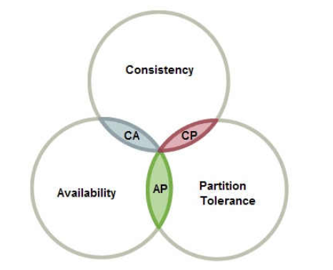

指的是在一个分布式系统中， Consistency（一致性）、 Availability（可用性）、Partition tolerance（分区容错性），这三个基本需求最多只能同时满足其中两项。

1. **一致性(C)** 在分布式环境下，一致性是指数据在多个副本之间能否保持一致的特性
2. **可用性(A)** 可用性是指系统提供的服务必须一直处于可用的状态，在集群中一部分节点故障后，集群整体是否还能响应客户端的读写请求。（对数据更新具备高可用性）
3. **分区容忍性（P）** 分区相当于对通信的时限要求，系统如果不能在时限内达成数据一致性，就意味着发生了分区的情况，必须就当前操作在C和A之间做出选择。
|CA|放弃分区容错性，加强一致性和可用性，是传统的单机数据库的选择                                                             |
|AP|放弃一致性（这里说的一致性是强一致性），追求分区容错性和可用性，这是很多分布式系统设计时的选择，例如很多NoSQL系统就是如此|
|CP|放弃可用性，追求一致性和分区容错性，基本不会选择，网络问题会直接让整个系统不可用                                         |

#### （2）BASE 理论

BASE是 **Basically Available（基本可用）+ Soft state（软状态）+ Eventually consistent（最终一致）** 三个短语的简写组合，是由CAP理论发展而来，主要解决分布式系统中一致性和可用性之间的平衡问题。BASE理论的核心思想是：**在无法做到数据强一致性的时候，捅过牺牲强一致性来获得可用性，并允许数据在一段时间内是不一致的，但最终达到一致状态**

* **基本可用 Basically Available**： 保证功能的部分可用，例如允许系统响应时间适当延长，允许系统系统降级使部分非核心功能不可用。但这绝不等价于系统不可用。
* **软状态Soft state**：软状态指允许系统中的数据存在中间状态，并认为该中间状态的存在不会影响系统的整体可用性，即允许系统在不同节点的数据副本之间进行数据同步的过程存在延时
* **最终一致性**：最终一致性的本质是保证在一段时间以后节点的数据最终能够达到一致，而不需要实时保证系统数据的强一致性。
#### (3) 分布式数据一致性

所谓的分布式下数据一致性问题在计算机原理中也有体现，单核计算机升级为多核计算机 跟现在的单机系统升级为分布式系统所面临的问题有着异曲同工之妙，面临的问题是相同的，同样的解决方案也类似。

**集群数据一致性问题：**

* 主从或副本之间数据如何同步

* 转账业务中的扣款和存款需要保证一边减少一边增加了

* 数据库缓存的双写

所谓分布一致性问题，是指在分布式环境中引入数据复制机制之后在对一个副本数据进行更新的时候，必须确保也能够更新其他的 副本，否则不同副本之间的数据将不一致。最直接办法就是阻塞写入动作直到所有服务器都写入完毕，他解决了一致性问题但是降低了系统写入的性能，在一个写很频繁的场景中会导致大量的写请求挤压，从而系统性能急剧下降。于是一致性级别出现了：
**1. 强一致性**：这种一致性级别是最符合用户直觉的，它要求系统写入什么，读出来的也会是什么，用户体验好，但实现起来往往对系统的性能影响大

**2. 弱一致性**：这种一致性级别约束了系统在写入成功后，不承诺立即可以读到写入的值，也不久承诺多久之后数据能够达到一致，但会尽可能地保证到某个时间级别（比如秒级别）后，数据能够达到一致状态

**3. 最终一致性**：最终一致性是弱一致性的一个特例，系统会保证在一定时间内，能够达到一个数据一致的状态。这里之所以将最终一致性单独提出来，是因为它是弱一致性中非常推崇的一种一致性模型，也是业界在大型分布式系统的数据一致性上比较推崇的模型

#### (4) 分布式事务

事务是指组成事务的操作都正常执行的情况下方可提交，他将一个活动涉及到的所有操作纳入一个不可分割的单元。就是要么什么都不做，要做就要全部成功的机制。

##### 1 事物具有ACID四个特性：

1. **原子性（atomicity）**：一个事务是一个不可分割的工作单位，事务中包括的诸操作要么都做，要么都不做。
2. **一致性（consistency）**：事务必须是使数据库从一个一致性状态变到另一个一致性状态。一致性与原子性是密切相关的。
3. **隔离性（isolation）**：一个事务的执行不能被其他事务干扰。即一个事务内部的操作及使用的数据对并发的其他事务是隔离的，并发执行的各个事务之间不能互相干扰。
4. **持久性（durability）**：持久性也称永久性（permanence），指一个事务一旦提交，它对数据库中数据的改变就应该是永久性的。接下来的其他操作或故障不应该对其有任何影响
##### 2 数据库事务的四种隔离级别

**隔离性所带来的问题：**

* **脏读**：脏读是指在一个事务处理过程里读取了另一个未提交的事务中的数据。
* **不可重复读**：(针对数据修改)对于数据库中的某个数据，一个事务范围内多次查询却返回了不同的数据值，这是由于在查询间隔，被另一个事务修改并提交了。
* **幻读**：（针对数据新增）幻读是事务非独立执行时发生的一种现象。例如事务T1对一个表中所有的行的某个数据项做了从“1”修改为“2”的操作，这时事务T2又对这个表中插入了一行数据项，而这个数据项的数值还是为“1”并且提交给数据库。而操作事务T1的用户如果再查看刚刚修改的数据，会发现还有一行没有修改，其实这行是从事务T2中添加的，就好像产生幻觉一样，这就是发生了幻读。
**MySQL数据库为我们提供的四种隔离级别：**

1. **Read uncommitted 、读未提交**：就是一个事务可以读取另一个未提交事务的数据。会造成脏读问题（读到了未提交的数据后来这个数据被回滚了，造成数据不准确）
2. **Read committed 读提交**：就是一个事务要等另一个事务提交后才能读取数据，能够解决脏读问题，但是不能解决不可重复读问题（一个事务第一次读到数据和第二次读到数据不一致，原因是在两次读取之间有别的事务修改了数据并提交了。
3. **Repeatable read -重复读**：就是在开始一个事务时时，不再允许修改操作。 可以解决不可重复读的问题，不可重复读对应的是修改，即UPDATE操作。但是可能还会有幻读问题。因为幻读问题对应的是插入INSERT操作，而不是UPDATE操作；（程序员某一天去消费，花了2千元，然后他的妻子去查看他今天的消费记录（全表扫描FTS，妻子事务开启），看到确实是花了2千元，就在这个时候，程序员花了1万买了一部电脑，即新增INSERT了一条消费记录，并提交。当妻子打印程序员的消费记录清单时（妻子事务提交），发现花了1.2万元，似乎出现了幻觉，这就是幻读。）
4. **Serializable 串行化读**：Serializable 是最高的事务隔离级别，在该级别下，事务串行化顺序执行，可以避免脏读、不可重复读与幻读。但是这种事务隔离级别效率低下，比较耗数据库性能，一般不使用。
> RR这是MYSQL InnoDB默认的隔离级别，其他数据库的默认隔离级别通常是RC，幻读和不可重复读区别在于 幻读针对得是插入Insert操作，不可重复读针对得是Update更新操作

##### 3 MVCC多版本并发控制

* MVCC，Multi-Version Concurrency Control，多版本并发控制。MVCC 是一种并发控制的方法，一般在数据库管理系统中，实现对数据库的并发访问。mvcc可以解决重复读的问题。
* 在数据库数据被多个事务同时访问的时候可能会造成事务中数据不一致的情况发生，通过加锁方式，让所有的读等待写工作完成在进行可以解决此问题，但是这样效率会很差。Mysql的大多数事务型存储引擎实现的都不是简单的行级锁。基于提升并发性能的考虑，它们一般都同时实现了多版本并发控制（MVCC）。
* MVCC的实现，是通过保存数据在某一个时间点的快照来实现的。因此每一个事务无论执行多长时间看到的数据，都是一样的。在事务隔离级别为RC和RR级别下， InnnoDB存储引擎使用的才是多版本并发控制。然而，对于快照数据的定义却不相同。在RC事务隔离级别下，对于快照数据（undo端数据），总是读取被锁定行的最新的一份快照数据。而在RR事务隔离级别下，对于快照数据，多版本并发控制总是读取事务开始时的行数据。
##### 4 分布式事务

分布式事务是指会涉及到操作多个数据库的事务，其实就是将对同一库事务的概念扩大到了对多个库的事务。目的是为了保证分布式系统中的数据一致性。分布式事务处理的关键是：需要记录事务在任何节点所做的所有动作； 事务进行的所有操作要么全部提交，要么全部回滚。

**如何解决分布式事务问题：**

##### （1）XA 规范

XA规范是由 X/Open组织（即现在的 Open Group ）定义的分布式事务处理模型,XA规范定义了交易中间件与数据库之间的接口规范（即接口函数），交易中间件用它来通知数据库事务的开始、结束以及提交、回滚等。而XA接口函数由数据库厂商提供。二阶提交协议和三阶提交协议就是基于XA规范提出的其中，二阶段提交就是实现XA分布式事务的关键。它包括四个角色 ：

1. 包括应用程序（AP）：应用程序
2. 事务管理器（TM）: 例如交易中间件，是必需的，由它通知和协调相关数据库的提交或回滚
3. 资源管理器（RM）：例如数据库，一个数据库只将其自己所做的操作（可恢复）影射到全局事务中
4. 通信资源管理器（CRM）：消息中间件
**XA规范的流程，大致如图所示：**

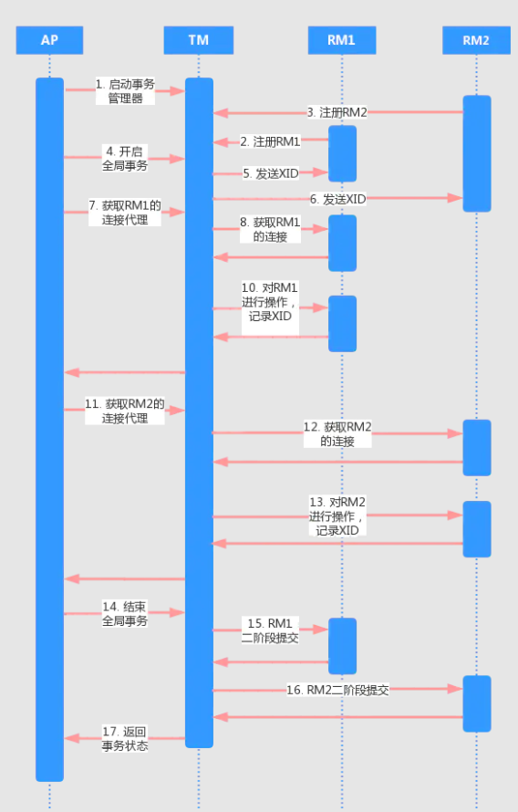

**XA规范编程规范**

> 1. 配置TM，给TM注册RM作为数据源。其中，一个TM可以注册多个RM。
> 2. AP向TM发起一个全局事务。这时，TM会发送一个XID（全局事务ID）通知各个RM。
> 3. AP从TM获取资源管理器的代理（例如：使用JTA接口，从TM管理的上下文中，获取出这个TM所管理的RM的JDBC连接或JMS连接）。
> 4. AP通过从TM中获取的连接，间接操作RM进行业务操作。TM在每次AP操作时把XID传递给RM，RM正是通过这个XID关联来操作和事务的关系的。
> 5. AP结束全局事务时，TM会通知RM全局事务结束。开始二段提交，也就是prepare - commit的过程。

通常把一个数据库内部的事务处理作为本地事务看待，分布式事务处理的对象是多个事务共同完成一个工作，被称作全局事务。

例如一个分布式事务中可能更新几个不同的数据库。对数据库的操作发生在系统的各处但必须全部被提交或回滚。此时一个数据库对自己内部所做操作的提交不仅依赖本身操作是否成功，还要依赖与全局事务相关的其它数据库的操作是否成功，如果任一数据库的任一操作失败，则参与此事务的所有数据库所做的所有操作都必须回滚。一般情况下，某一数据库无法知道其它数据库在做什么，因此，在一个 DTP 环境中，交易中间件是必需的，由它通知和协调相关数据库的提交或回滚。而一个数据库只将其自己所做的操作（可恢复）影射到全局事务中。

##### （2）分布式事务协议

分布式系统的一个难点是如何保证架构下多个节点在进行事务性操作的时候保持一致性,为了解决一致性问题提出了很多协议和算法，比较著名的分布式一致性协议有二阶提交协议（Two Phase Commitment Protocol）、三阶提交协议（Three Phase Commitment Protocol）和 Paxos算法。

二阶段提交和三阶段提交是根据XA规范衍生出来的，是XA规范实现分布式事务的关键，两阶段提交保证了分布式事物的原子性。

##### 两阶段提交协议 2PC

**二阶段提交的算法思路可以概括为：每个参与者将操作成败通知协调者，再由协调者根据所有参与者的反馈情况，决定各参与者是否要提交操作还是中止操作**

所谓的两个阶段是指：**第一阶段：准备阶段(投票阶段) 和 第二阶段：提交阶段（执行阶段)**

参与者将操作的成败都反馈给协调者事务管理器TM，再有协调者根据所有反馈这的情况决定下一步是提交还是中止。两阶段提交主要保证了分布式事务的原子性：即所有结点要么全做要么全不做

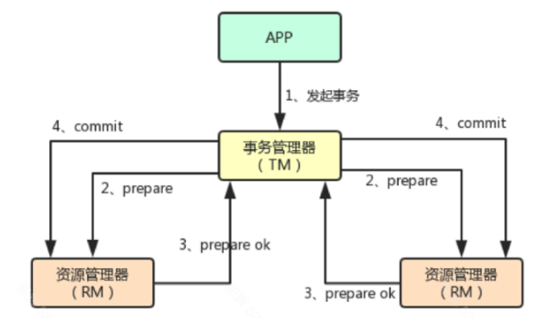

**阶段一：提交事务请求（投票）**

1. 协调者向参与者发起事务询问，并开始等到参与者响应
2. 参与者尝试执行事务，并把所有操作和准备都尽可能完成，并将事务的执行结果反馈给协调者。

阶段一类似于参与者再给协调者进行事务投票，各参与者表明是否需要继续执行下一步的提交操作。所以被称为投票阶段。这个时候参与者的资源是被事务锁定状态，处于阻塞中。直到提交、中止完成。
**阶段二：执行事务提交**

协调者会根据阶段一的投票情况来决定最终是否可以进行事务提交/中断操作。

**事务提交：**

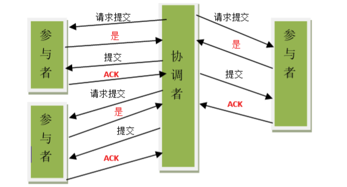

**事务中断：**

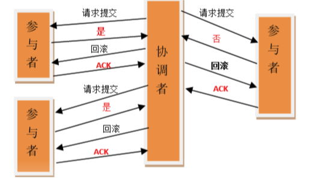

**2PC 缺点**

* **同步阻塞问题** 执行过程中，所有参与节点都是事务阻塞型的。参与者占用共享资源时，其他第三方节点就不能访问此资源。

* **单点故障** 由于协调者的重要性，一旦协调者发生故障。参与者会一直阻塞下去。尤其在第二阶段，协调者发生故障，那么所有的参与者还都处于锁定事务资源的状态中，而无法继续完成事务操作。（如果是协调者挂掉，可以重新选举一个协调者，但是无法解决因为协调者宕机导致的参与者处于阻塞状态的问题）

* **数据不一致**。在阶段二中，当协调者向参与者发送commit请求之后，协调者发生了故障，还有可能导致只有一部分参与者接受到了commit请求。而在这部分参与者接到commit请求之后就会执行commit操作。但是其他部分未接到commit请求的机器则无法执行事务提交。于是整个分布式系统便出现了数据部一致性的现象。最坏的情况时所有参与者都没接收到请求，则就出现了上面的**单点故障**
##### 三阶段提交协议 3PC

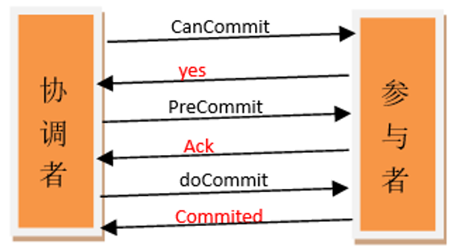

1. 同时在协调者和参与者中都引入超时机制。
2. 在第一阶段和第二阶段中插入一个准备阶段。这样三阶段提交就有CanCommit、PreCommit、DoCommit三个阶段。保证了在最后提交阶段之前各参与节点的状态是一致的。
相对于2PC，3PC加入的超时机制解决了单点故障，并减少了阻塞，因为一旦参与者无法及时收到协调者的信息他会默认执行commit操作，而不会一直持有事务资源并处于阻塞状态。但是它无法解决数据一致性问题，因为由于网络原因，协调者发送的abort中断响应没有及时被参与者接收到，那么参与者在等待超时之后执行了commit操作。这样就和其他接到abort中断命令并执行回滚的参与者之间存在数据不一致的情况。

三阶段缺点：数据不一致：参与者收到preCommit请求，此时如果出现网络分区，协调者与参与者之间无法进行正常网络通信，参与者在超时之后还是会进行事务提交，就会出现数据不一致

_无论是二阶段提交还是三阶段提交都无法彻底解决分布式的一致性问题，彻底解决需要使用Paxos算法。Google Chubby的作者Mike Burrows说过，世上只有一种一致性算法，那就是Paxos，所有其他一致性算法都是Paxos算法的不完整版_

##### Paxos分布式一致性算法

Paxos是试图对各Server上的状态进行全局编号，如果能编号成功，那么所有操作都按照编号顺序执行，一致性就不言而喻。当Cluster中的Server都接收了一些数据，如何进行编号？就是表决，让所有的Server进行表决，看哪个Server上的哪个数据应该排第一，哪个排第二...，只要多数Server同意某个数据该排第几，那就排第几。

很显然，为了给每个数据唯一编号，每次表决只能产生一个数据，否则表决就没有任何意义。Paxos的算法的所有精力都放在如何在一次表决只产生一个数据。再进一步，我们称表决的数据叫Value，Paxos算法的核心和精华就是确保每次表决只产生一个Value。

很多中间件根据paxos理论衍生出来的自己的leader选举算法

zk的leader的选举，使用的是基于paxos算法的ZAB协议，redis的leader选举，使用的是基于paxos算法的raft算法

##### （5）分布式事务的解决方案

**1. 全局事务 - 强一致性:** 2pc 3pc

**2. 本地消息表（异步确保） - 最终一致性**

本地消息表这种实现方式应该是业界使用最多的，其核心思想是将分布式事务拆分成本地事务进行处理，这种思路是来源于ebay

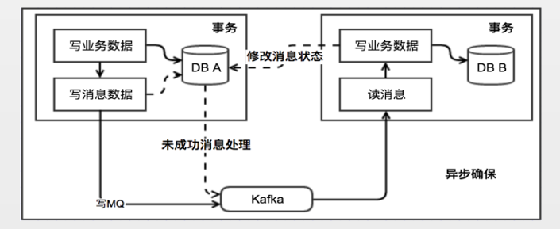

**消息生产方：** 在业务库中同时新建一个消息表来记录消息的状态，业务表写入数据的时候消息表也写入一条消息数据，二者在一个事务里面。然后消息投送到MQ中，发给消费者。如果此时消息发送失败，走MQ的重发逻辑。

**消息消费方：** 接受业务消息并处理，如果本地事务处理成功则修改消息表状态为成功，流程结束。如果本地事务失败则修改消息表状态为失败，根据具体失败情况来决定是重试还是直接回滚。（此时需要一个定时任务去扫消息表，来处理回滚或重试动作）注意消息消费需要保证幂等，避免同一条消息被多次消费。

**消息表怎么创建呢？** 这个表应该包括这些字段： id, biz_id, biz_type, msg, msg_result, msg_desc,atime,try_count。分别表示uuid，业务id，业务类型，消息内容，消息结果（成功或失败），消息描述，创建时间，重试次数， 其中biz_id，msg_desc字段是可选的。

**栗子：**

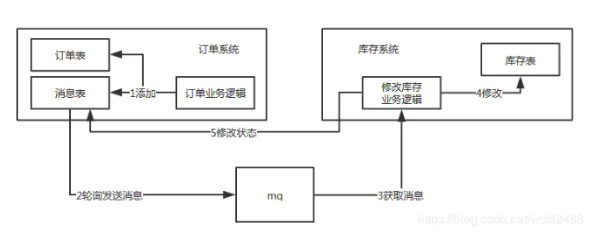

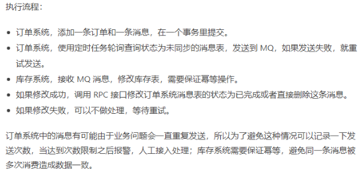

**3. 最大努力通知**

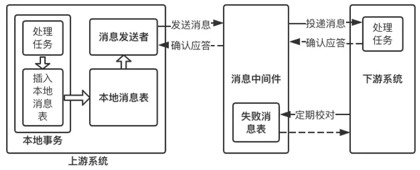

最大努力通知方案类似于本地消息表方案，他要求消息发送方必须包含消息重发机制，消息消费方要确保消息能被正确消费，如果消费失败则定期校对再次重试消费。主要是对mq的事务要求比较大。最大努力通知型事务”是为解决跨网络、跨服务，夸企业之间的事物数据一致性方案。

相比于上一方案，它达到数据一致性的周期较长，而且还需要在上游系统中实现消息重试发布机制

**4. MQ 事务消息可以支持分布式事务**

这种方式主要是通过选取支持事务的消息队列中间件来确保分布式事务的数据一致性。确保消息成功投递和消费。现在目前较为主流的MQ，比如ActiveMQ、RabbitMQ、Kafka、RocketMQ等，只有RocketMQ支持事务消息。可以考虑自己实现

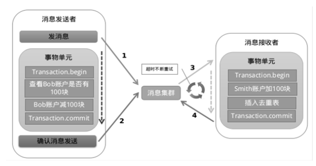

**确保消息成功发出：**

由于传统的处理方式无法解决消息生成者本地事务处理成功与消息发送成功两者的一致性问题，因此事务消息就诞生了，它实现了消息生成者本地事务与消息发送的原子性，保证了消息生成者本地事务处理成功与消息发送成功的最终一致性问题。

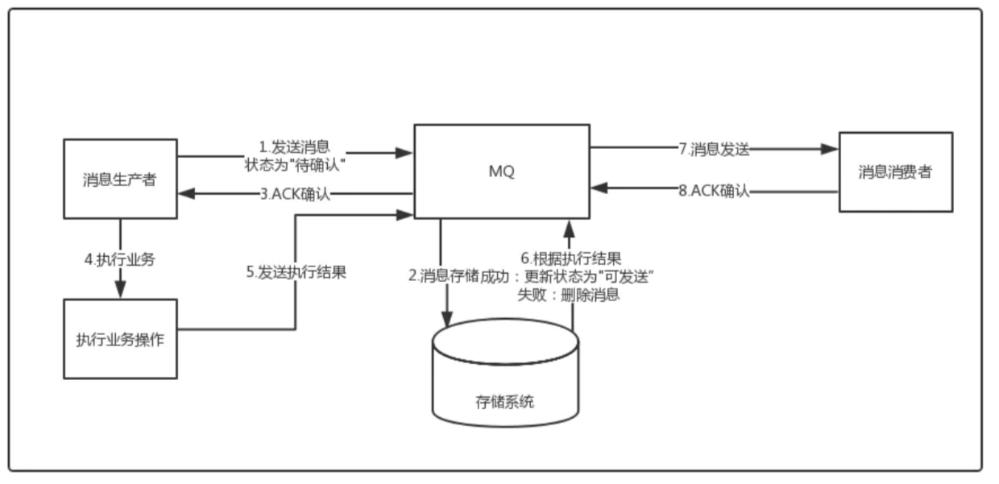

在业务方法内要想消息队列提交两次请求，一次发送消息和一次确认消息。

1. 第一阶段：发送Prepared消息，会拿到消息的地址。
2. 第二阶段：执行本地事务
3. 第三阶段：确认消息，通过第一阶段拿到的地址去访问消息，并修改状态
如果确认消息发送失败了RocketMQ会定期扫描消息集群中的事务消息，这时候发现了Prepared消息，它会向消息发送者确认，所以生产方需要实现一个check接口，RocketMQ会根据发送端设置的策略来决定是回滚还是继续发送确认消息。这样就保证了消息发送与本地事务同时成功或同时失败。

**5. TCC - 最终一致性**

TCC 其实就是采用的补偿机制，进行自行研发。其核心思想是：针对每个操作，都要注册一个与其对应的确认和补偿（撤销）操作。它分为三个阶段：

1. Try 阶段主要是对业务系统做检测及资源预留
2. Confirm 阶段主要是对业务系统做确认提交，Try阶段执行成功并开始执行 Confirm阶段时，默认 Confirm阶段是不会出错的。即：只要Try成功，Confirm一定成功。
3. Cancel 阶段主要是在业务执行错误，需要回滚的状态下执行的业务取消，预留资源释放。
举个简单的例子如果你用100元买了一瓶水， Try阶段:你需要向你的钱包检查是否够100元并锁住这100元，水也是一样的。如果有一个失败，则进行cancel(释放这100元和这一瓶水)，如果cancel失败不论什么失败都进行重试cancel，所以需要保持幂等。如果都成功，则进行confirm,确认这100元扣，和这一瓶水被卖，如果confirm失败无论什么失败则重试(会依靠活动日志进行重试)

对于TCC来说适合一些:强隔离性，严格一致性要求的活动业务。执行时间较短的业务，实现参考: https://github.com/liuyangming/ByteTCC/ 

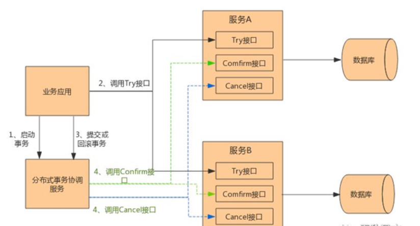

* 解决了协调者单点，由主业务方发起并完成这个业务活动。业务活动管理器也变成多点，引入集群。
* 同步阻塞:引入超时，超时后进行补偿，并且不会锁定整个资源，将资源转换为业务逻辑形式，粒度变小。
* 数据一致性，有了补偿机制之后，由业务活动管理器控制一致性
**6. Sagas 事务模型**

该模型其核心思想就是拆分分布式系统中的长事务为多个短事务，或者叫多个本地事务，然后由 Sagas 工作流引擎负责协调，如果整个流程正常结束，那么就算是业务成功完成，如果在这过程中实现失败，那么Sagas工作流引擎就会以相反的顺序调用补偿操作，重新进行业务回滚。

**选择建议：**

在面临数据一致性问题的时候，首先要从业务需求的角度出发，确定我们对于一致性模型的接受程度，再通过具体场景来决定解决方案，对购物转账等电商和金融业务，中间件层的2PC最大问题在于业务不可见，一旦出现不可抗力或意想不到的一致性破坏，如数据节点永久性宕机，业务难以根据2PC的日志进行补偿。金融场景下，数据一致性是命根，业务需要对数据有百分之百的掌控力，建议使用TCC这类分布式事务模型，或基于消息队列的柔性事务框架，这两种方案都在业务层实现，业务开发者具有足够掌控力 https://www.cnblogs.com/kaleidoscope/p/9627573.html

%5Btoc%5D%0A%0A%23%23%23%20%E4%B8%80%20%E5%88%86%E5%B8%83%E5%BC%8F%E7%B3%BB%E7%BB%9F%E7%AE%80%E4%BB%8B%0A%E5%8D%95%E6%9C%BA%E5%A4%84%E7%90%86%E8%83%BD%E5%8A%9B%E4%B8%BB%E8%A6%81%E4%BE%9D%E9%9D%A0CPU%E3%80%81%E5%86%85%E5%AD%98%E3%80%81%E7%A3%81%E7%9B%98%E7%A1%AC%E4%BB%B6%E8%B5%84%E6%BA%90%EF%BC%8C%E4%BD%86%E6%98%AF%E8%BF%99%E4%BA%9B%E8%B5%84%E6%BA%90%E9%83%BD%E4%BC%9A%E6%9C%89%E8%87%AA%E5%B7%B1%E7%9A%84%E6%80%A7%E8%83%BD%E5%B9%B3%E9%9D%99%EF%BC%8C%E9%9A%8F%E7%9D%80%E7%B3%BB%E7%BB%9F%E7%9A%84%E5%8F%91%E5%B1%95%EF%BC%8C%E5%BA%94%E7%94%A8%E7%B3%BB%E7%BB%9F%E5%BE%80%E5%BE%80%E9%9C%80%E8%A6%81%E6%89%BF%E6%8B%85%E9%AB%98%E5%B9%B6%E5%8F%91%EF%BC%8C%E9%AB%98%E5%90%9E%E5%90%90%E9%87%8F%EF%BC%8C%E9%AB%98%E5%8F%AF%E7%94%A8%E7%AD%89%E8%83%BD%E5%8A%9B%E3%80%82%E5%8D%95%E6%9C%BA%E6%BB%A1%E8%B6%B3%E4%B8%8D%E4%BA%86%E7%8E%B0%E5%AE%9E%E9%9C%80%E8%A6%81%E3%80%82%E6%89%80%E4%BB%A5%E6%89%8D%E8%AF%9E%E7%94%9F%E4%BA%86%E4%BC%97%E5%A4%9A%E7%9A%84%E5%88%86%E5%B8%83%E5%BC%8F%E7%B3%BB%E7%BB%9F%E3%80%82%0A%0A%E5%88%86%E5%B8%83%E5%BC%8F%E7%B3%BB%E7%BB%9F%E6%98%AF%E5%B0%86%E5%BA%94%E7%94%A8%E5%88%86%E5%B8%83%E5%9C%A8%E5%A4%9A%E5%8F%B0%E8%AE%A1%E7%AE%97%E6%9C%BA%E4%B8%8A%EF%BC%8C%E5%BD%BC%E6%AD%A4%E4%B9%8B%E9%97%B4%E9%80%9A%E8%BF%87%E6%B6%88%E6%81%AF%E4%BC%A0%E9%80%92%E8%BF%9B%E8%A1%8C%E9%80%9A%E4%BF%A1%E5%92%8C%E5%8D%8F%E8%B0%83%E7%9A%84%E7%B3%BB%E7%BB%9F%E3%80%82%E5%88%86%E5%B8%83%E5%BC%8F%E7%B3%BB%E7%BB%9F%E5%85%B7%E6%9C%89%E5%88%86%E5%B8%83%E6%80%A7%E3%80%81%E5%AF%B9%E7%AD%89%E6%80%A7%E3%80%81%E5%B9%B6%E5%8F%91%E6%80%A7%E3%80%81%E7%BC%BA%E4%B9%8F%E5%85%A8%E5%B1%80%E6%97%B6%E9%92%9F%E3%80%81%E6%95%85%E9%9A%9C%E6%80%BB%E4%BC%9A%E5%8F%91%E7%94%9F%E7%9A%84%E7%89%B9%E7%82%B9%EF%BC%8C%E7%94%B1%E4%BA%8E%E8%BF%99%E4%BA%9B%E7%89%B9%E7%82%B9%E5%AF%BC%E8%87%B4%E4%BA%86%E5%88%86%E5%B8%83%E5%BC%8F%E7%B3%BB%E7%BB%9F%E4%B8%AD%E7%9A%84%E4%B8%80%E8%87%B4%E6%80%A7%E9%9A%BE%E9%A2%98%0A%0A%23%23%23%20%E4%BA%8C%E5%88%86%E5%B8%83%E5%BC%8F%E7%B3%BB%E7%BB%9F%E5%B8%B8%E8%A7%81%E6%A6%82%E5%BF%B5%0A%0A**%E9%9B%86%E7%BE%A4**%0A%3E%E5%90%8C%E4%B8%80%E4%B8%AA%E4%B8%9A%E5%8A%A1%EF%BC%8C%E9%83%A8%E7%BD%B2%E5%9C%A8%E5%A4%9A%E4%B8%AA%E6%9C%8D%E5%8A%A1%E5%99%A8%E4%B8%8A%E5%85%B1%E5%90%8C%E6%89%BF%E6%8B%85%E5%A4%96%E7%95%8C%E7%9A%84%E8%B0%83%E7%94%A8%E5%8E%8B%E5%8A%9B%EF%BC%8C%E5%8F%AF%E4%BB%A5%E8%A7%A3%E5%86%B3%E5%8D%95%E7%82%B9%E9%97%AE%E9%A2%98%E3%80%82%E6%95%B0%E6%8D%AE%E5%BA%93%E5%B1%82%E9%9D%A2%E7%9A%84%E9%9B%86%E7%BE%A4%E5%8F%AF%E4%BB%A5%E8%A7%A3%E5%86%B3%E5%AE%B9%E9%94%99%E9%97%AE%E9%A2%98%EF%BC%8C%E5%85%B6%E4%B8%AD%E4%B8%80%E5%8F%B0%E6%9C%8D%E5%8A%A1%E5%99%A8%E6%8C%82%E4%BA%86%EF%BC%8C%E4%B8%8D%E4%BC%9A%E5%BD%B1%E5%93%8D%E6%9C%8D%E5%8A%A1%E7%9A%84%E6%AD%A3%E5%B8%B8%E8%AE%BF%E9%97%AE%E3%80%82N%E5%8F%B0%E6%9C%BA%E5%99%A8%E5%8F%AF%E4%BB%A5%E5%90%8C%E6%97%B6%E5%81%9A%E5%90%8C%E4%B8%80%E4%BB%B6%E4%BA%8B%EF%BC%8C%E4%BE%8B%E5%A6%82%E6%B5%B7%E9%87%8F%E8%AF%B7%E6%B1%82%E9%83%BD%E6%9D%A5%E8%B0%83%E7%94%A8%E5%90%8C%E4%B8%80%E6%9C%8D%E5%8A%A1%EF%BC%8C%E5%8D%95%E4%B8%AA%E6%9C%8D%E5%8A%A1%E5%A4%84%E7%90%86%E4%B8%8D%E8%BF%87%E6%9D%A5%EF%BC%8C%E5%8F%AF%E4%BB%A5%E5%B0%86%E6%AD%A4%E6%9C%8D%E5%8A%A1%E9%83%A8%E7%BD%B2%E5%88%B0N%E4%B8%AA%E6%9C%8D%E5%8A%A1%E5%99%A8%E4%B8%8A%EF%BC%8C%E8%BF%99%E4%BA%9B%E6%9C%8D%E5%8A%A1%E5%99%A8%E7%BB%84%E6%88%90%E9%9B%86%E7%BE%A4%E5%90%8C%E6%97%B6%E5%A4%84%E7%90%86%E6%B5%B7%E9%87%8F%E8%AF%B7%E6%B1%82%E3%80%82%0A%0A**%E5%88%86%E5%B8%83%E5%BC%8F**%0A%3E%20%20%20%20*%20%E5%B0%86%E5%A4%9A%E4%B8%AA%E4%B8%9A%E5%8A%A1%E5%88%86%E5%BC%80%E9%83%A8%E7%BD%B2%E5%88%B0%E4%B8%8D%E5%90%8C%E6%9C%BA%E5%99%A8%E4%B8%8A%EF%BC%8C%E6%AF%8F%E4%B8%AA%E4%B8%9A%E5%8A%A1%E6%9C%8D%E5%8A%A1%E7%9B%B8%E4%BA%92%E9%9A%94%E7%A6%BB%EF%BC%8C%E5%88%86%E6%95%A3%E4%BA%86%E8%B4%9F%E8%BD%BD%E3%80%82%E5%90%8C%E6%97%B6%E4%B9%9F%E5%8F%AF%E4%B9%9F%E5%B0%86%E6%AF%8F%E4%B8%AA%E4%B8%9A%E5%8A%A1%E5%8D%95%E7%8B%AC%E9%83%A8%E7%BD%B2%E6%88%90%E9%9B%86%E7%BE%A4%EF%BC%8C%E8%BF%99%E4%B8%AA%E4%B8%9A%E5%8A%A1%E9%9B%86%E7%BE%A4%E5%8F%AF%E8%83%BD%E6%93%8D%E4%BD%9C%E7%9B%B8%E5%90%8C%E7%9A%84%E5%BA%95%E5%B1%82%E6%95%B0%E6%8D%AE%E6%9D%A5%E6%BA%90%EF%BC%8C%E4%BE%8B%E5%A6%82%E8%AF%BB%E5%8F%96%E9%85%8D%E7%BD%AE%EF%BC%8C%E6%95%B0%E6%8D%AE%E5%BA%93%EF%BC%8C%E8%AE%BE%E7%BD%AE%E9%9B%86%E4%B8%AD%E5%BC%8F%E7%BC%93%E5%AD%98%E7%AD%89%EF%BC%8C%E9%82%A3%E8%BF%99%E4%B8%AA%E6%9C%8D%E5%8A%A1%E5%92%8C%E8%AF%BB%E5%8F%96%E9%85%8D%E7%BD%AE%E7%AD%89%E6%93%8D%E4%BD%9C%E4%B9%8B%E9%97%B4%E7%9A%84%E5%85%B3%E7%B3%BB%E6%98%AF%E5%88%86%E5%B8%83%E5%BC%8F%E7%9A%84%E3%80%82%E8%BF%99%E6%A0%B7%E5%AD%90%E5%B0%B1%E5%B8%A6%E6%9D%A5%E4%BA%86%E5%88%86%E5%B8%83%E5%BC%8F%E7%B3%BB%E7%BB%9F%E4%B8%8B%E5%B8%B8%E8%A7%81%E7%9A%84%E9%97%AE%E9%A2%98%EF%BC%9A%E6%95%B0%E6%8D%AE%E4%B8%80%E8%87%B4%E6%80%A7%EF%BC%8C%E5%88%86%E5%B8%83%E5%BC%8F%E4%BA%8B%E7%89%A9%EF%BC%8C%E4%BB%A5%E5%8F%8A%E9%94%81%E7%AB%9E%E4%BA%89%E7%AD%89%E3%80%82%0A%3E%20%20%20%20*%20%E8%80%8C%E5%AF%B9%E4%BA%8E%E8%A2%AB%E8%AE%BF%E9%97%AE%E7%AB%AF%EF%BC%88%E9%85%8D%E7%BD%AE%EF%BC%8C%E6%95%B0%E6%8D%AE%E5%BA%93%EF%BC%8C%E7%BC%93%E5%AD%98%E6%9C%8D%E5%8A%A1%E7%AD%89%EF%BC%89%EF%BC%8C%E9%9A%8F%E7%9D%80%E8%A2%AB%E5%B9%B6%E5%8F%91%E8%AE%BF%E9%97%AE%E7%9A%84%E6%AC%A1%E6%95%B0%E5%A2%9E%E5%8A%A0%EF%BC%8C%E8%B4%9F%E8%BD%BD%E8%B6%8A%E6%9D%A5%E8%B6%8A%E5%A4%A7%EF%BC%8C%E4%B9%9F%E5%8F%AF%E4%BB%A5%E9%83%A8%E7%BD%B2%E6%88%90%E9%9B%86%E7%BE%A4%EF%BC%8C%E5%B0%86%E5%8E%9F%E6%9C%AC%E5%AD%98%E5%82%A8%E5%9C%A8%E4%B8%80%E5%8F%B0%E6%9C%8D%E5%8A%A1%E5%99%A8%E7%9A%84%E6%95%B0%E6%8D%AE%E5%88%86%E6%95%A3%E5%88%B0%E5%AD%98%E5%82%A8%E5%9C%A8%E5%A4%9A%E5%8F%B0%E6%9C%8D%E5%8A%A1%E5%99%A8%E4%B8%8A%EF%BC%8C%E4%BB%8E%E8%80%8C%E6%AF%8F%E5%8F%B0%E5%8F%AA%E5%AD%98%E5%82%A8%E5%B0%91%E9%87%8F%E7%9A%84%E6%95%B0%E6%8D%AE%EF%BC%88%E5%88%86%E7%89%87%E5%AD%98%E5%82%A8%EF%BC%89%EF%BC%8C%E6%9D%A5%E6%8F%90%E5%8D%87%E5%86%99%E5%85%A5%E5%92%8C%E8%AF%BB%E5%8F%96%E7%9A%84%E6%80%A7%E8%83%BD%E3%80%82%0A%0A**%E8%8A%82%E7%82%B9**%0A%3E%20%20%20%20%E8%8A%82%E7%82%B9%E6%98%AF%E6%8C%87%E4%B8%80%E4%B8%AA%E5%8F%AF%E4%BB%A5%E7%8B%AC%E7%AB%8B%E6%8C%89%E7%85%A7%E5%88%86%E5%B8%83%E5%BC%8F%E5%8D%8F%E8%AE%AE%E5%AE%8C%E6%88%90%E4%B8%80%E7%BB%84%E9%80%BB%E8%BE%91%E7%9A%84%E7%A8%8B%E5%BA%8F%20%E4%B8%AA%E4%BD%93%EF%BC%88%E5%8F%AF%E4%BB%A5%E8%AE%A4%E4%B8%BA%E9%9B%86%E7%BE%A4%E4%B8%AD%E4%B8%80%E5%8F%B0%E6%9C%8D%E5%8A%A1%E5%99%A8%E6%98%AF%E4%B8%80%E4%B8%AA%E8%8A%82%E7%82%B9%EF%BC%89%E3%80%82%E5%9C%A8%E5%85%B7%E4%BD%93%E7%9A%84%E9%A1%B9%E7%9B%AE%E4%B8%AD%EF%BC%8C%E4%B8%80%E4%B8%AA%E8%8A%82%E7%82%B9%E8%A1%A8%E7%A4%BA%E7%9A%84%E6%98%AF%E4%B8%80%E4%B8%AA%E6%93%8D%E4%BD%9C%E7%B3%BB%E7%BB%9F%E4%B8%8A%E7%9A%84%20%E8%BF%9B%E7%A8%8B%E3%80%82%20%0A%0A**%E5%88%86%E7%89%87**%EF%BC%9A%20%20%E5%88%86%E7%89%87%E6%98%AF%E6%8C%87%E6%8B%86%E5%88%86%E6%95%B0%E6%8D%AE%E4%B8%BA%E5%A4%9A%E4%BB%BD%E5%AD%98%E5%82%A8%0A**%E5%89%AF%E6%9C%AC**%0A%3E%20%20%20%E5%89%AF%E6%9C%AC(replica%2Fcopy)%E6%8C%87%E5%9C%A8%E5%88%86%E5%B8%83%E5%BC%8F%E7%B3%BB%E7%BB%9F%E4%B8%AD%E4%B8%BA%E6%95%B0%E6%8D%AE%E6%88%96%E6%9C%8D%E5%8A%A1%E6%8F%90%E4%BE%9B%E7%9A%84%E5%86%97%20%E4%BD%99%E3%80%82%20%E6%95%B0%E6%8D%AE%E5%89%AF%E6%9C%AC%E6%8C%87%E5%9C%A8%E4%B8%8D%E5%90%8C%E7%9A%84%E8%8A%82%E7%82%B9%E4%B8%8A%E6%8C%81%E4%B9%85%E5%8C%96%E5%90%8C%E4%B8%80%E4%BB%BD%E6%95%B0%E6%8D%AE%EF%BC%8C%E5%BD%93%E5%87%BA%E7%8E%B0%E6%9F%90%E4%B8%80%E4%B8%AA%20%E8%8A%82%E7%82%B9%E7%9A%84%E6%95%B0%E6%8D%AE%E4%B8%A2%E5%A4%B1%E6%97%B6%EF%BC%8C%E5%8F%AF%E4%BB%A5%E4%BB%8E%E5%89%AF%E6%9C%AC%E4%B8%8A%E8%AF%BB%E5%8F%96%E5%88%B0%E6%95%B0%E6%8D%AE%E3%80%82%E6%95%B0%E6%8D%AE%E5%89%AF%E6%9C%AC%E6%98%AF%E5%88%86%20%E5%B8%83%E5%BC%8F%E7%B3%BB%E7%BB%9F%E4%B8%AD%E8%A7%A3%E5%86%B3%E6%95%B0%E6%8D%AE%E4%B8%A2%E5%A4%B1%E9%97%AE%E9%A2%98%E7%9A%84%E5%94%AF%E4%B8%80%E6%89%8B%E6%AE%B5%E3%80%82%E6%9C%8D%E5%8A%A1%E5%89%AF%E6%9C%AC%E8%A1%A8%E7%A4%BA%E5%A4%9A%E4%B8%AA%E8%8A%82%E7%82%B9%E6%8F%90%E4%BE%9B%E7%9B%B8%E5%90%8C%E7%9A%84%E6%9C%8D%E5%8A%A1%EF%BC%8C%E9%80%9A%E8%BF%87%E4%B8%BB%E4%BB%8E%E5%85%B3%E7%B3%BB%E6%9D%A5%E5%AE%9E%E7%8E%B0%20%E6%9C%8D%E5%8A%A1%E7%9A%84%E9%AB%98%E5%8F%AF%E7%94%A8%E6%96%B9%E6%A1%88%20%E3%80%82%E5%90%8C%E6%97%B6%E5%B8%A6%E6%9D%A5%E4%BA%86%E6%95%B0%E6%8D%AE%E4%B8%80%E8%87%B4%E6%80%A7%E9%97%AE%E9%A2%98%0A*%20**%E4%B8%AD%E9%97%B4%E4%BB%B6**%20%0A%3E%20%20%20%20%E4%B8%AD%E9%97%B4%E4%BB%B6%E4%BD%8D%E4%BA%8E%E6%93%8D%E4%BD%9C%E7%B3%BB%E7%BB%9F%E6%8F%90%E4%BE%9B%E7%9A%84%E6%9C%8D%E5%8A%A1%E4%B9%8B%E5%A4%96%EF%BC%8C%E5%8F%88%E4%B8%8D%E5%B1%9E%E4%BA%8E%E5%BA%94%E7%94%A8%EF%BC%8C%E4%BB%96%E6%98%AF%E4%BD%8D%20%E4%BA%8E%E5%BA%94%E7%94%A8%E5%92%8C%E7%B3%BB%E7%BB%9F%E5%B1%82%E4%B9%8B%E9%97%B4%E4%B8%BA%E5%BC%80%E5%8F%91%E8%80%85%E6%96%B9%E4%BE%BF%E7%9A%84%E5%A4%84%E7%90%86%E9%80%9A%E4%BF%A1%E3%80%81%E8%BE%93%E5%85%A5%E8%BE%93%E5%87%BA%E7%9A%84%E4%B8%80%20%E7%B1%BB%E8%BD%AF%E4%BB%B6%EF%BC%8C%E8%83%BD%E5%A4%9F%E8%AE%A9%E7%94%A8%E6%88%B7%E5%85%B3%E5%BF%83%E8%87%AA%E5%B7%B1%E5%BA%94%E7%94%A8%E7%9A%84%E9%83%A8%E5%88%86%E3%80%82%20%0A*%20**%E7%BD%91%E7%BB%9C%E5%88%86%E5%8C%BA**%20%20%0A%3E%20%20%20%20%E5%BD%93%E7%BD%91%E7%BB%9C%E7%94%B1%E4%BA%8E%E5%8F%91%E7%94%9F%E5%BC%82%E5%B8%B8%E6%83%85%E5%86%B5%EF%BC%8C%E5%AF%BC%E8%87%B4%E5%88%86%E5%B8%83%E5%BC%8F%E7%B3%BB%E7%BB%9F%E4%B8%AD%E9%83%A8%E5%88%86%E8%8A%82%E7%82%B9%E4%B9%8B%E9%97%B4%E7%9A%84%E7%BD%91%E7%BB%9C%E5%BB%B6%E6%97%B6%E4%B8%8D%E6%96%AD%E5%A2%9E%E5%A4%A7%EF%BC%8C%E6%9C%80%E7%BB%88%E5%AF%BC%E8%87%B4%E7%BB%84%E6%88%90%E5%88%86%E5%B8%83%E5%BC%8F%E7%B3%BB%E7%BB%9F%E7%9A%84%E6%89%80%E6%9C%89%E8%8A%82%E7%82%B9%E4%B8%AD%EF%BC%8C%E5%8F%AA%E6%9C%89%E9%83%A8%E5%88%86%E8%8A%82%E7%82%B9%E4%B9%8B%E9%97%B4%E8%83%BD%E5%A4%9F%E6%AD%A3%E5%B8%B8%E9%80%9A%E4%BF%A1%EF%BC%8C%E8%80%8C%E5%8F%A6%E4%B8%80%E4%BA%9B%E8%8A%82%E7%82%B9%E5%88%99%E4%B8%8D%E8%83%BD----%E6%88%91%E4%BB%AC%E5%B0%86%E8%BF%99%E4%B8%AA%E7%8E%B0%E8%B1%A1%E7%A7%B0%E4%B8%BA%E7%BD%91%E7%BB%9C%E5%88%86%E5%8C%BA%E3%80%82%E5%BD%93%E7%BD%91%E7%BB%9C%E5%88%86%E5%8C%BA%E5%87%BA%E7%8E%B0%E6%97%B6%EF%BC%8C%E5%88%86%E5%B8%83%E5%BC%8F%E7%B3%BB%E7%BB%9F%E4%BC%9A%E5%87%BA%E7%8E%B0%E5%B1%80%E9%83%A8%E5%B0%8F%E9%9B%86%E7%BE%A4%EF%BC%8C%E5%9C%A8%E6%9E%81%E7%AB%AF%E6%83%85%E5%86%B5%E4%B8%8B%EF%BC%8C%E8%BF%99%E4%BA%9B%E5%B1%80%E9%83%A8%E5%B0%8F%E9%9B%86%E7%BE%A4%E4%BC%9A%E7%8B%AC%E7%AB%8B%E5%AE%8C%E6%88%90%E5%8E%9F%E6%9C%AC%E9%9C%80%E8%A6%81%E6%95%B4%E4%B8%AA%E5%88%86%E5%B8%83%E5%BC%8F%E7%B3%BB%E7%BB%9F%E6%89%8D%E8%83%BD%E5%AE%8C%E6%88%90%E7%9A%84%E5%8A%9F%E8%83%BD%EF%BC%8C%E5%8C%85%E6%8B%AC%E5%AF%B9%E6%95%B0%E6%8D%AE%E7%9A%84%E4%BA%8B%E7%89%A9%E5%A4%84%E7%90%86%EF%BC%8C%E8%BF%99%E5%B0%B1%E5%AF%B9%E5%88%86%E5%B8%83%E5%BC%8F%E4%B8%80%E8%87%B4%E6%80%A7%E6%8F%90%E5%87%BA%E4%BA%86%E9%9D%9E%E5%B8%B8%E5%A4%A7%E7%9A%84%E6%8C%91%E6%88%98%0A*%20**%E4%B8%89%E6%80%81**%20%0A%3E%20%20%20%20%E5%88%86%E5%B8%83%E5%BC%8F%E7%B3%BB%E7%BB%9F%E7%9A%84%E6%AF%8F%E4%B8%80%E6%AC%A1%E8%AF%B7%E6%B1%82%E4%B8%8E%E5%93%8D%E5%BA%94%EF%BC%8C%E5%AD%98%E5%9C%A8%E7%89%B9%E6%9C%89%E7%9A%84%E4%B8%89%E6%80%81%E6%A6%82%E5%BF%B5%EF%BC%8C%E5%8D%B3%E6%88%90%E5%8A%9F%E3%80%81%E5%A4%B1%E8%B4%A5%E3%80%81%E8%B6%85%E6%97%B6%E3%80%82%20%E5%9C%A8%E4%BC%A0%E7%BB%9F%E7%9A%84%E5%8D%95%E6%9C%BA%E7%B3%BB%E7%BB%9F%E4%B8%AD%EF%BC%8C%E5%BA%94%E7%94%A8%E7%A8%8B%E5%BA%8F%E5%9C%A8%E8%B0%83%E7%94%A8%E4%B8%80%E4%B8%AA%E5%87%BD%E6%95%B0%E4%B9%8B%E5%90%8E%EF%BC%8C%E8%83%BD%E5%A4%9F%E5%BE%97%E5%88%B0%E4%B8%80%E4%B8%AA%E9%9D%9E%E5%B8%B8%E6%98%8E%E7%A1%AE%E7%9A%84%E5%93%8D%E5%BA%94%EF%BC%9A%E6%88%90%E5%8A%9F%E6%88%96%E5%A4%B1%E8%B4%A5%E3%80%82%E8%80%8C%E5%9C%A8%E5%88%86%E5%B8%83%E5%BC%8F%E7%B3%BB%E7%BB%9F%E4%B8%AD%EF%BC%8C%E7%94%B1%E4%BA%8E%E7%BD%91%E7%BB%9C%E6%98%AF%E4%B8%8D%E5%8F%AF%E9%9D%A0%E7%9A%84%EF%BC%8C%E8%99%BD%E7%84%B6%E5%9C%A8%E7%BB%9D%E5%A4%A7%E9%83%A8%E5%88%86%E6%83%85%E5%86%B5%20%E4%B8%8B%EF%BC%8C%E7%BD%91%E7%BB%9C%E9%80%9A%E4%BF%A1%E4%B9%9F%E8%83%BD%E5%A4%9F%E6%8E%A5%E5%8F%97%E5%88%B0%E6%88%90%E5%8A%9F%E6%88%96%E5%A4%B1%E8%B4%A5%E7%9A%84%E5%93%8D%E5%BA%94%EF%BC%8C%E5%BD%93%E6%97%B6%E5%BD%93%E7%BD%91%E7%BB%9C%E5%87%BA%E7%8E%B0%E5%BC%82%E5%B8%B8%E7%9A%84%E6%83%85%E5%86%B5%E4%B8%8B%EF%BC%8C%E5%B0%B1%E5%8F%AF%E8%83%BD%E4%BC%9A%E5%87%BA%E7%8E%B0%E8%B6%85%E6%97%B6%E7%8E%B0%E8%B1%A1%0A%0A%23%23%23%20%E4%B8%89%20%E5%88%86%E5%B8%83%E5%BC%8F%E7%90%86%E8%AE%BA%0A%0A%23%23%23%23%20%EF%BC%881%EF%BC%89CAP%20%E5%AE%9A%E7%90%86%0A!%5B9bc553bdb95741495e93a8a276c3ecde.png%5D(en-resource%3A%2F%2Fdatabase%2F1089%3A1)%0A%E6%8C%87%E7%9A%84%E6%98%AF%E5%9C%A8%E4%B8%80%E4%B8%AA%E5%88%86%E5%B8%83%E5%BC%8F%E7%B3%BB%E7%BB%9F%E4%B8%AD%EF%BC%8C%20Consistency%EF%BC%88%E4%B8%80%E8%87%B4%E6%80%A7%EF%BC%89%E3%80%81%20Availability%EF%BC%88%E5%8F%AF%E7%94%A8%E6%80%A7%EF%BC%89%E3%80%81Partition%20tolerance%EF%BC%88%E5%88%86%E5%8C%BA%E5%AE%B9%E9%94%99%E6%80%A7%EF%BC%89%EF%BC%8C%E8%BF%99%E4%B8%89%E4%B8%AA%E5%9F%BA%E6%9C%AC%E9%9C%80%E6%B1%82%E6%9C%80%E5%A4%9A%E5%8F%AA%E8%83%BD%E5%90%8C%E6%97%B6%E6%BB%A1%E8%B6%B3%E5%85%B6%E4%B8%AD%E4%B8%A4%E9%A1%B9%E3%80%82%0A%0A1.%20**%E4%B8%80%E8%87%B4%E6%80%A7(C)**%20%20%E5%9C%A8%E5%88%86%E5%B8%83%E5%BC%8F%E7%8E%AF%E5%A2%83%E4%B8%8B%EF%BC%8C%E4%B8%80%E8%87%B4%E6%80%A7%E6%98%AF%E6%8C%87%E6%95%B0%E6%8D%AE%E5%9C%A8%E5%A4%9A%E4%B8%AA%E5%89%AF%E6%9C%AC%E4%B9%8B%E9%97%B4%E8%83%BD%E5%90%A6%E4%BF%9D%E6%8C%81%E4%B8%80%E8%87%B4%E7%9A%84%E7%89%B9%E6%80%A7%0A2.%20**%E5%8F%AF%E7%94%A8%E6%80%A7(A)**%20%20%E5%8F%AF%E7%94%A8%E6%80%A7%E6%98%AF%E6%8C%87%E7%B3%BB%E7%BB%9F%E6%8F%90%E4%BE%9B%E7%9A%84%E6%9C%8D%E5%8A%A1%E5%BF%85%E9%A1%BB%E4%B8%80%E7%9B%B4%E5%A4%84%E4%BA%8E%E5%8F%AF%E7%94%A8%E7%9A%84%E7%8A%B6%E6%80%81%EF%BC%8C%E5%9C%A8%E9%9B%86%E7%BE%A4%E4%B8%AD%E4%B8%80%E9%83%A8%E5%88%86%E8%8A%82%E7%82%B9%E6%95%85%E9%9A%9C%E5%90%8E%EF%BC%8C%E9%9B%86%E7%BE%A4%E6%95%B4%E4%BD%93%E6%98%AF%E5%90%A6%E8%BF%98%E8%83%BD%E5%93%8D%E5%BA%94%E5%AE%A2%E6%88%B7%E7%AB%AF%E7%9A%84%E8%AF%BB%E5%86%99%E8%AF%B7%E6%B1%82%E3%80%82%EF%BC%88%E5%AF%B9%E6%95%B0%E6%8D%AE%E6%9B%B4%E6%96%B0%E5%85%B7%E5%A4%87%E9%AB%98%E5%8F%AF%E7%94%A8%E6%80%A7%EF%BC%89%0A3.%20**%E5%88%86%E5%8C%BA%E5%AE%B9%E5%BF%8D%E6%80%A7%EF%BC%88P%EF%BC%89**%20%E5%88%86%E5%8C%BA%E7%9B%B8%E5%BD%93%E4%BA%8E%E5%AF%B9%E9%80%9A%E4%BF%A1%E7%9A%84%E6%97%B6%E9%99%90%E8%A6%81%E6%B1%82%EF%BC%8C%E7%B3%BB%E7%BB%9F%E5%A6%82%E6%9E%9C%E4%B8%8D%E8%83%BD%E5%9C%A8%E6%97%B6%E9%99%90%E5%86%85%E8%BE%BE%E6%88%90%E6%95%B0%E6%8D%AE%E4%B8%80%E8%87%B4%E6%80%A7%EF%BC%8C%E5%B0%B1%E6%84%8F%E5%91%B3%E7%9D%80%E5%8F%91%E7%94%9F%E4%BA%86%E5%88%86%E5%8C%BA%E7%9A%84%E6%83%85%E5%86%B5%EF%BC%8C%E5%BF%85%E9%A1%BB%E5%B0%B1%E5%BD%93%E5%89%8D%E6%93%8D%E4%BD%9C%E5%9C%A8C%E5%92%8CA%E4%B9%8B%E9%97%B4%E5%81%9A%E5%87%BA%E9%80%89%E6%8B%A9%E3%80%82%0A%0A%7C%20%E9%80%89%E6%8B%A9%20%7C%20%20%E8%AF%B4%20%E6%98%8E%20%7C%0A%7C%20---%20%20%7C%20---%20%7C%0A%7C%20CA%7C%20%E6%94%BE%E5%BC%83%E5%88%86%E5%8C%BA%E5%AE%B9%E9%94%99%E6%80%A7%EF%BC%8C%E5%8A%A0%E5%BC%BA%E4%B8%80%E8%87%B4%E6%80%A7%E5%92%8C%E5%8F%AF%E7%94%A8%E6%80%A7%EF%BC%8C%E6%98%AF%E4%BC%A0%E7%BB%9F%E7%9A%84%E5%8D%95%E6%9C%BA%E6%95%B0%E6%8D%AE%E5%BA%93%E7%9A%84%E9%80%89%E6%8B%A9%20%7C%0A%7C%20AP%7C%20%E6%94%BE%E5%BC%83%E4%B8%80%E8%87%B4%E6%80%A7%EF%BC%88%E8%BF%99%E9%87%8C%E8%AF%B4%E7%9A%84%E4%B8%80%E8%87%B4%E6%80%A7%E6%98%AF%E5%BC%BA%E4%B8%80%E8%87%B4%E6%80%A7%EF%BC%89%EF%BC%8C%E8%BF%BD%E6%B1%82%E5%88%86%E5%8C%BA%E5%AE%B9%E9%94%99%E6%80%A7%E5%92%8C%E5%8F%AF%E7%94%A8%E6%80%A7%EF%BC%8C%E8%BF%99%E6%98%AF%E5%BE%88%E5%A4%9A%E5%88%86%E5%B8%83%E5%BC%8F%E7%B3%BB%E7%BB%9F%E8%AE%BE%E8%AE%A1%E6%97%B6%E7%9A%84%E9%80%89%E6%8B%A9%EF%BC%8C%E4%BE%8B%E5%A6%82%E5%BE%88%E5%A4%9ANoSQL%E7%B3%BB%E7%BB%9F%E5%B0%B1%E6%98%AF%E5%A6%82%E6%AD%A4%20%7C%0A%7C%20CP%20%7C%20%E6%94%BE%E5%BC%83%E5%8F%AF%E7%94%A8%E6%80%A7%EF%BC%8C%E8%BF%BD%E6%B1%82%E4%B8%80%E8%87%B4%E6%80%A7%E5%92%8C%E5%88%86%E5%8C%BA%E5%AE%B9%E9%94%99%E6%80%A7%EF%BC%8C%E5%9F%BA%E6%9C%AC%E4%B8%8D%E4%BC%9A%E9%80%89%E6%8B%A9%EF%BC%8C%E7%BD%91%E7%BB%9C%E9%97%AE%E9%A2%98%E4%BC%9A%E7%9B%B4%E6%8E%A5%E8%AE%A9%E6%95%B4%E4%B8%AA%E7%B3%BB%E7%BB%9F%E4%B8%8D%E5%8F%AF%E7%94%A8%20%7C%0A%0A%23%23%23%23%20%20%EF%BC%882%EF%BC%89BASE%20%E7%90%86%E8%AE%BA%0A%0ABASE%E6%98%AF%20**Basically%20Available%EF%BC%88%E5%9F%BA%E6%9C%AC%E5%8F%AF%E7%94%A8%EF%BC%89%2B%20Soft%20state%EF%BC%88%E8%BD%AF%E7%8A%B6%E6%80%81%EF%BC%89%2B%20Eventually%20consistent%EF%BC%88%E6%9C%80%E7%BB%88%E4%B8%80%E8%87%B4%EF%BC%89**%20%E4%B8%89%E4%B8%AA%E7%9F%AD%E8%AF%AD%E7%9A%84%E7%AE%80%E5%86%99%E7%BB%84%E5%90%88%EF%BC%8C%E6%98%AF%E7%94%B1CAP%E7%90%86%E8%AE%BA%E5%8F%91%E5%B1%95%E8%80%8C%E6%9D%A5%EF%BC%8C%E4%B8%BB%E8%A6%81%E8%A7%A3%E5%86%B3%E5%88%86%E5%B8%83%E5%BC%8F%E7%B3%BB%E7%BB%9F%E4%B8%AD%E4%B8%80%E8%87%B4%E6%80%A7%E5%92%8C%E5%8F%AF%E7%94%A8%E6%80%A7%E4%B9%8B%E9%97%B4%E7%9A%84%E5%B9%B3%E8%A1%A1%E9%97%AE%E9%A2%98%E3%80%82BASE%E7%90%86%E8%AE%BA%E7%9A%84%E6%A0%B8%E5%BF%83%E6%80%9D%E6%83%B3%E6%98%AF%EF%BC%9A**%E5%9C%A8%E6%97%A0%E6%B3%95%E5%81%9A%E5%88%B0%E6%95%B0%E6%8D%AE%E5%BC%BA%E4%B8%80%E8%87%B4%E6%80%A7%E7%9A%84%E6%97%B6%E5%80%99%EF%BC%8C%E6%8D%85%E8%BF%87%E7%89%BA%E7%89%B2%E5%BC%BA%E4%B8%80%E8%87%B4%E6%80%A7%E6%9D%A5%E8%8E%B7%E5%BE%97%E5%8F%AF%E7%94%A8%E6%80%A7%EF%BC%8C%E5%B9%B6%E5%85%81%E8%AE%B8%E6%95%B0%E6%8D%AE%E5%9C%A8%E4%B8%80%E6%AE%B5%E6%97%B6%E9%97%B4%E5%86%85%E6%98%AF%E4%B8%8D%E4%B8%80%E8%87%B4%E7%9A%84%EF%BC%8C%E4%BD%86%E6%9C%80%E7%BB%88%E8%BE%BE%E5%88%B0%E4%B8%80%E8%87%B4%E7%8A%B6%E6%80%81**%0A%0A*%20**%E5%9F%BA%E6%9C%AC%E5%8F%AF%E7%94%A8%20Basically%20Available**%EF%BC%9A%20%E4%BF%9D%E8%AF%81%E5%8A%9F%E8%83%BD%E7%9A%84%E9%83%A8%E5%88%86%E5%8F%AF%E7%94%A8%EF%BC%8C%E4%BE%8B%E5%A6%82%E5%85%81%E8%AE%B8%E7%B3%BB%E7%BB%9F%E5%93%8D%E5%BA%94%E6%97%B6%E9%97%B4%E9%80%82%E5%BD%93%E5%BB%B6%E9%95%BF%EF%BC%8C%E5%85%81%E8%AE%B8%E7%B3%BB%E7%BB%9F%E7%B3%BB%E7%BB%9F%E9%99%8D%E7%BA%A7%E4%BD%BF%E9%83%A8%E5%88%86%E9%9D%9E%E6%A0%B8%E5%BF%83%E5%8A%9F%E8%83%BD%E4%B8%8D%E5%8F%AF%E7%94%A8%E3%80%82%E4%BD%86%E8%BF%99%E7%BB%9D%E4%B8%8D%E7%AD%89%E4%BB%B7%E4%BA%8E%E7%B3%BB%E7%BB%9F%E4%B8%8D%E5%8F%AF%E7%94%A8%E3%80%82%0A*%20**%E8%BD%AF%E7%8A%B6%E6%80%81Soft%20state**%EF%BC%9A%E8%BD%AF%E7%8A%B6%E6%80%81%E6%8C%87%E5%85%81%E8%AE%B8%E7%B3%BB%E7%BB%9F%E4%B8%AD%E7%9A%84%E6%95%B0%E6%8D%AE%E5%AD%98%E5%9C%A8%E4%B8%AD%E9%97%B4%E7%8A%B6%E6%80%81%EF%BC%8C%E5%B9%B6%E8%AE%A4%E4%B8%BA%E8%AF%A5%E4%B8%AD%E9%97%B4%E7%8A%B6%E6%80%81%E7%9A%84%E5%AD%98%E5%9C%A8%E4%B8%8D%E4%BC%9A%E5%BD%B1%E5%93%8D%E7%B3%BB%E7%BB%9F%E7%9A%84%E6%95%B4%E4%BD%93%E5%8F%AF%E7%94%A8%E6%80%A7%EF%BC%8C%E5%8D%B3%E5%85%81%E8%AE%B8%E7%B3%BB%E7%BB%9F%E5%9C%A8%E4%B8%8D%E5%90%8C%E8%8A%82%E7%82%B9%E7%9A%84%E6%95%B0%E6%8D%AE%E5%89%AF%E6%9C%AC%E4%B9%8B%E9%97%B4%E8%BF%9B%E8%A1%8C%E6%95%B0%E6%8D%AE%E5%90%8C%E6%AD%A5%E7%9A%84%E8%BF%87%E7%A8%8B%E5%AD%98%E5%9C%A8%E5%BB%B6%E6%97%B6%0A*%20**%E6%9C%80%E7%BB%88%E4%B8%80%E8%87%B4%E6%80%A7**%EF%BC%9A%E6%9C%80%E7%BB%88%E4%B8%80%E8%87%B4%E6%80%A7%E7%9A%84%E6%9C%AC%E8%B4%A8%E6%98%AF%E4%BF%9D%E8%AF%81%E5%9C%A8%E4%B8%80%E6%AE%B5%E6%97%B6%E9%97%B4%E4%BB%A5%E5%90%8E%E8%8A%82%E7%82%B9%E7%9A%84%E6%95%B0%E6%8D%AE%E6%9C%80%E7%BB%88%E8%83%BD%E5%A4%9F%E8%BE%BE%E5%88%B0%E4%B8%80%E8%87%B4%EF%BC%8C%E8%80%8C%E4%B8%8D%E9%9C%80%E8%A6%81%E5%AE%9E%E6%97%B6%E4%BF%9D%E8%AF%81%E7%B3%BB%E7%BB%9F%E6%95%B0%E6%8D%AE%E7%9A%84%E5%BC%BA%E4%B8%80%E8%87%B4%E6%80%A7%E3%80%82%0A%0A%0A%23%23%23%23%20(3)%20%E5%88%86%E5%B8%83%E5%BC%8F%E6%95%B0%E6%8D%AE%E4%B8%80%E8%87%B4%E6%80%A7%0A%E6%89%80%E8%B0%93%E7%9A%84%E5%88%86%E5%B8%83%E5%BC%8F%E4%B8%8B%E6%95%B0%E6%8D%AE%E4%B8%80%E8%87%B4%E6%80%A7%E9%97%AE%E9%A2%98%E5%9C%A8%E8%AE%A1%E7%AE%97%E6%9C%BA%E5%8E%9F%E7%90%86%E4%B8%AD%E4%B9%9F%E6%9C%89%E4%BD%93%E7%8E%B0%EF%BC%8C%E5%8D%95%E6%A0%B8%E8%AE%A1%E7%AE%97%E6%9C%BA%E5%8D%87%E7%BA%A7%E4%B8%BA%E5%A4%9A%E6%A0%B8%E8%AE%A1%E7%AE%97%E6%9C%BA%20%E8%B7%9F%E7%8E%B0%E5%9C%A8%E7%9A%84%E5%8D%95%E6%9C%BA%E7%B3%BB%E7%BB%9F%E5%8D%87%E7%BA%A7%E4%B8%BA%E5%88%86%E5%B8%83%E5%BC%8F%E7%B3%BB%E7%BB%9F%E6%89%80%E9%9D%A2%E4%B8%B4%E7%9A%84%E9%97%AE%E9%A2%98%E6%9C%89%E7%9D%80%E5%BC%82%E6%9B%B2%E5%90%8C%E5%B7%A5%E4%B9%8B%E5%A6%99%EF%BC%8C%E9%9D%A2%E4%B8%B4%E7%9A%84%E9%97%AE%E9%A2%98%E6%98%AF%E7%9B%B8%E5%90%8C%E7%9A%84%EF%BC%8C%E5%90%8C%E6%A0%B7%E7%9A%84%E8%A7%A3%E5%86%B3%E6%96%B9%E6%A1%88%E4%B9%9F%E7%B1%BB%E4%BC%BC%E3%80%82%0A%0A**%E9%9B%86%E7%BE%A4%E6%95%B0%E6%8D%AE%E4%B8%80%E8%87%B4%E6%80%A7%E9%97%AE%E9%A2%98%EF%BC%9A**%0A*%20%E4%B8%BB%E4%BB%8E%E6%88%96%E5%89%AF%E6%9C%AC%E4%B9%8B%E9%97%B4%E6%95%B0%E6%8D%AE%E5%A6%82%E4%BD%95%E5%90%8C%E6%AD%A5%0A*%20%E8%BD%AC%E8%B4%A6%E4%B8%9A%E5%8A%A1%E4%B8%AD%E7%9A%84%E6%89%A3%E6%AC%BE%E5%92%8C%E5%AD%98%E6%AC%BE%E9%9C%80%E8%A6%81%E4%BF%9D%E8%AF%81%E4%B8%80%E8%BE%B9%E5%87%8F%E5%B0%91%E4%B8%80%E8%BE%B9%E5%A2%9E%E5%8A%A0%E4%BA%86%0A*%20%E6%95%B0%E6%8D%AE%E5%BA%93%E7%BC%93%E5%AD%98%E7%9A%84%E5%8F%8C%E5%86%99%0A%0A%20%20%E6%89%80%E8%B0%93%E5%88%86%E5%B8%83%E4%B8%80%E8%87%B4%E6%80%A7%E9%97%AE%E9%A2%98%EF%BC%8C%E6%98%AF%E6%8C%87%E5%9C%A8%E5%88%86%E5%B8%83%E5%BC%8F%E7%8E%AF%E5%A2%83%E4%B8%AD%E5%BC%95%E5%85%A5%E6%95%B0%E6%8D%AE%E5%A4%8D%E5%88%B6%E6%9C%BA%E5%88%B6%E4%B9%8B%E5%90%8E%E5%9C%A8%E5%AF%B9%E4%B8%80%E4%B8%AA%E5%89%AF%E6%9C%AC%E6%95%B0%E6%8D%AE%E8%BF%9B%E8%A1%8C%E6%9B%B4%E6%96%B0%E7%9A%84%E6%97%B6%E5%80%99%EF%BC%8C%E5%BF%85%E9%A1%BB%E7%A1%AE%E4%BF%9D%E4%B9%9F%E8%83%BD%E5%A4%9F%E6%9B%B4%E6%96%B0%E5%85%B6%E4%BB%96%E7%9A%84%20%E5%89%AF%E6%9C%AC%EF%BC%8C%E5%90%A6%E5%88%99%E4%B8%8D%E5%90%8C%E5%89%AF%E6%9C%AC%E4%B9%8B%E9%97%B4%E7%9A%84%E6%95%B0%E6%8D%AE%E5%B0%86%E4%B8%8D%E4%B8%80%E8%87%B4%E3%80%82%E6%9C%80%E7%9B%B4%E6%8E%A5%E5%8A%9E%E6%B3%95%E5%B0%B1%E6%98%AF%E9%98%BB%E5%A1%9E%E5%86%99%E5%85%A5%E5%8A%A8%E4%BD%9C%E7%9B%B4%E5%88%B0%E6%89%80%E6%9C%89%E6%9C%8D%E5%8A%A1%E5%99%A8%E9%83%BD%E5%86%99%E5%85%A5%E5%AE%8C%E6%AF%95%EF%BC%8C%E4%BB%96%E8%A7%A3%E5%86%B3%E4%BA%86%E4%B8%80%E8%87%B4%E6%80%A7%E9%97%AE%E9%A2%98%E4%BD%86%E6%98%AF%E9%99%8D%E4%BD%8E%E4%BA%86%E7%B3%BB%E7%BB%9F%E5%86%99%E5%85%A5%E7%9A%84%E6%80%A7%E8%83%BD%EF%BC%8C%E5%9C%A8%E4%B8%80%E4%B8%AA%E5%86%99%E5%BE%88%E9%A2%91%E7%B9%81%E7%9A%84%E5%9C%BA%E6%99%AF%E4%B8%AD%E4%BC%9A%E5%AF%BC%E8%87%B4%E5%A4%A7%E9%87%8F%E7%9A%84%E5%86%99%E8%AF%B7%E6%B1%82%E6%8C%A4%E5%8E%8B%EF%BC%8C%E4%BB%8E%E8%80%8C%E7%B3%BB%E7%BB%9F%E6%80%A7%E8%83%BD%E6%80%A5%E5%89%A7%E4%B8%8B%E9%99%8D%E3%80%82%E4%BA%8E%E6%98%AF%E4%B8%80%E8%87%B4%E6%80%A7%E7%BA%A7%E5%88%AB%E5%87%BA%E7%8E%B0%E4%BA%86%EF%BC%9A%0A%0A**1.%20%E5%BC%BA%E4%B8%80%E8%87%B4%E6%80%A7**%EF%BC%9A%E8%BF%99%E7%A7%8D%E4%B8%80%E8%87%B4%E6%80%A7%E7%BA%A7%E5%88%AB%E6%98%AF%E6%9C%80%E7%AC%A6%E5%90%88%E7%94%A8%E6%88%B7%E7%9B%B4%E8%A7%89%E7%9A%84%EF%BC%8C%E5%AE%83%E8%A6%81%E6%B1%82%E7%B3%BB%E7%BB%9F%E5%86%99%E5%85%A5%E4%BB%80%E4%B9%88%EF%BC%8C%E8%AF%BB%E5%87%BA%E6%9D%A5%E7%9A%84%E4%B9%9F%E4%BC%9A%E6%98%AF%E4%BB%80%E4%B9%88%EF%BC%8C%E7%94%A8%E6%88%B7%E4%BD%93%E9%AA%8C%E5%A5%BD%EF%BC%8C%E4%BD%86%E5%AE%9E%E7%8E%B0%E8%B5%B7%E6%9D%A5%E5%BE%80%E5%BE%80%E5%AF%B9%E7%B3%BB%E7%BB%9F%E7%9A%84%E6%80%A7%E8%83%BD%E5%BD%B1%E5%93%8D%E5%A4%A7%0A**2.%20%E5%BC%B1%E4%B8%80%E8%87%B4%E6%80%A7**%EF%BC%9A%E8%BF%99%E7%A7%8D%E4%B8%80%E8%87%B4%E6%80%A7%E7%BA%A7%E5%88%AB%E7%BA%A6%E6%9D%9F%E4%BA%86%E7%B3%BB%E7%BB%9F%E5%9C%A8%E5%86%99%E5%85%A5%E6%88%90%E5%8A%9F%E5%90%8E%EF%BC%8C%E4%B8%8D%E6%89%BF%E8%AF%BA%E7%AB%8B%E5%8D%B3%E5%8F%AF%E4%BB%A5%E8%AF%BB%E5%88%B0%E5%86%99%E5%85%A5%E7%9A%84%E5%80%BC%EF%BC%8C%E4%B9%9F%E4%B8%8D%E4%B9%85%E6%89%BF%E8%AF%BA%E5%A4%9A%E4%B9%85%E4%B9%8B%E5%90%8E%E6%95%B0%E6%8D%AE%E8%83%BD%E5%A4%9F%E8%BE%BE%E5%88%B0%E4%B8%80%E8%87%B4%EF%BC%8C%E4%BD%86%E4%BC%9A%E5%B0%BD%E5%8F%AF%E8%83%BD%E5%9C%B0%E4%BF%9D%E8%AF%81%E5%88%B0%E6%9F%90%E4%B8%AA%E6%97%B6%E9%97%B4%E7%BA%A7%E5%88%AB%EF%BC%88%E6%AF%94%E5%A6%82%E7%A7%92%E7%BA%A7%E5%88%AB%EF%BC%89%E5%90%8E%EF%BC%8C%E6%95%B0%E6%8D%AE%E8%83%BD%E5%A4%9F%E8%BE%BE%E5%88%B0%E4%B8%80%E8%87%B4%E7%8A%B6%E6%80%81%0A**3.%20%E6%9C%80%E7%BB%88%E4%B8%80%E8%87%B4%E6%80%A7**%EF%BC%9A%E6%9C%80%E7%BB%88%E4%B8%80%E8%87%B4%E6%80%A7%E6%98%AF%E5%BC%B1%E4%B8%80%E8%87%B4%E6%80%A7%E7%9A%84%E4%B8%80%E4%B8%AA%E7%89%B9%E4%BE%8B%EF%BC%8C%E7%B3%BB%E7%BB%9F%E4%BC%9A%E4%BF%9D%E8%AF%81%E5%9C%A8%E4%B8%80%E5%AE%9A%E6%97%B6%E9%97%B4%E5%86%85%EF%BC%8C%E8%83%BD%E5%A4%9F%E8%BE%BE%E5%88%B0%E4%B8%80%E4%B8%AA%E6%95%B0%E6%8D%AE%E4%B8%80%E8%87%B4%E7%9A%84%E7%8A%B6%E6%80%81%E3%80%82%E8%BF%99%E9%87%8C%E4%B9%8B%E6%89%80%E4%BB%A5%E5%B0%86%E6%9C%80%E7%BB%88%E4%B8%80%E8%87%B4%E6%80%A7%E5%8D%95%E7%8B%AC%E6%8F%90%E5%87%BA%E6%9D%A5%EF%BC%8C%E6%98%AF%E5%9B%A0%E4%B8%BA%E5%AE%83%E6%98%AF%E5%BC%B1%E4%B8%80%E8%87%B4%E6%80%A7%E4%B8%AD%E9%9D%9E%E5%B8%B8%E6%8E%A8%E5%B4%87%E7%9A%84%E4%B8%80%E7%A7%8D%E4%B8%80%E8%87%B4%E6%80%A7%E6%A8%A1%E5%9E%8B%EF%BC%8C%E4%B9%9F%E6%98%AF%E4%B8%9A%E7%95%8C%E5%9C%A8%E5%A4%A7%E5%9E%8B%E5%88%86%E5%B8%83%E5%BC%8F%E7%B3%BB%E7%BB%9F%E7%9A%84%E6%95%B0%E6%8D%AE%E4%B8%80%E8%87%B4%E6%80%A7%E4%B8%8A%E6%AF%94%E8%BE%83%E6%8E%A8%E5%B4%87%E7%9A%84%E6%A8%A1%E5%9E%8B%0A%0A%0A%0A%23%23%23%23%20(4)%20%E5%88%86%E5%B8%83%E5%BC%8F%E4%BA%8B%E5%8A%A1%0A%0A%E4%BA%8B%E5%8A%A1%E6%98%AF%E6%8C%87%E7%BB%84%E6%88%90%E4%BA%8B%E5%8A%A1%E7%9A%84%E6%93%8D%E4%BD%9C%E9%83%BD%E6%AD%A3%E5%B8%B8%E6%89%A7%E8%A1%8C%E7%9A%84%E6%83%85%E5%86%B5%E4%B8%8B%E6%96%B9%E5%8F%AF%E6%8F%90%E4%BA%A4%EF%BC%8C%E4%BB%96%E5%B0%86%E4%B8%80%E4%B8%AA%E6%B4%BB%E5%8A%A8%E6%B6%89%E5%8F%8A%E5%88%B0%E7%9A%84%E6%89%80%E6%9C%89%E6%93%8D%E4%BD%9C%E7%BA%B3%E5%85%A5%E4%B8%80%E4%B8%AA%E4%B8%8D%E5%8F%AF%E5%88%86%E5%89%B2%E7%9A%84%E5%8D%95%E5%85%83%E3%80%82%E5%B0%B1%E6%98%AF%E8%A6%81%E4%B9%88%E4%BB%80%E4%B9%88%E9%83%BD%E4%B8%8D%E5%81%9A%EF%BC%8C%E8%A6%81%E5%81%9A%E5%B0%B1%E8%A6%81%E5%85%A8%E9%83%A8%E6%88%90%E5%8A%9F%E7%9A%84%E6%9C%BA%E5%88%B6%E3%80%82%0A%0A%23%23%23%23%23%201%20%E4%BA%8B%E7%89%A9%E5%85%B7%E6%9C%89ACID%E5%9B%9B%E4%B8%AA%E7%89%B9%E6%80%A7%EF%BC%9A%0A1.%20**%E5%8E%9F%E5%AD%90%E6%80%A7%EF%BC%88atomicity%EF%BC%89**%EF%BC%9A%E4%B8%80%E4%B8%AA%E4%BA%8B%E5%8A%A1%E6%98%AF%E4%B8%80%E4%B8%AA%E4%B8%8D%E5%8F%AF%E5%88%86%E5%89%B2%E7%9A%84%E5%B7%A5%E4%BD%9C%E5%8D%95%E4%BD%8D%EF%BC%8C%E4%BA%8B%E5%8A%A1%E4%B8%AD%E5%8C%85%E6%8B%AC%E7%9A%84%E8%AF%B8%E6%93%8D%E4%BD%9C%E8%A6%81%E4%B9%88%E9%83%BD%E5%81%9A%EF%BC%8C%E8%A6%81%E4%B9%88%E9%83%BD%E4%B8%8D%E5%81%9A%E3%80%82%0A2.%20**%E4%B8%80%E8%87%B4%E6%80%A7%EF%BC%88consistency%EF%BC%89**%EF%BC%9A%E4%BA%8B%E5%8A%A1%E5%BF%85%E9%A1%BB%E6%98%AF%E4%BD%BF%E6%95%B0%E6%8D%AE%E5%BA%93%E4%BB%8E%E4%B8%80%E4%B8%AA%E4%B8%80%E8%87%B4%E6%80%A7%E7%8A%B6%E6%80%81%E5%8F%98%E5%88%B0%E5%8F%A6%E4%B8%80%E4%B8%AA%E4%B8%80%E8%87%B4%E6%80%A7%E7%8A%B6%E6%80%81%E3%80%82%E4%B8%80%E8%87%B4%E6%80%A7%E4%B8%8E%E5%8E%9F%E5%AD%90%E6%80%A7%E6%98%AF%E5%AF%86%E5%88%87%E7%9B%B8%E5%85%B3%E7%9A%84%E3%80%82%0A3.%20**%E9%9A%94%E7%A6%BB%E6%80%A7%EF%BC%88isolation%EF%BC%89**%EF%BC%9A%E4%B8%80%E4%B8%AA%E4%BA%8B%E5%8A%A1%E7%9A%84%E6%89%A7%E8%A1%8C%E4%B8%8D%E8%83%BD%E8%A2%AB%E5%85%B6%E4%BB%96%E4%BA%8B%E5%8A%A1%E5%B9%B2%E6%89%B0%E3%80%82%E5%8D%B3%E4%B8%80%E4%B8%AA%E4%BA%8B%E5%8A%A1%E5%86%85%E9%83%A8%E7%9A%84%E6%93%8D%E4%BD%9C%E5%8F%8A%E4%BD%BF%E7%94%A8%E7%9A%84%E6%95%B0%E6%8D%AE%E5%AF%B9%E5%B9%B6%E5%8F%91%E7%9A%84%E5%85%B6%E4%BB%96%E4%BA%8B%E5%8A%A1%E6%98%AF%E9%9A%94%E7%A6%BB%E7%9A%84%EF%BC%8C%E5%B9%B6%E5%8F%91%E6%89%A7%E8%A1%8C%E7%9A%84%E5%90%84%E4%B8%AA%E4%BA%8B%E5%8A%A1%E4%B9%8B%E9%97%B4%E4%B8%8D%E8%83%BD%E4%BA%92%E7%9B%B8%E5%B9%B2%E6%89%B0%E3%80%82%0A4.%20**%E6%8C%81%E4%B9%85%E6%80%A7%EF%BC%88durability%EF%BC%89**%EF%BC%9A%E6%8C%81%E4%B9%85%E6%80%A7%E4%B9%9F%E7%A7%B0%E6%B0%B8%E4%B9%85%E6%80%A7%EF%BC%88permanence%EF%BC%89%EF%BC%8C%E6%8C%87%E4%B8%80%E4%B8%AA%E4%BA%8B%E5%8A%A1%E4%B8%80%E6%97%A6%E6%8F%90%E4%BA%A4%EF%BC%8C%E5%AE%83%E5%AF%B9%E6%95%B0%E6%8D%AE%E5%BA%93%E4%B8%AD%E6%95%B0%E6%8D%AE%E7%9A%84%E6%94%B9%E5%8F%98%E5%B0%B1%E5%BA%94%E8%AF%A5%E6%98%AF%E6%B0%B8%E4%B9%85%E6%80%A7%E7%9A%84%E3%80%82%E6%8E%A5%E4%B8%8B%E6%9D%A5%E7%9A%84%E5%85%B6%E4%BB%96%E6%93%8D%E4%BD%9C%E6%88%96%E6%95%85%E9%9A%9C%E4%B8%8D%E5%BA%94%E8%AF%A5%E5%AF%B9%E5%85%B6%E6%9C%89%E4%BB%BB%E4%BD%95%E5%BD%B1%E5%93%8D%0A%0A%23%23%23%23%23%202%20%E6%95%B0%E6%8D%AE%E5%BA%93%E4%BA%8B%E5%8A%A1%E7%9A%84%E5%9B%9B%E7%A7%8D%E9%9A%94%E7%A6%BB%E7%BA%A7%E5%88%AB%0A**%E9%9A%94%E7%A6%BB%E6%80%A7%E6%89%80%E5%B8%A6%E6%9D%A5%E7%9A%84%E9%97%AE%E9%A2%98%EF%BC%9A**%0A*%20**%E8%84%8F%E8%AF%BB**%EF%BC%9A%E8%84%8F%E8%AF%BB%E6%98%AF%E6%8C%87%E5%9C%A8%E4%B8%80%E4%B8%AA%E4%BA%8B%E5%8A%A1%E5%A4%84%E7%90%86%E8%BF%87%E7%A8%8B%E9%87%8C%E8%AF%BB%E5%8F%96%E4%BA%86%E5%8F%A6%E4%B8%80%E4%B8%AA%E6%9C%AA%E6%8F%90%E4%BA%A4%E7%9A%84%E4%BA%8B%E5%8A%A1%E4%B8%AD%E7%9A%84%E6%95%B0%E6%8D%AE%E3%80%82%0A*%20**%E4%B8%8D%E5%8F%AF%E9%87%8D%E5%A4%8D%E8%AF%BB**%EF%BC%9A(%E9%92%88%E5%AF%B9%E6%95%B0%E6%8D%AE%E4%BF%AE%E6%94%B9)%E5%AF%B9%E4%BA%8E%E6%95%B0%E6%8D%AE%E5%BA%93%E4%B8%AD%E7%9A%84%E6%9F%90%E4%B8%AA%E6%95%B0%E6%8D%AE%EF%BC%8C%E4%B8%80%E4%B8%AA%E4%BA%8B%E5%8A%A1%E8%8C%83%E5%9B%B4%E5%86%85%E5%A4%9A%E6%AC%A1%E6%9F%A5%E8%AF%A2%E5%8D%B4%E8%BF%94%E5%9B%9E%E4%BA%86%E4%B8%8D%E5%90%8C%E7%9A%84%E6%95%B0%E6%8D%AE%E5%80%BC%EF%BC%8C%E8%BF%99%E6%98%AF%E7%94%B1%E4%BA%8E%E5%9C%A8%E6%9F%A5%E8%AF%A2%E9%97%B4%E9%9A%94%EF%BC%8C%E8%A2%AB%E5%8F%A6%E4%B8%80%E4%B8%AA%E4%BA%8B%E5%8A%A1%E4%BF%AE%E6%94%B9%E5%B9%B6%E6%8F%90%E4%BA%A4%E4%BA%86%E3%80%82%0A*%20**%E5%B9%BB%E8%AF%BB**%EF%BC%9A%EF%BC%88%E9%92%88%E5%AF%B9%E6%95%B0%E6%8D%AE%E6%96%B0%E5%A2%9E%EF%BC%89%E5%B9%BB%E8%AF%BB%E6%98%AF%E4%BA%8B%E5%8A%A1%E9%9D%9E%E7%8B%AC%E7%AB%8B%E6%89%A7%E8%A1%8C%E6%97%B6%E5%8F%91%E7%94%9F%E7%9A%84%E4%B8%80%E7%A7%8D%E7%8E%B0%E8%B1%A1%E3%80%82%E4%BE%8B%E5%A6%82%E4%BA%8B%E5%8A%A1T1%E5%AF%B9%E4%B8%80%E4%B8%AA%E8%A1%A8%E4%B8%AD%E6%89%80%E6%9C%89%E7%9A%84%E8%A1%8C%E7%9A%84%E6%9F%90%E4%B8%AA%E6%95%B0%E6%8D%AE%E9%A1%B9%E5%81%9A%E4%BA%86%E4%BB%8E%E2%80%9C1%E2%80%9D%E4%BF%AE%E6%94%B9%E4%B8%BA%E2%80%9C2%E2%80%9D%E7%9A%84%E6%93%8D%E4%BD%9C%EF%BC%8C%E8%BF%99%E6%97%B6%E4%BA%8B%E5%8A%A1T2%E5%8F%88%E5%AF%B9%E8%BF%99%E4%B8%AA%E8%A1%A8%E4%B8%AD%E6%8F%92%E5%85%A5%E4%BA%86%E4%B8%80%E8%A1%8C%E6%95%B0%E6%8D%AE%E9%A1%B9%EF%BC%8C%E8%80%8C%E8%BF%99%E4%B8%AA%E6%95%B0%E6%8D%AE%E9%A1%B9%E7%9A%84%E6%95%B0%E5%80%BC%E8%BF%98%E6%98%AF%E4%B8%BA%E2%80%9C1%E2%80%9D%E5%B9%B6%E4%B8%94%E6%8F%90%E4%BA%A4%E7%BB%99%E6%95%B0%E6%8D%AE%E5%BA%93%E3%80%82%E8%80%8C%E6%93%8D%E4%BD%9C%E4%BA%8B%E5%8A%A1T1%E7%9A%84%E7%94%A8%E6%88%B7%E5%A6%82%E6%9E%9C%E5%86%8D%E6%9F%A5%E7%9C%8B%E5%88%9A%E5%88%9A%E4%BF%AE%E6%94%B9%E7%9A%84%E6%95%B0%E6%8D%AE%EF%BC%8C%E4%BC%9A%E5%8F%91%E7%8E%B0%E8%BF%98%E6%9C%89%E4%B8%80%E8%A1%8C%E6%B2%A1%E6%9C%89%E4%BF%AE%E6%94%B9%EF%BC%8C%E5%85%B6%E5%AE%9E%E8%BF%99%E8%A1%8C%E6%98%AF%E4%BB%8E%E4%BA%8B%E5%8A%A1T2%E4%B8%AD%E6%B7%BB%E5%8A%A0%E7%9A%84%EF%BC%8C%E5%B0%B1%E5%A5%BD%E5%83%8F%E4%BA%A7%E7%94%9F%E5%B9%BB%E8%A7%89%E4%B8%80%E6%A0%B7%EF%BC%8C%E8%BF%99%E5%B0%B1%E6%98%AF%E5%8F%91%E7%94%9F%E4%BA%86%E5%B9%BB%E8%AF%BB%E3%80%82%0A%0A**MySQL%E6%95%B0%E6%8D%AE%E5%BA%93%E4%B8%BA%E6%88%91%E4%BB%AC%E6%8F%90%E4%BE%9B%E7%9A%84%E5%9B%9B%E7%A7%8D%E9%9A%94%E7%A6%BB%E7%BA%A7%E5%88%AB%EF%BC%9A**%0A%0A1.%20**Read%20uncommitted%20%E3%80%81%E8%AF%BB%E6%9C%AA%E6%8F%90%E4%BA%A4**%EF%BC%9A%E5%B0%B1%E6%98%AF%E4%B8%80%E4%B8%AA%E4%BA%8B%E5%8A%A1%E5%8F%AF%E4%BB%A5%E8%AF%BB%E5%8F%96%E5%8F%A6%E4%B8%80%E4%B8%AA%E6%9C%AA%E6%8F%90%E4%BA%A4%E4%BA%8B%E5%8A%A1%E7%9A%84%E6%95%B0%E6%8D%AE%E3%80%82%E4%BC%9A%E9%80%A0%E6%88%90%E8%84%8F%E8%AF%BB%E9%97%AE%E9%A2%98%EF%BC%88%E8%AF%BB%E5%88%B0%E4%BA%86%E6%9C%AA%E6%8F%90%E4%BA%A4%E7%9A%84%E6%95%B0%E6%8D%AE%E5%90%8E%E6%9D%A5%E8%BF%99%E4%B8%AA%E6%95%B0%E6%8D%AE%E8%A2%AB%E5%9B%9E%E6%BB%9A%E4%BA%86%EF%BC%8C%E9%80%A0%E6%88%90%E6%95%B0%E6%8D%AE%E4%B8%8D%E5%87%86%E7%A1%AE%EF%BC%89%0A2.%20**Read%20committed%20%E8%AF%BB%E6%8F%90%E4%BA%A4**%EF%BC%9A%E5%B0%B1%E6%98%AF%E4%B8%80%E4%B8%AA%E4%BA%8B%E5%8A%A1%E8%A6%81%E7%AD%89%E5%8F%A6%E4%B8%80%E4%B8%AA%E4%BA%8B%E5%8A%A1%E6%8F%90%E4%BA%A4%E5%90%8E%E6%89%8D%E8%83%BD%E8%AF%BB%E5%8F%96%E6%95%B0%E6%8D%AE%EF%BC%8C%E8%83%BD%E5%A4%9F%E8%A7%A3%E5%86%B3%E8%84%8F%E8%AF%BB%E9%97%AE%E9%A2%98%EF%BC%8C%E4%BD%86%E6%98%AF%E4%B8%8D%E8%83%BD%E8%A7%A3%E5%86%B3%E4%B8%8D%E5%8F%AF%E9%87%8D%E5%A4%8D%E8%AF%BB%E9%97%AE%E9%A2%98%EF%BC%88%E4%B8%80%E4%B8%AA%E4%BA%8B%E5%8A%A1%E7%AC%AC%E4%B8%80%E6%AC%A1%E8%AF%BB%E5%88%B0%E6%95%B0%E6%8D%AE%E5%92%8C%E7%AC%AC%E4%BA%8C%E6%AC%A1%E8%AF%BB%E5%88%B0%E6%95%B0%E6%8D%AE%E4%B8%8D%E4%B8%80%E8%87%B4%EF%BC%8C%E5%8E%9F%E5%9B%A0%E6%98%AF%E5%9C%A8%E4%B8%A4%E6%AC%A1%E8%AF%BB%E5%8F%96%E4%B9%8B%E9%97%B4%E6%9C%89%E5%88%AB%E7%9A%84%E4%BA%8B%E5%8A%A1%E4%BF%AE%E6%94%B9%E4%BA%86%E6%95%B0%E6%8D%AE%E5%B9%B6%E6%8F%90%E4%BA%A4%E4%BA%86%E3%80%82%0A3.%20**Repeatable%20read%20-%E9%87%8D%E5%A4%8D%E8%AF%BB**%EF%BC%9A%E5%B0%B1%E6%98%AF%E5%9C%A8%E5%BC%80%E5%A7%8B%E4%B8%80%E4%B8%AA%E4%BA%8B%E5%8A%A1%E6%97%B6%E6%97%B6%EF%BC%8C%E4%B8%8D%E5%86%8D%E5%85%81%E8%AE%B8%E4%BF%AE%E6%94%B9%E6%93%8D%E4%BD%9C%E3%80%82%20%E5%8F%AF%E4%BB%A5%E8%A7%A3%E5%86%B3%E4%B8%8D%E5%8F%AF%E9%87%8D%E5%A4%8D%E8%AF%BB%E7%9A%84%E9%97%AE%E9%A2%98%EF%BC%8C%E4%B8%8D%E5%8F%AF%E9%87%8D%E5%A4%8D%E8%AF%BB%E5%AF%B9%E5%BA%94%E7%9A%84%E6%98%AF%E4%BF%AE%E6%94%B9%EF%BC%8C%E5%8D%B3UPDATE%E6%93%8D%E4%BD%9C%E3%80%82%E4%BD%86%E6%98%AF%E5%8F%AF%E8%83%BD%E8%BF%98%E4%BC%9A%E6%9C%89%E5%B9%BB%E8%AF%BB%E9%97%AE%E9%A2%98%E3%80%82%E5%9B%A0%E4%B8%BA%E5%B9%BB%E8%AF%BB%E9%97%AE%E9%A2%98%E5%AF%B9%E5%BA%94%E7%9A%84%E6%98%AF%E6%8F%92%E5%85%A5INSERT%E6%93%8D%E4%BD%9C%EF%BC%8C%E8%80%8C%E4%B8%8D%E6%98%AFUPDATE%E6%93%8D%E4%BD%9C%EF%BC%9B%EF%BC%88%E7%A8%8B%E5%BA%8F%E5%91%98%E6%9F%90%E4%B8%80%E5%A4%A9%E5%8E%BB%E6%B6%88%E8%B4%B9%EF%BC%8C%E8%8A%B1%E4%BA%862%E5%8D%83%E5%85%83%EF%BC%8C%E7%84%B6%E5%90%8E%E4%BB%96%E7%9A%84%E5%A6%BB%E5%AD%90%E5%8E%BB%E6%9F%A5%E7%9C%8B%E4%BB%96%E4%BB%8A%E5%A4%A9%E7%9A%84%E6%B6%88%E8%B4%B9%E8%AE%B0%E5%BD%95%EF%BC%88%E5%85%A8%E8%A1%A8%E6%89%AB%E6%8F%8FFTS%EF%BC%8C%E5%A6%BB%E5%AD%90%E4%BA%8B%E5%8A%A1%E5%BC%80%E5%90%AF%EF%BC%89%EF%BC%8C%E7%9C%8B%E5%88%B0%E7%A1%AE%E5%AE%9E%E6%98%AF%E8%8A%B1%E4%BA%862%E5%8D%83%E5%85%83%EF%BC%8C%E5%B0%B1%E5%9C%A8%E8%BF%99%E4%B8%AA%E6%97%B6%E5%80%99%EF%BC%8C%E7%A8%8B%E5%BA%8F%E5%91%98%E8%8A%B1%E4%BA%861%E4%B8%87%E4%B9%B0%E4%BA%86%E4%B8%80%E9%83%A8%E7%94%B5%E8%84%91%EF%BC%8C%E5%8D%B3%E6%96%B0%E5%A2%9EINSERT%E4%BA%86%E4%B8%80%E6%9D%A1%E6%B6%88%E8%B4%B9%E8%AE%B0%E5%BD%95%EF%BC%8C%E5%B9%B6%E6%8F%90%E4%BA%A4%E3%80%82%E5%BD%93%E5%A6%BB%E5%AD%90%E6%89%93%E5%8D%B0%E7%A8%8B%E5%BA%8F%E5%91%98%E7%9A%84%E6%B6%88%E8%B4%B9%E8%AE%B0%E5%BD%95%E6%B8%85%E5%8D%95%E6%97%B6%EF%BC%88%E5%A6%BB%E5%AD%90%E4%BA%8B%E5%8A%A1%E6%8F%90%E4%BA%A4%EF%BC%89%EF%BC%8C%E5%8F%91%E7%8E%B0%E8%8A%B1%E4%BA%861.2%E4%B8%87%E5%85%83%EF%BC%8C%E4%BC%BC%E4%B9%8E%E5%87%BA%E7%8E%B0%E4%BA%86%E5%B9%BB%E8%A7%89%EF%BC%8C%E8%BF%99%E5%B0%B1%E6%98%AF%E5%B9%BB%E8%AF%BB%E3%80%82%EF%BC%89%0A4.%20**Serializable%20%E4%B8%B2%E8%A1%8C%E5%8C%96%E8%AF%BB**%EF%BC%9ASerializable%20%E6%98%AF%E6%9C%80%E9%AB%98%E7%9A%84%E4%BA%8B%E5%8A%A1%E9%9A%94%E7%A6%BB%E7%BA%A7%E5%88%AB%EF%BC%8C%E5%9C%A8%E8%AF%A5%E7%BA%A7%E5%88%AB%E4%B8%8B%EF%BC%8C%E4%BA%8B%E5%8A%A1%E4%B8%B2%E8%A1%8C%E5%8C%96%E9%A1%BA%E5%BA%8F%E6%89%A7%E8%A1%8C%EF%BC%8C%E5%8F%AF%E4%BB%A5%E9%81%BF%E5%85%8D%E8%84%8F%E8%AF%BB%E3%80%81%E4%B8%8D%E5%8F%AF%E9%87%8D%E5%A4%8D%E8%AF%BB%E4%B8%8E%E5%B9%BB%E8%AF%BB%E3%80%82%E4%BD%86%E6%98%AF%E8%BF%99%E7%A7%8D%E4%BA%8B%E5%8A%A1%E9%9A%94%E7%A6%BB%E7%BA%A7%E5%88%AB%E6%95%88%E7%8E%87%E4%BD%8E%E4%B8%8B%EF%BC%8C%E6%AF%94%E8%BE%83%E8%80%97%E6%95%B0%E6%8D%AE%E5%BA%93%E6%80%A7%E8%83%BD%EF%BC%8C%E4%B8%80%E8%88%AC%E4%B8%8D%E4%BD%BF%E7%94%A8%E3%80%82%0A%0A%3ERR%E8%BF%99%E6%98%AFMYSQL%20InnoDB%E9%BB%98%E8%AE%A4%E7%9A%84%E9%9A%94%E7%A6%BB%E7%BA%A7%E5%88%AB%EF%BC%8C%E5%85%B6%E4%BB%96%E6%95%B0%E6%8D%AE%E5%BA%93%E7%9A%84%E9%BB%98%E8%AE%A4%E9%9A%94%E7%A6%BB%E7%BA%A7%E5%88%AB%E9%80%9A%E5%B8%B8%E6%98%AFRC%EF%BC%8C%E5%B9%BB%E8%AF%BB%E5%92%8C%E4%B8%8D%E5%8F%AF%E9%87%8D%E5%A4%8D%E8%AF%BB%E5%8C%BA%E5%88%AB%E5%9C%A8%E4%BA%8E%20%E5%B9%BB%E8%AF%BB%E9%92%88%E5%AF%B9%E5%BE%97%E6%98%AF%E6%8F%92%E5%85%A5Insert%E6%93%8D%E4%BD%9C%EF%BC%8C%E4%B8%8D%E5%8F%AF%E9%87%8D%E5%A4%8D%E8%AF%BB%E9%92%88%E5%AF%B9%E5%BE%97%E6%98%AFUpdate%E6%9B%B4%E6%96%B0%E6%93%8D%E4%BD%9C%0A%0A%23%23%23%23%23%203%20MVCC%E5%A4%9A%E7%89%88%E6%9C%AC%E5%B9%B6%E5%8F%91%E6%8E%A7%E5%88%B6%0A%0A*%20MVCC%EF%BC%8CMulti-Version%20Concurrency%20Control%EF%BC%8C%E5%A4%9A%E7%89%88%E6%9C%AC%E5%B9%B6%E5%8F%91%E6%8E%A7%E5%88%B6%E3%80%82MVCC%20%E6%98%AF%E4%B8%80%E7%A7%8D%E5%B9%B6%E5%8F%91%E6%8E%A7%E5%88%B6%E7%9A%84%E6%96%B9%E6%B3%95%EF%BC%8C%E4%B8%80%E8%88%AC%E5%9C%A8%E6%95%B0%E6%8D%AE%E5%BA%93%E7%AE%A1%E7%90%86%E7%B3%BB%E7%BB%9F%E4%B8%AD%EF%BC%8C%E5%AE%9E%E7%8E%B0%E5%AF%B9%E6%95%B0%E6%8D%AE%E5%BA%93%E7%9A%84%E5%B9%B6%E5%8F%91%E8%AE%BF%E9%97%AE%E3%80%82mvcc%E5%8F%AF%E4%BB%A5%E8%A7%A3%E5%86%B3%E9%87%8D%E5%A4%8D%E8%AF%BB%E7%9A%84%E9%97%AE%E9%A2%98%E3%80%82%0A*%20%E5%9C%A8%E6%95%B0%E6%8D%AE%E5%BA%93%E6%95%B0%E6%8D%AE%E8%A2%AB%E5%A4%9A%E4%B8%AA%E4%BA%8B%E5%8A%A1%E5%90%8C%E6%97%B6%E8%AE%BF%E9%97%AE%E7%9A%84%E6%97%B6%E5%80%99%E5%8F%AF%E8%83%BD%E4%BC%9A%E9%80%A0%E6%88%90%E4%BA%8B%E5%8A%A1%E4%B8%AD%E6%95%B0%E6%8D%AE%E4%B8%8D%E4%B8%80%E8%87%B4%E7%9A%84%E6%83%85%E5%86%B5%E5%8F%91%E7%94%9F%EF%BC%8C%E9%80%9A%E8%BF%87%E5%8A%A0%E9%94%81%E6%96%B9%E5%BC%8F%EF%BC%8C%E8%AE%A9%E6%89%80%E6%9C%89%E7%9A%84%E8%AF%BB%E7%AD%89%E5%BE%85%E5%86%99%E5%B7%A5%E4%BD%9C%E5%AE%8C%E6%88%90%E5%9C%A8%E8%BF%9B%E8%A1%8C%E5%8F%AF%E4%BB%A5%E8%A7%A3%E5%86%B3%E6%AD%A4%E9%97%AE%E9%A2%98%EF%BC%8C%E4%BD%86%E6%98%AF%E8%BF%99%E6%A0%B7%E6%95%88%E7%8E%87%E4%BC%9A%E5%BE%88%E5%B7%AE%E3%80%82Mysql%E7%9A%84%E5%A4%A7%E5%A4%9A%E6%95%B0%E4%BA%8B%E5%8A%A1%E5%9E%8B%E5%AD%98%E5%82%A8%E5%BC%95%E6%93%8E%E5%AE%9E%E7%8E%B0%E7%9A%84%E9%83%BD%E4%B8%8D%E6%98%AF%E7%AE%80%E5%8D%95%E7%9A%84%E8%A1%8C%E7%BA%A7%E9%94%81%E3%80%82%E5%9F%BA%E4%BA%8E%E6%8F%90%E5%8D%87%E5%B9%B6%E5%8F%91%E6%80%A7%E8%83%BD%E7%9A%84%E8%80%83%E8%99%91%EF%BC%8C%E5%AE%83%E4%BB%AC%E4%B8%80%E8%88%AC%E9%83%BD%E5%90%8C%E6%97%B6%E5%AE%9E%E7%8E%B0%E4%BA%86%E5%A4%9A%E7%89%88%E6%9C%AC%E5%B9%B6%E5%8F%91%E6%8E%A7%E5%88%B6%EF%BC%88MVCC%EF%BC%89%E3%80%82%0A*%20MVCC%E7%9A%84%E5%AE%9E%E7%8E%B0%EF%BC%8C%E6%98%AF%E9%80%9A%E8%BF%87%E4%BF%9D%E5%AD%98%E6%95%B0%E6%8D%AE%E5%9C%A8%E6%9F%90%E4%B8%80%E4%B8%AA%E6%97%B6%E9%97%B4%E7%82%B9%E7%9A%84%E5%BF%AB%E7%85%A7%E6%9D%A5%E5%AE%9E%E7%8E%B0%E7%9A%84%E3%80%82%E5%9B%A0%E6%AD%A4%E6%AF%8F%E4%B8%80%E4%B8%AA%E4%BA%8B%E5%8A%A1%E6%97%A0%E8%AE%BA%E6%89%A7%E8%A1%8C%E5%A4%9A%E9%95%BF%E6%97%B6%E9%97%B4%E7%9C%8B%E5%88%B0%E7%9A%84%E6%95%B0%E6%8D%AE%EF%BC%8C%E9%83%BD%E6%98%AF%E4%B8%80%E6%A0%B7%E7%9A%84%E3%80%82%E5%9C%A8%E4%BA%8B%E5%8A%A1%E9%9A%94%E7%A6%BB%E7%BA%A7%E5%88%AB%E4%B8%BARC%E5%92%8CRR%E7%BA%A7%E5%88%AB%E4%B8%8B%EF%BC%8C%20InnnoDB%E5%AD%98%E5%82%A8%E5%BC%95%E6%93%8E%E4%BD%BF%E7%94%A8%E7%9A%84%E6%89%8D%E6%98%AF%E5%A4%9A%E7%89%88%E6%9C%AC%E5%B9%B6%E5%8F%91%E6%8E%A7%E5%88%B6%E3%80%82%E7%84%B6%E8%80%8C%EF%BC%8C%E5%AF%B9%E4%BA%8E%E5%BF%AB%E7%85%A7%E6%95%B0%E6%8D%AE%E7%9A%84%E5%AE%9A%E4%B9%89%E5%8D%B4%E4%B8%8D%E7%9B%B8%E5%90%8C%E3%80%82%E5%9C%A8RC%E4%BA%8B%E5%8A%A1%E9%9A%94%E7%A6%BB%E7%BA%A7%E5%88%AB%E4%B8%8B%EF%BC%8C%E5%AF%B9%E4%BA%8E%E5%BF%AB%E7%85%A7%E6%95%B0%E6%8D%AE%EF%BC%88undo%E7%AB%AF%E6%95%B0%E6%8D%AE%EF%BC%89%EF%BC%8C%E6%80%BB%E6%98%AF%E8%AF%BB%E5%8F%96%E8%A2%AB%E9%94%81%E5%AE%9A%E8%A1%8C%E7%9A%84%E6%9C%80%E6%96%B0%E7%9A%84%E4%B8%80%E4%BB%BD%E5%BF%AB%E7%85%A7%E6%95%B0%E6%8D%AE%E3%80%82%E8%80%8C%E5%9C%A8RR%E4%BA%8B%E5%8A%A1%E9%9A%94%E7%A6%BB%E7%BA%A7%E5%88%AB%E4%B8%8B%EF%BC%8C%E5%AF%B9%E4%BA%8E%E5%BF%AB%E7%85%A7%E6%95%B0%E6%8D%AE%EF%BC%8C%E5%A4%9A%E7%89%88%E6%9C%AC%E5%B9%B6%E5%8F%91%E6%8E%A7%E5%88%B6%E6%80%BB%E6%98%AF%E8%AF%BB%E5%8F%96%E4%BA%8B%E5%8A%A1%E5%BC%80%E5%A7%8B%E6%97%B6%E7%9A%84%E8%A1%8C%E6%95%B0%E6%8D%AE%E3%80%82%0A%0A%0A%23%23%23%23%23%204%20%E5%88%86%E5%B8%83%E5%BC%8F%E4%BA%8B%E5%8A%A1%0A%0A%E5%88%86%E5%B8%83%E5%BC%8F%E4%BA%8B%E5%8A%A1%E6%98%AF%E6%8C%87%E4%BC%9A%E6%B6%89%E5%8F%8A%E5%88%B0%E6%93%8D%E4%BD%9C%E5%A4%9A%E4%B8%AA%E6%95%B0%E6%8D%AE%E5%BA%93%E7%9A%84%E4%BA%8B%E5%8A%A1%EF%BC%8C%E5%85%B6%E5%AE%9E%E5%B0%B1%E6%98%AF%E5%B0%86%E5%AF%B9%E5%90%8C%E4%B8%80%E5%BA%93%E4%BA%8B%E5%8A%A1%E7%9A%84%E6%A6%82%E5%BF%B5%E6%89%A9%E5%A4%A7%E5%88%B0%E4%BA%86%E5%AF%B9%E5%A4%9A%E4%B8%AA%E5%BA%93%E7%9A%84%E4%BA%8B%E5%8A%A1%E3%80%82%E7%9B%AE%E7%9A%84%E6%98%AF%E4%B8%BA%E4%BA%86%E4%BF%9D%E8%AF%81%E5%88%86%E5%B8%83%E5%BC%8F%E7%B3%BB%E7%BB%9F%E4%B8%AD%E7%9A%84%E6%95%B0%E6%8D%AE%E4%B8%80%E8%87%B4%E6%80%A7%E3%80%82%E5%88%86%E5%B8%83%E5%BC%8F%E4%BA%8B%E5%8A%A1%E5%A4%84%E7%90%86%E7%9A%84%E5%85%B3%E9%94%AE%E6%98%AF%EF%BC%9A%E9%9C%80%E8%A6%81%E8%AE%B0%E5%BD%95%E4%BA%8B%E5%8A%A1%E5%9C%A8%E4%BB%BB%E4%BD%95%E8%8A%82%E7%82%B9%E6%89%80%E5%81%9A%E7%9A%84%E6%89%80%E6%9C%89%E5%8A%A8%E4%BD%9C%EF%BC%9B%C2%A0%E4%BA%8B%E5%8A%A1%E8%BF%9B%E8%A1%8C%E7%9A%84%E6%89%80%E6%9C%89%E6%93%8D%E4%BD%9C%E8%A6%81%E4%B9%88%E5%85%A8%E9%83%A8%E6%8F%90%E4%BA%A4%EF%BC%8C%E8%A6%81%E4%B9%88%E5%85%A8%E9%83%A8%E5%9B%9E%E6%BB%9A%E3%80%82%0A%0A%0A**%E5%A6%82%E4%BD%95%E8%A7%A3%E5%86%B3%E5%88%86%E5%B8%83%E5%BC%8F%E4%BA%8B%E5%8A%A1%E9%97%AE%E9%A2%98%EF%BC%9A**%0A%0A%23%23%23%23%23%20%EF%BC%881%EF%BC%89XA%20%E8%A7%84%E8%8C%83%0A%0AXA%E8%A7%84%E8%8C%83%E6%98%AF%E7%94%B1%20X%2FOpen%E7%BB%84%E7%BB%87%EF%BC%88%E5%8D%B3%E7%8E%B0%E5%9C%A8%E7%9A%84%20Open%20Group%20%EF%BC%89%E5%AE%9A%E4%B9%89%E7%9A%84%E5%88%86%E5%B8%83%E5%BC%8F%E4%BA%8B%E5%8A%A1%E5%A4%84%E7%90%86%E6%A8%A1%E5%9E%8B%2CXA%E8%A7%84%E8%8C%83%E5%AE%9A%E4%B9%89%E4%BA%86%E4%BA%A4%E6%98%93%E4%B8%AD%E9%97%B4%E4%BB%B6%E4%B8%8E%E6%95%B0%E6%8D%AE%E5%BA%93%E4%B9%8B%E9%97%B4%E7%9A%84%E6%8E%A5%E5%8F%A3%E8%A7%84%E8%8C%83%EF%BC%88%E5%8D%B3%E6%8E%A5%E5%8F%A3%E5%87%BD%E6%95%B0%EF%BC%89%EF%BC%8C%E4%BA%A4%E6%98%93%E4%B8%AD%E9%97%B4%E4%BB%B6%E7%94%A8%E5%AE%83%E6%9D%A5%E9%80%9A%E7%9F%A5%E6%95%B0%E6%8D%AE%E5%BA%93%E4%BA%8B%E5%8A%A1%E7%9A%84%E5%BC%80%E5%A7%8B%E3%80%81%E7%BB%93%E6%9D%9F%E4%BB%A5%E5%8F%8A%E6%8F%90%E4%BA%A4%E3%80%81%E5%9B%9E%E6%BB%9A%E7%AD%89%E3%80%82%E8%80%8CXA%E6%8E%A5%E5%8F%A3%E5%87%BD%E6%95%B0%E7%94%B1%E6%95%B0%E6%8D%AE%E5%BA%93%E5%8E%82%E5%95%86%E6%8F%90%E4%BE%9B%E3%80%82%E4%BA%8C%E9%98%B6%E6%8F%90%E4%BA%A4%E5%8D%8F%E8%AE%AE%E5%92%8C%E4%B8%89%E9%98%B6%E6%8F%90%E4%BA%A4%E5%8D%8F%E8%AE%AE%E5%B0%B1%E6%98%AF%E5%9F%BA%E4%BA%8EXA%E8%A7%84%E8%8C%83%E6%8F%90%E5%87%BA%E7%9A%84%E5%85%B6%E4%B8%AD%EF%BC%8C%E4%BA%8C%E9%98%B6%E6%AE%B5%E6%8F%90%E4%BA%A4%E5%B0%B1%E6%98%AF%E5%AE%9E%E7%8E%B0XA%E5%88%86%E5%B8%83%E5%BC%8F%E4%BA%8B%E5%8A%A1%E7%9A%84%E5%85%B3%E9%94%AE%E3%80%82%E5%AE%83%E5%8C%85%E6%8B%AC%E5%9B%9B%E4%B8%AA%E8%A7%92%E8%89%B2%20%EF%BC%9A%0A1.%20%E5%8C%85%E6%8B%AC%E5%BA%94%E7%94%A8%E7%A8%8B%E5%BA%8F%EF%BC%88AP%EF%BC%89%EF%BC%9A%E5%BA%94%E7%94%A8%E7%A8%8B%E5%BA%8F%0A2.%20%E4%BA%8B%E5%8A%A1%E7%AE%A1%E7%90%86%E5%99%A8%EF%BC%88TM%EF%BC%89%3A%20%E4%BE%8B%E5%A6%82%E4%BA%A4%E6%98%93%E4%B8%AD%E9%97%B4%E4%BB%B6%EF%BC%8C%E6%98%AF%E5%BF%85%E9%9C%80%E7%9A%84%EF%BC%8C%E7%94%B1%E5%AE%83%E9%80%9A%E7%9F%A5%E5%92%8C%E5%8D%8F%E8%B0%83%E7%9B%B8%E5%85%B3%E6%95%B0%E6%8D%AE%E5%BA%93%E7%9A%84%E6%8F%90%E4%BA%A4%E6%88%96%E5%9B%9E%E6%BB%9A%0A3.%20%E8%B5%84%E6%BA%90%E7%AE%A1%E7%90%86%E5%99%A8%EF%BC%88RM%EF%BC%89%EF%BC%9A%E4%BE%8B%E5%A6%82%E6%95%B0%E6%8D%AE%E5%BA%93%EF%BC%8C%E4%B8%80%E4%B8%AA%E6%95%B0%E6%8D%AE%E5%BA%93%E5%8F%AA%E5%B0%86%E5%85%B6%E8%87%AA%E5%B7%B1%E6%89%80%E5%81%9A%E7%9A%84%E6%93%8D%E4%BD%9C%EF%BC%88%E5%8F%AF%E6%81%A2%E5%A4%8D%EF%BC%89%E5%BD%B1%E5%B0%84%E5%88%B0%E5%85%A8%E5%B1%80%E4%BA%8B%E5%8A%A1%E4%B8%AD%0A4.%20%E9%80%9A%E4%BF%A1%E8%B5%84%E6%BA%90%E7%AE%A1%E7%90%86%E5%99%A8%EF%BC%88CRM%EF%BC%89%EF%BC%9A%E6%B6%88%E6%81%AF%E4%B8%AD%E9%97%B4%E4%BB%B6%0A%0A**XA%E8%A7%84%E8%8C%83%E7%9A%84%E6%B5%81%E7%A8%8B%EF%BC%8C%E5%A4%A7%E8%87%B4%E5%A6%82%E5%9B%BE%E6%89%80%E7%A4%BA%EF%BC%9A**%0A!%5B22b1e1faf63c700801cc7fe24119fe53.png%5D(en-resource%3A%2F%2Fdatabase%2F1142%3A1)%0A**XA%E8%A7%84%E8%8C%83%E7%BC%96%E7%A8%8B%E8%A7%84%E8%8C%83**%0A%3E1.%20%E9%85%8D%E7%BD%AETM%EF%BC%8C%E7%BB%99TM%E6%B3%A8%E5%86%8CRM%E4%BD%9C%E4%B8%BA%E6%95%B0%E6%8D%AE%E6%BA%90%E3%80%82%E5%85%B6%E4%B8%AD%EF%BC%8C%E4%B8%80%E4%B8%AATM%E5%8F%AF%E4%BB%A5%E6%B3%A8%E5%86%8C%E5%A4%9A%E4%B8%AARM%E3%80%82%0A%3E2.%20AP%E5%90%91TM%E5%8F%91%E8%B5%B7%E4%B8%80%E4%B8%AA%E5%85%A8%E5%B1%80%E4%BA%8B%E5%8A%A1%E3%80%82%E8%BF%99%E6%97%B6%EF%BC%8CTM%E4%BC%9A%E5%8F%91%E9%80%81%E4%B8%80%E4%B8%AAXID%EF%BC%88%E5%85%A8%E5%B1%80%E4%BA%8B%E5%8A%A1ID%EF%BC%89%E9%80%9A%E7%9F%A5%E5%90%84%E4%B8%AARM%E3%80%82%0A%3E3.%20AP%E4%BB%8ETM%E8%8E%B7%E5%8F%96%E8%B5%84%E6%BA%90%E7%AE%A1%E7%90%86%E5%99%A8%E7%9A%84%E4%BB%A3%E7%90%86%EF%BC%88%E4%BE%8B%E5%A6%82%EF%BC%9A%E4%BD%BF%E7%94%A8JTA%E6%8E%A5%E5%8F%A3%EF%BC%8C%E4%BB%8ETM%E7%AE%A1%E7%90%86%E7%9A%84%E4%B8%8A%E4%B8%8B%E6%96%87%E4%B8%AD%EF%BC%8C%E8%8E%B7%E5%8F%96%E5%87%BA%E8%BF%99%E4%B8%AATM%E6%89%80%E7%AE%A1%E7%90%86%E7%9A%84RM%E7%9A%84JDBC%E8%BF%9E%E6%8E%A5%E6%88%96JMS%E8%BF%9E%E6%8E%A5%EF%BC%89%E3%80%82%0A%3E4.%20AP%E9%80%9A%E8%BF%87%E4%BB%8ETM%E4%B8%AD%E8%8E%B7%E5%8F%96%E7%9A%84%E8%BF%9E%E6%8E%A5%EF%BC%8C%E9%97%B4%E6%8E%A5%E6%93%8D%E4%BD%9CRM%E8%BF%9B%E8%A1%8C%E4%B8%9A%E5%8A%A1%E6%93%8D%E4%BD%9C%E3%80%82TM%E5%9C%A8%E6%AF%8F%E6%AC%A1AP%E6%93%8D%E4%BD%9C%E6%97%B6%E6%8A%8AXID%E4%BC%A0%E9%80%92%E7%BB%99RM%EF%BC%8CRM%E6%AD%A3%E6%98%AF%E9%80%9A%E8%BF%87%E8%BF%99%E4%B8%AAXID%E5%85%B3%E8%81%94%E6%9D%A5%E6%93%8D%E4%BD%9C%E5%92%8C%E4%BA%8B%E5%8A%A1%E7%9A%84%E5%85%B3%E7%B3%BB%E7%9A%84%E3%80%82%0A%3E5.%20AP%E7%BB%93%E6%9D%9F%E5%85%A8%E5%B1%80%E4%BA%8B%E5%8A%A1%E6%97%B6%EF%BC%8CTM%E4%BC%9A%E9%80%9A%E7%9F%A5RM%E5%85%A8%E5%B1%80%E4%BA%8B%E5%8A%A1%E7%BB%93%E6%9D%9F%E3%80%82%E5%BC%80%E5%A7%8B%E4%BA%8C%E6%AE%B5%E6%8F%90%E4%BA%A4%EF%BC%8C%E4%B9%9F%E5%B0%B1%E6%98%AFprepare%20-%20commit%E7%9A%84%E8%BF%87%E7%A8%8B%E3%80%82%0A%0A%E9%80%9A%E5%B8%B8%E6%8A%8A%E4%B8%80%E4%B8%AA%E6%95%B0%E6%8D%AE%E5%BA%93%E5%86%85%E9%83%A8%E7%9A%84%E4%BA%8B%E5%8A%A1%E5%A4%84%E7%90%86%E4%BD%9C%E4%B8%BA%E6%9C%AC%E5%9C%B0%E4%BA%8B%E5%8A%A1%E7%9C%8B%E5%BE%85%EF%BC%8C%E5%88%86%E5%B8%83%E5%BC%8F%E4%BA%8B%E5%8A%A1%E5%A4%84%E7%90%86%E7%9A%84%E5%AF%B9%E8%B1%A1%E6%98%AF%E5%A4%9A%E4%B8%AA%E4%BA%8B%E5%8A%A1%E5%85%B1%E5%90%8C%E5%AE%8C%E6%88%90%E4%B8%80%E4%B8%AA%E5%B7%A5%E4%BD%9C%EF%BC%8C%E8%A2%AB%E7%A7%B0%E4%BD%9C%E5%85%A8%E5%B1%80%E4%BA%8B%E5%8A%A1%E3%80%82%0A%0A%E4%BE%8B%E5%A6%82%E4%B8%80%E4%B8%AA%E5%88%86%E5%B8%83%E5%BC%8F%E4%BA%8B%E5%8A%A1%E4%B8%AD%E5%8F%AF%E8%83%BD%E6%9B%B4%E6%96%B0%E5%87%A0%E4%B8%AA%E4%B8%8D%E5%90%8C%E7%9A%84%E6%95%B0%E6%8D%AE%E5%BA%93%E3%80%82%E5%AF%B9%E6%95%B0%E6%8D%AE%E5%BA%93%E7%9A%84%E6%93%8D%E4%BD%9C%E5%8F%91%E7%94%9F%E5%9C%A8%E7%B3%BB%E7%BB%9F%E7%9A%84%E5%90%84%E5%A4%84%E4%BD%86%E5%BF%85%E9%A1%BB%E5%85%A8%E9%83%A8%E8%A2%AB%E6%8F%90%E4%BA%A4%E6%88%96%E5%9B%9E%E6%BB%9A%E3%80%82%E6%AD%A4%E6%97%B6%E4%B8%80%E4%B8%AA%E6%95%B0%E6%8D%AE%E5%BA%93%E5%AF%B9%E8%87%AA%E5%B7%B1%E5%86%85%E9%83%A8%E6%89%80%E5%81%9A%E6%93%8D%E4%BD%9C%E7%9A%84%E6%8F%90%E4%BA%A4%E4%B8%8D%E4%BB%85%E4%BE%9D%E8%B5%96%E6%9C%AC%E8%BA%AB%E6%93%8D%E4%BD%9C%E6%98%AF%E5%90%A6%E6%88%90%E5%8A%9F%EF%BC%8C%E8%BF%98%E8%A6%81%E4%BE%9D%E8%B5%96%E4%B8%8E%E5%85%A8%E5%B1%80%E4%BA%8B%E5%8A%A1%E7%9B%B8%E5%85%B3%E7%9A%84%E5%85%B6%E5%AE%83%E6%95%B0%E6%8D%AE%E5%BA%93%E7%9A%84%E6%93%8D%E4%BD%9C%E6%98%AF%E5%90%A6%E6%88%90%E5%8A%9F%EF%BC%8C%E5%A6%82%E6%9E%9C%E4%BB%BB%E4%B8%80%E6%95%B0%E6%8D%AE%E5%BA%93%E7%9A%84%E4%BB%BB%E4%B8%80%E6%93%8D%E4%BD%9C%E5%A4%B1%E8%B4%A5%EF%BC%8C%E5%88%99%E5%8F%82%E4%B8%8E%E6%AD%A4%E4%BA%8B%E5%8A%A1%E7%9A%84%E6%89%80%E6%9C%89%E6%95%B0%E6%8D%AE%E5%BA%93%E6%89%80%E5%81%9A%E7%9A%84%E6%89%80%E6%9C%89%E6%93%8D%E4%BD%9C%E9%83%BD%E5%BF%85%E9%A1%BB%E5%9B%9E%E6%BB%9A%E3%80%82%E4%B8%80%E8%88%AC%E6%83%85%E5%86%B5%E4%B8%8B%EF%BC%8C%E6%9F%90%E4%B8%80%E6%95%B0%E6%8D%AE%E5%BA%93%E6%97%A0%E6%B3%95%E7%9F%A5%E9%81%93%E5%85%B6%E5%AE%83%E6%95%B0%E6%8D%AE%E5%BA%93%E5%9C%A8%E5%81%9A%E4%BB%80%E4%B9%88%EF%BC%8C%E5%9B%A0%E6%AD%A4%EF%BC%8C%E5%9C%A8%E4%B8%80%E4%B8%AA%20DTP%20%E7%8E%AF%E5%A2%83%E4%B8%AD%EF%BC%8C%E4%BA%A4%E6%98%93%E4%B8%AD%E9%97%B4%E4%BB%B6%E6%98%AF%E5%BF%85%E9%9C%80%E7%9A%84%EF%BC%8C%E7%94%B1%E5%AE%83%E9%80%9A%E7%9F%A5%E5%92%8C%E5%8D%8F%E8%B0%83%E7%9B%B8%E5%85%B3%E6%95%B0%E6%8D%AE%E5%BA%93%E7%9A%84%E6%8F%90%E4%BA%A4%E6%88%96%E5%9B%9E%E6%BB%9A%E3%80%82%E8%80%8C%E4%B8%80%E4%B8%AA%E6%95%B0%E6%8D%AE%E5%BA%93%E5%8F%AA%E5%B0%86%E5%85%B6%E8%87%AA%E5%B7%B1%E6%89%80%E5%81%9A%E7%9A%84%E6%93%8D%E4%BD%9C%EF%BC%88%E5%8F%AF%E6%81%A2%E5%A4%8D%EF%BC%89%E5%BD%B1%E5%B0%84%E5%88%B0%E5%85%A8%E5%B1%80%E4%BA%8B%E5%8A%A1%E4%B8%AD%E3%80%82%0A%0A%0A%0A%23%23%23%23%23%20%EF%BC%882%EF%BC%89%E5%88%86%E5%B8%83%E5%BC%8F%E4%BA%8B%E5%8A%A1%E5%8D%8F%E8%AE%AE%0A%E5%88%86%E5%B8%83%E5%BC%8F%E7%B3%BB%E7%BB%9F%E7%9A%84%E4%B8%80%E4%B8%AA%E9%9A%BE%E7%82%B9%E6%98%AF%E5%A6%82%E4%BD%95%E4%BF%9D%E8%AF%81%E6%9E%B6%E6%9E%84%E4%B8%8B%E5%A4%9A%E4%B8%AA%E8%8A%82%E7%82%B9%E5%9C%A8%E8%BF%9B%E8%A1%8C%E4%BA%8B%E5%8A%A1%E6%80%A7%E6%93%8D%E4%BD%9C%E7%9A%84%E6%97%B6%E5%80%99%E4%BF%9D%E6%8C%81%E4%B8%80%E8%87%B4%E6%80%A7%2C%E4%B8%BA%E4%BA%86%E8%A7%A3%E5%86%B3%E4%B8%80%E8%87%B4%E6%80%A7%E9%97%AE%E9%A2%98%E6%8F%90%E5%87%BA%E4%BA%86%E5%BE%88%E5%A4%9A%E5%8D%8F%E8%AE%AE%E5%92%8C%E7%AE%97%E6%B3%95%EF%BC%8C%E6%AF%94%E8%BE%83%E8%91%97%E5%90%8D%E7%9A%84%E5%88%86%E5%B8%83%E5%BC%8F%E4%B8%80%E8%87%B4%E6%80%A7%E5%8D%8F%E8%AE%AE%E6%9C%89%E4%BA%8C%E9%98%B6%E6%8F%90%E4%BA%A4%E5%8D%8F%E8%AE%AE%EF%BC%88Two%20Phase%20Commitment%20Protocol%EF%BC%89%E3%80%81%E4%B8%89%E9%98%B6%E6%8F%90%E4%BA%A4%E5%8D%8F%E8%AE%AE%EF%BC%88Three%20Phase%20Commitment%20Protocol%EF%BC%89%E5%92%8C%20Paxos%E7%AE%97%E6%B3%95%E3%80%82%0A%E4%BA%8C%E9%98%B6%E6%AE%B5%E6%8F%90%E4%BA%A4%E5%92%8C%E4%B8%89%E9%98%B6%E6%AE%B5%E6%8F%90%E4%BA%A4%E6%98%AF%E6%A0%B9%E6%8D%AEXA%E8%A7%84%E8%8C%83%E8%A1%8D%E7%94%9F%E5%87%BA%E6%9D%A5%E7%9A%84%EF%BC%8C%E6%98%AFXA%E8%A7%84%E8%8C%83%E5%AE%9E%E7%8E%B0%E5%88%86%E5%B8%83%E5%BC%8F%E4%BA%8B%E5%8A%A1%E7%9A%84%E5%85%B3%E9%94%AE%EF%BC%8C%E4%B8%A4%E9%98%B6%E6%AE%B5%E6%8F%90%E4%BA%A4%E4%BF%9D%E8%AF%81%E4%BA%86%E5%88%86%E5%B8%83%E5%BC%8F%E4%BA%8B%E7%89%A9%E7%9A%84%E5%8E%9F%E5%AD%90%E6%80%A7%E3%80%82%0A%0A%23%23%23%23%23%20%E4%B8%A4%E9%98%B6%E6%AE%B5%E6%8F%90%E4%BA%A4%E5%8D%8F%E8%AE%AE%202PC%0A**%E4%BA%8C%E9%98%B6%E6%AE%B5%E6%8F%90%E4%BA%A4%E7%9A%84%E7%AE%97%E6%B3%95%E6%80%9D%E8%B7%AF%E5%8F%AF%E4%BB%A5%E6%A6%82%E6%8B%AC%E4%B8%BA%EF%BC%9A%E6%AF%8F%E4%B8%AA%E5%8F%82%E4%B8%8E%E8%80%85%E5%B0%86%E6%93%8D%E4%BD%9C%E6%88%90%E8%B4%A5%E9%80%9A%E7%9F%A5%E5%8D%8F%E8%B0%83%E8%80%85%EF%BC%8C%E5%86%8D%E7%94%B1%E5%8D%8F%E8%B0%83%E8%80%85%E6%A0%B9%E6%8D%AE%E6%89%80%E6%9C%89%E5%8F%82%E4%B8%8E%E8%80%85%E7%9A%84%E5%8F%8D%E9%A6%88%E6%83%85%E5%86%B5%EF%BC%8C%E5%86%B3%E5%AE%9A%E5%90%84%E5%8F%82%E4%B8%8E%E8%80%85%E6%98%AF%E5%90%A6%E8%A6%81%E6%8F%90%E4%BA%A4%E6%93%8D%E4%BD%9C%E8%BF%98%E6%98%AF%E4%B8%AD%E6%AD%A2%E6%93%8D%E4%BD%9C**%0A%0A%E6%89%80%E8%B0%93%E7%9A%84%E4%B8%A4%E4%B8%AA%E9%98%B6%E6%AE%B5%E6%98%AF%E6%8C%87%EF%BC%9A**%E7%AC%AC%E4%B8%80%E9%98%B6%E6%AE%B5%EF%BC%9A%E5%87%86%E5%A4%87%E9%98%B6%E6%AE%B5(%E6%8A%95%E7%A5%A8%E9%98%B6%E6%AE%B5)%20%E5%92%8C%20%E7%AC%AC%E4%BA%8C%E9%98%B6%E6%AE%B5%EF%BC%9A%E6%8F%90%E4%BA%A4%E9%98%B6%E6%AE%B5%EF%BC%88%E6%89%A7%E8%A1%8C%E9%98%B6%E6%AE%B5)**%0A%E5%8F%82%E4%B8%8E%E8%80%85%E5%B0%86%E6%93%8D%E4%BD%9C%E7%9A%84%E6%88%90%E8%B4%A5%E9%83%BD%E5%8F%8D%E9%A6%88%E7%BB%99%E5%8D%8F%E8%B0%83%E8%80%85%E4%BA%8B%E5%8A%A1%E7%AE%A1%E7%90%86%E5%99%A8TM%EF%BC%8C%E5%86%8D%E6%9C%89%E5%8D%8F%E8%B0%83%E8%80%85%E6%A0%B9%E6%8D%AE%E6%89%80%E6%9C%89%E5%8F%8D%E9%A6%88%E8%BF%99%E7%9A%84%E6%83%85%E5%86%B5%E5%86%B3%E5%AE%9A%E4%B8%8B%E4%B8%80%E6%AD%A5%E6%98%AF%E6%8F%90%E4%BA%A4%E8%BF%98%E6%98%AF%E4%B8%AD%E6%AD%A2%E3%80%82%E4%B8%A4%E9%98%B6%E6%AE%B5%E6%8F%90%E4%BA%A4%E4%B8%BB%E8%A6%81%E4%BF%9D%E8%AF%81%E4%BA%86%E5%88%86%E5%B8%83%E5%BC%8F%E4%BA%8B%E5%8A%A1%E7%9A%84%E5%8E%9F%E5%AD%90%E6%80%A7%EF%BC%9A%E5%8D%B3%E6%89%80%E6%9C%89%E7%BB%93%E7%82%B9%E8%A6%81%E4%B9%88%E5%85%A8%E5%81%9A%E8%A6%81%E4%B9%88%E5%85%A8%E4%B8%8D%E5%81%9A%0A!%5B4ea620e19469b0bbd5daa456b59b91c5.png%5D(en-resource%3A%2F%2Fdatabase%2F1093%3A1)%0A%0A**%E9%98%B6%E6%AE%B5%E4%B8%80%EF%BC%9A%E6%8F%90%E4%BA%A4%E4%BA%8B%E5%8A%A1%E8%AF%B7%E6%B1%82%EF%BC%88%E6%8A%95%E7%A5%A8%EF%BC%89**%0A%0A1.%20%E5%8D%8F%E8%B0%83%E8%80%85%E5%90%91%E5%8F%82%E4%B8%8E%E8%80%85%E5%8F%91%E8%B5%B7%E4%BA%8B%E5%8A%A1%E8%AF%A2%E9%97%AE%EF%BC%8C%E5%B9%B6%E5%BC%80%E5%A7%8B%E7%AD%89%E5%88%B0%E5%8F%82%E4%B8%8E%E8%80%85%E5%93%8D%E5%BA%94%0A2.%20%E5%8F%82%E4%B8%8E%E8%80%85%E5%B0%9D%E8%AF%95%E6%89%A7%E8%A1%8C%E4%BA%8B%E5%8A%A1%EF%BC%8C%E5%B9%B6%E6%8A%8A%E6%89%80%E6%9C%89%E6%93%8D%E4%BD%9C%E5%92%8C%E5%87%86%E5%A4%87%E9%83%BD%E5%B0%BD%E5%8F%AF%E8%83%BD%E5%AE%8C%E6%88%90%EF%BC%8C%E5%B9%B6%E5%B0%86%E4%BA%8B%E5%8A%A1%E7%9A%84%E6%89%A7%E8%A1%8C%E7%BB%93%E6%9E%9C%E5%8F%8D%E9%A6%88%E7%BB%99%E5%8D%8F%E8%B0%83%E8%80%85%E3%80%82%0A%E9%98%B6%E6%AE%B5%E4%B8%80%E7%B1%BB%E4%BC%BC%E4%BA%8E%E5%8F%82%E4%B8%8E%E8%80%85%E5%86%8D%E7%BB%99%E5%8D%8F%E8%B0%83%E8%80%85%E8%BF%9B%E8%A1%8C%E4%BA%8B%E5%8A%A1%E6%8A%95%E7%A5%A8%EF%BC%8C%E5%90%84%E5%8F%82%E4%B8%8E%E8%80%85%E8%A1%A8%E6%98%8E%E6%98%AF%E5%90%A6%E9%9C%80%E8%A6%81%E7%BB%A7%E7%BB%AD%E6%89%A7%E8%A1%8C%E4%B8%8B%E4%B8%80%E6%AD%A5%E7%9A%84%E6%8F%90%E4%BA%A4%E6%93%8D%E4%BD%9C%E3%80%82%E6%89%80%E4%BB%A5%E8%A2%AB%E7%A7%B0%E4%B8%BA%E6%8A%95%E7%A5%A8%E9%98%B6%E6%AE%B5%E3%80%82%E8%BF%99%E4%B8%AA%E6%97%B6%E5%80%99%E5%8F%82%E4%B8%8E%E8%80%85%E7%9A%84%E8%B5%84%E6%BA%90%E6%98%AF%E8%A2%AB%E4%BA%8B%E5%8A%A1%E9%94%81%E5%AE%9A%E7%8A%B6%E6%80%81%EF%BC%8C%E5%A4%84%E4%BA%8E%E9%98%BB%E5%A1%9E%E4%B8%AD%E3%80%82%E7%9B%B4%E5%88%B0%E6%8F%90%E4%BA%A4%E3%80%81%E4%B8%AD%E6%AD%A2%E5%AE%8C%E6%88%90%E3%80%82%0A%0A**%E9%98%B6%E6%AE%B5%E4%BA%8C%EF%BC%9A%E6%89%A7%E8%A1%8C%E4%BA%8B%E5%8A%A1%E6%8F%90%E4%BA%A4**%0A%E5%8D%8F%E8%B0%83%E8%80%85%E4%BC%9A%E6%A0%B9%E6%8D%AE%E9%98%B6%E6%AE%B5%E4%B8%80%E7%9A%84%E6%8A%95%E7%A5%A8%E6%83%85%E5%86%B5%E6%9D%A5%E5%86%B3%E5%AE%9A%E6%9C%80%E7%BB%88%E6%98%AF%E5%90%A6%E5%8F%AF%E4%BB%A5%E8%BF%9B%E8%A1%8C%E4%BA%8B%E5%8A%A1%E6%8F%90%E4%BA%A4%2F%E4%B8%AD%E6%96%AD%E6%93%8D%E4%BD%9C%E3%80%82%0A**%E4%BA%8B%E5%8A%A1%E6%8F%90%E4%BA%A4%EF%BC%9A**%0A!%5Bc59877e5ecd836deb0de3121a2f7bfcd.png%5D(en-resource%3A%2F%2Fdatabase%2F1097%3A1)%0A**%E4%BA%8B%E5%8A%A1%E4%B8%AD%E6%96%AD%EF%BC%9A**%0A!%5B2db5625f8ec77e165876d32916d7e362.png%5D(en-resource%3A%2F%2Fdatabase%2F1099%3A1)%0A%0A**2PC%20%E7%BC%BA%E7%82%B9**%0A%0A*%20**%E5%90%8C%E6%AD%A5%E9%98%BB%E5%A1%9E%E9%97%AE%E9%A2%98**%20%E6%89%A7%E8%A1%8C%E8%BF%87%E7%A8%8B%E4%B8%AD%EF%BC%8C%E6%89%80%E6%9C%89%E5%8F%82%E4%B8%8E%E8%8A%82%E7%82%B9%E9%83%BD%E6%98%AF%E4%BA%8B%E5%8A%A1%E9%98%BB%E5%A1%9E%E5%9E%8B%E7%9A%84%E3%80%82%E5%8F%82%E4%B8%8E%E8%80%85%E5%8D%A0%E7%94%A8%E5%85%B1%E4%BA%AB%E8%B5%84%E6%BA%90%E6%97%B6%EF%BC%8C%E5%85%B6%E4%BB%96%E7%AC%AC%E4%B8%89%E6%96%B9%E8%8A%82%E7%82%B9%E5%B0%B1%E4%B8%8D%E8%83%BD%E8%AE%BF%E9%97%AE%E6%AD%A4%E8%B5%84%E6%BA%90%E3%80%82%0A%0A*%20**%E5%8D%95%E7%82%B9%E6%95%85%E9%9A%9C**%20%E7%94%B1%E4%BA%8E%E5%8D%8F%E8%B0%83%E8%80%85%E7%9A%84%E9%87%8D%E8%A6%81%E6%80%A7%EF%BC%8C%E4%B8%80%E6%97%A6%E5%8D%8F%E8%B0%83%E8%80%85%E5%8F%91%E7%94%9F%E6%95%85%E9%9A%9C%E3%80%82%E5%8F%82%E4%B8%8E%E8%80%85%E4%BC%9A%E4%B8%80%E7%9B%B4%E9%98%BB%E5%A1%9E%E4%B8%8B%E5%8E%BB%E3%80%82%E5%B0%A4%E5%85%B6%E5%9C%A8%E7%AC%AC%E4%BA%8C%E9%98%B6%E6%AE%B5%EF%BC%8C%E5%8D%8F%E8%B0%83%E8%80%85%E5%8F%91%E7%94%9F%E6%95%85%E9%9A%9C%EF%BC%8C%E9%82%A3%E4%B9%88%E6%89%80%E6%9C%89%E7%9A%84%E5%8F%82%E4%B8%8E%E8%80%85%E8%BF%98%E9%83%BD%E5%A4%84%E4%BA%8E%E9%94%81%E5%AE%9A%E4%BA%8B%E5%8A%A1%E8%B5%84%E6%BA%90%E7%9A%84%E7%8A%B6%E6%80%81%E4%B8%AD%EF%BC%8C%E8%80%8C%E6%97%A0%E6%B3%95%E7%BB%A7%E7%BB%AD%E5%AE%8C%E6%88%90%E4%BA%8B%E5%8A%A1%E6%93%8D%E4%BD%9C%E3%80%82%EF%BC%88%E5%A6%82%E6%9E%9C%E6%98%AF%E5%8D%8F%E8%B0%83%E8%80%85%E6%8C%82%E6%8E%89%EF%BC%8C%E5%8F%AF%E4%BB%A5%E9%87%8D%E6%96%B0%E9%80%89%E4%B8%BE%E4%B8%80%E4%B8%AA%E5%8D%8F%E8%B0%83%E8%80%85%EF%BC%8C%E4%BD%86%E6%98%AF%E6%97%A0%E6%B3%95%E8%A7%A3%E5%86%B3%E5%9B%A0%E4%B8%BA%E5%8D%8F%E8%B0%83%E8%80%85%E5%AE%95%E6%9C%BA%E5%AF%BC%E8%87%B4%E7%9A%84%E5%8F%82%E4%B8%8E%E8%80%85%E5%A4%84%E4%BA%8E%E9%98%BB%E5%A1%9E%E7%8A%B6%E6%80%81%E7%9A%84%E9%97%AE%E9%A2%98%EF%BC%89%0A%0A*%20**%E6%95%B0%E6%8D%AE%E4%B8%8D%E4%B8%80%E8%87%B4**%E3%80%82%E5%9C%A8%E9%98%B6%E6%AE%B5%E4%BA%8C%E4%B8%AD%EF%BC%8C%E5%BD%93%E5%8D%8F%E8%B0%83%E8%80%85%E5%90%91%E5%8F%82%E4%B8%8E%E8%80%85%E5%8F%91%E9%80%81commit%E8%AF%B7%E6%B1%82%E4%B9%8B%E5%90%8E%EF%BC%8C%E5%8D%8F%E8%B0%83%E8%80%85%E5%8F%91%E7%94%9F%E4%BA%86%E6%95%85%E9%9A%9C%EF%BC%8C%E8%BF%98%E6%9C%89%E5%8F%AF%E8%83%BD%E5%AF%BC%E8%87%B4%E5%8F%AA%E6%9C%89%E4%B8%80%E9%83%A8%E5%88%86%E5%8F%82%E4%B8%8E%E8%80%85%E6%8E%A5%E5%8F%97%E5%88%B0%E4%BA%86commit%E8%AF%B7%E6%B1%82%E3%80%82%E8%80%8C%E5%9C%A8%E8%BF%99%E9%83%A8%E5%88%86%E5%8F%82%E4%B8%8E%E8%80%85%E6%8E%A5%E5%88%B0commit%E8%AF%B7%E6%B1%82%E4%B9%8B%E5%90%8E%E5%B0%B1%E4%BC%9A%E6%89%A7%E8%A1%8Ccommit%E6%93%8D%E4%BD%9C%E3%80%82%E4%BD%86%E6%98%AF%E5%85%B6%E4%BB%96%E9%83%A8%E5%88%86%E6%9C%AA%E6%8E%A5%E5%88%B0commit%E8%AF%B7%E6%B1%82%E7%9A%84%E6%9C%BA%E5%99%A8%E5%88%99%E6%97%A0%E6%B3%95%E6%89%A7%E8%A1%8C%E4%BA%8B%E5%8A%A1%E6%8F%90%E4%BA%A4%E3%80%82%E4%BA%8E%E6%98%AF%E6%95%B4%E4%B8%AA%E5%88%86%E5%B8%83%E5%BC%8F%E7%B3%BB%E7%BB%9F%E4%BE%BF%E5%87%BA%E7%8E%B0%E4%BA%86%E6%95%B0%E6%8D%AE%E9%83%A8%E4%B8%80%E8%87%B4%E6%80%A7%E7%9A%84%E7%8E%B0%E8%B1%A1%E3%80%82%E6%9C%80%E5%9D%8F%E7%9A%84%E6%83%85%E5%86%B5%E6%97%B6%E6%89%80%E6%9C%89%E5%8F%82%E4%B8%8E%E8%80%85%E9%83%BD%E6%B2%A1%E6%8E%A5%E6%94%B6%E5%88%B0%E8%AF%B7%E6%B1%82%EF%BC%8C%E5%88%99%E5%B0%B1%E5%87%BA%E7%8E%B0%E4%BA%86%E4%B8%8A%E9%9D%A2%E7%9A%84**%E5%8D%95%E7%82%B9%E6%95%85%E9%9A%9C**%0A%0A%23%23%23%23%23%20%E4%B8%89%E9%98%B6%E6%AE%B5%E6%8F%90%E4%BA%A4%E5%8D%8F%E8%AE%AE%203PC%0A!%5Bf0b75dc60176bd9bf3c2c51b0fc4d3f4.png%5D(en-resource%3A%2F%2Fdatabase%2F1101%3A1)%0A%0A1.%20%E5%90%8C%E6%97%B6%E5%9C%A8%E5%8D%8F%E8%B0%83%E8%80%85%E5%92%8C%E5%8F%82%E4%B8%8E%E8%80%85%E4%B8%AD%E9%83%BD%E5%BC%95%E5%85%A5%E8%B6%85%E6%97%B6%E6%9C%BA%E5%88%B6%E3%80%82%0A2.%20%E5%9C%A8%E7%AC%AC%E4%B8%80%E9%98%B6%E6%AE%B5%E5%92%8C%E7%AC%AC%E4%BA%8C%E9%98%B6%E6%AE%B5%E4%B8%AD%E6%8F%92%E5%85%A5%E4%B8%80%E4%B8%AA%E5%87%86%E5%A4%87%E9%98%B6%E6%AE%B5%E3%80%82%E8%BF%99%E6%A0%B7%E4%B8%89%E9%98%B6%E6%AE%B5%E6%8F%90%E4%BA%A4%E5%B0%B1%E6%9C%89CanCommit%E3%80%81PreCommit%E3%80%81DoCommit%E4%B8%89%E4%B8%AA%E9%98%B6%E6%AE%B5%E3%80%82%E4%BF%9D%E8%AF%81%E4%BA%86%E5%9C%A8%E6%9C%80%E5%90%8E%E6%8F%90%E4%BA%A4%E9%98%B6%E6%AE%B5%E4%B9%8B%E5%89%8D%E5%90%84%E5%8F%82%E4%B8%8E%E8%8A%82%E7%82%B9%E7%9A%84%E7%8A%B6%E6%80%81%E6%98%AF%E4%B8%80%E8%87%B4%E7%9A%84%E3%80%82%0A%0A%E7%9B%B8%E5%AF%B9%E4%BA%8E2PC%EF%BC%8C3PC%E5%8A%A0%E5%85%A5%E7%9A%84%E8%B6%85%E6%97%B6%E6%9C%BA%E5%88%B6%E8%A7%A3%E5%86%B3%E4%BA%86%E5%8D%95%E7%82%B9%E6%95%85%E9%9A%9C%EF%BC%8C%E5%B9%B6%E5%87%8F%E5%B0%91%E4%BA%86%E9%98%BB%E5%A1%9E%EF%BC%8C%E5%9B%A0%E4%B8%BA%E4%B8%80%E6%97%A6%E5%8F%82%E4%B8%8E%E8%80%85%E6%97%A0%E6%B3%95%E5%8F%8A%E6%97%B6%E6%94%B6%E5%88%B0%E5%8D%8F%E8%B0%83%E8%80%85%E7%9A%84%E4%BF%A1%E6%81%AF%E4%BB%96%E4%BC%9A%E9%BB%98%E8%AE%A4%E6%89%A7%E8%A1%8Ccommit%E6%93%8D%E4%BD%9C%EF%BC%8C%E8%80%8C%E4%B8%8D%E4%BC%9A%E4%B8%80%E7%9B%B4%E6%8C%81%E6%9C%89%E4%BA%8B%E5%8A%A1%E8%B5%84%E6%BA%90%E5%B9%B6%E5%A4%84%E4%BA%8E%E9%98%BB%E5%A1%9E%E7%8A%B6%E6%80%81%E3%80%82%E4%BD%86%E6%98%AF%E5%AE%83%E6%97%A0%E6%B3%95%E8%A7%A3%E5%86%B3%E6%95%B0%E6%8D%AE%E4%B8%80%E8%87%B4%E6%80%A7%E9%97%AE%E9%A2%98%EF%BC%8C%E5%9B%A0%E4%B8%BA%E7%94%B1%E4%BA%8E%E7%BD%91%E7%BB%9C%E5%8E%9F%E5%9B%A0%EF%BC%8C%E5%8D%8F%E8%B0%83%E8%80%85%E5%8F%91%E9%80%81%E7%9A%84abort%E4%B8%AD%E6%96%AD%E5%93%8D%E5%BA%94%E6%B2%A1%E6%9C%89%E5%8F%8A%E6%97%B6%E8%A2%AB%E5%8F%82%E4%B8%8E%E8%80%85%E6%8E%A5%E6%94%B6%E5%88%B0%EF%BC%8C%E9%82%A3%E4%B9%88%E5%8F%82%E4%B8%8E%E8%80%85%E5%9C%A8%E7%AD%89%E5%BE%85%E8%B6%85%E6%97%B6%E4%B9%8B%E5%90%8E%E6%89%A7%E8%A1%8C%E4%BA%86commit%E6%93%8D%E4%BD%9C%E3%80%82%E8%BF%99%E6%A0%B7%E5%B0%B1%E5%92%8C%E5%85%B6%E4%BB%96%E6%8E%A5%E5%88%B0abort%E4%B8%AD%E6%96%AD%E5%91%BD%E4%BB%A4%E5%B9%B6%E6%89%A7%E8%A1%8C%E5%9B%9E%E6%BB%9A%E7%9A%84%E5%8F%82%E4%B8%8E%E8%80%85%E4%B9%8B%E9%97%B4%E5%AD%98%E5%9C%A8%E6%95%B0%E6%8D%AE%E4%B8%8D%E4%B8%80%E8%87%B4%E7%9A%84%E6%83%85%E5%86%B5%E3%80%82%0A%0A%0A%E4%B8%89%E9%98%B6%E6%AE%B5%E7%BC%BA%E7%82%B9%EF%BC%9A%E6%95%B0%E6%8D%AE%E4%B8%8D%E4%B8%80%E8%87%B4%EF%BC%9A%E5%8F%82%E4%B8%8E%E8%80%85%E6%94%B6%E5%88%B0preCommit%E8%AF%B7%E6%B1%82%EF%BC%8C%E6%AD%A4%E6%97%B6%E5%A6%82%E6%9E%9C%E5%87%BA%E7%8E%B0%E7%BD%91%E7%BB%9C%E5%88%86%E5%8C%BA%EF%BC%8C%E5%8D%8F%E8%B0%83%E8%80%85%E4%B8%8E%E5%8F%82%E4%B8%8E%E8%80%85%E4%B9%8B%E9%97%B4%E6%97%A0%E6%B3%95%E8%BF%9B%E8%A1%8C%E6%AD%A3%E5%B8%B8%E7%BD%91%E7%BB%9C%E9%80%9A%E4%BF%A1%EF%BC%8C%E5%8F%82%E4%B8%8E%E8%80%85%E5%9C%A8%E8%B6%85%E6%97%B6%E4%B9%8B%E5%90%8E%E8%BF%98%E6%98%AF%E4%BC%9A%E8%BF%9B%E8%A1%8C%E4%BA%8B%E5%8A%A1%E6%8F%90%E4%BA%A4%EF%BC%8C%E5%B0%B1%E4%BC%9A%E5%87%BA%E7%8E%B0%E6%95%B0%E6%8D%AE%E4%B8%8D%E4%B8%80%E8%87%B4%0A%0A*%E6%97%A0%E8%AE%BA%E6%98%AF%E4%BA%8C%E9%98%B6%E6%AE%B5%E6%8F%90%E4%BA%A4%E8%BF%98%E6%98%AF%E4%B8%89%E9%98%B6%E6%AE%B5%E6%8F%90%E4%BA%A4%E9%83%BD%E6%97%A0%E6%B3%95%E5%BD%BB%E5%BA%95%E8%A7%A3%E5%86%B3%E5%88%86%E5%B8%83%E5%BC%8F%E7%9A%84%E4%B8%80%E8%87%B4%E6%80%A7%E9%97%AE%E9%A2%98%EF%BC%8C%E5%BD%BB%E5%BA%95%E8%A7%A3%E5%86%B3%E9%9C%80%E8%A6%81%E4%BD%BF%E7%94%A8Paxos%E7%AE%97%E6%B3%95%E3%80%82Google%20Chubby%E7%9A%84%E4%BD%9C%E8%80%85Mike%20Burrows%E8%AF%B4%E8%BF%87%EF%BC%8C%E4%B8%96%E4%B8%8A%E5%8F%AA%E6%9C%89%E4%B8%80%E7%A7%8D%E4%B8%80%E8%87%B4%E6%80%A7%E7%AE%97%E6%B3%95%EF%BC%8C%E9%82%A3%E5%B0%B1%E6%98%AFPaxos%EF%BC%8C%E6%89%80%E6%9C%89%E5%85%B6%E4%BB%96%E4%B8%80%E8%87%B4%E6%80%A7%E7%AE%97%E6%B3%95%E9%83%BD%E6%98%AFPaxos%E7%AE%97%E6%B3%95%E7%9A%84%E4%B8%8D%E5%AE%8C%E6%95%B4%E7%89%88*%0A%0A%0A%23%23%23%23%23%20Paxos%E5%88%86%E5%B8%83%E5%BC%8F%E4%B8%80%E8%87%B4%E6%80%A7%E7%AE%97%E6%B3%95%0A%0APaxos%E6%98%AF%E8%AF%95%E5%9B%BE%E5%AF%B9%E5%90%84Server%E4%B8%8A%E7%9A%84%E7%8A%B6%E6%80%81%E8%BF%9B%E8%A1%8C%E5%85%A8%E5%B1%80%E7%BC%96%E5%8F%B7%EF%BC%8C%E5%A6%82%E6%9E%9C%E8%83%BD%E7%BC%96%E5%8F%B7%E6%88%90%E5%8A%9F%EF%BC%8C%E9%82%A3%E4%B9%88%E6%89%80%E6%9C%89%E6%93%8D%E4%BD%9C%E9%83%BD%E6%8C%89%E7%85%A7%E7%BC%96%E5%8F%B7%E9%A1%BA%E5%BA%8F%E6%89%A7%E8%A1%8C%EF%BC%8C%E4%B8%80%E8%87%B4%E6%80%A7%E5%B0%B1%E4%B8%8D%E8%A8%80%E8%80%8C%E5%96%BB%E3%80%82%E5%BD%93Cluster%E4%B8%AD%E7%9A%84Server%E9%83%BD%E6%8E%A5%E6%94%B6%E4%BA%86%E4%B8%80%E4%BA%9B%E6%95%B0%E6%8D%AE%EF%BC%8C%E5%A6%82%E4%BD%95%E8%BF%9B%E8%A1%8C%E7%BC%96%E5%8F%B7%EF%BC%9F%E5%B0%B1%E6%98%AF%E8%A1%A8%E5%86%B3%EF%BC%8C%E8%AE%A9%E6%89%80%E6%9C%89%E7%9A%84Server%E8%BF%9B%E8%A1%8C%E8%A1%A8%E5%86%B3%EF%BC%8C%E7%9C%8B%E5%93%AA%E4%B8%AAServer%E4%B8%8A%E7%9A%84%E5%93%AA%E4%B8%AA%E6%95%B0%E6%8D%AE%E5%BA%94%E8%AF%A5%E6%8E%92%E7%AC%AC%E4%B8%80%EF%BC%8C%E5%93%AA%E4%B8%AA%E6%8E%92%E7%AC%AC%E4%BA%8C...%EF%BC%8C%E5%8F%AA%E8%A6%81%E5%A4%9A%E6%95%B0Server%E5%90%8C%E6%84%8F%E6%9F%90%E4%B8%AA%E6%95%B0%E6%8D%AE%E8%AF%A5%E6%8E%92%E7%AC%AC%E5%87%A0%EF%BC%8C%E9%82%A3%E5%B0%B1%E6%8E%92%E7%AC%AC%E5%87%A0%E3%80%82%0A%E5%BE%88%E6%98%BE%E7%84%B6%EF%BC%8C%E4%B8%BA%E4%BA%86%E7%BB%99%E6%AF%8F%E4%B8%AA%E6%95%B0%E6%8D%AE%E5%94%AF%E4%B8%80%E7%BC%96%E5%8F%B7%EF%BC%8C%E6%AF%8F%E6%AC%A1%E8%A1%A8%E5%86%B3%E5%8F%AA%E8%83%BD%E4%BA%A7%E7%94%9F%E4%B8%80%E4%B8%AA%E6%95%B0%E6%8D%AE%EF%BC%8C%E5%90%A6%E5%88%99%E8%A1%A8%E5%86%B3%E5%B0%B1%E6%B2%A1%E6%9C%89%E4%BB%BB%E4%BD%95%E6%84%8F%E4%B9%89%E3%80%82Paxos%E7%9A%84%E7%AE%97%E6%B3%95%E7%9A%84%E6%89%80%E6%9C%89%E7%B2%BE%E5%8A%9B%E9%83%BD%E6%94%BE%E5%9C%A8%E5%A6%82%E4%BD%95%E5%9C%A8%E4%B8%80%E6%AC%A1%E8%A1%A8%E5%86%B3%E5%8F%AA%E4%BA%A7%E7%94%9F%E4%B8%80%E4%B8%AA%E6%95%B0%E6%8D%AE%E3%80%82%E5%86%8D%E8%BF%9B%E4%B8%80%E6%AD%A5%EF%BC%8C%E6%88%91%E4%BB%AC%E7%A7%B0%E8%A1%A8%E5%86%B3%E7%9A%84%E6%95%B0%E6%8D%AE%E5%8F%ABValue%EF%BC%8CPaxos%E7%AE%97%E6%B3%95%E7%9A%84%E6%A0%B8%E5%BF%83%E5%92%8C%E7%B2%BE%E5%8D%8E%E5%B0%B1%E6%98%AF%E7%A1%AE%E4%BF%9D%E6%AF%8F%E6%AC%A1%E8%A1%A8%E5%86%B3%E5%8F%AA%E4%BA%A7%E7%94%9F%E4%B8%80%E4%B8%AAValue%E3%80%82%0A%0A%E5%BE%88%E5%A4%9A%E4%B8%AD%E9%97%B4%E4%BB%B6%E6%A0%B9%E6%8D%AEpaxos%E7%90%86%E8%AE%BA%E8%A1%8D%E7%94%9F%E5%87%BA%E6%9D%A5%E7%9A%84%E8%87%AA%E5%B7%B1%E7%9A%84leader%E9%80%89%E4%B8%BE%E7%AE%97%E6%B3%95%0Azk%E7%9A%84leader%E7%9A%84%E9%80%89%E4%B8%BE%EF%BC%8C%E4%BD%BF%E7%94%A8%E7%9A%84%E6%98%AF%E5%9F%BA%E4%BA%8Epaxos%E7%AE%97%E6%B3%95%E7%9A%84ZAB%E5%8D%8F%E8%AE%AE%EF%BC%8Credis%E7%9A%84leader%E9%80%89%E4%B8%BE%EF%BC%8C%E4%BD%BF%E7%94%A8%E7%9A%84%E6%98%AF%E5%9F%BA%E4%BA%8Epaxos%E7%AE%97%E6%B3%95%E7%9A%84raft%E7%AE%97%E6%B3%95%0A%0A%0A%23%23%23%23%23%20%EF%BC%885%EF%BC%89%E5%88%86%E5%B8%83%E5%BC%8F%E4%BA%8B%E5%8A%A1%E7%9A%84%E8%A7%A3%E5%86%B3%E6%96%B9%E6%A1%88%0A%0A**1.%20%E5%85%A8%E5%B1%80%E4%BA%8B%E5%8A%A1%20-%20%E5%BC%BA%E4%B8%80%E8%87%B4%E6%80%A7%3A**%20%20%202pc%20%203pc%0A**2.%20%E6%9C%AC%E5%9C%B0%E6%B6%88%E6%81%AF%E8%A1%A8%EF%BC%88%E5%BC%82%E6%AD%A5%E7%A1%AE%E4%BF%9D%EF%BC%89%20-%20%E6%9C%80%E7%BB%88%E4%B8%80%E8%87%B4%E6%80%A7**%0A%E6%9C%AC%E5%9C%B0%E6%B6%88%E6%81%AF%E8%A1%A8%E8%BF%99%E7%A7%8D%E5%AE%9E%E7%8E%B0%E6%96%B9%E5%BC%8F%E5%BA%94%E8%AF%A5%E6%98%AF%E4%B8%9A%E7%95%8C%E4%BD%BF%E7%94%A8%E6%9C%80%E5%A4%9A%E7%9A%84%EF%BC%8C%E5%85%B6%E6%A0%B8%E5%BF%83%E6%80%9D%E6%83%B3%E6%98%AF%E5%B0%86%E5%88%86%E5%B8%83%E5%BC%8F%E4%BA%8B%E5%8A%A1%E6%8B%86%E5%88%86%E6%88%90%E6%9C%AC%E5%9C%B0%E4%BA%8B%E5%8A%A1%E8%BF%9B%E8%A1%8C%E5%A4%84%E7%90%86%EF%BC%8C%E8%BF%99%E7%A7%8D%E6%80%9D%E8%B7%AF%E6%98%AF%E6%9D%A5%E6%BA%90%E4%BA%8Eebay%0A!%5B77f55c33c6674bed8ab0b1a8e5db1ccd.png%5D(en-resource%3A%2F%2Fdatabase%2F1114%3A1)%0A**%E6%B6%88%E6%81%AF%E7%94%9F%E4%BA%A7%E6%96%B9%EF%BC%9A**%20%E5%9C%A8%E4%B8%9A%E5%8A%A1%E5%BA%93%E4%B8%AD%E5%90%8C%E6%97%B6%E6%96%B0%E5%BB%BA%E4%B8%80%E4%B8%AA%E6%B6%88%E6%81%AF%E8%A1%A8%E6%9D%A5%E8%AE%B0%E5%BD%95%E6%B6%88%E6%81%AF%E7%9A%84%E7%8A%B6%E6%80%81%EF%BC%8C%E4%B8%9A%E5%8A%A1%E8%A1%A8%E5%86%99%E5%85%A5%E6%95%B0%E6%8D%AE%E7%9A%84%E6%97%B6%E5%80%99%E6%B6%88%E6%81%AF%E8%A1%A8%E4%B9%9F%E5%86%99%E5%85%A5%E4%B8%80%E6%9D%A1%E6%B6%88%E6%81%AF%E6%95%B0%E6%8D%AE%EF%BC%8C%E4%BA%8C%E8%80%85%E5%9C%A8%E4%B8%80%E4%B8%AA%E4%BA%8B%E5%8A%A1%E9%87%8C%E9%9D%A2%E3%80%82%E7%84%B6%E5%90%8E%E6%B6%88%E6%81%AF%E6%8A%95%E9%80%81%E5%88%B0MQ%E4%B8%AD%EF%BC%8C%E5%8F%91%E7%BB%99%E6%B6%88%E8%B4%B9%E8%80%85%E3%80%82%E5%A6%82%E6%9E%9C%E6%AD%A4%E6%97%B6%E6%B6%88%E6%81%AF%E5%8F%91%E9%80%81%E5%A4%B1%E8%B4%A5%EF%BC%8C%E8%B5%B0MQ%E7%9A%84%E9%87%8D%E5%8F%91%E9%80%BB%E8%BE%91%E3%80%82%0A%0A**%E6%B6%88%E6%81%AF%E6%B6%88%E8%B4%B9%E6%96%B9%EF%BC%9A**%20%E6%8E%A5%E5%8F%97%E4%B8%9A%E5%8A%A1%E6%B6%88%E6%81%AF%E5%B9%B6%E5%A4%84%E7%90%86%EF%BC%8C%E5%A6%82%E6%9E%9C%E6%9C%AC%E5%9C%B0%E4%BA%8B%E5%8A%A1%E5%A4%84%E7%90%86%E6%88%90%E5%8A%9F%E5%88%99%E4%BF%AE%E6%94%B9%E6%B6%88%E6%81%AF%E8%A1%A8%E7%8A%B6%E6%80%81%E4%B8%BA%E6%88%90%E5%8A%9F%EF%BC%8C%E6%B5%81%E7%A8%8B%E7%BB%93%E6%9D%9F%E3%80%82%E5%A6%82%E6%9E%9C%E6%9C%AC%E5%9C%B0%E4%BA%8B%E5%8A%A1%E5%A4%B1%E8%B4%A5%E5%88%99%E4%BF%AE%E6%94%B9%E6%B6%88%E6%81%AF%E8%A1%A8%E7%8A%B6%E6%80%81%E4%B8%BA%E5%A4%B1%E8%B4%A5%EF%BC%8C%E6%A0%B9%E6%8D%AE%E5%85%B7%E4%BD%93%E5%A4%B1%E8%B4%A5%E6%83%85%E5%86%B5%E6%9D%A5%E5%86%B3%E5%AE%9A%E6%98%AF%E9%87%8D%E8%AF%95%E8%BF%98%E6%98%AF%E7%9B%B4%E6%8E%A5%E5%9B%9E%E6%BB%9A%E3%80%82%EF%BC%88%E6%AD%A4%E6%97%B6%E9%9C%80%E8%A6%81%E4%B8%80%E4%B8%AA%E5%AE%9A%E6%97%B6%E4%BB%BB%E5%8A%A1%E5%8E%BB%E6%89%AB%E6%B6%88%E6%81%AF%E8%A1%A8%EF%BC%8C%E6%9D%A5%E5%A4%84%E7%90%86%E5%9B%9E%E6%BB%9A%E6%88%96%E9%87%8D%E8%AF%95%E5%8A%A8%E4%BD%9C%EF%BC%89%E6%B3%A8%E6%84%8F%E6%B6%88%E6%81%AF%E6%B6%88%E8%B4%B9%E9%9C%80%E8%A6%81%E4%BF%9D%E8%AF%81%E5%B9%82%E7%AD%89%EF%BC%8C%E9%81%BF%E5%85%8D%E5%90%8C%E4%B8%80%E6%9D%A1%E6%B6%88%E6%81%AF%E8%A2%AB%E5%A4%9A%E6%AC%A1%E6%B6%88%E8%B4%B9%E3%80%82%0A%0A**%E6%B6%88%E6%81%AF%E8%A1%A8%E6%80%8E%E4%B9%88%E5%88%9B%E5%BB%BA%E5%91%A2%EF%BC%9F**%20%E8%BF%99%E4%B8%AA%E8%A1%A8%E5%BA%94%E8%AF%A5%E5%8C%85%E6%8B%AC%E8%BF%99%E4%BA%9B%E5%AD%97%E6%AE%B5%EF%BC%9A%20id%2C%20biz_id%2C%20biz_type%2C%20msg%2C%20msg_result%2C%20msg_desc%2Catime%2Ctry_count%E3%80%82%E5%88%86%E5%88%AB%E8%A1%A8%E7%A4%BAuuid%EF%BC%8C%E4%B8%9A%E5%8A%A1id%EF%BC%8C%E4%B8%9A%E5%8A%A1%E7%B1%BB%E5%9E%8B%EF%BC%8C%E6%B6%88%E6%81%AF%E5%86%85%E5%AE%B9%EF%BC%8C%E6%B6%88%E6%81%AF%E7%BB%93%E6%9E%9C%EF%BC%88%E6%88%90%E5%8A%9F%E6%88%96%E5%A4%B1%E8%B4%A5%EF%BC%89%EF%BC%8C%E6%B6%88%E6%81%AF%E6%8F%8F%E8%BF%B0%EF%BC%8C%E5%88%9B%E5%BB%BA%E6%97%B6%E9%97%B4%EF%BC%8C%E9%87%8D%E8%AF%95%E6%AC%A1%E6%95%B0%EF%BC%8C%20%E5%85%B6%E4%B8%ADbiz_id%EF%BC%8Cmsg_desc%E5%AD%97%E6%AE%B5%E6%98%AF%E5%8F%AF%E9%80%89%E7%9A%84%E3%80%82%0A%0A**%E6%A0%97%E5%AD%90%EF%BC%9A**%0A!%5B6ad14ba47da9f48ce86ae06225e1dc2c.png%5D(en-resource%3A%2F%2Fdatabase%2F1116%3A1)%0A!%5B2009438cf90f58cf027e0672ad375668.png%5D(en-resource%3A%2F%2Fdatabase%2F1118%3A1)%0A%0A**3.%20%E6%9C%80%E5%A4%A7%E5%8A%AA%E5%8A%9B%E9%80%9A%E7%9F%A5**%20%0A%0A%20!%5Bd7cd107729ae820779de05a1243c336c.png%5D(en-resource%3A%2F%2Fdatabase%2F1122%3A1)%0A%E6%9C%80%E5%A4%A7%E5%8A%AA%E5%8A%9B%E9%80%9A%E7%9F%A5%E6%96%B9%E6%A1%88%E7%B1%BB%E4%BC%BC%E4%BA%8E%E6%9C%AC%E5%9C%B0%E6%B6%88%E6%81%AF%E8%A1%A8%E6%96%B9%E6%A1%88%EF%BC%8C%E4%BB%96%E8%A6%81%E6%B1%82%E6%B6%88%E6%81%AF%E5%8F%91%E9%80%81%E6%96%B9%E5%BF%85%E9%A1%BB%E5%8C%85%E5%90%AB%E6%B6%88%E6%81%AF%E9%87%8D%E5%8F%91%E6%9C%BA%E5%88%B6%EF%BC%8C%E6%B6%88%E6%81%AF%E6%B6%88%E8%B4%B9%E6%96%B9%E8%A6%81%E7%A1%AE%E4%BF%9D%E6%B6%88%E6%81%AF%E8%83%BD%E8%A2%AB%E6%AD%A3%E7%A1%AE%E6%B6%88%E8%B4%B9%EF%BC%8C%E5%A6%82%E6%9E%9C%E6%B6%88%E8%B4%B9%E5%A4%B1%E8%B4%A5%E5%88%99%E5%AE%9A%E6%9C%9F%E6%A0%A1%E5%AF%B9%E5%86%8D%E6%AC%A1%E9%87%8D%E8%AF%95%E6%B6%88%E8%B4%B9%E3%80%82%E4%B8%BB%E8%A6%81%E6%98%AF%E5%AF%B9mq%E7%9A%84%E4%BA%8B%E5%8A%A1%E8%A6%81%E6%B1%82%E6%AF%94%E8%BE%83%E5%A4%A7%E3%80%82%E6%9C%80%E5%A4%A7%E5%8A%AA%E5%8A%9B%E9%80%9A%E7%9F%A5%E5%9E%8B%E4%BA%8B%E5%8A%A1%E2%80%9D%E6%98%AF%E4%B8%BA%E8%A7%A3%E5%86%B3%E8%B7%A8%E7%BD%91%E7%BB%9C%E3%80%81%E8%B7%A8%E6%9C%8D%E5%8A%A1%EF%BC%8C%E5%A4%B8%E4%BC%81%E4%B8%9A%E4%B9%8B%E9%97%B4%E7%9A%84%E4%BA%8B%E7%89%A9%E6%95%B0%E6%8D%AE%E4%B8%80%E8%87%B4%E6%80%A7%E6%96%B9%E6%A1%88%E3%80%82%0A%E7%9B%B8%E6%AF%94%E4%BA%8E%E4%B8%8A%E4%B8%80%E6%96%B9%E6%A1%88%EF%BC%8C%E5%AE%83%E8%BE%BE%E5%88%B0%E6%95%B0%E6%8D%AE%E4%B8%80%E8%87%B4%E6%80%A7%E7%9A%84%E5%91%A8%E6%9C%9F%E8%BE%83%E9%95%BF%EF%BC%8C%E8%80%8C%E4%B8%94%E8%BF%98%E9%9C%80%E8%A6%81%E5%9C%A8%E4%B8%8A%E6%B8%B8%E7%B3%BB%E7%BB%9F%E4%B8%AD%E5%AE%9E%E7%8E%B0%E6%B6%88%E6%81%AF%E9%87%8D%E8%AF%95%E5%8F%91%E5%B8%83%E6%9C%BA%E5%88%B6%0A%0A**4.%20MQ%20%E4%BA%8B%E5%8A%A1%E6%B6%88%E6%81%AF%E5%8F%AF%E4%BB%A5%E6%94%AF%E6%8C%81%E5%88%86%E5%B8%83%E5%BC%8F%E4%BA%8B%E5%8A%A1**%0A%0A%E8%BF%99%E7%A7%8D%E6%96%B9%E5%BC%8F%E4%B8%BB%E8%A6%81%E6%98%AF%E9%80%9A%E8%BF%87%E9%80%89%E5%8F%96%E6%94%AF%E6%8C%81%E4%BA%8B%E5%8A%A1%E7%9A%84%E6%B6%88%E6%81%AF%E9%98%9F%E5%88%97%E4%B8%AD%E9%97%B4%E4%BB%B6%E6%9D%A5%E7%A1%AE%E4%BF%9D%E5%88%86%E5%B8%83%E5%BC%8F%E4%BA%8B%E5%8A%A1%E7%9A%84%E6%95%B0%E6%8D%AE%E4%B8%80%E8%87%B4%E6%80%A7%E3%80%82%E7%A1%AE%E4%BF%9D%E6%B6%88%E6%81%AF%E6%88%90%E5%8A%9F%E6%8A%95%E9%80%92%E5%92%8C%E6%B6%88%E8%B4%B9%E3%80%82%E7%8E%B0%E5%9C%A8%E7%9B%AE%E5%89%8D%E8%BE%83%E4%B8%BA%E4%B8%BB%E6%B5%81%E7%9A%84MQ%EF%BC%8C%E6%AF%94%E5%A6%82ActiveMQ%E3%80%81RabbitMQ%E3%80%81Kafka%E3%80%81RocketMQ%E7%AD%89%EF%BC%8C%E5%8F%AA%E6%9C%89RocketMQ%E6%94%AF%E6%8C%81%E4%BA%8B%E5%8A%A1%E6%B6%88%E6%81%AF%E3%80%82%E5%8F%AF%E4%BB%A5%E8%80%83%E8%99%91%E8%87%AA%E5%B7%B1%E5%AE%9E%E7%8E%B0%0A%0A!%5Bd86b9467b0ef2a0a62ab96ee02857741.png%5D(en-resource%3A%2F%2Fdatabase%2F1126%3A1)%0A**%E7%A1%AE%E4%BF%9D%E6%B6%88%E6%81%AF%E6%88%90%E5%8A%9F%E5%8F%91%E5%87%BA%EF%BC%9A**%0A%E7%94%B1%E4%BA%8E%E4%BC%A0%E7%BB%9F%E7%9A%84%E5%A4%84%E7%90%86%E6%96%B9%E5%BC%8F%E6%97%A0%E6%B3%95%E8%A7%A3%E5%86%B3%E6%B6%88%E6%81%AF%E7%94%9F%E6%88%90%E8%80%85%E6%9C%AC%E5%9C%B0%E4%BA%8B%E5%8A%A1%E5%A4%84%E7%90%86%E6%88%90%E5%8A%9F%E4%B8%8E%E6%B6%88%E6%81%AF%E5%8F%91%E9%80%81%E6%88%90%E5%8A%9F%E4%B8%A4%E8%80%85%E7%9A%84%E4%B8%80%E8%87%B4%E6%80%A7%E9%97%AE%E9%A2%98%EF%BC%8C%E5%9B%A0%E6%AD%A4%E4%BA%8B%E5%8A%A1%E6%B6%88%E6%81%AF%E5%B0%B1%E8%AF%9E%E7%94%9F%E4%BA%86%EF%BC%8C%E5%AE%83%E5%AE%9E%E7%8E%B0%E4%BA%86%E6%B6%88%E6%81%AF%E7%94%9F%E6%88%90%E8%80%85%E6%9C%AC%E5%9C%B0%E4%BA%8B%E5%8A%A1%E4%B8%8E%E6%B6%88%E6%81%AF%E5%8F%91%E9%80%81%E7%9A%84%E5%8E%9F%E5%AD%90%E6%80%A7%EF%BC%8C%E4%BF%9D%E8%AF%81%E4%BA%86%E6%B6%88%E6%81%AF%E7%94%9F%E6%88%90%E8%80%85%E6%9C%AC%E5%9C%B0%E4%BA%8B%E5%8A%A1%E5%A4%84%E7%90%86%E6%88%90%E5%8A%9F%E4%B8%8E%E6%B6%88%E6%81%AF%E5%8F%91%E9%80%81%E6%88%90%E5%8A%9F%E7%9A%84%E6%9C%80%E7%BB%88%E4%B8%80%E8%87%B4%E6%80%A7%E9%97%AE%E9%A2%98%E3%80%82%0A!%5Bf6aa37b79ae0f7583d7567ff3c77f3b3.png%5D(en-resource%3A%2F%2Fdatabase%2F1128%3A1)%0A%0A%E5%9C%A8%E4%B8%9A%E5%8A%A1%E6%96%B9%E6%B3%95%E5%86%85%E8%A6%81%E6%83%B3%E6%B6%88%E6%81%AF%E9%98%9F%E5%88%97%E6%8F%90%E4%BA%A4%E4%B8%A4%E6%AC%A1%E8%AF%B7%E6%B1%82%EF%BC%8C%E4%B8%80%E6%AC%A1%E5%8F%91%E9%80%81%E6%B6%88%E6%81%AF%E5%92%8C%E4%B8%80%E6%AC%A1%E7%A1%AE%E8%AE%A4%E6%B6%88%E6%81%AF%E3%80%82%0A1.%20%E7%AC%AC%E4%B8%80%E9%98%B6%E6%AE%B5%EF%BC%9A%E5%8F%91%E9%80%81Prepared%E6%B6%88%E6%81%AF%EF%BC%8C%E4%BC%9A%E6%8B%BF%E5%88%B0%E6%B6%88%E6%81%AF%E7%9A%84%E5%9C%B0%E5%9D%80%E3%80%82%0A2.%20%E7%AC%AC%E4%BA%8C%E9%98%B6%E6%AE%B5%EF%BC%9A%E6%89%A7%E8%A1%8C%E6%9C%AC%E5%9C%B0%E4%BA%8B%E5%8A%A1%0A3.%20%E7%AC%AC%E4%B8%89%E9%98%B6%E6%AE%B5%EF%BC%9A%E7%A1%AE%E8%AE%A4%E6%B6%88%E6%81%AF%EF%BC%8C%E9%80%9A%E8%BF%87%E7%AC%AC%E4%B8%80%E9%98%B6%E6%AE%B5%E6%8B%BF%E5%88%B0%E7%9A%84%E5%9C%B0%E5%9D%80%E5%8E%BB%E8%AE%BF%E9%97%AE%E6%B6%88%E6%81%AF%EF%BC%8C%E5%B9%B6%E4%BF%AE%E6%94%B9%E7%8A%B6%E6%80%81%0A%0A%E5%A6%82%E6%9E%9C%E7%A1%AE%E8%AE%A4%E6%B6%88%E6%81%AF%E5%8F%91%E9%80%81%E5%A4%B1%E8%B4%A5%E4%BA%86RocketMQ%E4%BC%9A%E5%AE%9A%E6%9C%9F%E6%89%AB%E6%8F%8F%E6%B6%88%E6%81%AF%E9%9B%86%E7%BE%A4%E4%B8%AD%E7%9A%84%E4%BA%8B%E5%8A%A1%E6%B6%88%E6%81%AF%EF%BC%8C%E8%BF%99%E6%97%B6%E5%80%99%E5%8F%91%E7%8E%B0%E4%BA%86Prepared%E6%B6%88%E6%81%AF%EF%BC%8C%E5%AE%83%E4%BC%9A%E5%90%91%E6%B6%88%E6%81%AF%E5%8F%91%E9%80%81%E8%80%85%E7%A1%AE%E8%AE%A4%EF%BC%8C%E6%89%80%E4%BB%A5%E7%94%9F%E4%BA%A7%E6%96%B9%E9%9C%80%E8%A6%81%E5%AE%9E%E7%8E%B0%E4%B8%80%E4%B8%AAcheck%E6%8E%A5%E5%8F%A3%EF%BC%8CRocketMQ%E4%BC%9A%E6%A0%B9%E6%8D%AE%E5%8F%91%E9%80%81%E7%AB%AF%E8%AE%BE%E7%BD%AE%E7%9A%84%E7%AD%96%E7%95%A5%E6%9D%A5%E5%86%B3%E5%AE%9A%E6%98%AF%E5%9B%9E%E6%BB%9A%E8%BF%98%E6%98%AF%E7%BB%A7%E7%BB%AD%E5%8F%91%E9%80%81%E7%A1%AE%E8%AE%A4%E6%B6%88%E6%81%AF%E3%80%82%E8%BF%99%E6%A0%B7%E5%B0%B1%E4%BF%9D%E8%AF%81%E4%BA%86%E6%B6%88%E6%81%AF%E5%8F%91%E9%80%81%E4%B8%8E%E6%9C%AC%E5%9C%B0%E4%BA%8B%E5%8A%A1%E5%90%8C%E6%97%B6%E6%88%90%E5%8A%9F%E6%88%96%E5%90%8C%E6%97%B6%E5%A4%B1%E8%B4%A5%E3%80%82%0A%0A%0A%0A%0A**5.%20TCC%20-%20%E6%9C%80%E7%BB%88%E4%B8%80%E8%87%B4%E6%80%A7**%0ATCC%20%E5%85%B6%E5%AE%9E%E5%B0%B1%E6%98%AF%E9%87%87%E7%94%A8%E7%9A%84%E8%A1%A5%E5%81%BF%E6%9C%BA%E5%88%B6%EF%BC%8C%E8%BF%9B%E8%A1%8C%E8%87%AA%E8%A1%8C%E7%A0%94%E5%8F%91%E3%80%82%E5%85%B6%E6%A0%B8%E5%BF%83%E6%80%9D%E6%83%B3%E6%98%AF%EF%BC%9A%E9%92%88%E5%AF%B9%E6%AF%8F%E4%B8%AA%E6%93%8D%E4%BD%9C%EF%BC%8C%E9%83%BD%E8%A6%81%E6%B3%A8%E5%86%8C%E4%B8%80%E4%B8%AA%E4%B8%8E%E5%85%B6%E5%AF%B9%E5%BA%94%E7%9A%84%E7%A1%AE%E8%AE%A4%E5%92%8C%E8%A1%A5%E5%81%BF%EF%BC%88%E6%92%A4%E9%94%80%EF%BC%89%E6%93%8D%E4%BD%9C%E3%80%82%E5%AE%83%E5%88%86%E4%B8%BA%E4%B8%89%E4%B8%AA%E9%98%B6%E6%AE%B5%EF%BC%9A%0A%0A1.%20Try%20%E9%98%B6%E6%AE%B5%E4%B8%BB%E8%A6%81%E6%98%AF%E5%AF%B9%E4%B8%9A%E5%8A%A1%E7%B3%BB%E7%BB%9F%E5%81%9A%E6%A3%80%E6%B5%8B%E5%8F%8A%E8%B5%84%E6%BA%90%E9%A2%84%E7%95%99%0A2.%20Confirm%20%E9%98%B6%E6%AE%B5%E4%B8%BB%E8%A6%81%E6%98%AF%E5%AF%B9%E4%B8%9A%E5%8A%A1%E7%B3%BB%E7%BB%9F%E5%81%9A%E7%A1%AE%E8%AE%A4%E6%8F%90%E4%BA%A4%EF%BC%8CTry%E9%98%B6%E6%AE%B5%E6%89%A7%E8%A1%8C%E6%88%90%E5%8A%9F%E5%B9%B6%E5%BC%80%E5%A7%8B%E6%89%A7%E8%A1%8C%20Confirm%E9%98%B6%E6%AE%B5%E6%97%B6%EF%BC%8C%E9%BB%98%E8%AE%A4%20Confirm%E9%98%B6%E6%AE%B5%E6%98%AF%E4%B8%8D%E4%BC%9A%E5%87%BA%E9%94%99%E7%9A%84%E3%80%82%E5%8D%B3%EF%BC%9A%E5%8F%AA%E8%A6%81Try%E6%88%90%E5%8A%9F%EF%BC%8CConfirm%E4%B8%80%E5%AE%9A%E6%88%90%E5%8A%9F%E3%80%82%0A3.%20Cancel%20%E9%98%B6%E6%AE%B5%E4%B8%BB%E8%A6%81%E6%98%AF%E5%9C%A8%E4%B8%9A%E5%8A%A1%E6%89%A7%E8%A1%8C%E9%94%99%E8%AF%AF%EF%BC%8C%E9%9C%80%E8%A6%81%E5%9B%9E%E6%BB%9A%E7%9A%84%E7%8A%B6%E6%80%81%E4%B8%8B%E6%89%A7%E8%A1%8C%E7%9A%84%E4%B8%9A%E5%8A%A1%E5%8F%96%E6%B6%88%EF%BC%8C%E9%A2%84%E7%95%99%E8%B5%84%E6%BA%90%E9%87%8A%E6%94%BE%E3%80%82%0A%0A%E4%B8%BE%E4%B8%AA%E7%AE%80%E5%8D%95%E7%9A%84%E4%BE%8B%E5%AD%90%E5%A6%82%E6%9E%9C%E4%BD%A0%E7%94%A8100%E5%85%83%E4%B9%B0%E4%BA%86%E4%B8%80%E7%93%B6%E6%B0%B4%EF%BC%8C%20Try%E9%98%B6%E6%AE%B5%3A%E4%BD%A0%E9%9C%80%E8%A6%81%E5%90%91%E4%BD%A0%E7%9A%84%E9%92%B1%E5%8C%85%E6%A3%80%E6%9F%A5%E6%98%AF%E5%90%A6%E5%A4%9F100%E5%85%83%E5%B9%B6%E9%94%81%E4%BD%8F%E8%BF%99100%E5%85%83%EF%BC%8C%E6%B0%B4%E4%B9%9F%E6%98%AF%E4%B8%80%E6%A0%B7%E7%9A%84%E3%80%82%E5%A6%82%E6%9E%9C%E6%9C%89%E4%B8%80%E4%B8%AA%E5%A4%B1%E8%B4%A5%EF%BC%8C%E5%88%99%E8%BF%9B%E8%A1%8Ccancel(%E9%87%8A%E6%94%BE%E8%BF%99100%E5%85%83%E5%92%8C%E8%BF%99%E4%B8%80%E7%93%B6%E6%B0%B4)%EF%BC%8C%E5%A6%82%E6%9E%9Ccancel%E5%A4%B1%E8%B4%A5%E4%B8%8D%E8%AE%BA%E4%BB%80%E4%B9%88%E5%A4%B1%E8%B4%A5%E9%83%BD%E8%BF%9B%E8%A1%8C%E9%87%8D%E8%AF%95cancel%EF%BC%8C%E6%89%80%E4%BB%A5%E9%9C%80%E8%A6%81%E4%BF%9D%E6%8C%81%E5%B9%82%E7%AD%89%E3%80%82%E5%A6%82%E6%9E%9C%E9%83%BD%E6%88%90%E5%8A%9F%EF%BC%8C%E5%88%99%E8%BF%9B%E8%A1%8Cconfirm%2C%E7%A1%AE%E8%AE%A4%E8%BF%99100%E5%85%83%E6%89%A3%EF%BC%8C%E5%92%8C%E8%BF%99%E4%B8%80%E7%93%B6%E6%B0%B4%E8%A2%AB%E5%8D%96%EF%BC%8C%E5%A6%82%E6%9E%9Cconfirm%E5%A4%B1%E8%B4%A5%E6%97%A0%E8%AE%BA%E4%BB%80%E4%B9%88%E5%A4%B1%E8%B4%A5%E5%88%99%E9%87%8D%E8%AF%95(%E4%BC%9A%E4%BE%9D%E9%9D%A0%E6%B4%BB%E5%8A%A8%E6%97%A5%E5%BF%97%E8%BF%9B%E8%A1%8C%E9%87%8D%E8%AF%95)%0A%0A%E5%AF%B9%E4%BA%8ETCC%E6%9D%A5%E8%AF%B4%E9%80%82%E5%90%88%E4%B8%80%E4%BA%9B%3A%E5%BC%BA%E9%9A%94%E7%A6%BB%E6%80%A7%EF%BC%8C%E4%B8%A5%E6%A0%BC%E4%B8%80%E8%87%B4%E6%80%A7%E8%A6%81%E6%B1%82%E7%9A%84%E6%B4%BB%E5%8A%A8%E4%B8%9A%E5%8A%A1%E3%80%82%E6%89%A7%E8%A1%8C%E6%97%B6%E9%97%B4%E8%BE%83%E7%9F%AD%E7%9A%84%E4%B8%9A%E5%8A%A1%EF%BC%8C%E5%AE%9E%E7%8E%B0%E5%8F%82%E8%80%83%3A%C2%A0https%3A%2F%2Fgithub.com%2Fliuyangming%2FByteTCC%2F%C2%A0%0A!%5Ba1b29fa503be1f567eb0f97191467387.png%5D(en-resource%3A%2F%2Fdatabase%2F1124%3A1)%0A*%20%E8%A7%A3%E5%86%B3%E4%BA%86%E5%8D%8F%E8%B0%83%E8%80%85%E5%8D%95%E7%82%B9%EF%BC%8C%E7%94%B1%E4%B8%BB%E4%B8%9A%E5%8A%A1%E6%96%B9%E5%8F%91%E8%B5%B7%E5%B9%B6%E5%AE%8C%E6%88%90%E8%BF%99%E4%B8%AA%E4%B8%9A%E5%8A%A1%E6%B4%BB%E5%8A%A8%E3%80%82%E4%B8%9A%E5%8A%A1%E6%B4%BB%E5%8A%A8%E7%AE%A1%E7%90%86%E5%99%A8%E4%B9%9F%E5%8F%98%E6%88%90%E5%A4%9A%E7%82%B9%EF%BC%8C%E5%BC%95%E5%85%A5%E9%9B%86%E7%BE%A4%E3%80%82%0A*%20%E5%90%8C%E6%AD%A5%E9%98%BB%E5%A1%9E%3A%E5%BC%95%E5%85%A5%E8%B6%85%E6%97%B6%EF%BC%8C%E8%B6%85%E6%97%B6%E5%90%8E%E8%BF%9B%E8%A1%8C%E8%A1%A5%E5%81%BF%EF%BC%8C%E5%B9%B6%E4%B8%94%E4%B8%8D%E4%BC%9A%E9%94%81%E5%AE%9A%E6%95%B4%E4%B8%AA%E8%B5%84%E6%BA%90%EF%BC%8C%E5%B0%86%E8%B5%84%E6%BA%90%E8%BD%AC%E6%8D%A2%E4%B8%BA%E4%B8%9A%E5%8A%A1%E9%80%BB%E8%BE%91%E5%BD%A2%E5%BC%8F%EF%BC%8C%E7%B2%92%E5%BA%A6%E5%8F%98%E5%B0%8F%E3%80%82%0A*%20%E6%95%B0%E6%8D%AE%E4%B8%80%E8%87%B4%E6%80%A7%EF%BC%8C%E6%9C%89%E4%BA%86%E8%A1%A5%E5%81%BF%E6%9C%BA%E5%88%B6%E4%B9%8B%E5%90%8E%EF%BC%8C%E7%94%B1%E4%B8%9A%E5%8A%A1%E6%B4%BB%E5%8A%A8%E7%AE%A1%E7%90%86%E5%99%A8%E6%8E%A7%E5%88%B6%E4%B8%80%E8%87%B4%E6%80%A7%C2%A0%0A%0A%0A**6.%20Sagas%20%E4%BA%8B%E5%8A%A1%E6%A8%A1%E5%9E%8B**%0A%E8%AF%A5%E6%A8%A1%E5%9E%8B%E5%85%B6%E6%A0%B8%E5%BF%83%E6%80%9D%E6%83%B3%E5%B0%B1%E6%98%AF%E6%8B%86%E5%88%86%E5%88%86%E5%B8%83%E5%BC%8F%E7%B3%BB%E7%BB%9F%E4%B8%AD%E7%9A%84%E9%95%BF%E4%BA%8B%E5%8A%A1%E4%B8%BA%E5%A4%9A%E4%B8%AA%E7%9F%AD%E4%BA%8B%E5%8A%A1%EF%BC%8C%E6%88%96%E8%80%85%E5%8F%AB%E5%A4%9A%E4%B8%AA%E6%9C%AC%E5%9C%B0%E4%BA%8B%E5%8A%A1%EF%BC%8C%E7%84%B6%E5%90%8E%E7%94%B1%20Sagas%20%E5%B7%A5%E4%BD%9C%E6%B5%81%E5%BC%95%E6%93%8E%E8%B4%9F%E8%B4%A3%E5%8D%8F%E8%B0%83%EF%BC%8C%E5%A6%82%E6%9E%9C%E6%95%B4%E4%B8%AA%E6%B5%81%E7%A8%8B%E6%AD%A3%E5%B8%B8%E7%BB%93%E6%9D%9F%EF%BC%8C%E9%82%A3%E4%B9%88%E5%B0%B1%E7%AE%97%E6%98%AF%E4%B8%9A%E5%8A%A1%E6%88%90%E5%8A%9F%E5%AE%8C%E6%88%90%EF%BC%8C%E5%A6%82%E6%9E%9C%E5%9C%A8%E8%BF%99%E8%BF%87%E7%A8%8B%E4%B8%AD%E5%AE%9E%E7%8E%B0%E5%A4%B1%E8%B4%A5%EF%BC%8C%E9%82%A3%E4%B9%88Sagas%E5%B7%A5%E4%BD%9C%E6%B5%81%E5%BC%95%E6%93%8E%E5%B0%B1%E4%BC%9A%E4%BB%A5%E7%9B%B8%E5%8F%8D%E7%9A%84%E9%A1%BA%E5%BA%8F%E8%B0%83%E7%94%A8%E8%A1%A5%E5%81%BF%E6%93%8D%E4%BD%9C%EF%BC%8C%E9%87%8D%E6%96%B0%E8%BF%9B%E8%A1%8C%E4%B8%9A%E5%8A%A1%E5%9B%9E%E6%BB%9A%E3%80%82%0A%0A**%E9%80%89%E6%8B%A9%E5%BB%BA%E8%AE%AE%EF%BC%9A**%0A%E5%9C%A8%E9%9D%A2%E4%B8%B4%E6%95%B0%E6%8D%AE%E4%B8%80%E8%87%B4%E6%80%A7%E9%97%AE%E9%A2%98%E7%9A%84%E6%97%B6%E5%80%99%EF%BC%8C%E9%A6%96%E5%85%88%E8%A6%81%E4%BB%8E%E4%B8%9A%E5%8A%A1%E9%9C%80%E6%B1%82%E7%9A%84%E8%A7%92%E5%BA%A6%E5%87%BA%E5%8F%91%EF%BC%8C%E7%A1%AE%E5%AE%9A%E6%88%91%E4%BB%AC%E5%AF%B9%E4%BA%8E%E4%B8%80%E8%87%B4%E6%80%A7%E6%A8%A1%E5%9E%8B%E7%9A%84%E6%8E%A5%E5%8F%97%E7%A8%8B%E5%BA%A6%EF%BC%8C%E5%86%8D%E9%80%9A%E8%BF%87%E5%85%B7%E4%BD%93%E5%9C%BA%E6%99%AF%E6%9D%A5%E5%86%B3%E5%AE%9A%E8%A7%A3%E5%86%B3%E6%96%B9%E6%A1%88%EF%BC%8C%E5%AF%B9%E8%B4%AD%E7%89%A9%E8%BD%AC%E8%B4%A6%E7%AD%89%E7%94%B5%E5%95%86%E5%92%8C%E9%87%91%E8%9E%8D%E4%B8%9A%E5%8A%A1%EF%BC%8C%E4%B8%AD%E9%97%B4%E4%BB%B6%E5%B1%82%E7%9A%842PC%E6%9C%80%E5%A4%A7%E9%97%AE%E9%A2%98%E5%9C%A8%E4%BA%8E%E4%B8%9A%E5%8A%A1%E4%B8%8D%E5%8F%AF%E8%A7%81%EF%BC%8C%E4%B8%80%E6%97%A6%E5%87%BA%E7%8E%B0%E4%B8%8D%E5%8F%AF%E6%8A%97%E5%8A%9B%E6%88%96%E6%84%8F%E6%83%B3%E4%B8%8D%E5%88%B0%E7%9A%84%E4%B8%80%E8%87%B4%E6%80%A7%E7%A0%B4%E5%9D%8F%EF%BC%8C%E5%A6%82%E6%95%B0%E6%8D%AE%E8%8A%82%E7%82%B9%E6%B0%B8%E4%B9%85%E6%80%A7%E5%AE%95%E6%9C%BA%EF%BC%8C%E4%B8%9A%E5%8A%A1%E9%9A%BE%E4%BB%A5%E6%A0%B9%E6%8D%AE2PC%E7%9A%84%E6%97%A5%E5%BF%97%E8%BF%9B%E8%A1%8C%E8%A1%A5%E5%81%BF%E3%80%82%E9%87%91%E8%9E%8D%E5%9C%BA%E6%99%AF%E4%B8%8B%EF%BC%8C%E6%95%B0%E6%8D%AE%E4%B8%80%E8%87%B4%E6%80%A7%E6%98%AF%E5%91%BD%E6%A0%B9%EF%BC%8C%E4%B8%9A%E5%8A%A1%E9%9C%80%E8%A6%81%E5%AF%B9%E6%95%B0%E6%8D%AE%E6%9C%89%E7%99%BE%E5%88%86%E4%B9%8B%E7%99%BE%E7%9A%84%E6%8E%8C%E6%8E%A7%E5%8A%9B%EF%BC%8C%E5%BB%BA%E8%AE%AE%E4%BD%BF%E7%94%A8TCC%E8%BF%99%E7%B1%BB%E5%88%86%E5%B8%83%E5%BC%8F%E4%BA%8B%E5%8A%A1%E6%A8%A1%E5%9E%8B%EF%BC%8C%E6%88%96%E5%9F%BA%E4%BA%8E%E6%B6%88%E6%81%AF%E9%98%9F%E5%88%97%E7%9A%84%E6%9F%94%E6%80%A7%E4%BA%8B%E5%8A%A1%E6%A1%86%E6%9E%B6%EF%BC%8C%E8%BF%99%E4%B8%A4%E7%A7%8D%E6%96%B9%E6%A1%88%E9%83%BD%E5%9C%A8%E4%B8%9A%E5%8A%A1%E5%B1%82%E5%AE%9E%E7%8E%B0%EF%BC%8C%E4%B8%9A%E5%8A%A1%E5%BC%80%E5%8F%91%E8%80%85%E5%85%B7%E6%9C%89%E8%B6%B3%E5%A4%9F%E6%8E%8C%E6%8E%A7%E5%8A%9B%20%20https%3A%2F%2Fwww.cnblogs.com%2Fkaleidoscope%2Fp%2F9627573.html%0A
