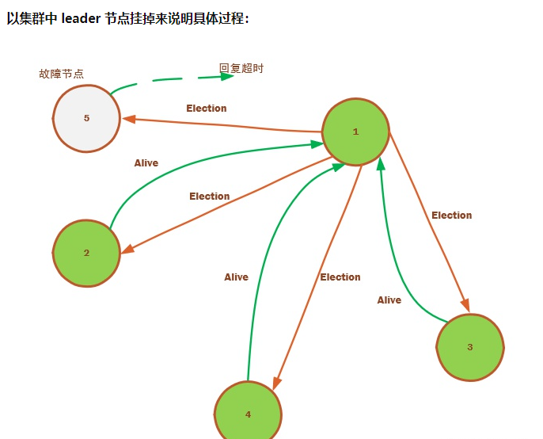
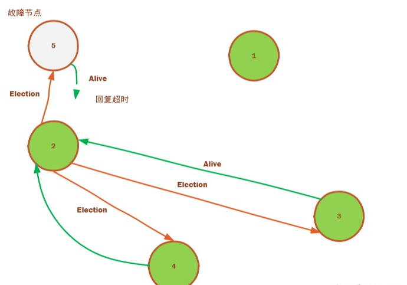
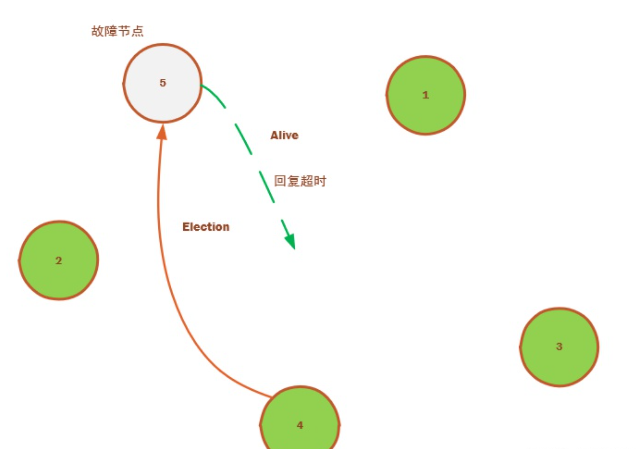
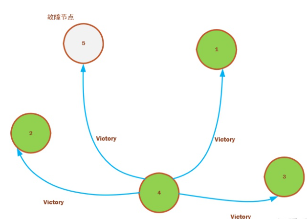
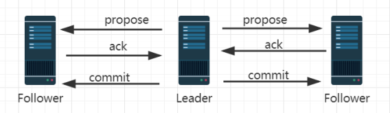
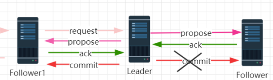
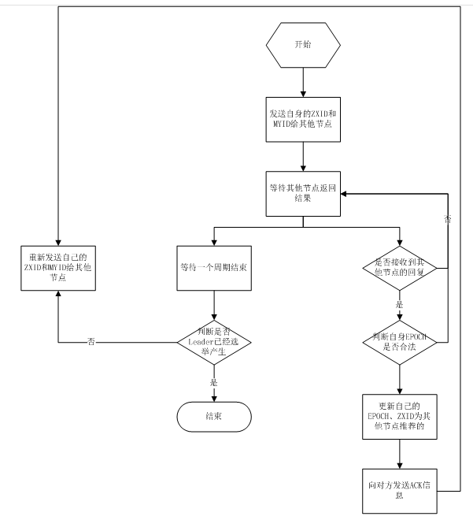
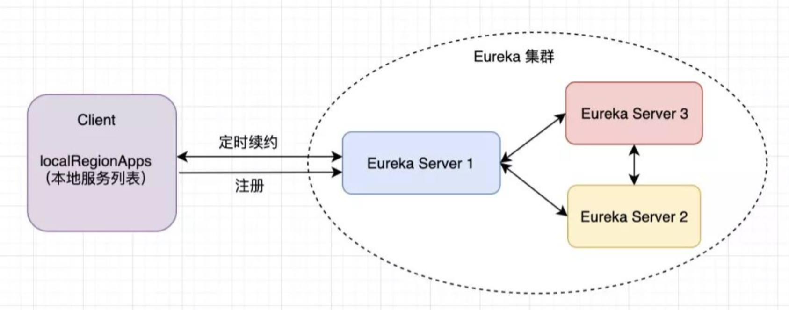

# 分布式选举算法

* [集群一致性问题 （集群高可用）]()
* [一 Bully算法 - 在所有活着的节点中，选取 ID 最大的节点作为主节点]()
* [二 Paxos算法]()
* [三 Raft 共识选举算法（少数服从多数）]()
* [四 ZAB崩溃恢复原子广播协议]()    * [1 消息广播的实现原理]()
    * [2 崩溃恢复的实现原理]()

* [五 应用场景：]()    * [1 ES采用Bully选举算法]()
    * [2 mongodb选举算法（老版Bully，新版Raft）：]()
    * [3 kafka使用ZK实现leader选举]()
    * [4 Eureka 没有主从关系，通过节点复制实现高可用]()

* [六 总结]()    * [选举算法要解决的问题]()
    * [常用中间件使用算法概括]()

一致性本身是个应用广泛的概念，比如并发编程、数据库事务处理、缓存一致性，集群状态数据一致性等等，很多算法都可以解决某些场景下对一致性要求不同的问题。比如2pc无法容错但是能解决强一致性问题，并发编程里

#### 集群一致性问题 （集群高可用）

为了解决单点问题引入了集群，为了实现集群的高可用，用户数据往往存在多个副本或者分片，这样就带来了新的挑战，数据一致性问题。一般情况下 集群模式都是主从架构，主服务器负责写，同时用来保证所有节点状态的一致，而从服务器只负责读和同步主节点状态。当主节点挂掉之后，通过一致性选举算法重新从slave从节点中选举一个作为主节点来提供服务。

在普通的选举算法中可以根据节点编号或版本号来选举leader，或根据投票多少来选举。只要保证选举的结果是唯一的，无二义性的，都是有效的选举算法。

一致性算法并不保证所有节点中的数据是完全一致的，但它能保证即使一小部分节点出现故障，仍然能对外提供一致的服务（客户端无感知）

在分布式环境下，还要保证网络隔离的场景下该算法只有一个leader产生。否则会出现“**脑裂**”问题

#### 一 Bully算法 - 在所有活着的节点中，选取 ID 最大的节点作为主节点

Bully算法是一种主节点竞选算法又叫霸道算法，通常选举id最大的节点作为leader节点(或者根据时间戳最新）。集群中的每个节点都会存放所有的集群节点信息，当集群初始化或主节点挂掉时会发起leader选举。节点之间通过发送消息来进行选举，消息分为三种：

1. **Election Message： 选举消息** A->B 发送选举消息，表示 A 支持 B 当 Leader。
2. **Alive Message： 响应选举消息**，刚才 A->B 选举 B，B 给 A 回复 Answer Messge。
3. **Victory Message： 宣布胜利消息**，如果 B 最终当选为 Leader，则 B 向其他节点发送 Victory Message。
> 当集群启动或主节点挂了之后，集群内心跳检测不到主节点存活会发起新的选举。每个节点都对比自己大的节点发送选举消息（节点保存集群中所有节点的信息），准备选举比自己大的节点为leader。如果存在比自己大的节点，对方会响应选举消息回复AliveMessage消息给自己，此时他就知道有比自己大的节点存在，会等待选举完成的Victory消息。
> 
> 
> 当自己发出选举消息以后，过了一段时间如果未收到任何选举消息的回复AliveMessage消息，那说明自己最大，就可以对其他节点发送victory消息了.

1. Leader 挂掉后，1 节点通过心跳探测消息发现，将发起新的选举，节点 1 向比它大的所有节点发起选举消息，也需要向节点 5 发送选举消息，因为节点 5 这时候可能已经活了，所以再发一次。 节点 2，3，4 回复 Alive 给 1 节点，5 节点由于网络故障回复 Alive 消息丢失。 1 有收到 Alive 的回复后，说明有比它资格老的还活着，老老实实等待选举完成的 Victory 消息吧。

2. 节点 2 也通过心跳探测发现 leader 5 挂了，这时候，通过向所有节点 ID 比它大的 3，4，5 发送选举消息，这时候，3 和 4 都回复 Alive 消息给 2，2 就知道自己不能当 leader，老老实实等待Victory消息吧

3）节点 4 也探测到超时后，发起选举消息给节点 5，接收选举回复消息超时，这时候由于节点 4 没有收到任何选举消息的恢复消息，那就认为自己是 leader，向其他所有节点发送 victory 消息，宣布主权，从而完成这轮选举。

向其他所有节点发送 victory 消息，宣布主权：

**优点：**选举方法简单，实现容易，性能好

**缺点：**如果集群最大的id不稳定，就会频繁选举，造成集群不稳定

**问题：**

**（1）选举时消息延时/过期会干扰集群：**

选举时如果一个节点回复消息有延时，当选举结束以后它的消息才返回，此时势必影响算法的稳定。解决办法是:

> **增加统一的全局逻辑时钟，为每一轮选举增加一个代的概念。选举成功以后逻辑时钟+1，那么延时来的消息就作为上一轮选举的消息丢弃掉 **

**（2）leader 假死：**

当主节点压力比较大的时候，某个子节点可能不能及时收到心跳包，他就会判定主节点已经挂了，从而发起选举。结果主节点又活过来了，又要发起新的选举。es的解决办法：

> **当某个子节点发现主节点挂了（假死），不立刻发起选举，而是询问其他节点，当有半数的节点认为主节点挂了才发起选举。**

**（3）如何防止脑裂：**

脑裂是因为网络分区原因导致的选举出了多个leader的情况，每个leader都会独自处理请求而不会把消息转发给其他分区的节点。

**解决办法：**

> 集群中的存活节点数要包含集群中节点量一半，如果集群中的存活的节点数量没有达到一半，则把自己变成 dead 状态

网上分布式Bully算法选举实现：[https://github.com/Justin02180218/distribute-election-bully](https://github.com/Justin02180218/distribute-election-bully)

**Bully算法应用场景举例：mongodb（r3.2.0版本之前），elasticsearch**

#### 二 Paxos算法

Paxos 理论是用来解决分布式系统中，如何就某个值达成一致的算法。**由Paxos 理论为基础而衍生出来的变种协议有ZooKeeper 的 ZAB 协议，raft 协议等**

Paxos是试图对各Server上的状态进行全局编号，如果能编号成功，那么所有操作都按照编号顺序执行，一致性就不言而喻。

当Cluster中的Server都接收了一些数据，如何进行编号？就是表决，让所有的Server进行表决，看哪个Server上的哪个数据应该排第一，哪个排第二...，只要多数Server同意某个数据该排第几，那就排第几。

很显然，为了给每个数据唯一编号，每次表决只能产生一个数据，否则表决就没有任何意义。

Paxos的算法的所有精力都放在如何在一次表决只产生一个数据。再进一步，我们称表决的数据叫Value，Paxos算法的核心和精华就是确保每次表决只产生一个Value。

**Paxos算法的推导过程：**

https://my.oschina.net/u/150175/blog/2992187

#### 三 Raft 共识选举算法（少数服从多数）

**Raft协议就是针对于主从模式的高可用数据一致性协议,Redis，Mongodb, ETCD，Consul服务注册中心 使用的就是该协议。他是基于paxos算法衍生出来的更简单的选主算法**

**在Raft中，节点有三种角色：**

1. Leader：负责接收客户端的请求，将日志复制到其他节点并告知其他节点何时应用这些日志是安全的
2. Candidate：用于选举Leader的一种角色，可以被选为一个新的Leader
3. Follower：负责响应来自Leader或者Candidate的请求
**选举过程：**

* leader节点会定时向follow节点发送心跳包（150ms~300ms），如果follow节点收不到心跳包就会认为集群崩溃，先增加自己的当前任期号，然后变成Candidate节点，进入竞选阶段。
* Candidate节点开始向其他节点发起请求（投票），其他节点会回复改请求，如果超过一半的节点回复了就认为他是leader，开始跟他建立心跳连接。从而完成选主。
* 如果多个Candidate票数相同会进行下一轮投票。每个Candidate节点都会有随机的竞选时间限制，从而避免了无限次投票的情况。同时建议节点数为奇数，避免无限重复选举。
**日志复制过程：**

1. Leader接收客户端的并请求将修改写入日志中,此时修改还未提交
2. Leader 会把修改发送个所有 Follower，Follower都将这个新的日志内容追加到他们各自的日志中
3. 大多数Follower服务器节点日志写入磁盘文件后，确认追加成功，发出Commited OK消息给leader
4. 此时 Leader 会通知的所有 Follower 更新Commited，让它们也提交修改，此时所有节点的值达成一致
#### 四 ZAB崩溃恢复原子广播协议

**ZAB（Zookeeper Atomic Broadcast） 协议是为分布式协 调服务 ZooKeeper 专门设计的一种基于paxos协议的支持崩溃恢复的原子广播协议。在 ZooKeeper 中，主要依赖 ZAB 协议来实现 分布式数据一致性，基于该协议，ZooKeeper 实现了一种主备模式的系统架构来保持集群中各个副本之间的数据一 致性。**

**原理概况：**

在 zookeeper 中，所有的事务请求都是由leader服务器进行协调的。当请求来临，客户端会随机连接到 zookeeper 集群中 的一个节点，如果是读请求，就直接从当前节点中读取数据，如果是写请求，那么请求会被转发给 leader 提交事务， 然后 leader 会广播事务，发送事务提议，只要有超过半数的folow节点返回写入成功，那么leader会再次向所有follower节点发送提交请求，那么写请求就会被提交（类似 2PC 事务）。

**ZAB 协议包含两种基本模式，分别是 1. 崩溃恢复 2. 原子广播**

**（1）崩溃恢复**

当整个集群在启动时或者当 leader 节点出现网络中断、 崩溃等情况时，ZAB 协议就会进入**恢复模式**并**选举产生新的 Leader**，当 leader 服务器选举出来后，并且集群中有过 半的机器和该 leader 节点完成数据同步后（同步指的是数 据同步，用来保证集群中过半的机器能够和 leader 服务器 的数据状态保持一致），ZAB 协议就会退出恢复模式。

**（2）原子广播**

当集群退出恢复模式之后，集群有过半的 Follower节点完成了和 Leader 状态同步，那么整个集群就进入了**消息广播模式**。这个时候，在 Leader 节点正常工作时，如果新加入一台机器到集群，那这个服务器会直接进入数据恢复模式，和 leader 节点进行数据同步。同步完成后即可正常对外提供非事务请求的处理。

##### 1 消息广播的实现原理

事务消息广播的实现原理程实际上是一个 简化版本的2pc（二阶段）提交过程：

1. leader接收到事务消息以后生成一个自增的且全局唯一的事务号zxid，通过对比zxid的大小就可以实现消息有序
2. leader 为每个 follower 准备了一个 FIFO 队列（通过 TCP 协议来实现，以实现了全局有序这一个特点）将带有 zxid 的消息作为一个提案（proposal）分发给所有的 follower
3. 当 follower 接收到 proposal（提案），先把 proposal 写到磁盘， 写入成功以后再向 leader 回复一个 ack
4. 当 leader 接收到合法数量（超过半数节点）的 ACK 后， leader 就会向这些 follower 发送 commit 命令，同时会在本地提交该消息
5. 当 follower 收到消息的 commit 命令以后，会提交该消 息

在新版的zk中，除了leader角色和follower角色以外增加了Observer观察者角色，Observer 的工作原理与 follower 角色基本一致，可以提供非事务的请求服务，而它和 follower 角色唯一的不同在于 observer 不参与任何形式的投票，包括事物请求 Proposal的投票和leader选举的投票。但是它仍然需要同leader的数据保持一直。

##### 2 崩溃恢复的实现原理

当leader由于网络原因连不上或者崩溃，或者失去半数节点联系时就会进入到崩溃恢复模式。此时会进行leader选举，在leader选举的时候需要保证：

**1 已经被处理的消息不能丢失：**

当 leader 收到合法数量 follower 的 ACKs 后，就向 各个 follower 广播 COMMIT 命令，同时也会在本地 执行 COMMIT 并向连接的客户端返回「成功」。但是如果有部分 follower 在收到 COMMIT 命令前 leader 就挂了，导致一部分服务器执行了commit一部分没执行,需要保证恢复后可以执行commit。如下图：

> （leader 对事务消息发起 commit 操作，但是该消息在 follower1 上执行了，但是 follower2 还没有收到 commit， 就已经挂了，而实际上客户端已经收到该事务消息处理成 功的回执了。所以在 zab 协议下需要保证所有机器都要执 行这个事务消息）

**2 被丢弃的消息不能再次出现**

当 leader 接收到消息请求生成 proposal（提议） 后就挂了，其 他 follower 并没有收到此 proposal，因此经过恢复模式 重新选了 leader 后，这条消息是被跳过的。此时，之前 挂了的 leader 重新启动并注册成了 follower，他保留了 被跳过消息的 proposal 状态，与整个系统的状态是不一 致的，需要将其删除

ZAB 协议需要满足上面两种情况，就必须要设计一个 leader 选举算法：能够确保已经被 leader 提交的事务 Proposal能够提交、同时丢弃已经被跳过的事务Proposal。

**leader选举流程**

1. zxid:是递增的全局唯一的事务id，是一个60位的数字，可以用来保证事务消息的顺序一致性。    1. 每一个事物操作update，delete都会导致事物id增加
    2. 每台服务器都会存储zxid，由于节点数据同步延迟原因可能存在zxid不同的情况，zxid最大的节点数据最全。
    3. 在选举时每次投票会携带zxid,选举时会根据这个zxid来决定优先选谁，所有的提议（proposal）都在被提出的时候加上了 zxid。

2. epoch：可以理解为当前集群所处的年代或者周期，每个 leader 就像皇帝，都有自己的年号，所以每次改朝换代， leader 变更之后，都会在前一个年代的基础上加 1。这样 就算旧的 leader 崩溃恢复之后，也没有人听他的了，因为 follower 只听从当前年代的 leader 的命令。(在 /tmp/zookeeper/VERSION-2 路 径 下 会 看 到 一 个 currentEpoch 文件。文件中显示的是当前的 epoch)
3. myid：代表某个节点

**服务器启动时的 leader 选举过程：**

leader选举至少需要2台服务器才能进行，当服务启动时节点处于looking观望状态,，当有一台服务器 Server1 启动时，它本身是 无法进行和完成 Leader 选举，当第二台服务器 Server2 启 动时，这个时候两台机器可以相互通信，每台机器都试图 找到 Leader，于是进入 Leader 选举过程。选举过程如下：

1. **每个 Server 发出一个投票**：由于是初始情况，Server1 和 Server2 都会将自己作为 Leader 服务器来进行投 票，每次投票会包含所推举的服务器的 (myid, ZXID,epoch)来表示，此时 Server1 的投票为(1, 0)，Server2 的投票为(2, 0)，然后各自将 这个投票发给集群中其他机器。
2. **接受来自各个服务器的投票**：集群的每个服务器收到 投票后，首先判断该投票的有效性，如检查是否是本 轮投票（epoch）、是否来自LOOKING状态的服务器
3. **处理投票**：针对每一个投票，服务器都需要将别人的 投票和自己的投票进行 PK，PK 规则如下：    1. 优先检查 ZXID。ZXID 比较大的服务器优先作为 Leader
    2. 如果 ZXID 相同，那么就比较 myid。myid 较大的 服务器作为 Leader 服务器
对于 Server1 而言，它的投票是(1, 0)，接收 Server2 的投票为(2, 0)，首先会比较两者的 ZXID，均为 0，再 比较 myid，此时 Server2 的 myid 最大，于是更新自 己的投票为(2, 0)，然后重新投票，对于 Server2 而言， 它不需要更新自己的投票，只是再次向集群中所有机 器发出上一次投票信息即可

4. **统计投票** ：每次投票后，服务器都会统计投票信息， 判断是否已经有过半机器接受到相同的投票信息，对 于 Server1、Server2 而言，都统计出集群中已经有两 台机器接受了(2, 0)的投票信息，此时便认为已经选出 了 Leader。

5. **改变服务器状态**：一旦确定了 Leader，每个服务器就 会更新自己的状态，如果是 Follower，那么就变更为 FOLLOWING，如果是 Leader，就变更为 LEADING。

**lader崩溃后的leader选举**

当集群中的 leader 服务器出现宕机或者不可用的情况时， 那么整个集群将无法对外提供服务，进入新一轮的 Leader 选举，服务器运行期间的 Leader 选举和启动时期 的 Leader 选举基本过程是一致的。唯一不同的是 变更状态：Leader 挂后，余下的非 Observer 服务器 都会将自己的服务器状态变更为 LOOKING，然后开 始进入 Leader 选举过程

#### 五 应用场景：

##### 1 ES采用Bully选举算法

Elasticsearch采用了master-slave模式， ES会在集群中选取一个节点成为主节点，只有Master节点有资格维护全局的集群状态，在有节点加入或者退出集群的时候，它会重新分配分片，并将集群最新状态发送给集群中其它节点，主节点会以周期性ping的方式以验证其它节点是否存活。Elasticsearch的选举算法基于Bully选举算法，简单的说，在bully算法中，每个节点都有一个编号，只有编号最大的存活节点才能成为master节点。

**（1）选举时机：** 集群启动或有新节点加入集群时触发，或者某个节点检测到leader崩溃

**（2）选举的流程同Bully选举流程一样**

* 节点node向所有比自己大的节点发送选举消息(选举为election消息)
* 如果节点node得不到任何回复(回复为alive消息)，那么节点node成为master，并向所有的其它节点宣布自己是master(宣布为Victory消息)
* 如果node得到了任何回复，node节点就一定不是master，同时等待Victory消息，如果等待Victory超时那么重新发起选举
**（3）Elasticsearch集群版本号解决选举消息延时问题**

ES通过ClusterState集群版本号和节点id两个因素进行选举比较，首先是ClusterState版本号的比较，版本号越大优先级越高，然后是节点id的比较，id越小优先级越高。

ClusterState是Master向集群中各个节点发送的集群状态，这个状态有一个版本号码，如果集群状态发生了变化，比如集群新增了节点成员或者有节点成员退出了，那么这个版本号就会加一，比对这个版本号的目的是让拥有最新状态的节点成为Master的优先级最高。**解决了过期消息（选举消息延时）对于集群的影响。**

**（4）Elasticsearch解决Master假死**

Master节点承担的职责负载过重的情况下，可能无法即时对组内成员作出响应，这种便是假死。

**解决办法是**：当一个节点发现master不能访问时不立即进行选举，而是询问其他节点是否能访问到master，当有过半的节点都不能访问master时才进行选举。

**（5）Elasticsearch解决脑裂问题**

脑裂问题是由于网络分区原因形成了多个相互隔离的网络，各个网络的节点之间都选举出了自己的master。等于是形成了多个小的集群，每个集群的leader都会独自处理请求而不会把消息转发给其他网络分区的节点，造成数据不一致的情况出现，这就是脑裂问题。

**解决办法：**

Elasticsearch集群机制采用了最小参与节点的方案解决的，节点想要成为master必须要得到n/2 +1票数。我们可以指定es的参与节点数量：`discovery.zen.minimum_master_nodes= n/2+1` 注意：如果设置的过小则会出现脑裂的情况。

> 如果产生了脑裂情况，为了避免脑裂的Master生成错误数据对整个集群产生影响。Master更新集群状态时还作出了如下防护，Master有两种指令，一种是send指令，另一种是commit指令，Master将最新集群状态推送给其它节点的时候(这是send指令)，Master节点进入等待响应状态，其它节点并不会立刻应用该集群状态，而是首先会响应Master节点表示它已经收到集群状态更新，同时等待Master节点的commit指令。Master节点如果在discovery.zen.commit_timeout配置时间内都没有收到discovery.zen.minimum_master_nodes个数的节点响应，那么Master节点就不会向其它节点发送commit指令。如果Master收到了足够数量的响应，那么Master会向集群发出提交状态的指令，此时其它节点应用集群最新状态，Master节点再次等待所有节点响应，等待时间为discovery.zen.publish_timeout，如果任何一个节点没有发出提交响应，Master再次更新整个集群状态更新。

**（6）Master降级**

Master主动降级发生在两种情况：

1. 第一种是master发现自己能连接到的其它节点数目小于n/2 + 1，那么master自动降级为candidate。
2. 第二种是Master在ping其它节点时候，如果发现了其它master，那么当前的master会比较cluster_state的version，如果当前master的version小，那么主动降级为candidate并主动加入另外一个master节点
##### 2 mongodb选举算法（老版Bully，新版Raft）：

* mongodb通过副本集来保证集群的高可用和自动故障转移。副本集包含一个Primary主节点和若干个Secondary从节点，选举机制主要负责在集群初始化时以及节点发生变化时重新选举主节点，保证系统可用性。**触发机制：**    * Secondary节点权重比Primary节点高时，发起替换选举；
    * Secondary节点发现集群中没有Primary时，发起选举；
    * Primary节点不能访问到大部分(Majority)成员时主动降级；

* mongodb副本集中每个节点都会维护所有成员的节点信息，成员之间是通过发送心跳给自己之外的所有节点来同步状态和处理响应。
**MongoDB r3.2.0版本之前使用Bully算法**：

* Bully ID对应MongoDB节点的priority权重，且两个节点priority权重可能相等
* 从节点检测到主节点挂掉之后不止向更高权重的节点发起选举，还会向所有节点发送选举， 

通过审核的节点会投vote票，每个vote会将得票数+1，收到选举请求的节点如果发现候选节点中有更高priority权重的节点时投反对票（veto），会将对应节点的得票数剪掉10000。 * 发起选举的节点不会投票
* 最终得票数超过集群可投票节点数一半时通过选举，发起节点成为Primary。当得票不足一半时，发起者随机退让，随机sleep 0 到1 秒后重新发起选举
* 一轮选举中每个成员最多只能投一票，通过30s的选举锁来避免为其他发起者重复投票，在持有锁的时间内不得给其他发起者投票，避免一个节点同时给两个发起者投票。这会导致如果新选举的主马上挂掉，再30s内不会有新的主产生。
**MongoDB r3.2.0版本之后使用Raft算法**：

Raft算法定义了三种角色：Leader（领袖），Flower（追随者），Candidate（候选者），leader节点会定时向follow节点发送心跳包（150ms~300ms）有一定的随机性，如果follow节点收不到心跳包就会认为集群崩溃，会变成Candidate节点，进入竞选阶段。Candidate节点开始向其他节点发起请求（投票），其他节点会回复改请求，如果超过一半的节点回复了就认为他是leader，开始跟他建立心跳连接。从而完成选主。如果多个Candidate票数相同会进行下一轮投票。每个Candidate节点都会有随机的竞选时间限制，从而避免了无限次投票的情况

**两种方式对比**：

* Raft为MongoDB选举引入Term，取消Bully的选举锁，效率更高，更优雅的避免重复投票，减少投票等待时间。
* Raft弱化了priority权重功能，可能出现非最高priority候选节点当选的情况，后续的心跳中会发现，并重新选举。
* 取消了veto否决投票，选举不一定需要等待心跳超时。
* 主节点的降级有自己发起，效率更高。
##### 3 kafka使用ZK实现leader选举

当一个broker（具体存储消息的节点）歇菜后，所有leader在该broker上的partition都会重新选举，选出一个leader。kafka使用Zookeeper实现leader选举。

如果leader失败，controller会从ISR选出一个新的leader，ISR是in-sync replicas的简写，存储各个节点/副本信息。ISR的副本保持和leader的同步，当然leader本身也在ISR中。初始状态所有的副本都处于ISR中，当一个消息发送给leader的时候，leader会等待ISR中所有的副本告诉它已经接收了这个消息，如果一个副本失败了，那么它会被移除ISR。下一条消息来的时候，leader就会将消息发送给当前的ISR中节点了

##### 4 Eureka 没有主从关系，通过节点复制实现高可用

Eureka集群 实现了CAP理论中的AP，它的各个节点之间没有主从关系，不需要选举机制。每个节点之间都是对等的，采用节点同步的方式实现高可用，数据同步的方式是增量备份。

#### 六 总结

##### 选举算法要解决的问题

1. **网络分区造成的脑裂问题**：设置集群最小参与投票节点的总数，只有超过一半以上节点投票通过才选举成功。
2. **选举时投票消息响应超时问题**：通过集群版本号或者叫选举年代来解决。每选举一次该版本号就自增一次，投票时拥有最新版本号的投票才有效。解决了延时消息对集群的影响。
3. **leader假死问题**：当一个节点发现master不能访问时不立即进行选举，而是询问其他节点是否能访问到master，当有过半的节点都不能访问master时才进行选举。
4. **选举成功后的数据状态如何同步**：一般采用类似2pc两阶段提交的方式进行，来保证事务的一致性。通过生成自增唯一的事务id来保证消息的有序。
##### 常用中间件使用算法概括

* **redis,老版mongodb,etcd,es** 都使用的是改良后的Bully选举算法
* **redis,RocketMQ,Consul注册中心和新版mongodb**使用的是Raft选举算法
* **zookeper**分布式协调服务，使用的是自己实现的一套ZAB原子崩溃广播协议,一些中间件直接使用zk作为选举组件。
* **kafka**使用zk作为选举组件
* **Eureka** 没有主从关系，通过节点复制实现高可用

%0A%5Btoc%5D%0A%0A%E4%B8%80%E8%87%B4%E6%80%A7%E6%9C%AC%E8%BA%AB%E6%98%AF%E4%B8%AA%E5%BA%94%E7%94%A8%E5%B9%BF%E6%B3%9B%E7%9A%84%E6%A6%82%E5%BF%B5%EF%BC%8C%E6%AF%94%E5%A6%82%E5%B9%B6%E5%8F%91%E7%BC%96%E7%A8%8B%E3%80%81%E6%95%B0%E6%8D%AE%E5%BA%93%E4%BA%8B%E5%8A%A1%E5%A4%84%E7%90%86%E3%80%81%E7%BC%93%E5%AD%98%E4%B8%80%E8%87%B4%E6%80%A7%EF%BC%8C%E9%9B%86%E7%BE%A4%E7%8A%B6%E6%80%81%E6%95%B0%E6%8D%AE%E4%B8%80%E8%87%B4%E6%80%A7%E7%AD%89%E7%AD%89%EF%BC%8C%E5%BE%88%E5%A4%9A%E7%AE%97%E6%B3%95%E9%83%BD%E5%8F%AF%E4%BB%A5%E8%A7%A3%E5%86%B3%E6%9F%90%E4%BA%9B%E5%9C%BA%E6%99%AF%E4%B8%8B%E5%AF%B9%E4%B8%80%E8%87%B4%E6%80%A7%E8%A6%81%E6%B1%82%E4%B8%8D%E5%90%8C%E7%9A%84%E9%97%AE%E9%A2%98%E3%80%82%E6%AF%94%E5%A6%822pc%E6%97%A0%E6%B3%95%E5%AE%B9%E9%94%99%E4%BD%86%E6%98%AF%E8%83%BD%E8%A7%A3%E5%86%B3%E5%BC%BA%E4%B8%80%E8%87%B4%E6%80%A7%E9%97%AE%E9%A2%98%EF%BC%8C%E5%B9%B6%E5%8F%91%E7%BC%96%E7%A8%8B%E9%87%8C%0A%0A%0A%23%23%23%23%20%E9%9B%86%E7%BE%A4%E4%B8%80%E8%87%B4%E6%80%A7%E9%97%AE%E9%A2%98%20%EF%BC%88%E9%9B%86%E7%BE%A4%E9%AB%98%E5%8F%AF%E7%94%A8%EF%BC%89%0A%0A%E4%B8%BA%E4%BA%86%E8%A7%A3%E5%86%B3%E5%8D%95%E7%82%B9%E9%97%AE%E9%A2%98%E5%BC%95%E5%85%A5%E4%BA%86%E9%9B%86%E7%BE%A4%EF%BC%8C%E4%B8%BA%E4%BA%86%E5%AE%9E%E7%8E%B0%E9%9B%86%E7%BE%A4%E7%9A%84%E9%AB%98%E5%8F%AF%E7%94%A8%EF%BC%8C%E7%94%A8%E6%88%B7%E6%95%B0%E6%8D%AE%E5%BE%80%E5%BE%80%E5%AD%98%E5%9C%A8%E5%A4%9A%E4%B8%AA%E5%89%AF%E6%9C%AC%E6%88%96%E8%80%85%E5%88%86%E7%89%87%EF%BC%8C%E8%BF%99%E6%A0%B7%E5%B0%B1%E5%B8%A6%E6%9D%A5%E4%BA%86%E6%96%B0%E7%9A%84%E6%8C%91%E6%88%98%EF%BC%8C%E6%95%B0%E6%8D%AE%E4%B8%80%E8%87%B4%E6%80%A7%E9%97%AE%E9%A2%98%E3%80%82%E4%B8%80%E8%88%AC%E6%83%85%E5%86%B5%E4%B8%8B%20%E9%9B%86%E7%BE%A4%E6%A8%A1%E5%BC%8F%E9%83%BD%E6%98%AF%E4%B8%BB%E4%BB%8E%E6%9E%B6%E6%9E%84%EF%BC%8C%E4%B8%BB%E6%9C%8D%E5%8A%A1%E5%99%A8%E8%B4%9F%E8%B4%A3%E5%86%99%EF%BC%8C%E5%90%8C%E6%97%B6%E7%94%A8%E6%9D%A5%E4%BF%9D%E8%AF%81%E6%89%80%E6%9C%89%E8%8A%82%E7%82%B9%E7%8A%B6%E6%80%81%E7%9A%84%E4%B8%80%E8%87%B4%EF%BC%8C%E8%80%8C%E4%BB%8E%E6%9C%8D%E5%8A%A1%E5%99%A8%E5%8F%AA%E8%B4%9F%E8%B4%A3%E8%AF%BB%E5%92%8C%E5%90%8C%E6%AD%A5%E4%B8%BB%E8%8A%82%E7%82%B9%E7%8A%B6%E6%80%81%E3%80%82%E5%BD%93%E4%B8%BB%E8%8A%82%E7%82%B9%E6%8C%82%E6%8E%89%E4%B9%8B%E5%90%8E%EF%BC%8C%E9%80%9A%E8%BF%87%E4%B8%80%E8%87%B4%E6%80%A7%E9%80%89%E4%B8%BE%E7%AE%97%E6%B3%95%E9%87%8D%E6%96%B0%E4%BB%8Eslave%E4%BB%8E%E8%8A%82%E7%82%B9%E4%B8%AD%E9%80%89%E4%B8%BE%E4%B8%80%E4%B8%AA%E4%BD%9C%E4%B8%BA%E4%B8%BB%E8%8A%82%E7%82%B9%E6%9D%A5%E6%8F%90%E4%BE%9B%E6%9C%8D%E5%8A%A1%E3%80%82%0A%0A%E5%9C%A8%E6%99%AE%E9%80%9A%E7%9A%84%E9%80%89%E4%B8%BE%E7%AE%97%E6%B3%95%E4%B8%AD%E5%8F%AF%E4%BB%A5%E6%A0%B9%E6%8D%AE%E8%8A%82%E7%82%B9%E7%BC%96%E5%8F%B7%E6%88%96%E7%89%88%E6%9C%AC%E5%8F%B7%E6%9D%A5%E9%80%89%E4%B8%BEleader%EF%BC%8C%E6%88%96%E6%A0%B9%E6%8D%AE%E6%8A%95%E7%A5%A8%E5%A4%9A%E5%B0%91%E6%9D%A5%E9%80%89%E4%B8%BE%E3%80%82%E5%8F%AA%E8%A6%81%E4%BF%9D%E8%AF%81%E9%80%89%E4%B8%BE%E7%9A%84%E7%BB%93%E6%9E%9C%E6%98%AF%E5%94%AF%E4%B8%80%E7%9A%84%EF%BC%8C%E6%97%A0%E4%BA%8C%E4%B9%89%E6%80%A7%E7%9A%84%EF%BC%8C%E9%83%BD%E6%98%AF%E6%9C%89%E6%95%88%E7%9A%84%E9%80%89%E4%B8%BE%E7%AE%97%E6%B3%95%E3%80%82%0A%0A%E4%B8%80%E8%87%B4%E6%80%A7%E7%AE%97%E6%B3%95%E5%B9%B6%E4%B8%8D%E4%BF%9D%E8%AF%81%E6%89%80%E6%9C%89%E8%8A%82%E7%82%B9%E4%B8%AD%E7%9A%84%E6%95%B0%E6%8D%AE%E6%98%AF%E5%AE%8C%E5%85%A8%E4%B8%80%E8%87%B4%E7%9A%84%EF%BC%8C%E4%BD%86%E5%AE%83%E8%83%BD%E4%BF%9D%E8%AF%81%E5%8D%B3%E4%BD%BF%E4%B8%80%E5%B0%8F%E9%83%A8%E5%88%86%E8%8A%82%E7%82%B9%E5%87%BA%E7%8E%B0%E6%95%85%E9%9A%9C%EF%BC%8C%E4%BB%8D%E7%84%B6%E8%83%BD%E5%AF%B9%E5%A4%96%E6%8F%90%E4%BE%9B%E4%B8%80%E8%87%B4%E7%9A%84%E6%9C%8D%E5%8A%A1%EF%BC%88%E5%AE%A2%E6%88%B7%E7%AB%AF%E6%97%A0%E6%84%9F%E7%9F%A5%EF%BC%89%0A%0A%E5%9C%A8%E5%88%86%E5%B8%83%E5%BC%8F%E7%8E%AF%E5%A2%83%E4%B8%8B%EF%BC%8C%E8%BF%98%E8%A6%81%E4%BF%9D%E8%AF%81%E7%BD%91%E7%BB%9C%E9%9A%94%E7%A6%BB%E7%9A%84%E5%9C%BA%E6%99%AF%E4%B8%8B%E8%AF%A5%E7%AE%97%E6%B3%95%E5%8F%AA%E6%9C%89%E4%B8%80%E4%B8%AAleader%E4%BA%A7%E7%94%9F%E3%80%82%E5%90%A6%E5%88%99%E4%BC%9A%E5%87%BA%E7%8E%B0%E2%80%9C**%E8%84%91%E8%A3%82**%E2%80%9D%E9%97%AE%E9%A2%98%0A%0A%0A%23%23%23%23%20%E4%B8%80%20Bully%E7%AE%97%E6%B3%95%20%20-%20%20%E5%9C%A8%E6%89%80%E6%9C%89%E6%B4%BB%E7%9D%80%E7%9A%84%E8%8A%82%E7%82%B9%E4%B8%AD%EF%BC%8C%E9%80%89%E5%8F%96%20ID%20%E6%9C%80%E5%A4%A7%E7%9A%84%E8%8A%82%E7%82%B9%E4%BD%9C%E4%B8%BA%E4%B8%BB%E8%8A%82%E7%82%B9%0A%0A%0ABully%E7%AE%97%E6%B3%95%E6%98%AF%E4%B8%80%E7%A7%8D%E4%B8%BB%E8%8A%82%E7%82%B9%E7%AB%9E%E9%80%89%E7%AE%97%E6%B3%95%E5%8F%88%E5%8F%AB%E9%9C%B8%E9%81%93%E7%AE%97%E6%B3%95%EF%BC%8C%E9%80%9A%E5%B8%B8%E9%80%89%E4%B8%BEid%E6%9C%80%E5%A4%A7%E7%9A%84%E8%8A%82%E7%82%B9%E4%BD%9C%E4%B8%BAleader%E8%8A%82%E7%82%B9(%E6%88%96%E8%80%85%E6%A0%B9%E6%8D%AE%E6%97%B6%E9%97%B4%E6%88%B3%E6%9C%80%E6%96%B0%EF%BC%89%E3%80%82%E9%9B%86%E7%BE%A4%E4%B8%AD%E7%9A%84%E6%AF%8F%E4%B8%AA%E8%8A%82%E7%82%B9%E9%83%BD%E4%BC%9A%E5%AD%98%E6%94%BE%E6%89%80%E6%9C%89%E7%9A%84%E9%9B%86%E7%BE%A4%E8%8A%82%E7%82%B9%E4%BF%A1%E6%81%AF%EF%BC%8C%E5%BD%93%E9%9B%86%E7%BE%A4%E5%88%9D%E5%A7%8B%E5%8C%96%E6%88%96%E4%B8%BB%E8%8A%82%E7%82%B9%E6%8C%82%E6%8E%89%E6%97%B6%E4%BC%9A%E5%8F%91%E8%B5%B7leader%E9%80%89%E4%B8%BE%E3%80%82%E8%8A%82%E7%82%B9%E4%B9%8B%E9%97%B4%E9%80%9A%E8%BF%87%E5%8F%91%E9%80%81%E6%B6%88%E6%81%AF%E6%9D%A5%E8%BF%9B%E8%A1%8C%E9%80%89%E4%B8%BE%EF%BC%8C%E6%B6%88%E6%81%AF%E5%88%86%E4%B8%BA%E4%B8%89%E7%A7%8D%EF%BC%9A%0A%0A1.%20**Election%20Message%EF%BC%9A%20%E9%80%89%E4%B8%BE%E6%B6%88%E6%81%AF**%20A-%3EB%20%E5%8F%91%E9%80%81%E9%80%89%E4%B8%BE%E6%B6%88%E6%81%AF%EF%BC%8C%E8%A1%A8%E7%A4%BA%20A%20%E6%94%AF%E6%8C%81%20B%20%E5%BD%93%20Leader%E3%80%82%0A2.%20**Alive%20Message%EF%BC%9A%20%E5%93%8D%E5%BA%94%E9%80%89%E4%B8%BE%E6%B6%88%E6%81%AF**%EF%BC%8C%E5%88%9A%E6%89%8D%20A-%3EB%20%E9%80%89%E4%B8%BE%20B%EF%BC%8CB%20%E7%BB%99%20A%20%E5%9B%9E%E5%A4%8D%20Answer%20Messge%E3%80%82%0A3.%20**Victory%20Message%EF%BC%9A%20%E5%AE%A3%E5%B8%83%E8%83%9C%E5%88%A9%E6%B6%88%E6%81%AF**%EF%BC%8C%E5%A6%82%E6%9E%9C%20B%20%E6%9C%80%E7%BB%88%E5%BD%93%E9%80%89%E4%B8%BA%20Leader%EF%BC%8C%E5%88%99%20B%20%E5%90%91%E5%85%B6%E4%BB%96%E8%8A%82%E7%82%B9%E5%8F%91%E9%80%81%20Victory%20Message%E3%80%82%0A%0A%3E%E5%BD%93%E9%9B%86%E7%BE%A4%E5%90%AF%E5%8A%A8%E6%88%96%E4%B8%BB%E8%8A%82%E7%82%B9%E6%8C%82%E4%BA%86%E4%B9%8B%E5%90%8E%EF%BC%8C%E9%9B%86%E7%BE%A4%E5%86%85%E5%BF%83%E8%B7%B3%E6%A3%80%E6%B5%8B%E4%B8%8D%E5%88%B0%E4%B8%BB%E8%8A%82%E7%82%B9%E5%AD%98%E6%B4%BB%E4%BC%9A%E5%8F%91%E8%B5%B7%E6%96%B0%E7%9A%84%E9%80%89%E4%B8%BE%E3%80%82%E6%AF%8F%E4%B8%AA%E8%8A%82%E7%82%B9%E9%83%BD%E5%AF%B9%E6%AF%94%E8%87%AA%E5%B7%B1%E5%A4%A7%E7%9A%84%E8%8A%82%E7%82%B9%E5%8F%91%E9%80%81%E9%80%89%E4%B8%BE%E6%B6%88%E6%81%AF%EF%BC%88%E8%8A%82%E7%82%B9%E4%BF%9D%E5%AD%98%E9%9B%86%E7%BE%A4%E4%B8%AD%E6%89%80%E6%9C%89%E8%8A%82%E7%82%B9%E7%9A%84%E4%BF%A1%E6%81%AF%EF%BC%89%EF%BC%8C%E5%87%86%E5%A4%87%E9%80%89%E4%B8%BE%E6%AF%94%E8%87%AA%E5%B7%B1%E5%A4%A7%E7%9A%84%E8%8A%82%E7%82%B9%E4%B8%BAleader%E3%80%82%E5%A6%82%E6%9E%9C%E5%AD%98%E5%9C%A8%E6%AF%94%E8%87%AA%E5%B7%B1%E5%A4%A7%E7%9A%84%E8%8A%82%E7%82%B9%EF%BC%8C%E5%AF%B9%E6%96%B9%E4%BC%9A%E5%93%8D%E5%BA%94%E9%80%89%E4%B8%BE%E6%B6%88%E6%81%AF%E5%9B%9E%E5%A4%8DAliveMessage%E6%B6%88%E6%81%AF%E7%BB%99%E8%87%AA%E5%B7%B1%EF%BC%8C%E6%AD%A4%E6%97%B6%E4%BB%96%E5%B0%B1%E7%9F%A5%E9%81%93%E6%9C%89%E6%AF%94%E8%87%AA%E5%B7%B1%E5%A4%A7%E7%9A%84%E8%8A%82%E7%82%B9%E5%AD%98%E5%9C%A8%EF%BC%8C%E4%BC%9A%E7%AD%89%E5%BE%85%E9%80%89%E4%B8%BE%E5%AE%8C%E6%88%90%E7%9A%84Victory%E6%B6%88%E6%81%AF%E3%80%82%0A%3E%E5%BD%93%E8%87%AA%E5%B7%B1%E5%8F%91%E5%87%BA%E9%80%89%E4%B8%BE%E6%B6%88%E6%81%AF%E4%BB%A5%E5%90%8E%EF%BC%8C%E8%BF%87%E4%BA%86%E4%B8%80%E6%AE%B5%E6%97%B6%E9%97%B4%E5%A6%82%E6%9E%9C%E6%9C%AA%E6%94%B6%E5%88%B0%E4%BB%BB%E4%BD%95%E9%80%89%E4%B8%BE%E6%B6%88%E6%81%AF%E7%9A%84%E5%9B%9E%E5%A4%8DAliveMessage%E6%B6%88%E6%81%AF%EF%BC%8C%E9%82%A3%E8%AF%B4%E6%98%8E%E8%87%AA%E5%B7%B1%E6%9C%80%E5%A4%A7%EF%BC%8C%E5%B0%B1%E5%8F%AF%E4%BB%A5%E5%AF%B9%E5%85%B6%E4%BB%96%E8%8A%82%E7%82%B9%E5%8F%91%E9%80%81victory%E6%B6%88%E6%81%AF%E4%BA%86.%0A%0A%0A%0A1)%20Leader%20%E6%8C%82%E6%8E%89%E5%90%8E%EF%BC%8C1%20%E8%8A%82%E7%82%B9%E9%80%9A%E8%BF%87%E5%BF%83%E8%B7%B3%E6%8E%A2%E6%B5%8B%E6%B6%88%E6%81%AF%E5%8F%91%E7%8E%B0%EF%BC%8C%E5%B0%86%E5%8F%91%E8%B5%B7%E6%96%B0%E7%9A%84%E9%80%89%E4%B8%BE%EF%BC%8C%E8%8A%82%E7%82%B9%201%20%E5%90%91%E6%AF%94%E5%AE%83%E5%A4%A7%E7%9A%84%E6%89%80%E6%9C%89%E8%8A%82%E7%82%B9%E5%8F%91%E8%B5%B7%E9%80%89%E4%B8%BE%E6%B6%88%E6%81%AF%EF%BC%8C%E4%B9%9F%E9%9C%80%E8%A6%81%E5%90%91%E8%8A%82%E7%82%B9%205%20%E5%8F%91%E9%80%81%E9%80%89%E4%B8%BE%E6%B6%88%E6%81%AF%EF%BC%8C%E5%9B%A0%E4%B8%BA%E8%8A%82%E7%82%B9%205%20%E8%BF%99%E6%97%B6%E5%80%99%E5%8F%AF%E8%83%BD%E5%B7%B2%E7%BB%8F%E6%B4%BB%E4%BA%86%EF%BC%8C%E6%89%80%E4%BB%A5%E5%86%8D%E5%8F%91%E4%B8%80%E6%AC%A1%E3%80%82%20%E8%8A%82%E7%82%B9%202%EF%BC%8C3%EF%BC%8C4%20%E5%9B%9E%E5%A4%8D%20Alive%20%E7%BB%99%201%20%E8%8A%82%E7%82%B9%EF%BC%8C5%20%E8%8A%82%E7%82%B9%E7%94%B1%E4%BA%8E%E7%BD%91%E7%BB%9C%E6%95%85%E9%9A%9C%E5%9B%9E%E5%A4%8D%20Alive%20%E6%B6%88%E6%81%AF%E4%B8%A2%E5%A4%B1%E3%80%82%201%20%E6%9C%89%E6%94%B6%E5%88%B0%20Alive%20%E7%9A%84%E5%9B%9E%E5%A4%8D%E5%90%8E%EF%BC%8C%E8%AF%B4%E6%98%8E%E6%9C%89%E6%AF%94%E5%AE%83%E8%B5%84%E6%A0%BC%E8%80%81%E7%9A%84%E8%BF%98%E6%B4%BB%E7%9D%80%EF%BC%8C%E8%80%81%E8%80%81%E5%AE%9E%E5%AE%9E%E7%AD%89%E5%BE%85%E9%80%89%E4%B8%BE%E5%AE%8C%E6%88%90%E7%9A%84%20Victory%20%E6%B6%88%E6%81%AF%E5%90%A7%E3%80%82%0A!%5B278f1ee703ddb1681050af28441f254c.png%5D(en-resource%3A%2F%2Fdatabase%2F1134%3A1)%0A%0A2)%20%E8%8A%82%E7%82%B9%202%20%E4%B9%9F%E9%80%9A%E8%BF%87%E5%BF%83%E8%B7%B3%E6%8E%A2%E6%B5%8B%E5%8F%91%E7%8E%B0%20leader%205%20%E6%8C%82%E4%BA%86%EF%BC%8C%E8%BF%99%E6%97%B6%E5%80%99%EF%BC%8C%E9%80%9A%E8%BF%87%E5%90%91%E6%89%80%E6%9C%89%E8%8A%82%E7%82%B9%20ID%20%E6%AF%94%E5%AE%83%E5%A4%A7%E7%9A%84%203%EF%BC%8C4%EF%BC%8C5%20%E5%8F%91%E9%80%81%E9%80%89%E4%B8%BE%E6%B6%88%E6%81%AF%EF%BC%8C%E8%BF%99%E6%97%B6%E5%80%99%EF%BC%8C3%20%E5%92%8C%204%20%E9%83%BD%E5%9B%9E%E5%A4%8D%20Alive%20%E6%B6%88%E6%81%AF%E7%BB%99%202%EF%BC%8C2%20%E5%B0%B1%E7%9F%A5%E9%81%93%E8%87%AA%E5%B7%B1%E4%B8%8D%E8%83%BD%E5%BD%93%20leader%EF%BC%8C%E8%80%81%E8%80%81%E5%AE%9E%E5%AE%9E%E7%AD%89%E5%BE%85Victory%E6%B6%88%E6%81%AF%E5%90%A7%0A!%5B942f9c925af8dbb28032dc044b47ab62.png%5D(en-resource%3A%2F%2Fdatabase%2F1136%3A1)%0A%0A%0A3%EF%BC%89%E8%8A%82%E7%82%B9%204%20%E4%B9%9F%E6%8E%A2%E6%B5%8B%E5%88%B0%E8%B6%85%E6%97%B6%E5%90%8E%EF%BC%8C%E5%8F%91%E8%B5%B7%E9%80%89%E4%B8%BE%E6%B6%88%E6%81%AF%E7%BB%99%E8%8A%82%E7%82%B9%205%EF%BC%8C%E6%8E%A5%E6%94%B6%E9%80%89%E4%B8%BE%E5%9B%9E%E5%A4%8D%E6%B6%88%E6%81%AF%E8%B6%85%E6%97%B6%EF%BC%8C%E8%BF%99%E6%97%B6%E5%80%99%E7%94%B1%E4%BA%8E%E8%8A%82%E7%82%B9%204%20%E6%B2%A1%E6%9C%89%E6%94%B6%E5%88%B0%E4%BB%BB%E4%BD%95%E9%80%89%E4%B8%BE%E6%B6%88%E6%81%AF%E7%9A%84%E6%81%A2%E5%A4%8D%E6%B6%88%E6%81%AF%EF%BC%8C%E9%82%A3%E5%B0%B1%E8%AE%A4%E4%B8%BA%E8%87%AA%E5%B7%B1%E6%98%AF%20leader%EF%BC%8C%E5%90%91%E5%85%B6%E4%BB%96%E6%89%80%E6%9C%89%E8%8A%82%E7%82%B9%E5%8F%91%E9%80%81%20victory%20%E6%B6%88%E6%81%AF%EF%BC%8C%E5%AE%A3%E5%B8%83%E4%B8%BB%E6%9D%83%EF%BC%8C%E4%BB%8E%E8%80%8C%E5%AE%8C%E6%88%90%E8%BF%99%E8%BD%AE%E9%80%89%E4%B8%BE%E3%80%82%0A!%5B5b682e5977d112ed6450e49485c15489.png%5D(en-resource%3A%2F%2Fdatabase%2F1138%3A1)%0A%E5%90%91%E5%85%B6%E4%BB%96%E6%89%80%E6%9C%89%E8%8A%82%E7%82%B9%E5%8F%91%E9%80%81%20victory%20%E6%B6%88%E6%81%AF%EF%BC%8C%E5%AE%A3%E5%B8%83%E4%B8%BB%E6%9D%83%EF%BC%9A%0A!%5B7e8b7e02d1d39b234ad764a7c4915269.png%5D(en-resource%3A%2F%2Fdatabase%2F1140%3A1)%0A%0A**%E4%BC%98%E7%82%B9%EF%BC%9A**%E9%80%89%E4%B8%BE%E6%96%B9%E6%B3%95%E7%AE%80%E5%8D%95%EF%BC%8C%E5%AE%9E%E7%8E%B0%E5%AE%B9%E6%98%93%EF%BC%8C%E6%80%A7%E8%83%BD%E5%A5%BD%0A**%E7%BC%BA%E7%82%B9%EF%BC%9A**%E5%A6%82%E6%9E%9C%E9%9B%86%E7%BE%A4%E6%9C%80%E5%A4%A7%E7%9A%84id%E4%B8%8D%E7%A8%B3%E5%AE%9A%EF%BC%8C%E5%B0%B1%E4%BC%9A%E9%A2%91%E7%B9%81%E9%80%89%E4%B8%BE%EF%BC%8C%E9%80%A0%E6%88%90%E9%9B%86%E7%BE%A4%E4%B8%8D%E7%A8%B3%E5%AE%9A%0A**%E9%97%AE%E9%A2%98%EF%BC%9A**%0A**%EF%BC%881%EF%BC%89%E9%80%89%E4%B8%BE%E6%97%B6%E6%B6%88%E6%81%AF%E5%BB%B6%E6%97%B6%2F%E8%BF%87%E6%9C%9F%E4%BC%9A%E5%B9%B2%E6%89%B0%E9%9B%86%E7%BE%A4%EF%BC%9A**%0A%20%20%20%20%E9%80%89%E4%B8%BE%E6%97%B6%E5%A6%82%E6%9E%9C%E4%B8%80%E4%B8%AA%E8%8A%82%E7%82%B9%E5%9B%9E%E5%A4%8D%E6%B6%88%E6%81%AF%E6%9C%89%E5%BB%B6%E6%97%B6%EF%BC%8C%E5%BD%93%E9%80%89%E4%B8%BE%E7%BB%93%E6%9D%9F%E4%BB%A5%E5%90%8E%E5%AE%83%E7%9A%84%E6%B6%88%E6%81%AF%E6%89%8D%E8%BF%94%E5%9B%9E%EF%BC%8C%E6%AD%A4%E6%97%B6%E5%8A%BF%E5%BF%85%E5%BD%B1%E5%93%8D%E7%AE%97%E6%B3%95%E7%9A%84%E7%A8%B3%E5%AE%9A%E3%80%82%E8%A7%A3%E5%86%B3%E5%8A%9E%E6%B3%95%E6%98%AF%3A%0A%3E%20%20%20**%E5%A2%9E%E5%8A%A0%E7%BB%9F%E4%B8%80%E7%9A%84%E5%85%A8%E5%B1%80%E9%80%BB%E8%BE%91%E6%97%B6%E9%92%9F%EF%BC%8C%E4%B8%BA%E6%AF%8F%E4%B8%80%E8%BD%AE%E9%80%89%E4%B8%BE%E5%A2%9E%E5%8A%A0%E4%B8%80%E4%B8%AA%E4%BB%A3%E7%9A%84%E6%A6%82%E5%BF%B5%E3%80%82%E9%80%89%E4%B8%BE%E6%88%90%E5%8A%9F%E4%BB%A5%E5%90%8E%E9%80%BB%E8%BE%91%E6%97%B6%E9%92%9F%2B1%EF%BC%8C%E9%82%A3%E4%B9%88%E5%BB%B6%E6%97%B6%E6%9D%A5%E7%9A%84%E6%B6%88%E6%81%AF%E5%B0%B1%E4%BD%9C%E4%B8%BA%E4%B8%8A%E4%B8%80%E8%BD%AE%E9%80%89%E4%B8%BE%E7%9A%84%E6%B6%88%E6%81%AF%E4%B8%A2%E5%BC%83%E6%8E%89%20**%0A%0A**%EF%BC%882%EF%BC%89leader%20%E5%81%87%E6%AD%BB%EF%BC%9A**%0A%E5%BD%93%E4%B8%BB%E8%8A%82%E7%82%B9%E5%8E%8B%E5%8A%9B%E6%AF%94%E8%BE%83%E5%A4%A7%E7%9A%84%E6%97%B6%E5%80%99%EF%BC%8C%E6%9F%90%E4%B8%AA%E5%AD%90%E8%8A%82%E7%82%B9%E5%8F%AF%E8%83%BD%E4%B8%8D%E8%83%BD%E5%8F%8A%E6%97%B6%E6%94%B6%E5%88%B0%E5%BF%83%E8%B7%B3%E5%8C%85%EF%BC%8C%E4%BB%96%E5%B0%B1%E4%BC%9A%E5%88%A4%E5%AE%9A%E4%B8%BB%E8%8A%82%E7%82%B9%E5%B7%B2%E7%BB%8F%E6%8C%82%E4%BA%86%EF%BC%8C%E4%BB%8E%E8%80%8C%E5%8F%91%E8%B5%B7%E9%80%89%E4%B8%BE%E3%80%82%E7%BB%93%E6%9E%9C%E4%B8%BB%E8%8A%82%E7%82%B9%E5%8F%88%E6%B4%BB%E8%BF%87%E6%9D%A5%E4%BA%86%EF%BC%8C%E5%8F%88%E8%A6%81%E5%8F%91%E8%B5%B7%E6%96%B0%E7%9A%84%E9%80%89%E4%B8%BE%E3%80%82es%E7%9A%84%E8%A7%A3%E5%86%B3%E5%8A%9E%E6%B3%95%EF%BC%9A%0A%3E**%E5%BD%93%E6%9F%90%E4%B8%AA%E5%AD%90%E8%8A%82%E7%82%B9%E5%8F%91%E7%8E%B0%E4%B8%BB%E8%8A%82%E7%82%B9%E6%8C%82%E4%BA%86%EF%BC%88%E5%81%87%E6%AD%BB%EF%BC%89%EF%BC%8C%E4%B8%8D%E7%AB%8B%E5%88%BB%E5%8F%91%E8%B5%B7%E9%80%89%E4%B8%BE%EF%BC%8C%E8%80%8C%E6%98%AF%E8%AF%A2%E9%97%AE%E5%85%B6%E4%BB%96%E8%8A%82%E7%82%B9%EF%BC%8C%E5%BD%93%E6%9C%89%E5%8D%8A%E6%95%B0%E7%9A%84%E8%8A%82%E7%82%B9%E8%AE%A4%E4%B8%BA%E4%B8%BB%E8%8A%82%E7%82%B9%E6%8C%82%E4%BA%86%E6%89%8D%E5%8F%91%E8%B5%B7%E9%80%89%E4%B8%BE%E3%80%82**%0A%0A**%EF%BC%883%EF%BC%89%E5%A6%82%E4%BD%95%E9%98%B2%E6%AD%A2%E8%84%91%E8%A3%82%EF%BC%9A**%0A%E8%84%91%E8%A3%82%E6%98%AF%E5%9B%A0%E4%B8%BA%E7%BD%91%E7%BB%9C%E5%88%86%E5%8C%BA%E5%8E%9F%E5%9B%A0%E5%AF%BC%E8%87%B4%E7%9A%84%E9%80%89%E4%B8%BE%E5%87%BA%E4%BA%86%E5%A4%9A%E4%B8%AAleader%E7%9A%84%E6%83%85%E5%86%B5%EF%BC%8C%E6%AF%8F%E4%B8%AAleader%E9%83%BD%E4%BC%9A%E7%8B%AC%E8%87%AA%E5%A4%84%E7%90%86%E8%AF%B7%E6%B1%82%E8%80%8C%E4%B8%8D%E4%BC%9A%E6%8A%8A%E6%B6%88%E6%81%AF%E8%BD%AC%E5%8F%91%E7%BB%99%E5%85%B6%E4%BB%96%E5%88%86%E5%8C%BA%E7%9A%84%E8%8A%82%E7%82%B9%E3%80%82%0A**%E8%A7%A3%E5%86%B3%E5%8A%9E%E6%B3%95%EF%BC%9A**%0A%3E%E9%9B%86%E7%BE%A4%E4%B8%AD%E7%9A%84%E5%AD%98%E6%B4%BB%E8%8A%82%E7%82%B9%E6%95%B0%E8%A6%81%E5%8C%85%E5%90%AB%E9%9B%86%E7%BE%A4%E4%B8%AD%E8%8A%82%E7%82%B9%E9%87%8F%E4%B8%80%E5%8D%8A%EF%BC%8C%E5%A6%82%E6%9E%9C%E9%9B%86%E7%BE%A4%E4%B8%AD%E7%9A%84%E5%AD%98%E6%B4%BB%E7%9A%84%E8%8A%82%E7%82%B9%E6%95%B0%E9%87%8F%E6%B2%A1%E6%9C%89%E8%BE%BE%E5%88%B0%E4%B8%80%E5%8D%8A%EF%BC%8C%E5%88%99%E6%8A%8A%E8%87%AA%E5%B7%B1%E5%8F%98%E6%88%90%20dead%20%E7%8A%B6%E6%80%81%0A%0A%E7%BD%91%E4%B8%8A%E5%88%86%E5%B8%83%E5%BC%8FBully%E7%AE%97%E6%B3%95%E9%80%89%E4%B8%BE%E5%AE%9E%E7%8E%B0%EF%BC%9A%5Bhttps%3A%2F%2Fgithub.com%2FJustin02180218%2Fdistribute-election-bully%5D(https%3A%2F%2Fgithub.com%2FJustin02180218%2Fdistribute-election-bully)%0A%0A%0A**Bully%E7%AE%97%E6%B3%95%E5%BA%94%E7%94%A8%E5%9C%BA%E6%99%AF%E4%B8%BE%E4%BE%8B%EF%BC%9Amongodb%EF%BC%88r3.2.0%E7%89%88%E6%9C%AC%E4%B9%8B%E5%89%8D%EF%BC%89%EF%BC%8Celasticsearch**%0A%0A%0A%0A%23%23%23%23%20%E4%BA%8C%20Paxos%E7%AE%97%E6%B3%95%0A%0APaxos%20%E7%90%86%E8%AE%BA%E6%98%AF%E7%94%A8%E6%9D%A5%E8%A7%A3%E5%86%B3%E5%88%86%E5%B8%83%E5%BC%8F%E7%B3%BB%E7%BB%9F%E4%B8%AD%EF%BC%8C%E5%A6%82%E4%BD%95%E5%B0%B1%E6%9F%90%E4%B8%AA%E5%80%BC%E8%BE%BE%E6%88%90%E4%B8%80%E8%87%B4%E7%9A%84%E7%AE%97%E6%B3%95%E3%80%82**%E7%94%B1Paxos%20%E7%90%86%E8%AE%BA%E4%B8%BA%E5%9F%BA%E7%A1%80%E8%80%8C%E8%A1%8D%E7%94%9F%E5%87%BA%E6%9D%A5%E7%9A%84%E5%8F%98%E7%A7%8D%E5%8D%8F%E8%AE%AE%E6%9C%89ZooKeeper%20%E7%9A%84%20ZAB%20%E5%8D%8F%E8%AE%AE%EF%BC%8Craft%20%E5%8D%8F%E8%AE%AE%E7%AD%89**%0A%0APaxos%E6%98%AF%E8%AF%95%E5%9B%BE%E5%AF%B9%E5%90%84Server%E4%B8%8A%E7%9A%84%E7%8A%B6%E6%80%81%E8%BF%9B%E8%A1%8C%E5%85%A8%E5%B1%80%E7%BC%96%E5%8F%B7%EF%BC%8C%E5%A6%82%E6%9E%9C%E8%83%BD%E7%BC%96%E5%8F%B7%E6%88%90%E5%8A%9F%EF%BC%8C%E9%82%A3%E4%B9%88%E6%89%80%E6%9C%89%E6%93%8D%E4%BD%9C%E9%83%BD%E6%8C%89%E7%85%A7%E7%BC%96%E5%8F%B7%E9%A1%BA%E5%BA%8F%E6%89%A7%E8%A1%8C%EF%BC%8C%E4%B8%80%E8%87%B4%E6%80%A7%E5%B0%B1%E4%B8%8D%E8%A8%80%E8%80%8C%E5%96%BB%E3%80%82%0A%0A%E5%BD%93Cluster%E4%B8%AD%E7%9A%84Server%E9%83%BD%E6%8E%A5%E6%94%B6%E4%BA%86%E4%B8%80%E4%BA%9B%E6%95%B0%E6%8D%AE%EF%BC%8C%E5%A6%82%E4%BD%95%E8%BF%9B%E8%A1%8C%E7%BC%96%E5%8F%B7%EF%BC%9F%E5%B0%B1%E6%98%AF%E8%A1%A8%E5%86%B3%EF%BC%8C%E8%AE%A9%E6%89%80%E6%9C%89%E7%9A%84Server%E8%BF%9B%E8%A1%8C%E8%A1%A8%E5%86%B3%EF%BC%8C%E7%9C%8B%E5%93%AA%E4%B8%AAServer%E4%B8%8A%E7%9A%84%E5%93%AA%E4%B8%AA%E6%95%B0%E6%8D%AE%E5%BA%94%E8%AF%A5%E6%8E%92%E7%AC%AC%E4%B8%80%EF%BC%8C%E5%93%AA%E4%B8%AA%E6%8E%92%E7%AC%AC%E4%BA%8C...%EF%BC%8C%E5%8F%AA%E8%A6%81%E5%A4%9A%E6%95%B0Server%E5%90%8C%E6%84%8F%E6%9F%90%E4%B8%AA%E6%95%B0%E6%8D%AE%E8%AF%A5%E6%8E%92%E7%AC%AC%E5%87%A0%EF%BC%8C%E9%82%A3%E5%B0%B1%E6%8E%92%E7%AC%AC%E5%87%A0%E3%80%82%0A%E5%BE%88%E6%98%BE%E7%84%B6%EF%BC%8C%E4%B8%BA%E4%BA%86%E7%BB%99%E6%AF%8F%E4%B8%AA%E6%95%B0%E6%8D%AE%E5%94%AF%E4%B8%80%E7%BC%96%E5%8F%B7%EF%BC%8C%E6%AF%8F%E6%AC%A1%E8%A1%A8%E5%86%B3%E5%8F%AA%E8%83%BD%E4%BA%A7%E7%94%9F%E4%B8%80%E4%B8%AA%E6%95%B0%E6%8D%AE%EF%BC%8C%E5%90%A6%E5%88%99%E8%A1%A8%E5%86%B3%E5%B0%B1%E6%B2%A1%E6%9C%89%E4%BB%BB%E4%BD%95%E6%84%8F%E4%B9%89%E3%80%82%0APaxos%E7%9A%84%E7%AE%97%E6%B3%95%E7%9A%84%E6%89%80%E6%9C%89%E7%B2%BE%E5%8A%9B%E9%83%BD%E6%94%BE%E5%9C%A8%E5%A6%82%E4%BD%95%E5%9C%A8%E4%B8%80%E6%AC%A1%E8%A1%A8%E5%86%B3%E5%8F%AA%E4%BA%A7%E7%94%9F%E4%B8%80%E4%B8%AA%E6%95%B0%E6%8D%AE%E3%80%82%E5%86%8D%E8%BF%9B%E4%B8%80%E6%AD%A5%EF%BC%8C%E6%88%91%E4%BB%AC%E7%A7%B0%E8%A1%A8%E5%86%B3%E7%9A%84%E6%95%B0%E6%8D%AE%E5%8F%ABValue%EF%BC%8CPaxos%E7%AE%97%E6%B3%95%E7%9A%84%E6%A0%B8%E5%BF%83%E5%92%8C%E7%B2%BE%E5%8D%8E%E5%B0%B1%E6%98%AF%E7%A1%AE%E4%BF%9D%E6%AF%8F%E6%AC%A1%E8%A1%A8%E5%86%B3%E5%8F%AA%E4%BA%A7%E7%94%9F%E4%B8%80%E4%B8%AAValue%E3%80%82%0A%0A**Paxos%E7%AE%97%E6%B3%95%E7%9A%84%E6%8E%A8%E5%AF%BC%E8%BF%87%E7%A8%8B%EF%BC%9A**%0Ahttps%3A%2F%2Fmy.oschina.net%2Fu%2F150175%2Fblog%2F2992187%0A%0A%23%23%23%23%20%E4%B8%89%20Raft%20%E5%85%B1%E8%AF%86%E9%80%89%E4%B8%BE%E7%AE%97%E6%B3%95%EF%BC%88%E5%B0%91%E6%95%B0%E6%9C%8D%E4%BB%8E%E5%A4%9A%E6%95%B0%EF%BC%89%0A%0A**Raft%E5%8D%8F%E8%AE%AE%E5%B0%B1%E6%98%AF%E9%92%88%E5%AF%B9%E4%BA%8E%E4%B8%BB%E4%BB%8E%E6%A8%A1%E5%BC%8F%E7%9A%84%E9%AB%98%E5%8F%AF%E7%94%A8%E6%95%B0%E6%8D%AE%E4%B8%80%E8%87%B4%E6%80%A7%E5%8D%8F%E8%AE%AE%2CRedis%EF%BC%8CMongodb%2C%20ETCD%EF%BC%8CConsul%E6%9C%8D%E5%8A%A1%E6%B3%A8%E5%86%8C%E4%B8%AD%E5%BF%83%20%E4%BD%BF%E7%94%A8%E7%9A%84%E5%B0%B1%E6%98%AF%E8%AF%A5%E5%8D%8F%E8%AE%AE%E3%80%82%E4%BB%96%E6%98%AF%E5%9F%BA%E4%BA%8Epaxos%E7%AE%97%E6%B3%95%E8%A1%8D%E7%94%9F%E5%87%BA%E6%9D%A5%E7%9A%84%E6%9B%B4%E7%AE%80%E5%8D%95%E7%9A%84%E9%80%89%E4%B8%BB%E7%AE%97%E6%B3%95**%0A%0A**%E5%9C%A8Raft%E4%B8%AD%EF%BC%8C%E8%8A%82%E7%82%B9%E6%9C%89%E4%B8%89%E7%A7%8D%E8%A7%92%E8%89%B2%EF%BC%9A**%0A%0A1.%20Leader%EF%BC%9A%E8%B4%9F%E8%B4%A3%E6%8E%A5%E6%94%B6%E5%AE%A2%E6%88%B7%E7%AB%AF%E7%9A%84%E8%AF%B7%E6%B1%82%EF%BC%8C%E5%B0%86%E6%97%A5%E5%BF%97%E5%A4%8D%E5%88%B6%E5%88%B0%E5%85%B6%E4%BB%96%E8%8A%82%E7%82%B9%E5%B9%B6%E5%91%8A%E7%9F%A5%E5%85%B6%E4%BB%96%E8%8A%82%E7%82%B9%E4%BD%95%E6%97%B6%E5%BA%94%E7%94%A8%E8%BF%99%E4%BA%9B%E6%97%A5%E5%BF%97%E6%98%AF%E5%AE%89%E5%85%A8%E7%9A%84%0A2.%20Candidate%EF%BC%9A%E7%94%A8%E4%BA%8E%E9%80%89%E4%B8%BELeader%E7%9A%84%E4%B8%80%E7%A7%8D%E8%A7%92%E8%89%B2%EF%BC%8C%E5%8F%AF%E4%BB%A5%E8%A2%AB%E9%80%89%E4%B8%BA%E4%B8%80%E4%B8%AA%E6%96%B0%E7%9A%84Leader%0A3.%20Follower%EF%BC%9A%E8%B4%9F%E8%B4%A3%E5%93%8D%E5%BA%94%E6%9D%A5%E8%87%AALeader%E6%88%96%E8%80%85Candidate%E7%9A%84%E8%AF%B7%E6%B1%82%0A%0A**%E9%80%89%E4%B8%BE%E8%BF%87%E7%A8%8B%EF%BC%9A**%0A*%20leader%E8%8A%82%E7%82%B9%E4%BC%9A%E5%AE%9A%E6%97%B6%E5%90%91follow%E8%8A%82%E7%82%B9%E5%8F%91%E9%80%81%E5%BF%83%E8%B7%B3%E5%8C%85%EF%BC%88150ms~300ms%EF%BC%89%EF%BC%8C%E5%A6%82%E6%9E%9Cfollow%E8%8A%82%E7%82%B9%E6%94%B6%E4%B8%8D%E5%88%B0%E5%BF%83%E8%B7%B3%E5%8C%85%E5%B0%B1%E4%BC%9A%E8%AE%A4%E4%B8%BA%E9%9B%86%E7%BE%A4%E5%B4%A9%E6%BA%83%EF%BC%8C%E5%85%88%E5%A2%9E%E5%8A%A0%E8%87%AA%E5%B7%B1%E7%9A%84%E5%BD%93%E5%89%8D%E4%BB%BB%E6%9C%9F%E5%8F%B7%EF%BC%8C%E7%84%B6%E5%90%8E%E5%8F%98%E6%88%90Candidate%E8%8A%82%E7%82%B9%EF%BC%8C%E8%BF%9B%E5%85%A5%E7%AB%9E%E9%80%89%E9%98%B6%E6%AE%B5%E3%80%82%0A*%20Candidate%E8%8A%82%E7%82%B9%E5%BC%80%E5%A7%8B%E5%90%91%E5%85%B6%E4%BB%96%E8%8A%82%E7%82%B9%E5%8F%91%E8%B5%B7%E8%AF%B7%E6%B1%82%EF%BC%88%E6%8A%95%E7%A5%A8%EF%BC%89%EF%BC%8C%E5%85%B6%E4%BB%96%E8%8A%82%E7%82%B9%E4%BC%9A%E5%9B%9E%E5%A4%8D%E6%94%B9%E8%AF%B7%E6%B1%82%EF%BC%8C%E5%A6%82%E6%9E%9C%E8%B6%85%E8%BF%87%E4%B8%80%E5%8D%8A%E7%9A%84%E8%8A%82%E7%82%B9%E5%9B%9E%E5%A4%8D%E4%BA%86%E5%B0%B1%E8%AE%A4%E4%B8%BA%E4%BB%96%E6%98%AFleader%EF%BC%8C%E5%BC%80%E5%A7%8B%E8%B7%9F%E4%BB%96%E5%BB%BA%E7%AB%8B%E5%BF%83%E8%B7%B3%E8%BF%9E%E6%8E%A5%E3%80%82%E4%BB%8E%E8%80%8C%E5%AE%8C%E6%88%90%E9%80%89%E4%B8%BB%E3%80%82%0A*%20%E5%A6%82%E6%9E%9C%E5%A4%9A%E4%B8%AACandidate%E7%A5%A8%E6%95%B0%E7%9B%B8%E5%90%8C%E4%BC%9A%E8%BF%9B%E8%A1%8C%E4%B8%8B%E4%B8%80%E8%BD%AE%E6%8A%95%E7%A5%A8%E3%80%82%E6%AF%8F%E4%B8%AACandidate%E8%8A%82%E7%82%B9%E9%83%BD%E4%BC%9A%E6%9C%89%E9%9A%8F%E6%9C%BA%E7%9A%84%E7%AB%9E%E9%80%89%E6%97%B6%E9%97%B4%E9%99%90%E5%88%B6%EF%BC%8C%E4%BB%8E%E8%80%8C%E9%81%BF%E5%85%8D%E4%BA%86%E6%97%A0%E9%99%90%E6%AC%A1%E6%8A%95%E7%A5%A8%E7%9A%84%E6%83%85%E5%86%B5%E3%80%82%E5%90%8C%E6%97%B6%E5%BB%BA%E8%AE%AE%E8%8A%82%E7%82%B9%E6%95%B0%E4%B8%BA%E5%A5%87%E6%95%B0%EF%BC%8C%E9%81%BF%E5%85%8D%E6%97%A0%E9%99%90%E9%87%8D%E5%A4%8D%E9%80%89%E4%B8%BE%E3%80%82%0A%0A**%E6%97%A5%E5%BF%97%E5%A4%8D%E5%88%B6%E8%BF%87%E7%A8%8B%EF%BC%9A**%0A1.%20Leader%E6%8E%A5%E6%94%B6%E5%AE%A2%E6%88%B7%E7%AB%AF%E7%9A%84%E5%B9%B6%E8%AF%B7%E6%B1%82%E5%B0%86%E4%BF%AE%E6%94%B9%E5%86%99%E5%85%A5%E6%97%A5%E5%BF%97%E4%B8%AD%2C%E6%AD%A4%E6%97%B6%E4%BF%AE%E6%94%B9%E8%BF%98%E6%9C%AA%E6%8F%90%E4%BA%A4%0A2.%20Leader%20%E4%BC%9A%E6%8A%8A%E4%BF%AE%E6%94%B9%E5%8F%91%E9%80%81%E4%B8%AA%E6%89%80%E6%9C%89%20Follower%EF%BC%8CFollower%E9%83%BD%E5%B0%86%E8%BF%99%E4%B8%AA%E6%96%B0%E7%9A%84%E6%97%A5%E5%BF%97%E5%86%85%E5%AE%B9%E8%BF%BD%E5%8A%A0%E5%88%B0%E4%BB%96%E4%BB%AC%E5%90%84%E8%87%AA%E7%9A%84%E6%97%A5%E5%BF%97%E4%B8%AD%0A3.%20%E5%A4%A7%E5%A4%9A%E6%95%B0Follower%E6%9C%8D%E5%8A%A1%E5%99%A8%E8%8A%82%E7%82%B9%E6%97%A5%E5%BF%97%E5%86%99%E5%85%A5%E7%A3%81%E7%9B%98%E6%96%87%E4%BB%B6%E5%90%8E%EF%BC%8C%E7%A1%AE%E8%AE%A4%E8%BF%BD%E5%8A%A0%E6%88%90%E5%8A%9F%EF%BC%8C%E5%8F%91%E5%87%BACommited%20OK%E6%B6%88%E6%81%AF%E7%BB%99leader%0A4.%20%E6%AD%A4%E6%97%B6%20Leader%20%E4%BC%9A%E9%80%9A%E7%9F%A5%E7%9A%84%E6%89%80%E6%9C%89%20Follower%20%E6%9B%B4%E6%96%B0Commited%EF%BC%8C%E8%AE%A9%E5%AE%83%E4%BB%AC%E4%B9%9F%E6%8F%90%E4%BA%A4%E4%BF%AE%E6%94%B9%EF%BC%8C%E6%AD%A4%E6%97%B6%E6%89%80%E6%9C%89%E8%8A%82%E7%82%B9%E7%9A%84%E5%80%BC%E8%BE%BE%E6%88%90%E4%B8%80%E8%87%B4%0A%0A%0A%0A%23%23%23%23%20%E5%9B%9B%20ZAB%E5%B4%A9%E6%BA%83%E6%81%A2%E5%A4%8D%E5%8E%9F%E5%AD%90%E5%B9%BF%E6%92%AD%E5%8D%8F%E8%AE%AE%0A**ZAB%EF%BC%88Zookeeper%20Atomic%20Broadcast%EF%BC%89%20%E5%8D%8F%E8%AE%AE%E6%98%AF%E4%B8%BA%E5%88%86%E5%B8%83%E5%BC%8F%E5%8D%8F%20%E8%B0%83%E6%9C%8D%E5%8A%A1%20ZooKeeper%20%E4%B8%93%E9%97%A8%E8%AE%BE%E8%AE%A1%E7%9A%84%E4%B8%80%E7%A7%8D%E5%9F%BA%E4%BA%8Epaxos%E5%8D%8F%E8%AE%AE%E7%9A%84%E6%94%AF%E6%8C%81%E5%B4%A9%E6%BA%83%E6%81%A2%E5%A4%8D%E7%9A%84%E5%8E%9F%E5%AD%90%E5%B9%BF%E6%92%AD%E5%8D%8F%E8%AE%AE%E3%80%82%E5%9C%A8%20ZooKeeper%20%E4%B8%AD%EF%BC%8C%E4%B8%BB%E8%A6%81%E4%BE%9D%E8%B5%96%20ZAB%20%E5%8D%8F%E8%AE%AE%E6%9D%A5%E5%AE%9E%E7%8E%B0%20%E5%88%86%E5%B8%83%E5%BC%8F%E6%95%B0%E6%8D%AE%E4%B8%80%E8%87%B4%E6%80%A7%EF%BC%8C%E5%9F%BA%E4%BA%8E%E8%AF%A5%E5%8D%8F%E8%AE%AE%EF%BC%8CZooKeeper%20%E5%AE%9E%E7%8E%B0%E4%BA%86%E4%B8%80%E7%A7%8D%E4%B8%BB%E5%A4%87%E6%A8%A1%E5%BC%8F%E7%9A%84%E7%B3%BB%E7%BB%9F%E6%9E%B6%E6%9E%84%E6%9D%A5%E4%BF%9D%E6%8C%81%E9%9B%86%E7%BE%A4%E4%B8%AD%E5%90%84%E4%B8%AA%E5%89%AF%E6%9C%AC%E4%B9%8B%E9%97%B4%E7%9A%84%E6%95%B0%E6%8D%AE%E4%B8%80%20%E8%87%B4%E6%80%A7%E3%80%82**%0A%0A**%E5%8E%9F%E7%90%86%E6%A6%82%E5%86%B5%EF%BC%9A**%0A%E5%9C%A8%20zookeeper%20%E4%B8%AD%EF%BC%8C%E6%89%80%E6%9C%89%E7%9A%84%E4%BA%8B%E5%8A%A1%E8%AF%B7%E6%B1%82%E9%83%BD%E6%98%AF%E7%94%B1leader%E6%9C%8D%E5%8A%A1%E5%99%A8%E8%BF%9B%E8%A1%8C%E5%8D%8F%E8%B0%83%E7%9A%84%E3%80%82%E5%BD%93%E8%AF%B7%E6%B1%82%E6%9D%A5%E4%B8%B4%EF%BC%8C%E5%AE%A2%E6%88%B7%E7%AB%AF%E4%BC%9A%E9%9A%8F%E6%9C%BA%E8%BF%9E%E6%8E%A5%E5%88%B0%20zookeeper%20%E9%9B%86%E7%BE%A4%E4%B8%AD%20%E7%9A%84%E4%B8%80%E4%B8%AA%E8%8A%82%E7%82%B9%EF%BC%8C%E5%A6%82%E6%9E%9C%E6%98%AF%E8%AF%BB%E8%AF%B7%E6%B1%82%EF%BC%8C%E5%B0%B1%E7%9B%B4%E6%8E%A5%E4%BB%8E%E5%BD%93%E5%89%8D%E8%8A%82%E7%82%B9%E4%B8%AD%E8%AF%BB%E5%8F%96%E6%95%B0%E6%8D%AE%EF%BC%8C%E5%A6%82%E6%9E%9C%E6%98%AF%E5%86%99%E8%AF%B7%E6%B1%82%EF%BC%8C%E9%82%A3%E4%B9%88%E8%AF%B7%E6%B1%82%E4%BC%9A%E8%A2%AB%E8%BD%AC%E5%8F%91%E7%BB%99%20leader%20%E6%8F%90%E4%BA%A4%E4%BA%8B%E5%8A%A1%EF%BC%8C%20%E7%84%B6%E5%90%8E%20leader%20%E4%BC%9A%E5%B9%BF%E6%92%AD%E4%BA%8B%E5%8A%A1%EF%BC%8C%E5%8F%91%E9%80%81%E4%BA%8B%E5%8A%A1%E6%8F%90%E8%AE%AE%EF%BC%8C%E5%8F%AA%E8%A6%81%E6%9C%89%E8%B6%85%E8%BF%87%E5%8D%8A%E6%95%B0%E7%9A%84folow%E8%8A%82%E7%82%B9%E8%BF%94%E5%9B%9E%E5%86%99%E5%85%A5%E6%88%90%E5%8A%9F%EF%BC%8C%E9%82%A3%E4%B9%88leader%E4%BC%9A%E5%86%8D%E6%AC%A1%E5%90%91%E6%89%80%E6%9C%89follower%E8%8A%82%E7%82%B9%E5%8F%91%E9%80%81%E6%8F%90%E4%BA%A4%E8%AF%B7%E6%B1%82%EF%BC%8C%E9%82%A3%E4%B9%88%E5%86%99%E8%AF%B7%E6%B1%82%E5%B0%B1%E4%BC%9A%E8%A2%AB%E6%8F%90%E4%BA%A4%EF%BC%88%E7%B1%BB%E4%BC%BC%202PC%20%E4%BA%8B%E5%8A%A1%EF%BC%89%E3%80%82%0A%0A**ZAB%20%E5%8D%8F%E8%AE%AE%E5%8C%85%E5%90%AB%E4%B8%A4%E7%A7%8D%E5%9F%BA%E6%9C%AC%E6%A8%A1%E5%BC%8F%EF%BC%8C%E5%88%86%E5%88%AB%E6%98%AF%201.%20%E5%B4%A9%E6%BA%83%E6%81%A2%E5%A4%8D%202.%20%E5%8E%9F%E5%AD%90%E5%B9%BF%E6%92%AD**%0A%0A**%EF%BC%881%EF%BC%89%E5%B4%A9%E6%BA%83%E6%81%A2%E5%A4%8D**%0A%E5%BD%93%E6%95%B4%E4%B8%AA%E9%9B%86%E7%BE%A4%E5%9C%A8%E5%90%AF%E5%8A%A8%E6%97%B6%E6%88%96%E8%80%85%E5%BD%93%20leader%20%E8%8A%82%E7%82%B9%E5%87%BA%E7%8E%B0%E7%BD%91%E7%BB%9C%E4%B8%AD%E6%96%AD%E3%80%81%20%E5%B4%A9%E6%BA%83%E7%AD%89%E6%83%85%E5%86%B5%E6%97%B6%EF%BC%8CZAB%20%E5%8D%8F%E8%AE%AE%E5%B0%B1%E4%BC%9A%E8%BF%9B%E5%85%A5**%E6%81%A2%E5%A4%8D%E6%A8%A1%E5%BC%8F**%E5%B9%B6**%E9%80%89%E4%B8%BE%E4%BA%A7%E7%94%9F%E6%96%B0%E7%9A%84%20Leader**%EF%BC%8C%E5%BD%93%20leader%20%E6%9C%8D%E5%8A%A1%E5%99%A8%E9%80%89%E4%B8%BE%E5%87%BA%E6%9D%A5%E5%90%8E%EF%BC%8C%E5%B9%B6%E4%B8%94%E9%9B%86%E7%BE%A4%E4%B8%AD%E6%9C%89%E8%BF%87%20%E5%8D%8A%E7%9A%84%E6%9C%BA%E5%99%A8%E5%92%8C%E8%AF%A5%20leader%20%E8%8A%82%E7%82%B9%E5%AE%8C%E6%88%90%E6%95%B0%E6%8D%AE%E5%90%8C%E6%AD%A5%E5%90%8E%EF%BC%88%E5%90%8C%E6%AD%A5%E6%8C%87%E7%9A%84%E6%98%AF%E6%95%B0%20%E6%8D%AE%E5%90%8C%E6%AD%A5%EF%BC%8C%E7%94%A8%E6%9D%A5%E4%BF%9D%E8%AF%81%E9%9B%86%E7%BE%A4%E4%B8%AD%E8%BF%87%E5%8D%8A%E7%9A%84%E6%9C%BA%E5%99%A8%E8%83%BD%E5%A4%9F%E5%92%8C%20leader%20%E6%9C%8D%E5%8A%A1%E5%99%A8%20%E7%9A%84%E6%95%B0%E6%8D%AE%E7%8A%B6%E6%80%81%E4%BF%9D%E6%8C%81%E4%B8%80%E8%87%B4%EF%BC%89%EF%BC%8CZAB%20%E5%8D%8F%E8%AE%AE%E5%B0%B1%E4%BC%9A%E9%80%80%E5%87%BA%E6%81%A2%E5%A4%8D%E6%A8%A1%E5%BC%8F%E3%80%82%0A**%EF%BC%882%EF%BC%89%E5%8E%9F%E5%AD%90%E5%B9%BF%E6%92%AD**%0A%E5%BD%93%E9%9B%86%E7%BE%A4%E9%80%80%E5%87%BA%E6%81%A2%E5%A4%8D%E6%A8%A1%E5%BC%8F%E4%B9%8B%E5%90%8E%EF%BC%8C%E9%9B%86%E7%BE%A4%E6%9C%89%E8%BF%87%E5%8D%8A%E7%9A%84%20Follower%E8%8A%82%E7%82%B9%E5%AE%8C%E6%88%90%E4%BA%86%E5%92%8C%20Leader%20%E7%8A%B6%E6%80%81%E5%90%8C%E6%AD%A5%EF%BC%8C%E9%82%A3%E4%B9%88%E6%95%B4%E4%B8%AA%E9%9B%86%E7%BE%A4%E5%B0%B1%E8%BF%9B%E5%85%A5%E4%BA%86**%E6%B6%88%E6%81%AF%E5%B9%BF%E6%92%AD%E6%A8%A1%E5%BC%8F**%E3%80%82%E8%BF%99%E4%B8%AA%E6%97%B6%E5%80%99%EF%BC%8C%E5%9C%A8%20Leader%20%E8%8A%82%E7%82%B9%E6%AD%A3%E5%B8%B8%E5%B7%A5%E4%BD%9C%E6%97%B6%EF%BC%8C%E5%A6%82%E6%9E%9C%E6%96%B0%E5%8A%A0%E5%85%A5%E4%B8%80%E5%8F%B0%E6%9C%BA%E5%99%A8%E5%88%B0%E9%9B%86%E7%BE%A4%EF%BC%8C%E9%82%A3%E8%BF%99%E4%B8%AA%E6%9C%8D%E5%8A%A1%E5%99%A8%E4%BC%9A%E7%9B%B4%E6%8E%A5%E8%BF%9B%E5%85%A5%E6%95%B0%E6%8D%AE%E6%81%A2%E5%A4%8D%E6%A8%A1%E5%BC%8F%EF%BC%8C%E5%92%8C%20leader%20%E8%8A%82%E7%82%B9%E8%BF%9B%E8%A1%8C%E6%95%B0%E6%8D%AE%E5%90%8C%E6%AD%A5%E3%80%82%E5%90%8C%E6%AD%A5%E5%AE%8C%E6%88%90%E5%90%8E%E5%8D%B3%E5%8F%AF%E6%AD%A3%E5%B8%B8%E5%AF%B9%E5%A4%96%E6%8F%90%E4%BE%9B%E9%9D%9E%E4%BA%8B%E5%8A%A1%E8%AF%B7%E6%B1%82%E7%9A%84%E5%A4%84%E7%90%86%E3%80%82%0A%0A%23%23%23%23%23%201%20%E6%B6%88%E6%81%AF%E5%B9%BF%E6%92%AD%E7%9A%84%E5%AE%9E%E7%8E%B0%E5%8E%9F%E7%90%86%0A%0A%E4%BA%8B%E5%8A%A1%E6%B6%88%E6%81%AF%E5%B9%BF%E6%92%AD%E7%9A%84%E5%AE%9E%E7%8E%B0%E5%8E%9F%E7%90%86%E7%A8%8B%E5%AE%9E%E9%99%85%E4%B8%8A%E6%98%AF%E4%B8%80%E4%B8%AA%20%E7%AE%80%E5%8C%96%E7%89%88%E6%9C%AC%E7%9A%842pc%EF%BC%88%E4%BA%8C%E9%98%B6%E6%AE%B5%EF%BC%89%E6%8F%90%E4%BA%A4%E8%BF%87%E7%A8%8B%EF%BC%9A%0A1.%20leader%E6%8E%A5%E6%94%B6%E5%88%B0%E4%BA%8B%E5%8A%A1%E6%B6%88%E6%81%AF%E4%BB%A5%E5%90%8E%E7%94%9F%E6%88%90%E4%B8%80%E4%B8%AA%E8%87%AA%E5%A2%9E%E7%9A%84%E4%B8%94%E5%85%A8%E5%B1%80%E5%94%AF%E4%B8%80%E7%9A%84%E4%BA%8B%E5%8A%A1%E5%8F%B7zxid%EF%BC%8C%E9%80%9A%E8%BF%87%E5%AF%B9%E6%AF%94zxid%E7%9A%84%E5%A4%A7%E5%B0%8F%E5%B0%B1%E5%8F%AF%E4%BB%A5%E5%AE%9E%E7%8E%B0%E6%B6%88%E6%81%AF%E6%9C%89%E5%BA%8F%0A2.%20leader%20%E4%B8%BA%E6%AF%8F%E4%B8%AA%20follower%20%E5%87%86%E5%A4%87%E4%BA%86%E4%B8%80%E4%B8%AA%20FIFO%20%E9%98%9F%E5%88%97%EF%BC%88%E9%80%9A%E8%BF%87%20TCP%20%E5%8D%8F%E8%AE%AE%E6%9D%A5%E5%AE%9E%E7%8E%B0%EF%BC%8C%E4%BB%A5%E5%AE%9E%E7%8E%B0%E4%BA%86%E5%85%A8%E5%B1%80%E6%9C%89%E5%BA%8F%E8%BF%99%E4%B8%80%E4%B8%AA%E7%89%B9%E7%82%B9%EF%BC%89%E5%B0%86%E5%B8%A6%E6%9C%89%20zxid%20%E7%9A%84%E6%B6%88%E6%81%AF%E4%BD%9C%E4%B8%BA%E4%B8%80%E4%B8%AA%E6%8F%90%E6%A1%88%EF%BC%88proposal%EF%BC%89%E5%88%86%E5%8F%91%E7%BB%99%E6%89%80%E6%9C%89%E7%9A%84%20follower%0A3.%20%E5%BD%93%20follower%20%E6%8E%A5%E6%94%B6%E5%88%B0%20proposal%EF%BC%88%E6%8F%90%E6%A1%88%EF%BC%89%EF%BC%8C%E5%85%88%E6%8A%8A%20proposal%20%E5%86%99%E5%88%B0%E7%A3%81%E7%9B%98%EF%BC%8C%20%E5%86%99%E5%85%A5%E6%88%90%E5%8A%9F%E4%BB%A5%E5%90%8E%E5%86%8D%E5%90%91%20leader%20%E5%9B%9E%E5%A4%8D%E4%B8%80%E4%B8%AA%20ack%0A4.%20%E5%BD%93%20leader%20%E6%8E%A5%E6%94%B6%E5%88%B0%E5%90%88%E6%B3%95%E6%95%B0%E9%87%8F%EF%BC%88%E8%B6%85%E8%BF%87%E5%8D%8A%E6%95%B0%E8%8A%82%E7%82%B9%EF%BC%89%E7%9A%84%20ACK%20%E5%90%8E%EF%BC%8C%20leader%20%E5%B0%B1%E4%BC%9A%E5%90%91%E8%BF%99%E4%BA%9B%20follower%20%E5%8F%91%E9%80%81%20commit%20%E5%91%BD%E4%BB%A4%EF%BC%8C%E5%90%8C%E6%97%B6%E4%BC%9A%E5%9C%A8%E6%9C%AC%E5%9C%B0%E6%8F%90%E4%BA%A4%E8%AF%A5%E6%B6%88%E6%81%AF%0A5.%20%E5%BD%93%20follower%20%E6%94%B6%E5%88%B0%E6%B6%88%E6%81%AF%E7%9A%84%20commit%20%E5%91%BD%E4%BB%A4%E4%BB%A5%E5%90%8E%EF%BC%8C%E4%BC%9A%E6%8F%90%E4%BA%A4%E8%AF%A5%E6%B6%88%20%E6%81%AF%0A%0A!%5Ba41e743739d78daedef7c37c38e24073.png%5D(en-resource%3A%2F%2Fdatabase%2F1148%3A1)%0A%0A%E5%9C%A8%E6%96%B0%E7%89%88%E7%9A%84zk%E4%B8%AD%EF%BC%8C%E9%99%A4%E4%BA%86leader%E8%A7%92%E8%89%B2%E5%92%8Cfollower%E8%A7%92%E8%89%B2%E4%BB%A5%E5%A4%96%E5%A2%9E%E5%8A%A0%E4%BA%86Observer%E8%A7%82%E5%AF%9F%E8%80%85%E8%A7%92%E8%89%B2%EF%BC%8CObserver%20%E7%9A%84%E5%B7%A5%E4%BD%9C%E5%8E%9F%E7%90%86%E4%B8%8E%20follower%20%E8%A7%92%E8%89%B2%E5%9F%BA%E6%9C%AC%E4%B8%80%E8%87%B4%EF%BC%8C%E5%8F%AF%E4%BB%A5%E6%8F%90%E4%BE%9B%E9%9D%9E%E4%BA%8B%E5%8A%A1%E7%9A%84%E8%AF%B7%E6%B1%82%E6%9C%8D%E5%8A%A1%EF%BC%8C%E8%80%8C%E5%AE%83%E5%92%8C%20follower%20%E8%A7%92%E8%89%B2%E5%94%AF%E4%B8%80%E7%9A%84%E4%B8%8D%E5%90%8C%E5%9C%A8%E4%BA%8E%20observer%20%E4%B8%8D%E5%8F%82%E4%B8%8E%E4%BB%BB%E4%BD%95%E5%BD%A2%E5%BC%8F%E7%9A%84%E6%8A%95%E7%A5%A8%EF%BC%8C%E5%8C%85%E6%8B%AC%E4%BA%8B%E7%89%A9%E8%AF%B7%E6%B1%82%20Proposal%E7%9A%84%E6%8A%95%E7%A5%A8%E5%92%8Cleader%E9%80%89%E4%B8%BE%E7%9A%84%E6%8A%95%E7%A5%A8%E3%80%82%E4%BD%86%E6%98%AF%E5%AE%83%E4%BB%8D%E7%84%B6%E9%9C%80%E8%A6%81%E5%90%8Cleader%E7%9A%84%E6%95%B0%E6%8D%AE%E4%BF%9D%E6%8C%81%E4%B8%80%E7%9B%B4%E3%80%82%0A%0A%0A%23%23%23%23%23%202%20%E5%B4%A9%E6%BA%83%E6%81%A2%E5%A4%8D%E7%9A%84%E5%AE%9E%E7%8E%B0%E5%8E%9F%E7%90%86%0A%E5%BD%93leader%E7%94%B1%E4%BA%8E%E7%BD%91%E7%BB%9C%E5%8E%9F%E5%9B%A0%E8%BF%9E%E4%B8%8D%E4%B8%8A%E6%88%96%E8%80%85%E5%B4%A9%E6%BA%83%EF%BC%8C%E6%88%96%E8%80%85%E5%A4%B1%E5%8E%BB%E5%8D%8A%E6%95%B0%E8%8A%82%E7%82%B9%E8%81%94%E7%B3%BB%E6%97%B6%E5%B0%B1%E4%BC%9A%E8%BF%9B%E5%85%A5%E5%88%B0%E5%B4%A9%E6%BA%83%E6%81%A2%E5%A4%8D%E6%A8%A1%E5%BC%8F%E3%80%82%E6%AD%A4%E6%97%B6%E4%BC%9A%E8%BF%9B%E8%A1%8Cleader%E9%80%89%E4%B8%BE%EF%BC%8C%E5%9C%A8leader%E9%80%89%E4%B8%BE%E7%9A%84%E6%97%B6%E5%80%99%E9%9C%80%E8%A6%81%E4%BF%9D%E8%AF%81%EF%BC%9A%0A%0A**1%20%E5%B7%B2%E7%BB%8F%E8%A2%AB%E5%A4%84%E7%90%86%E7%9A%84%E6%B6%88%E6%81%AF%E4%B8%8D%E8%83%BD%E4%B8%A2%E5%A4%B1%EF%BC%9A**%0A%0A%E5%BD%93%20leader%20%E6%94%B6%E5%88%B0%E5%90%88%E6%B3%95%E6%95%B0%E9%87%8F%20follower%20%E7%9A%84%20ACKs%20%E5%90%8E%EF%BC%8C%E5%B0%B1%E5%90%91%20%E5%90%84%E4%B8%AA%20follower%20%E5%B9%BF%E6%92%AD%20COMMIT%20%E5%91%BD%E4%BB%A4%EF%BC%8C%E5%90%8C%E6%97%B6%E4%B9%9F%E4%BC%9A%E5%9C%A8%E6%9C%AC%E5%9C%B0%20%E6%89%A7%E8%A1%8C%20COMMIT%20%E5%B9%B6%E5%90%91%E8%BF%9E%E6%8E%A5%E7%9A%84%E5%AE%A2%E6%88%B7%E7%AB%AF%E8%BF%94%E5%9B%9E%E3%80%8C%E6%88%90%E5%8A%9F%E3%80%8D%E3%80%82%E4%BD%86%E6%98%AF%E5%A6%82%E6%9E%9C%E6%9C%89%E9%83%A8%E5%88%86%20follower%20%E5%9C%A8%E6%94%B6%E5%88%B0%20COMMIT%20%E5%91%BD%E4%BB%A4%E5%89%8D%20leader%20%E5%B0%B1%E6%8C%82%E4%BA%86%EF%BC%8C%E5%AF%BC%E8%87%B4%E4%B8%80%E9%83%A8%E5%88%86%E6%9C%8D%E5%8A%A1%E5%99%A8%E6%89%A7%E8%A1%8C%E4%BA%86commit%E4%B8%80%E9%83%A8%E5%88%86%E6%B2%A1%E6%89%A7%E8%A1%8C%2C%E9%9C%80%E8%A6%81%E4%BF%9D%E8%AF%81%E6%81%A2%E5%A4%8D%E5%90%8E%E5%8F%AF%E4%BB%A5%E6%89%A7%E8%A1%8Ccommit%E3%80%82%E5%A6%82%E4%B8%8B%E5%9B%BE%EF%BC%9A%0A!%5B0d4dc689c9cf991e132777ccfca15e84.png%5D(en-resource%3A%2F%2Fdatabase%2F1150%3A1)%0A%3E%EF%BC%88leader%20%E5%AF%B9%E4%BA%8B%E5%8A%A1%E6%B6%88%E6%81%AF%E5%8F%91%E8%B5%B7%20commit%20%E6%93%8D%E4%BD%9C%EF%BC%8C%E4%BD%86%E6%98%AF%E8%AF%A5%E6%B6%88%E6%81%AF%E5%9C%A8%20follower1%20%E4%B8%8A%E6%89%A7%E8%A1%8C%E4%BA%86%EF%BC%8C%E4%BD%86%E6%98%AF%20follower2%20%E8%BF%98%E6%B2%A1%E6%9C%89%E6%94%B6%E5%88%B0%20commit%EF%BC%8C%20%E5%B0%B1%E5%B7%B2%E7%BB%8F%E6%8C%82%E4%BA%86%EF%BC%8C%E8%80%8C%E5%AE%9E%E9%99%85%E4%B8%8A%E5%AE%A2%E6%88%B7%E7%AB%AF%E5%B7%B2%E7%BB%8F%E6%94%B6%E5%88%B0%E8%AF%A5%E4%BA%8B%E5%8A%A1%E6%B6%88%E6%81%AF%E5%A4%84%E7%90%86%E6%88%90%20%E5%8A%9F%E7%9A%84%E5%9B%9E%E6%89%A7%E4%BA%86%E3%80%82%E6%89%80%E4%BB%A5%E5%9C%A8%20zab%20%E5%8D%8F%E8%AE%AE%E4%B8%8B%E9%9C%80%E8%A6%81%E4%BF%9D%E8%AF%81%E6%89%80%E6%9C%89%E6%9C%BA%E5%99%A8%E9%83%BD%E8%A6%81%E6%89%A7%20%E8%A1%8C%E8%BF%99%E4%B8%AA%E4%BA%8B%E5%8A%A1%E6%B6%88%E6%81%AF%EF%BC%89%0A%0A%0A**2%20%E8%A2%AB%E4%B8%A2%E5%BC%83%E7%9A%84%E6%B6%88%E6%81%AF%E4%B8%8D%E8%83%BD%E5%86%8D%E6%AC%A1%E5%87%BA%E7%8E%B0**%0A%E5%BD%93%20leader%20%E6%8E%A5%E6%94%B6%E5%88%B0%E6%B6%88%E6%81%AF%E8%AF%B7%E6%B1%82%E7%94%9F%E6%88%90%20proposal%EF%BC%88%E6%8F%90%E8%AE%AE%EF%BC%89%20%E5%90%8E%E5%B0%B1%E6%8C%82%E4%BA%86%EF%BC%8C%E5%85%B6%20%E4%BB%96%20follower%20%E5%B9%B6%E6%B2%A1%E6%9C%89%E6%94%B6%E5%88%B0%E6%AD%A4%20proposal%EF%BC%8C%E5%9B%A0%E6%AD%A4%E7%BB%8F%E8%BF%87%E6%81%A2%E5%A4%8D%E6%A8%A1%E5%BC%8F%20%E9%87%8D%E6%96%B0%E9%80%89%E4%BA%86%20leader%20%E5%90%8E%EF%BC%8C%E8%BF%99%E6%9D%A1%E6%B6%88%E6%81%AF%E6%98%AF%E8%A2%AB%E8%B7%B3%E8%BF%87%E7%9A%84%E3%80%82%E6%AD%A4%E6%97%B6%EF%BC%8C%E4%B9%8B%E5%89%8D%20%E6%8C%82%E4%BA%86%E7%9A%84%20leader%20%E9%87%8D%E6%96%B0%E5%90%AF%E5%8A%A8%E5%B9%B6%E6%B3%A8%E5%86%8C%E6%88%90%E4%BA%86%20follower%EF%BC%8C%E4%BB%96%E4%BF%9D%E7%95%99%E4%BA%86%20%E8%A2%AB%E8%B7%B3%E8%BF%87%E6%B6%88%E6%81%AF%E7%9A%84%20proposal%20%E7%8A%B6%E6%80%81%EF%BC%8C%E4%B8%8E%E6%95%B4%E4%B8%AA%E7%B3%BB%E7%BB%9F%E7%9A%84%E7%8A%B6%E6%80%81%E6%98%AF%E4%B8%8D%E4%B8%80%20%E8%87%B4%E7%9A%84%EF%BC%8C%E9%9C%80%E8%A6%81%E5%B0%86%E5%85%B6%E5%88%A0%E9%99%A4%0A%0AZAB%20%E5%8D%8F%E8%AE%AE%E9%9C%80%E8%A6%81%E6%BB%A1%E8%B6%B3%E4%B8%8A%E9%9D%A2%E4%B8%A4%E7%A7%8D%E6%83%85%E5%86%B5%EF%BC%8C%E5%B0%B1%E5%BF%85%E9%A1%BB%E8%A6%81%E8%AE%BE%E8%AE%A1%E4%B8%80%E4%B8%AA%20leader%20%E9%80%89%E4%B8%BE%E7%AE%97%E6%B3%95%EF%BC%9A%E8%83%BD%E5%A4%9F%E7%A1%AE%E4%BF%9D%E5%B7%B2%E7%BB%8F%E8%A2%AB%20leader%20%E6%8F%90%E4%BA%A4%E7%9A%84%E4%BA%8B%E5%8A%A1%20Proposal%E8%83%BD%E5%A4%9F%E6%8F%90%E4%BA%A4%E3%80%81%E5%90%8C%E6%97%B6%E4%B8%A2%E5%BC%83%E5%B7%B2%E7%BB%8F%E8%A2%AB%E8%B7%B3%E8%BF%87%E7%9A%84%E4%BA%8B%E5%8A%A1Proposal%E3%80%82%0A%0A**leader%E9%80%89%E4%B8%BE%E6%B5%81%E7%A8%8B**%0A%0A%0A1.%20zxid%3A%E6%98%AF%E9%80%92%E5%A2%9E%E7%9A%84%E5%85%A8%E5%B1%80%E5%94%AF%E4%B8%80%E7%9A%84%E4%BA%8B%E5%8A%A1id%EF%BC%8C%E6%98%AF%E4%B8%80%E4%B8%AA60%E4%BD%8D%E7%9A%84%E6%95%B0%E5%AD%97%EF%BC%8C%E5%8F%AF%E4%BB%A5%E7%94%A8%E6%9D%A5%E4%BF%9D%E8%AF%81%E4%BA%8B%E5%8A%A1%E6%B6%88%E6%81%AF%E7%9A%84%E9%A1%BA%E5%BA%8F%E4%B8%80%E8%87%B4%E6%80%A7%E3%80%82%0A%20%20%20%201.%20%E6%AF%8F%E4%B8%80%E4%B8%AA%E4%BA%8B%E7%89%A9%E6%93%8D%E4%BD%9Cupdate%EF%BC%8Cdelete%E9%83%BD%E4%BC%9A%E5%AF%BC%E8%87%B4%E4%BA%8B%E7%89%A9id%E5%A2%9E%E5%8A%A0%0A%20%20%20%202.%20%E6%AF%8F%E5%8F%B0%E6%9C%8D%E5%8A%A1%E5%99%A8%E9%83%BD%E4%BC%9A%E5%AD%98%E5%82%A8zxid%EF%BC%8C%E7%94%B1%E4%BA%8E%E8%8A%82%E7%82%B9%E6%95%B0%E6%8D%AE%E5%90%8C%E6%AD%A5%E5%BB%B6%E8%BF%9F%E5%8E%9F%E5%9B%A0%E5%8F%AF%E8%83%BD%E5%AD%98%E5%9C%A8zxid%E4%B8%8D%E5%90%8C%E7%9A%84%E6%83%85%E5%86%B5%EF%BC%8Czxid%E6%9C%80%E5%A4%A7%E7%9A%84%E8%8A%82%E7%82%B9%E6%95%B0%E6%8D%AE%E6%9C%80%E5%85%A8%E3%80%82%0A%20%20%20%203.%20%E5%9C%A8%E9%80%89%E4%B8%BE%E6%97%B6%E6%AF%8F%E6%AC%A1%E6%8A%95%E7%A5%A8%E4%BC%9A%E6%90%BA%E5%B8%A6zxid%2C%E9%80%89%E4%B8%BE%E6%97%B6%E4%BC%9A%E6%A0%B9%E6%8D%AE%E8%BF%99%E4%B8%AAzxid%E6%9D%A5%E5%86%B3%E5%AE%9A%E4%BC%98%E5%85%88%E9%80%89%E8%B0%81%EF%BC%8C%E6%89%80%E6%9C%89%E7%9A%84%E6%8F%90%E8%AE%AE%EF%BC%88proposal%EF%BC%89%E9%83%BD%E5%9C%A8%E8%A2%AB%E6%8F%90%E5%87%BA%E7%9A%84%E6%97%B6%E5%80%99%E5%8A%A0%E4%B8%8A%E4%BA%86%20zxid%E3%80%82%0A2.%20%20epoch%EF%BC%9A%E5%8F%AF%E4%BB%A5%E7%90%86%E8%A7%A3%E4%B8%BA%E5%BD%93%E5%89%8D%E9%9B%86%E7%BE%A4%E6%89%80%E5%A4%84%E7%9A%84%E5%B9%B4%E4%BB%A3%E6%88%96%E8%80%85%E5%91%A8%E6%9C%9F%EF%BC%8C%E6%AF%8F%E4%B8%AA%20leader%20%E5%B0%B1%E5%83%8F%E7%9A%87%E5%B8%9D%EF%BC%8C%E9%83%BD%E6%9C%89%E8%87%AA%E5%B7%B1%E7%9A%84%E5%B9%B4%E5%8F%B7%EF%BC%8C%E6%89%80%E4%BB%A5%E6%AF%8F%E6%AC%A1%E6%94%B9%E6%9C%9D%E6%8D%A2%E4%BB%A3%EF%BC%8C%20leader%20%E5%8F%98%E6%9B%B4%E4%B9%8B%E5%90%8E%EF%BC%8C%E9%83%BD%E4%BC%9A%E5%9C%A8%E5%89%8D%E4%B8%80%E4%B8%AA%E5%B9%B4%E4%BB%A3%E7%9A%84%E5%9F%BA%E7%A1%80%E4%B8%8A%E5%8A%A0%201%E3%80%82%E8%BF%99%E6%A0%B7%20%E5%B0%B1%E7%AE%97%E6%97%A7%E7%9A%84%20leader%20%E5%B4%A9%E6%BA%83%E6%81%A2%E5%A4%8D%E4%B9%8B%E5%90%8E%EF%BC%8C%E4%B9%9F%E6%B2%A1%E6%9C%89%E4%BA%BA%E5%90%AC%E4%BB%96%E7%9A%84%E4%BA%86%EF%BC%8C%E5%9B%A0%E4%B8%BA%20follower%20%E5%8F%AA%E5%90%AC%E4%BB%8E%E5%BD%93%E5%89%8D%E5%B9%B4%E4%BB%A3%E7%9A%84%20leader%20%E7%9A%84%E5%91%BD%E4%BB%A4%E3%80%82(%E5%9C%A8%20%2Ftmp%2Fzookeeper%2FVERSION-2%20%E8%B7%AF%20%E5%BE%84%20%E4%B8%8B%20%E4%BC%9A%20%E7%9C%8B%20%E5%88%B0%20%E4%B8%80%20%E4%B8%AA%20currentEpoch%20%E6%96%87%E4%BB%B6%E3%80%82%E6%96%87%E4%BB%B6%E4%B8%AD%E6%98%BE%E7%A4%BA%E7%9A%84%E6%98%AF%E5%BD%93%E5%89%8D%E7%9A%84%20epoch)%0A3.%20myid%EF%BC%9A%E4%BB%A3%E8%A1%A8%E6%9F%90%E4%B8%AA%E8%8A%82%E7%82%B9%0A%0A!%5B5f974a334499c1da7a668709f1214d25.png%5D(en-resource%3A%2F%2Fdatabase%2F1152%3A1)%0A%0A**%E6%9C%8D%E5%8A%A1%E5%99%A8%E5%90%AF%E5%8A%A8%E6%97%B6%E7%9A%84%20leader%20%E9%80%89%E4%B8%BE%E8%BF%87%E7%A8%8B%EF%BC%9A**%0Aleader%E9%80%89%E4%B8%BE%E8%87%B3%E5%B0%91%E9%9C%80%E8%A6%812%E5%8F%B0%E6%9C%8D%E5%8A%A1%E5%99%A8%E6%89%8D%E8%83%BD%E8%BF%9B%E8%A1%8C%EF%BC%8C%E5%BD%93%E6%9C%8D%E5%8A%A1%E5%90%AF%E5%8A%A8%E6%97%B6%E8%8A%82%E7%82%B9%E5%A4%84%E4%BA%8Elooking%E8%A7%82%E6%9C%9B%E7%8A%B6%E6%80%81%2C%EF%BC%8C%E5%BD%93%E6%9C%89%E4%B8%80%E5%8F%B0%E6%9C%8D%E5%8A%A1%E5%99%A8%20Server1%20%E5%90%AF%E5%8A%A8%E6%97%B6%EF%BC%8C%E5%AE%83%E6%9C%AC%E8%BA%AB%E6%98%AF%20%E6%97%A0%E6%B3%95%E8%BF%9B%E8%A1%8C%E5%92%8C%E5%AE%8C%E6%88%90%20Leader%20%E9%80%89%E4%B8%BE%EF%BC%8C%E5%BD%93%E7%AC%AC%E4%BA%8C%E5%8F%B0%E6%9C%8D%E5%8A%A1%E5%99%A8%20Server2%20%E5%90%AF%20%E5%8A%A8%E6%97%B6%EF%BC%8C%E8%BF%99%E4%B8%AA%E6%97%B6%E5%80%99%E4%B8%A4%E5%8F%B0%E6%9C%BA%E5%99%A8%E5%8F%AF%E4%BB%A5%E7%9B%B8%E4%BA%92%E9%80%9A%E4%BF%A1%EF%BC%8C%E6%AF%8F%E5%8F%B0%E6%9C%BA%E5%99%A8%E9%83%BD%E8%AF%95%E5%9B%BE%20%E6%89%BE%E5%88%B0%20Leader%EF%BC%8C%E4%BA%8E%E6%98%AF%E8%BF%9B%E5%85%A5%20Leader%20%E9%80%89%E4%B8%BE%E8%BF%87%E7%A8%8B%E3%80%82%E9%80%89%E4%B8%BE%E8%BF%87%E7%A8%8B%E5%A6%82%E4%B8%8B%EF%BC%9A%0A%0A1.%20**%E6%AF%8F%E4%B8%AA%20Server%20%E5%8F%91%E5%87%BA%E4%B8%80%E4%B8%AA%E6%8A%95%E7%A5%A8**%EF%BC%9A%E7%94%B1%E4%BA%8E%E6%98%AF%E5%88%9D%E5%A7%8B%E6%83%85%E5%86%B5%EF%BC%8CServer1%20%E5%92%8C%20Server2%20%E9%83%BD%E4%BC%9A%E5%B0%86%E8%87%AA%E5%B7%B1%E4%BD%9C%E4%B8%BA%20Leader%20%E6%9C%8D%E5%8A%A1%E5%99%A8%E6%9D%A5%E8%BF%9B%E8%A1%8C%E6%8A%95%20%E7%A5%A8%EF%BC%8C%E6%AF%8F%E6%AC%A1%E6%8A%95%E7%A5%A8%E4%BC%9A%E5%8C%85%E5%90%AB%E6%89%80%E6%8E%A8%E4%B8%BE%E7%9A%84%E6%9C%8D%E5%8A%A1%E5%99%A8%E7%9A%84%20(myid%2C%20ZXID%2Cepoch)%E6%9D%A5%E8%A1%A8%E7%A4%BA%EF%BC%8C%E6%AD%A4%E6%97%B6%20Server1%20%E7%9A%84%E6%8A%95%E7%A5%A8%E4%B8%BA(1%2C%200)%EF%BC%8CServer2%20%E7%9A%84%E6%8A%95%E7%A5%A8%E4%B8%BA(2%2C%200)%EF%BC%8C%E7%84%B6%E5%90%8E%E5%90%84%E8%87%AA%E5%B0%86%20%E8%BF%99%E4%B8%AA%E6%8A%95%E7%A5%A8%E5%8F%91%E7%BB%99%E9%9B%86%E7%BE%A4%E4%B8%AD%E5%85%B6%E4%BB%96%E6%9C%BA%E5%99%A8%E3%80%82%0A2.%20**%E6%8E%A5%E5%8F%97%E6%9D%A5%E8%87%AA%E5%90%84%E4%B8%AA%E6%9C%8D%E5%8A%A1%E5%99%A8%E7%9A%84%E6%8A%95%E7%A5%A8**%EF%BC%9A%E9%9B%86%E7%BE%A4%E7%9A%84%E6%AF%8F%E4%B8%AA%E6%9C%8D%E5%8A%A1%E5%99%A8%E6%94%B6%E5%88%B0%20%E6%8A%95%E7%A5%A8%E5%90%8E%EF%BC%8C%E9%A6%96%E5%85%88%E5%88%A4%E6%96%AD%E8%AF%A5%E6%8A%95%E7%A5%A8%E7%9A%84%E6%9C%89%E6%95%88%E6%80%A7%EF%BC%8C%E5%A6%82%E6%A3%80%E6%9F%A5%E6%98%AF%E5%90%A6%E6%98%AF%E6%9C%AC%20%E8%BD%AE%E6%8A%95%E7%A5%A8%EF%BC%88epoch%EF%BC%89%E3%80%81%E6%98%AF%E5%90%A6%E6%9D%A5%E8%87%AALOOKING%E7%8A%B6%E6%80%81%E7%9A%84%E6%9C%8D%E5%8A%A1%E5%99%A8%0A3.%20**%E5%A4%84%E7%90%86%E6%8A%95%E7%A5%A8**%EF%BC%9A%E9%92%88%E5%AF%B9%E6%AF%8F%E4%B8%80%E4%B8%AA%E6%8A%95%E7%A5%A8%EF%BC%8C%E6%9C%8D%E5%8A%A1%E5%99%A8%E9%83%BD%E9%9C%80%E8%A6%81%E5%B0%86%E5%88%AB%E4%BA%BA%E7%9A%84%20%E6%8A%95%E7%A5%A8%E5%92%8C%E8%87%AA%E5%B7%B1%E7%9A%84%E6%8A%95%E7%A5%A8%E8%BF%9B%E8%A1%8C%20PK%EF%BC%8CPK%20%E8%A7%84%E5%88%99%E5%A6%82%E4%B8%8B%EF%BC%9A%0A%20%20%20%201.%20%E4%BC%98%E5%85%88%E6%A3%80%E6%9F%A5%20ZXID%E3%80%82ZXID%20%E6%AF%94%E8%BE%83%E5%A4%A7%E7%9A%84%E6%9C%8D%E5%8A%A1%E5%99%A8%E4%BC%98%E5%85%88%E4%BD%9C%E4%B8%BA%20Leader%0A%20%20%20%202.%20%E5%A6%82%E6%9E%9C%20ZXID%20%E7%9B%B8%E5%90%8C%EF%BC%8C%E9%82%A3%E4%B9%88%E5%B0%B1%E6%AF%94%E8%BE%83%20myid%E3%80%82myid%20%E8%BE%83%E5%A4%A7%E7%9A%84%20%E6%9C%8D%E5%8A%A1%E5%99%A8%E4%BD%9C%E4%B8%BA%20Leader%20%E6%9C%8D%E5%8A%A1%E5%99%A8%0A%0A%E5%AF%B9%E4%BA%8E%20Server1%20%E8%80%8C%E8%A8%80%EF%BC%8C%E5%AE%83%E7%9A%84%E6%8A%95%E7%A5%A8%E6%98%AF(1%2C%200)%EF%BC%8C%E6%8E%A5%E6%94%B6%20Server2%20%E7%9A%84%E6%8A%95%E7%A5%A8%E4%B8%BA(2%2C%200)%EF%BC%8C%E9%A6%96%E5%85%88%E4%BC%9A%E6%AF%94%E8%BE%83%E4%B8%A4%E8%80%85%E7%9A%84%20ZXID%EF%BC%8C%E5%9D%87%E4%B8%BA%200%EF%BC%8C%E5%86%8D%20%E6%AF%94%E8%BE%83%20myid%EF%BC%8C%E6%AD%A4%E6%97%B6%20Server2%20%E7%9A%84%20myid%20%E6%9C%80%E5%A4%A7%EF%BC%8C%E4%BA%8E%E6%98%AF%E6%9B%B4%E6%96%B0%E8%87%AA%20%E5%B7%B1%E7%9A%84%E6%8A%95%E7%A5%A8%E4%B8%BA(2%2C%200)%EF%BC%8C%E7%84%B6%E5%90%8E%E9%87%8D%E6%96%B0%E6%8A%95%E7%A5%A8%EF%BC%8C%E5%AF%B9%E4%BA%8E%20Server2%20%E8%80%8C%E8%A8%80%EF%BC%8C%20%E5%AE%83%E4%B8%8D%E9%9C%80%E8%A6%81%E6%9B%B4%E6%96%B0%E8%87%AA%E5%B7%B1%E7%9A%84%E6%8A%95%E7%A5%A8%EF%BC%8C%E5%8F%AA%E6%98%AF%E5%86%8D%E6%AC%A1%E5%90%91%E9%9B%86%E7%BE%A4%E4%B8%AD%E6%89%80%E6%9C%89%E6%9C%BA%20%E5%99%A8%E5%8F%91%E5%87%BA%E4%B8%8A%E4%B8%80%E6%AC%A1%E6%8A%95%E7%A5%A8%E4%BF%A1%E6%81%AF%E5%8D%B3%E5%8F%AF%0A4.%20**%E7%BB%9F%E8%AE%A1%E6%8A%95%E7%A5%A8**%20%EF%BC%9A%E6%AF%8F%E6%AC%A1%E6%8A%95%E7%A5%A8%E5%90%8E%EF%BC%8C%E6%9C%8D%E5%8A%A1%E5%99%A8%E9%83%BD%E4%BC%9A%E7%BB%9F%E8%AE%A1%E6%8A%95%E7%A5%A8%E4%BF%A1%E6%81%AF%EF%BC%8C%20%E5%88%A4%E6%96%AD%E6%98%AF%E5%90%A6%E5%B7%B2%E7%BB%8F%E6%9C%89%E8%BF%87%E5%8D%8A%E6%9C%BA%E5%99%A8%E6%8E%A5%E5%8F%97%E5%88%B0%E7%9B%B8%E5%90%8C%E7%9A%84%E6%8A%95%E7%A5%A8%E4%BF%A1%E6%81%AF%EF%BC%8C%E5%AF%B9%20%E4%BA%8E%20Server1%E3%80%81Server2%20%E8%80%8C%E8%A8%80%EF%BC%8C%E9%83%BD%E7%BB%9F%E8%AE%A1%E5%87%BA%E9%9B%86%E7%BE%A4%E4%B8%AD%E5%B7%B2%E7%BB%8F%E6%9C%89%E4%B8%A4%20%E5%8F%B0%E6%9C%BA%E5%99%A8%E6%8E%A5%E5%8F%97%E4%BA%86(2%2C%200)%E7%9A%84%E6%8A%95%E7%A5%A8%E4%BF%A1%E6%81%AF%EF%BC%8C%E6%AD%A4%E6%97%B6%E4%BE%BF%E8%AE%A4%E4%B8%BA%E5%B7%B2%E7%BB%8F%E9%80%89%E5%87%BA%20%E4%BA%86%20Leader%E3%80%82%0A5.%20**%E6%94%B9%E5%8F%98%E6%9C%8D%E5%8A%A1%E5%99%A8%E7%8A%B6%E6%80%81**%EF%BC%9A%E4%B8%80%E6%97%A6%E7%A1%AE%E5%AE%9A%E4%BA%86%20Leader%EF%BC%8C%E6%AF%8F%E4%B8%AA%E6%9C%8D%E5%8A%A1%E5%99%A8%E5%B0%B1%20%E4%BC%9A%E6%9B%B4%E6%96%B0%E8%87%AA%E5%B7%B1%E7%9A%84%E7%8A%B6%E6%80%81%EF%BC%8C%E5%A6%82%E6%9E%9C%E6%98%AF%20Follower%EF%BC%8C%E9%82%A3%E4%B9%88%E5%B0%B1%E5%8F%98%E6%9B%B4%E4%B8%BA%20FOLLOWING%EF%BC%8C%E5%A6%82%E6%9E%9C%E6%98%AF%20Leader%EF%BC%8C%E5%B0%B1%E5%8F%98%E6%9B%B4%E4%B8%BA%20LEADING%E3%80%82%0A%0A**lader%E5%B4%A9%E6%BA%83%E5%90%8E%E7%9A%84leader%E9%80%89%E4%B8%BE**%0A%0A%E5%BD%93%E9%9B%86%E7%BE%A4%E4%B8%AD%E7%9A%84%20leader%20%E6%9C%8D%E5%8A%A1%E5%99%A8%E5%87%BA%E7%8E%B0%E5%AE%95%E6%9C%BA%E6%88%96%E8%80%85%E4%B8%8D%E5%8F%AF%E7%94%A8%E7%9A%84%E6%83%85%E5%86%B5%E6%97%B6%EF%BC%8C%20%E9%82%A3%E4%B9%88%E6%95%B4%E4%B8%AA%E9%9B%86%E7%BE%A4%E5%B0%86%E6%97%A0%E6%B3%95%E5%AF%B9%E5%A4%96%E6%8F%90%E4%BE%9B%E6%9C%8D%E5%8A%A1%EF%BC%8C%E8%BF%9B%E5%85%A5%E6%96%B0%E4%B8%80%E8%BD%AE%E7%9A%84%20Leader%20%E9%80%89%E4%B8%BE%EF%BC%8C%E6%9C%8D%E5%8A%A1%E5%99%A8%E8%BF%90%E8%A1%8C%E6%9C%9F%E9%97%B4%E7%9A%84%20Leader%20%E9%80%89%E4%B8%BE%E5%92%8C%E5%90%AF%E5%8A%A8%E6%97%B6%E6%9C%9F%20%E7%9A%84%20Leader%20%E9%80%89%E4%B8%BE%E5%9F%BA%E6%9C%AC%E8%BF%87%E7%A8%8B%E6%98%AF%E4%B8%80%E8%87%B4%E7%9A%84%E3%80%82%E5%94%AF%E4%B8%80%E4%B8%8D%E5%90%8C%E7%9A%84%E6%98%AF%20%E5%8F%98%E6%9B%B4%E7%8A%B6%E6%80%81%EF%BC%9ALeader%20%E6%8C%82%E5%90%8E%EF%BC%8C%E4%BD%99%E4%B8%8B%E7%9A%84%E9%9D%9E%20Observer%20%E6%9C%8D%E5%8A%A1%E5%99%A8%20%E9%83%BD%E4%BC%9A%E5%B0%86%E8%87%AA%E5%B7%B1%E7%9A%84%E6%9C%8D%E5%8A%A1%E5%99%A8%E7%8A%B6%E6%80%81%E5%8F%98%E6%9B%B4%E4%B8%BA%20LOOKING%EF%BC%8C%E7%84%B6%E5%90%8E%E5%BC%80%20%E5%A7%8B%E8%BF%9B%E5%85%A5%20Leader%20%E9%80%89%E4%B8%BE%E8%BF%87%E7%A8%8B%0A%0A%0A%0A%0A%0A%0A%23%23%23%23%20%E4%BA%94%20%E5%BA%94%E7%94%A8%E5%9C%BA%E6%99%AF%EF%BC%9A%0A%0A%23%23%23%23%23%201%20ES%E9%87%87%E7%94%A8Bully%E9%80%89%E4%B8%BE%E7%AE%97%E6%B3%95%0A%0AElasticsearch%E9%87%87%E7%94%A8%E4%BA%86master-slave%E6%A8%A1%E5%BC%8F%EF%BC%8C%20ES%E4%BC%9A%E5%9C%A8%E9%9B%86%E7%BE%A4%E4%B8%AD%E9%80%89%E5%8F%96%E4%B8%80%E4%B8%AA%E8%8A%82%E7%82%B9%E6%88%90%E4%B8%BA%E4%B8%BB%E8%8A%82%E7%82%B9%EF%BC%8C%E5%8F%AA%E6%9C%89Master%E8%8A%82%E7%82%B9%E6%9C%89%E8%B5%84%E6%A0%BC%E7%BB%B4%E6%8A%A4%E5%85%A8%E5%B1%80%E7%9A%84%E9%9B%86%E7%BE%A4%E7%8A%B6%E6%80%81%EF%BC%8C%E5%9C%A8%E6%9C%89%E8%8A%82%E7%82%B9%E5%8A%A0%E5%85%A5%E6%88%96%E8%80%85%E9%80%80%E5%87%BA%E9%9B%86%E7%BE%A4%E7%9A%84%E6%97%B6%E5%80%99%EF%BC%8C%E5%AE%83%E4%BC%9A%E9%87%8D%E6%96%B0%E5%88%86%E9%85%8D%E5%88%86%E7%89%87%EF%BC%8C%E5%B9%B6%E5%B0%86%E9%9B%86%E7%BE%A4%E6%9C%80%E6%96%B0%E7%8A%B6%E6%80%81%E5%8F%91%E9%80%81%E7%BB%99%E9%9B%86%E7%BE%A4%E4%B8%AD%E5%85%B6%E5%AE%83%E8%8A%82%E7%82%B9%EF%BC%8C%E4%B8%BB%E8%8A%82%E7%82%B9%E4%BC%9A%E4%BB%A5%E5%91%A8%E6%9C%9F%E6%80%A7ping%E7%9A%84%E6%96%B9%E5%BC%8F%E4%BB%A5%E9%AA%8C%E8%AF%81%E5%85%B6%E5%AE%83%E8%8A%82%E7%82%B9%E6%98%AF%E5%90%A6%E5%AD%98%E6%B4%BB%E3%80%82Elasticsearch%E7%9A%84%E9%80%89%E4%B8%BE%E7%AE%97%E6%B3%95%E5%9F%BA%E4%BA%8EBully%E9%80%89%E4%B8%BE%E7%AE%97%E6%B3%95%EF%BC%8C%E7%AE%80%E5%8D%95%E7%9A%84%E8%AF%B4%EF%BC%8C%E5%9C%A8bully%E7%AE%97%E6%B3%95%E4%B8%AD%EF%BC%8C%E6%AF%8F%E4%B8%AA%E8%8A%82%E7%82%B9%E9%83%BD%E6%9C%89%E4%B8%80%E4%B8%AA%E7%BC%96%E5%8F%B7%EF%BC%8C%E5%8F%AA%E6%9C%89%E7%BC%96%E5%8F%B7%E6%9C%80%E5%A4%A7%E7%9A%84%E5%AD%98%E6%B4%BB%E8%8A%82%E7%82%B9%E6%89%8D%E8%83%BD%E6%88%90%E4%B8%BAmaster%E8%8A%82%E7%82%B9%E3%80%82%0A%0A**%EF%BC%881%EF%BC%89%E9%80%89%E4%B8%BE%E6%97%B6%E6%9C%BA%EF%BC%9A**%20%E9%9B%86%E7%BE%A4%E5%90%AF%E5%8A%A8%E6%88%96%E6%9C%89%E6%96%B0%E8%8A%82%E7%82%B9%E5%8A%A0%E5%85%A5%E9%9B%86%E7%BE%A4%E6%97%B6%E8%A7%A6%E5%8F%91%EF%BC%8C%E6%88%96%E8%80%85%E6%9F%90%E4%B8%AA%E8%8A%82%E7%82%B9%E6%A3%80%E6%B5%8B%E5%88%B0leader%E5%B4%A9%E6%BA%83%0A%0A**%EF%BC%882%EF%BC%89%E9%80%89%E4%B8%BE%E7%9A%84%E6%B5%81%E7%A8%8B%E5%90%8CBully%E9%80%89%E4%B8%BE%E6%B5%81%E7%A8%8B%E4%B8%80%E6%A0%B7**%0A%0A*%20%E8%8A%82%E7%82%B9node%E5%90%91%E6%89%80%E6%9C%89%E6%AF%94%E8%87%AA%E5%B7%B1%E5%A4%A7%E7%9A%84%E8%8A%82%E7%82%B9%E5%8F%91%E9%80%81%E9%80%89%E4%B8%BE%E6%B6%88%E6%81%AF(%E9%80%89%E4%B8%BE%E4%B8%BAelection%E6%B6%88%E6%81%AF)%0A*%20%E5%A6%82%E6%9E%9C%E8%8A%82%E7%82%B9node%E5%BE%97%E4%B8%8D%E5%88%B0%E4%BB%BB%E4%BD%95%E5%9B%9E%E5%A4%8D(%E5%9B%9E%E5%A4%8D%E4%B8%BAalive%E6%B6%88%E6%81%AF)%EF%BC%8C%E9%82%A3%E4%B9%88%E8%8A%82%E7%82%B9node%E6%88%90%E4%B8%BAmaster%EF%BC%8C%E5%B9%B6%E5%90%91%E6%89%80%E6%9C%89%E7%9A%84%E5%85%B6%E5%AE%83%E8%8A%82%E7%82%B9%E5%AE%A3%E5%B8%83%E8%87%AA%E5%B7%B1%E6%98%AFmaster(%E5%AE%A3%E5%B8%83%E4%B8%BAVictory%E6%B6%88%E6%81%AF)%0A*%20%E5%A6%82%E6%9E%9Cnode%E5%BE%97%E5%88%B0%E4%BA%86%E4%BB%BB%E4%BD%95%E5%9B%9E%E5%A4%8D%EF%BC%8Cnode%E8%8A%82%E7%82%B9%E5%B0%B1%E4%B8%80%E5%AE%9A%E4%B8%8D%E6%98%AFmaster%EF%BC%8C%E5%90%8C%E6%97%B6%E7%AD%89%E5%BE%85Victory%E6%B6%88%E6%81%AF%EF%BC%8C%E5%A6%82%E6%9E%9C%E7%AD%89%E5%BE%85Victory%E8%B6%85%E6%97%B6%E9%82%A3%E4%B9%88%E9%87%8D%E6%96%B0%E5%8F%91%E8%B5%B7%E9%80%89%E4%B8%BE%0A%0A**%EF%BC%883%EF%BC%89Elasticsearch%E9%9B%86%E7%BE%A4%E7%89%88%E6%9C%AC%E5%8F%B7%E8%A7%A3%E5%86%B3%E9%80%89%E4%B8%BE%E6%B6%88%E6%81%AF%E5%BB%B6%E6%97%B6%E9%97%AE%E9%A2%98**%0A%0AES%E9%80%9A%E8%BF%87ClusterState%E9%9B%86%E7%BE%A4%E7%89%88%E6%9C%AC%E5%8F%B7%E5%92%8C%E8%8A%82%E7%82%B9id%E4%B8%A4%E4%B8%AA%E5%9B%A0%E7%B4%A0%E8%BF%9B%E8%A1%8C%E9%80%89%E4%B8%BE%E6%AF%94%E8%BE%83%EF%BC%8C%E9%A6%96%E5%85%88%E6%98%AFClusterState%E7%89%88%E6%9C%AC%E5%8F%B7%E7%9A%84%E6%AF%94%E8%BE%83%EF%BC%8C%E7%89%88%E6%9C%AC%E5%8F%B7%E8%B6%8A%E5%A4%A7%E4%BC%98%E5%85%88%E7%BA%A7%E8%B6%8A%E9%AB%98%EF%BC%8C%E7%84%B6%E5%90%8E%E6%98%AF%E8%8A%82%E7%82%B9id%E7%9A%84%E6%AF%94%E8%BE%83%EF%BC%8Cid%E8%B6%8A%E5%B0%8F%E4%BC%98%E5%85%88%E7%BA%A7%E8%B6%8A%E9%AB%98%E3%80%82%0A%0AClusterState%E6%98%AFMaster%E5%90%91%E9%9B%86%E7%BE%A4%E4%B8%AD%E5%90%84%E4%B8%AA%E8%8A%82%E7%82%B9%E5%8F%91%E9%80%81%E7%9A%84%E9%9B%86%E7%BE%A4%E7%8A%B6%E6%80%81%EF%BC%8C%E8%BF%99%E4%B8%AA%E7%8A%B6%E6%80%81%E6%9C%89%E4%B8%80%E4%B8%AA%E7%89%88%E6%9C%AC%E5%8F%B7%E7%A0%81%EF%BC%8C%E5%A6%82%E6%9E%9C%E9%9B%86%E7%BE%A4%E7%8A%B6%E6%80%81%E5%8F%91%E7%94%9F%E4%BA%86%E5%8F%98%E5%8C%96%EF%BC%8C%E6%AF%94%E5%A6%82%E9%9B%86%E7%BE%A4%E6%96%B0%E5%A2%9E%E4%BA%86%E8%8A%82%E7%82%B9%E6%88%90%E5%91%98%E6%88%96%E8%80%85%E6%9C%89%E8%8A%82%E7%82%B9%E6%88%90%E5%91%98%E9%80%80%E5%87%BA%E4%BA%86%EF%BC%8C%E9%82%A3%E4%B9%88%E8%BF%99%E4%B8%AA%E7%89%88%E6%9C%AC%E5%8F%B7%E5%B0%B1%E4%BC%9A%E5%8A%A0%E4%B8%80%EF%BC%8C%E6%AF%94%E5%AF%B9%E8%BF%99%E4%B8%AA%E7%89%88%E6%9C%AC%E5%8F%B7%E7%9A%84%E7%9B%AE%E7%9A%84%E6%98%AF%E8%AE%A9%E6%8B%A5%E6%9C%89%E6%9C%80%E6%96%B0%E7%8A%B6%E6%80%81%E7%9A%84%E8%8A%82%E7%82%B9%E6%88%90%E4%B8%BAMaster%E7%9A%84%E4%BC%98%E5%85%88%E7%BA%A7%E6%9C%80%E9%AB%98%E3%80%82**%E8%A7%A3%E5%86%B3%E4%BA%86%E8%BF%87%E6%9C%9F%E6%B6%88%E6%81%AF%EF%BC%88%E9%80%89%E4%B8%BE%E6%B6%88%E6%81%AF%E5%BB%B6%E6%97%B6%EF%BC%89%E5%AF%B9%E4%BA%8E%E9%9B%86%E7%BE%A4%E7%9A%84%E5%BD%B1%E5%93%8D%E3%80%82**%0A%0A**%EF%BC%884%EF%BC%89Elasticsearch%E8%A7%A3%E5%86%B3Master%E5%81%87%E6%AD%BB**%0A%0AMaster%E8%8A%82%E7%82%B9%E6%89%BF%E6%8B%85%E7%9A%84%E8%81%8C%E8%B4%A3%E8%B4%9F%E8%BD%BD%E8%BF%87%E9%87%8D%E7%9A%84%E6%83%85%E5%86%B5%E4%B8%8B%EF%BC%8C%E5%8F%AF%E8%83%BD%E6%97%A0%E6%B3%95%E5%8D%B3%E6%97%B6%E5%AF%B9%E7%BB%84%E5%86%85%E6%88%90%E5%91%98%E4%BD%9C%E5%87%BA%E5%93%8D%E5%BA%94%EF%BC%8C%E8%BF%99%E7%A7%8D%E4%BE%BF%E6%98%AF%E5%81%87%E6%AD%BB%E3%80%82%0A**%E8%A7%A3%E5%86%B3%E5%8A%9E%E6%B3%95%E6%98%AF**%EF%BC%9A%E5%BD%93%E4%B8%80%E4%B8%AA%E8%8A%82%E7%82%B9%E5%8F%91%E7%8E%B0master%E4%B8%8D%E8%83%BD%E8%AE%BF%E9%97%AE%E6%97%B6%E4%B8%8D%E7%AB%8B%E5%8D%B3%E8%BF%9B%E8%A1%8C%E9%80%89%E4%B8%BE%EF%BC%8C%E8%80%8C%E6%98%AF%E8%AF%A2%E9%97%AE%E5%85%B6%E4%BB%96%E8%8A%82%E7%82%B9%E6%98%AF%E5%90%A6%E8%83%BD%E8%AE%BF%E9%97%AE%E5%88%B0master%EF%BC%8C%E5%BD%93%E6%9C%89%E8%BF%87%E5%8D%8A%E7%9A%84%E8%8A%82%E7%82%B9%E9%83%BD%E4%B8%8D%E8%83%BD%E8%AE%BF%E9%97%AEmaster%E6%97%B6%E6%89%8D%E8%BF%9B%E8%A1%8C%E9%80%89%E4%B8%BE%E3%80%82%0A%0A%0A**%EF%BC%885%EF%BC%89Elasticsearch%E8%A7%A3%E5%86%B3%E8%84%91%E8%A3%82%E9%97%AE%E9%A2%98**%0A%0A%E8%84%91%E8%A3%82%E9%97%AE%E9%A2%98%E6%98%AF%E7%94%B1%E4%BA%8E%E7%BD%91%E7%BB%9C%E5%88%86%E5%8C%BA%E5%8E%9F%E5%9B%A0%E5%BD%A2%E6%88%90%E4%BA%86%E5%A4%9A%E4%B8%AA%E7%9B%B8%E4%BA%92%E9%9A%94%E7%A6%BB%E7%9A%84%E7%BD%91%E7%BB%9C%EF%BC%8C%E5%90%84%E4%B8%AA%E7%BD%91%E7%BB%9C%E7%9A%84%E8%8A%82%E7%82%B9%E4%B9%8B%E9%97%B4%E9%83%BD%E9%80%89%E4%B8%BE%E5%87%BA%E4%BA%86%E8%87%AA%E5%B7%B1%E7%9A%84master%E3%80%82%E7%AD%89%E4%BA%8E%E6%98%AF%E5%BD%A2%E6%88%90%E4%BA%86%E5%A4%9A%E4%B8%AA%E5%B0%8F%E7%9A%84%E9%9B%86%E7%BE%A4%EF%BC%8C%E6%AF%8F%E4%B8%AA%E9%9B%86%E7%BE%A4%E7%9A%84leader%E9%83%BD%E4%BC%9A%E7%8B%AC%E8%87%AA%E5%A4%84%E7%90%86%E8%AF%B7%E6%B1%82%E8%80%8C%E4%B8%8D%E4%BC%9A%E6%8A%8A%E6%B6%88%E6%81%AF%E8%BD%AC%E5%8F%91%E7%BB%99%E5%85%B6%E4%BB%96%E7%BD%91%E7%BB%9C%E5%88%86%E5%8C%BA%E7%9A%84%E8%8A%82%E7%82%B9%EF%BC%8C%E9%80%A0%E6%88%90%E6%95%B0%E6%8D%AE%E4%B8%8D%E4%B8%80%E8%87%B4%E7%9A%84%E6%83%85%E5%86%B5%E5%87%BA%E7%8E%B0%EF%BC%8C%E8%BF%99%E5%B0%B1%E6%98%AF%E8%84%91%E8%A3%82%E9%97%AE%E9%A2%98%E3%80%82%0A**%E8%A7%A3%E5%86%B3%E5%8A%9E%E6%B3%95%EF%BC%9A**%0A%0AElasticsearch%E9%9B%86%E7%BE%A4%E6%9C%BA%E5%88%B6%E9%87%87%E7%94%A8%E4%BA%86%E6%9C%80%E5%B0%8F%E5%8F%82%E4%B8%8E%E8%8A%82%E7%82%B9%E7%9A%84%E6%96%B9%E6%A1%88%E8%A7%A3%E5%86%B3%E7%9A%84%EF%BC%8C%E8%8A%82%E7%82%B9%E6%83%B3%E8%A6%81%E6%88%90%E4%B8%BAmaster%E5%BF%85%E9%A1%BB%E8%A6%81%E5%BE%97%E5%88%B0n%2F2%20%2B1%E7%A5%A8%E6%95%B0%E3%80%82%E6%88%91%E4%BB%AC%E5%8F%AF%E4%BB%A5%E6%8C%87%E5%AE%9Aes%E7%9A%84%E5%8F%82%E4%B8%8E%E8%8A%82%E7%82%B9%E6%95%B0%E9%87%8F%EF%BC%9A%60discovery.zen.minimum_master_nodes%3D%20n%2F2%2B1%60%20%20%20%E6%B3%A8%E6%84%8F%EF%BC%9A%E5%A6%82%E6%9E%9C%E8%AE%BE%E7%BD%AE%E7%9A%84%E8%BF%87%E5%B0%8F%E5%88%99%E4%BC%9A%E5%87%BA%E7%8E%B0%E8%84%91%E8%A3%82%E7%9A%84%E6%83%85%E5%86%B5%E3%80%82%0A%0A%0A%3E%E5%A6%82%E6%9E%9C%E4%BA%A7%E7%94%9F%E4%BA%86%E8%84%91%E8%A3%82%E6%83%85%E5%86%B5%EF%BC%8C%E4%B8%BA%E4%BA%86%E9%81%BF%E5%85%8D%E8%84%91%E8%A3%82%E7%9A%84Master%E7%94%9F%E6%88%90%E9%94%99%E8%AF%AF%E6%95%B0%E6%8D%AE%E5%AF%B9%E6%95%B4%E4%B8%AA%E9%9B%86%E7%BE%A4%E4%BA%A7%E7%94%9F%E5%BD%B1%E5%93%8D%E3%80%82Master%E6%9B%B4%E6%96%B0%E9%9B%86%E7%BE%A4%E7%8A%B6%E6%80%81%E6%97%B6%E8%BF%98%E4%BD%9C%E5%87%BA%E4%BA%86%E5%A6%82%E4%B8%8B%E9%98%B2%E6%8A%A4%EF%BC%8CMaster%E6%9C%89%E4%B8%A4%E7%A7%8D%E6%8C%87%E4%BB%A4%EF%BC%8C%E4%B8%80%E7%A7%8D%E6%98%AFsend%E6%8C%87%E4%BB%A4%EF%BC%8C%E5%8F%A6%E4%B8%80%E7%A7%8D%E6%98%AFcommit%E6%8C%87%E4%BB%A4%EF%BC%8CMaster%E5%B0%86%E6%9C%80%E6%96%B0%E9%9B%86%E7%BE%A4%E7%8A%B6%E6%80%81%E6%8E%A8%E9%80%81%E7%BB%99%E5%85%B6%E5%AE%83%E8%8A%82%E7%82%B9%E7%9A%84%E6%97%B6%E5%80%99(%E8%BF%99%E6%98%AFsend%E6%8C%87%E4%BB%A4)%EF%BC%8CMaster%E8%8A%82%E7%82%B9%E8%BF%9B%E5%85%A5%E7%AD%89%E5%BE%85%E5%93%8D%E5%BA%94%E7%8A%B6%E6%80%81%EF%BC%8C%E5%85%B6%E5%AE%83%E8%8A%82%E7%82%B9%E5%B9%B6%E4%B8%8D%E4%BC%9A%E7%AB%8B%E5%88%BB%E5%BA%94%E7%94%A8%E8%AF%A5%E9%9B%86%E7%BE%A4%E7%8A%B6%E6%80%81%EF%BC%8C%E8%80%8C%E6%98%AF%E9%A6%96%E5%85%88%E4%BC%9A%E5%93%8D%E5%BA%94Master%E8%8A%82%E7%82%B9%E8%A1%A8%E7%A4%BA%E5%AE%83%E5%B7%B2%E7%BB%8F%E6%94%B6%E5%88%B0%E9%9B%86%E7%BE%A4%E7%8A%B6%E6%80%81%E6%9B%B4%E6%96%B0%EF%BC%8C%E5%90%8C%E6%97%B6%E7%AD%89%E5%BE%85Master%E8%8A%82%E7%82%B9%E7%9A%84commit%E6%8C%87%E4%BB%A4%E3%80%82Master%E8%8A%82%E7%82%B9%E5%A6%82%E6%9E%9C%E5%9C%A8discovery.zen.commit_timeout%E9%85%8D%E7%BD%AE%E6%97%B6%E9%97%B4%E5%86%85%E9%83%BD%E6%B2%A1%E6%9C%89%E6%94%B6%E5%88%B0discovery.zen.minimum_master_nodes%E4%B8%AA%E6%95%B0%E7%9A%84%E8%8A%82%E7%82%B9%E5%93%8D%E5%BA%94%EF%BC%8C%E9%82%A3%E4%B9%88Master%E8%8A%82%E7%82%B9%E5%B0%B1%E4%B8%8D%E4%BC%9A%E5%90%91%E5%85%B6%E5%AE%83%E8%8A%82%E7%82%B9%E5%8F%91%E9%80%81commit%E6%8C%87%E4%BB%A4%E3%80%82%E5%A6%82%E6%9E%9CMaster%E6%94%B6%E5%88%B0%E4%BA%86%E8%B6%B3%E5%A4%9F%E6%95%B0%E9%87%8F%E7%9A%84%E5%93%8D%E5%BA%94%EF%BC%8C%E9%82%A3%E4%B9%88Master%E4%BC%9A%E5%90%91%E9%9B%86%E7%BE%A4%E5%8F%91%E5%87%BA%E6%8F%90%E4%BA%A4%E7%8A%B6%E6%80%81%E7%9A%84%E6%8C%87%E4%BB%A4%EF%BC%8C%E6%AD%A4%E6%97%B6%E5%85%B6%E5%AE%83%E8%8A%82%E7%82%B9%E5%BA%94%E7%94%A8%E9%9B%86%E7%BE%A4%E6%9C%80%E6%96%B0%E7%8A%B6%E6%80%81%EF%BC%8CMaster%E8%8A%82%E7%82%B9%E5%86%8D%E6%AC%A1%E7%AD%89%E5%BE%85%E6%89%80%E6%9C%89%E8%8A%82%E7%82%B9%E5%93%8D%E5%BA%94%EF%BC%8C%E7%AD%89%E5%BE%85%E6%97%B6%E9%97%B4%E4%B8%BAdiscovery.zen.publish_timeout%EF%BC%8C%E5%A6%82%E6%9E%9C%E4%BB%BB%E4%BD%95%E4%B8%80%E4%B8%AA%E8%8A%82%E7%82%B9%E6%B2%A1%E6%9C%89%E5%8F%91%E5%87%BA%E6%8F%90%E4%BA%A4%E5%93%8D%E5%BA%94%EF%BC%8CMaster%E5%86%8D%E6%AC%A1%E6%9B%B4%E6%96%B0%E6%95%B4%E4%B8%AA%E9%9B%86%E7%BE%A4%E7%8A%B6%E6%80%81%E6%9B%B4%E6%96%B0%E3%80%82%0A%0A%0A%0A**%EF%BC%886%EF%BC%89Master%E9%99%8D%E7%BA%A7**%0AMaster%E4%B8%BB%E5%8A%A8%E9%99%8D%E7%BA%A7%E5%8F%91%E7%94%9F%E5%9C%A8%E4%B8%A4%E7%A7%8D%E6%83%85%E5%86%B5%EF%BC%9A%0A%0A1.%20%E7%AC%AC%E4%B8%80%E7%A7%8D%E6%98%AFmaster%E5%8F%91%E7%8E%B0%E8%87%AA%E5%B7%B1%E8%83%BD%E8%BF%9E%E6%8E%A5%E5%88%B0%E7%9A%84%E5%85%B6%E5%AE%83%E8%8A%82%E7%82%B9%E6%95%B0%E7%9B%AE%E5%B0%8F%E4%BA%8En%2F2%20%2B%201%EF%BC%8C%E9%82%A3%E4%B9%88master%E8%87%AA%E5%8A%A8%E9%99%8D%E7%BA%A7%E4%B8%BAcandidate%E3%80%82%0A2.%20%E7%AC%AC%E4%BA%8C%E7%A7%8D%E6%98%AFMaster%E5%9C%A8ping%E5%85%B6%E5%AE%83%E8%8A%82%E7%82%B9%E6%97%B6%E5%80%99%EF%BC%8C%E5%A6%82%E6%9E%9C%E5%8F%91%E7%8E%B0%E4%BA%86%E5%85%B6%E5%AE%83master%EF%BC%8C%E9%82%A3%E4%B9%88%E5%BD%93%E5%89%8D%E7%9A%84master%E4%BC%9A%E6%AF%94%E8%BE%83cluster_state%E7%9A%84version%EF%BC%8C%E5%A6%82%E6%9E%9C%E5%BD%93%E5%89%8Dmaster%E7%9A%84version%E5%B0%8F%EF%BC%8C%E9%82%A3%E4%B9%88%E4%B8%BB%E5%8A%A8%E9%99%8D%E7%BA%A7%E4%B8%BAcandidate%E5%B9%B6%E4%B8%BB%E5%8A%A8%E5%8A%A0%E5%85%A5%E5%8F%A6%E5%A4%96%E4%B8%80%E4%B8%AAmaster%E8%8A%82%E7%82%B9%0A%0A%23%23%23%23%23%202%20%20mongodb%E9%80%89%E4%B8%BE%E7%AE%97%E6%B3%95%EF%BC%88%E8%80%81%E7%89%88Bully%EF%BC%8C%E6%96%B0%E7%89%88Raft%EF%BC%89%EF%BC%9A%0A%0A*%20mongodb%E9%80%9A%E8%BF%87%E5%89%AF%E6%9C%AC%E9%9B%86%E6%9D%A5%E4%BF%9D%E8%AF%81%E9%9B%86%E7%BE%A4%E7%9A%84%E9%AB%98%E5%8F%AF%E7%94%A8%E5%92%8C%E8%87%AA%E5%8A%A8%E6%95%85%E9%9A%9C%E8%BD%AC%E7%A7%BB%E3%80%82%E5%89%AF%E6%9C%AC%E9%9B%86%E5%8C%85%E5%90%AB%E4%B8%80%E4%B8%AAPrimary%E4%B8%BB%E8%8A%82%E7%82%B9%E5%92%8C%E8%8B%A5%E5%B9%B2%E4%B8%AASecondary%E4%BB%8E%E8%8A%82%E7%82%B9%EF%BC%8C%E9%80%89%E4%B8%BE%E6%9C%BA%E5%88%B6%E4%B8%BB%E8%A6%81%E8%B4%9F%E8%B4%A3%E5%9C%A8%E9%9B%86%E7%BE%A4%E5%88%9D%E5%A7%8B%E5%8C%96%E6%97%B6%E4%BB%A5%E5%8F%8A%E8%8A%82%E7%82%B9%E5%8F%91%E7%94%9F%E5%8F%98%E5%8C%96%E6%97%B6%E9%87%8D%E6%96%B0%E9%80%89%E4%B8%BE%E4%B8%BB%E8%8A%82%E7%82%B9%EF%BC%8C%E4%BF%9D%E8%AF%81%E7%B3%BB%E7%BB%9F%E5%8F%AF%E7%94%A8%E6%80%A7%E3%80%82**%E8%A7%A6%E5%8F%91%E6%9C%BA%E5%88%B6%EF%BC%9A**%0A%20%20%20%20-%20Secondary%E8%8A%82%E7%82%B9%E6%9D%83%E9%87%8D%E6%AF%94Primary%E8%8A%82%E7%82%B9%E9%AB%98%E6%97%B6%EF%BC%8C%E5%8F%91%E8%B5%B7%E6%9B%BF%E6%8D%A2%E9%80%89%E4%B8%BE%EF%BC%9B%0A%20%20%20%20-%20Secondary%E8%8A%82%E7%82%B9%E5%8F%91%E7%8E%B0%E9%9B%86%E7%BE%A4%E4%B8%AD%E6%B2%A1%E6%9C%89Primary%E6%97%B6%EF%BC%8C%E5%8F%91%E8%B5%B7%E9%80%89%E4%B8%BE%EF%BC%9B%0A%20%20%20%20-%20Primary%E8%8A%82%E7%82%B9%E4%B8%8D%E8%83%BD%E8%AE%BF%E9%97%AE%E5%88%B0%E5%A4%A7%E9%83%A8%E5%88%86(Majority)%E6%88%90%E5%91%98%E6%97%B6%E4%B8%BB%E5%8A%A8%E9%99%8D%E7%BA%A7%EF%BC%9B%0A*%20mongodb%E5%89%AF%E6%9C%AC%E9%9B%86%E4%B8%AD%E6%AF%8F%E4%B8%AA%E8%8A%82%E7%82%B9%E9%83%BD%E4%BC%9A%E7%BB%B4%E6%8A%A4%E6%89%80%E6%9C%89%E6%88%90%E5%91%98%E7%9A%84%E8%8A%82%E7%82%B9%E4%BF%A1%E6%81%AF%EF%BC%8C%E6%88%90%E5%91%98%E4%B9%8B%E9%97%B4%E6%98%AF%E9%80%9A%E8%BF%87%E5%8F%91%E9%80%81%E5%BF%83%E8%B7%B3%E7%BB%99%E8%87%AA%E5%B7%B1%E4%B9%8B%E5%A4%96%E7%9A%84%E6%89%80%E6%9C%89%E8%8A%82%E7%82%B9%E6%9D%A5%E5%90%8C%E6%AD%A5%E7%8A%B6%E6%80%81%E5%92%8C%E5%A4%84%E7%90%86%E5%93%8D%E5%BA%94%E3%80%82%0A%0A**MongoDB%20r3.2.0%E7%89%88%E6%9C%AC%E4%B9%8B%E5%89%8D%E4%BD%BF%E7%94%A8Bully%E7%AE%97%E6%B3%95**%EF%BC%9A%0A%0A*%20Bully%20ID%E5%AF%B9%E5%BA%94MongoDB%E8%8A%82%E7%82%B9%E7%9A%84priority%E6%9D%83%E9%87%8D%EF%BC%8C%E4%B8%94%E4%B8%A4%E4%B8%AA%E8%8A%82%E7%82%B9priority%E6%9D%83%E9%87%8D%E5%8F%AF%E8%83%BD%E7%9B%B8%E7%AD%89%0A*%20%E4%BB%8E%E8%8A%82%E7%82%B9%E6%A3%80%E6%B5%8B%E5%88%B0%E4%B8%BB%E8%8A%82%E7%82%B9%E6%8C%82%E6%8E%89%E4%B9%8B%E5%90%8E%E4%B8%8D%E6%AD%A2%E5%90%91%E6%9B%B4%E9%AB%98%E6%9D%83%E9%87%8D%E7%9A%84%E8%8A%82%E7%82%B9%E5%8F%91%E8%B5%B7%E9%80%89%E4%B8%BE%EF%BC%8C%E8%BF%98%E4%BC%9A%E5%90%91%E6%89%80%E6%9C%89%E8%8A%82%E7%82%B9%E5%8F%91%E9%80%81%E9%80%89%E4%B8%BE%EF%BC%8C%C2%A0%0A%E9%80%9A%E8%BF%87%E5%AE%A1%E6%A0%B8%E7%9A%84%E8%8A%82%E7%82%B9%E4%BC%9A%E6%8A%95vote%E7%A5%A8%EF%BC%8C%E6%AF%8F%E4%B8%AAvote%E4%BC%9A%E5%B0%86%E5%BE%97%E7%A5%A8%E6%95%B0%2B1%EF%BC%8C%E6%94%B6%E5%88%B0%E9%80%89%E4%B8%BE%E8%AF%B7%E6%B1%82%E7%9A%84%E8%8A%82%E7%82%B9%E5%A6%82%E6%9E%9C%E5%8F%91%E7%8E%B0%E5%80%99%E9%80%89%E8%8A%82%E7%82%B9%E4%B8%AD%E6%9C%89%E6%9B%B4%E9%AB%98priority%E6%9D%83%E9%87%8D%E7%9A%84%E8%8A%82%E7%82%B9%E6%97%B6%E6%8A%95%E5%8F%8D%E5%AF%B9%E7%A5%A8%EF%BC%88veto%EF%BC%89%EF%BC%8C%E4%BC%9A%E5%B0%86%E5%AF%B9%E5%BA%94%E8%8A%82%E7%82%B9%E7%9A%84%E5%BE%97%E7%A5%A8%E6%95%B0%E5%89%AA%E6%8E%8910000%E3%80%82%20%20*%20%E5%8F%91%E8%B5%B7%E9%80%89%E4%B8%BE%E7%9A%84%E8%8A%82%E7%82%B9%E4%B8%8D%E4%BC%9A%E6%8A%95%E7%A5%A8%0A*%20%E6%9C%80%E7%BB%88%E5%BE%97%E7%A5%A8%E6%95%B0%E8%B6%85%E8%BF%87%E9%9B%86%E7%BE%A4%E5%8F%AF%E6%8A%95%E7%A5%A8%E8%8A%82%E7%82%B9%E6%95%B0%E4%B8%80%E5%8D%8A%E6%97%B6%E9%80%9A%E8%BF%87%E9%80%89%E4%B8%BE%EF%BC%8C%E5%8F%91%E8%B5%B7%E8%8A%82%E7%82%B9%E6%88%90%E4%B8%BAPrimary%E3%80%82%E5%BD%93%E5%BE%97%E7%A5%A8%E4%B8%8D%E8%B6%B3%E4%B8%80%E5%8D%8A%E6%97%B6%EF%BC%8C%E5%8F%91%E8%B5%B7%E8%80%85%E9%9A%8F%E6%9C%BA%E9%80%80%E8%AE%A9%EF%BC%8C%E9%9A%8F%E6%9C%BAsleep%200%20%E5%88%B01%20%E7%A7%92%E5%90%8E%E9%87%8D%E6%96%B0%E5%8F%91%E8%B5%B7%E9%80%89%E4%B8%BE%0A*%20%20%E4%B8%80%E8%BD%AE%E9%80%89%E4%B8%BE%E4%B8%AD%E6%AF%8F%E4%B8%AA%E6%88%90%E5%91%98%E6%9C%80%E5%A4%9A%E5%8F%AA%E8%83%BD%E6%8A%95%E4%B8%80%E7%A5%A8%EF%BC%8C%E9%80%9A%E8%BF%8730s%E7%9A%84%E9%80%89%E4%B8%BE%E9%94%81%E6%9D%A5%E9%81%BF%E5%85%8D%E4%B8%BA%E5%85%B6%E4%BB%96%E5%8F%91%E8%B5%B7%E8%80%85%E9%87%8D%E5%A4%8D%E6%8A%95%E7%A5%A8%EF%BC%8C%E5%9C%A8%E6%8C%81%E6%9C%89%E9%94%81%E7%9A%84%E6%97%B6%E9%97%B4%E5%86%85%E4%B8%8D%E5%BE%97%E7%BB%99%E5%85%B6%E4%BB%96%E5%8F%91%E8%B5%B7%E8%80%85%E6%8A%95%E7%A5%A8%EF%BC%8C%E9%81%BF%E5%85%8D%E4%B8%80%E4%B8%AA%E8%8A%82%E7%82%B9%E5%90%8C%E6%97%B6%E7%BB%99%E4%B8%A4%E4%B8%AA%E5%8F%91%E8%B5%B7%E8%80%85%E6%8A%95%E7%A5%A8%E3%80%82%E8%BF%99%E4%BC%9A%E5%AF%BC%E8%87%B4%E5%A6%82%E6%9E%9C%E6%96%B0%E9%80%89%E4%B8%BE%E7%9A%84%E4%B8%BB%E9%A9%AC%E4%B8%8A%E6%8C%82%E6%8E%89%EF%BC%8C%E5%86%8D30s%E5%86%85%E4%B8%8D%E4%BC%9A%E6%9C%89%E6%96%B0%E7%9A%84%E4%B8%BB%E4%BA%A7%E7%94%9F%E3%80%82%0A%0A**MongoDB%20r3.2.0%E7%89%88%E6%9C%AC%E4%B9%8B%E5%90%8E%E4%BD%BF%E7%94%A8Raft%E7%AE%97%E6%B3%95**%EF%BC%9A%0A%0ARaft%E7%AE%97%E6%B3%95%E5%AE%9A%E4%B9%89%E4%BA%86%E4%B8%89%E7%A7%8D%E8%A7%92%E8%89%B2%EF%BC%9ALeader%EF%BC%88%E9%A2%86%E8%A2%96%EF%BC%89%EF%BC%8CFlower%EF%BC%88%E8%BF%BD%E9%9A%8F%E8%80%85%EF%BC%89%EF%BC%8CCandidate%EF%BC%88%E5%80%99%E9%80%89%E8%80%85%EF%BC%89%EF%BC%8Cleader%E8%8A%82%E7%82%B9%E4%BC%9A%E5%AE%9A%E6%97%B6%E5%90%91follow%E8%8A%82%E7%82%B9%E5%8F%91%E9%80%81%E5%BF%83%E8%B7%B3%E5%8C%85%EF%BC%88150ms~300ms%EF%BC%89%E6%9C%89%E4%B8%80%E5%AE%9A%E7%9A%84%E9%9A%8F%E6%9C%BA%E6%80%A7%EF%BC%8C%E5%A6%82%E6%9E%9Cfollow%E8%8A%82%E7%82%B9%E6%94%B6%E4%B8%8D%E5%88%B0%E5%BF%83%E8%B7%B3%E5%8C%85%E5%B0%B1%E4%BC%9A%E8%AE%A4%E4%B8%BA%E9%9B%86%E7%BE%A4%E5%B4%A9%E6%BA%83%EF%BC%8C%E4%BC%9A%E5%8F%98%E6%88%90Candidate%E8%8A%82%E7%82%B9%EF%BC%8C%E8%BF%9B%E5%85%A5%E7%AB%9E%E9%80%89%E9%98%B6%E6%AE%B5%E3%80%82Candidate%E8%8A%82%E7%82%B9%E5%BC%80%E5%A7%8B%E5%90%91%E5%85%B6%E4%BB%96%E8%8A%82%E7%82%B9%E5%8F%91%E8%B5%B7%E8%AF%B7%E6%B1%82%EF%BC%88%E6%8A%95%E7%A5%A8%EF%BC%89%EF%BC%8C%E5%85%B6%E4%BB%96%E8%8A%82%E7%82%B9%E4%BC%9A%E5%9B%9E%E5%A4%8D%E6%94%B9%E8%AF%B7%E6%B1%82%EF%BC%8C%E5%A6%82%E6%9E%9C%E8%B6%85%E8%BF%87%E4%B8%80%E5%8D%8A%E7%9A%84%E8%8A%82%E7%82%B9%E5%9B%9E%E5%A4%8D%E4%BA%86%E5%B0%B1%E8%AE%A4%E4%B8%BA%E4%BB%96%E6%98%AFleader%EF%BC%8C%E5%BC%80%E5%A7%8B%E8%B7%9F%E4%BB%96%E5%BB%BA%E7%AB%8B%E5%BF%83%E8%B7%B3%E8%BF%9E%E6%8E%A5%E3%80%82%E4%BB%8E%E8%80%8C%E5%AE%8C%E6%88%90%E9%80%89%E4%B8%BB%E3%80%82%E5%A6%82%E6%9E%9C%E5%A4%9A%E4%B8%AACandidate%E7%A5%A8%E6%95%B0%E7%9B%B8%E5%90%8C%E4%BC%9A%E8%BF%9B%E8%A1%8C%E4%B8%8B%E4%B8%80%E8%BD%AE%E6%8A%95%E7%A5%A8%E3%80%82%E6%AF%8F%E4%B8%AACandidate%E8%8A%82%E7%82%B9%E9%83%BD%E4%BC%9A%E6%9C%89%E9%9A%8F%E6%9C%BA%E7%9A%84%E7%AB%9E%E9%80%89%E6%97%B6%E9%97%B4%E9%99%90%E5%88%B6%EF%BC%8C%E4%BB%8E%E8%80%8C%E9%81%BF%E5%85%8D%E4%BA%86%E6%97%A0%E9%99%90%E6%AC%A1%E6%8A%95%E7%A5%A8%E7%9A%84%E6%83%85%E5%86%B5%0A%0A**%E4%B8%A4%E7%A7%8D%E6%96%B9%E5%BC%8F%E5%AF%B9%E6%AF%94**%EF%BC%9A%0A-%20Raft%E4%B8%BAMongoDB%E9%80%89%E4%B8%BE%E5%BC%95%E5%85%A5Term%EF%BC%8C%E5%8F%96%E6%B6%88Bully%E7%9A%84%E9%80%89%E4%B8%BE%E9%94%81%EF%BC%8C%E6%95%88%E7%8E%87%E6%9B%B4%E9%AB%98%EF%BC%8C%E6%9B%B4%E4%BC%98%E9%9B%85%E7%9A%84%E9%81%BF%E5%85%8D%E9%87%8D%E5%A4%8D%E6%8A%95%E7%A5%A8%EF%BC%8C%E5%87%8F%E5%B0%91%E6%8A%95%E7%A5%A8%E7%AD%89%E5%BE%85%E6%97%B6%E9%97%B4%E3%80%82%0A-%20Raft%E5%BC%B1%E5%8C%96%E4%BA%86priority%E6%9D%83%E9%87%8D%E5%8A%9F%E8%83%BD%EF%BC%8C%E5%8F%AF%E8%83%BD%E5%87%BA%E7%8E%B0%E9%9D%9E%E6%9C%80%E9%AB%98priority%E5%80%99%E9%80%89%E8%8A%82%E7%82%B9%E5%BD%93%E9%80%89%E7%9A%84%E6%83%85%E5%86%B5%EF%BC%8C%E5%90%8E%E7%BB%AD%E7%9A%84%E5%BF%83%E8%B7%B3%E4%B8%AD%E4%BC%9A%E5%8F%91%E7%8E%B0%EF%BC%8C%E5%B9%B6%E9%87%8D%E6%96%B0%E9%80%89%E4%B8%BE%E3%80%82%0A-%20%E5%8F%96%E6%B6%88%E4%BA%86veto%E5%90%A6%E5%86%B3%E6%8A%95%E7%A5%A8%EF%BC%8C%E9%80%89%E4%B8%BE%E4%B8%8D%E4%B8%80%E5%AE%9A%E9%9C%80%E8%A6%81%E7%AD%89%E5%BE%85%E5%BF%83%E8%B7%B3%E8%B6%85%E6%97%B6%E3%80%82%0A-%20%E4%B8%BB%E8%8A%82%E7%82%B9%E7%9A%84%E9%99%8D%E7%BA%A7%E6%9C%89%E8%87%AA%E5%B7%B1%E5%8F%91%E8%B5%B7%EF%BC%8C%E6%95%88%E7%8E%87%E6%9B%B4%E9%AB%98%E3%80%82%0A%0A%0A%23%23%23%23%23%203%20kafka%E4%BD%BF%E7%94%A8ZK%E5%AE%9E%E7%8E%B0leader%E9%80%89%E4%B8%BE%0A%0A%E5%BD%93%E4%B8%80%E4%B8%AAbroker%EF%BC%88%E5%85%B7%E4%BD%93%E5%AD%98%E5%82%A8%E6%B6%88%E6%81%AF%E7%9A%84%E8%8A%82%E7%82%B9%EF%BC%89%E6%AD%87%E8%8F%9C%E5%90%8E%EF%BC%8C%E6%89%80%E6%9C%89leader%E5%9C%A8%E8%AF%A5broker%E4%B8%8A%E7%9A%84partition%E9%83%BD%E4%BC%9A%E9%87%8D%E6%96%B0%E9%80%89%E4%B8%BE%EF%BC%8C%E9%80%89%E5%87%BA%E4%B8%80%E4%B8%AAleader%E3%80%82kafka%E4%BD%BF%E7%94%A8Zookeeper%E5%AE%9E%E7%8E%B0leader%E9%80%89%E4%B8%BE%E3%80%82%0A%E5%A6%82%E6%9E%9Cleader%E5%A4%B1%E8%B4%A5%EF%BC%8Ccontroller%E4%BC%9A%E4%BB%8EISR%E9%80%89%E5%87%BA%E4%B8%80%E4%B8%AA%E6%96%B0%E7%9A%84leader%EF%BC%8CISR%E6%98%AFin-sync%20replicas%E7%9A%84%E7%AE%80%E5%86%99%EF%BC%8C%E5%AD%98%E5%82%A8%E5%90%84%E4%B8%AA%E8%8A%82%E7%82%B9%2F%E5%89%AF%E6%9C%AC%E4%BF%A1%E6%81%AF%E3%80%82ISR%E7%9A%84%E5%89%AF%E6%9C%AC%E4%BF%9D%E6%8C%81%E5%92%8Cleader%E7%9A%84%E5%90%8C%E6%AD%A5%EF%BC%8C%E5%BD%93%E7%84%B6leader%E6%9C%AC%E8%BA%AB%E4%B9%9F%E5%9C%A8ISR%E4%B8%AD%E3%80%82%E5%88%9D%E5%A7%8B%E7%8A%B6%E6%80%81%E6%89%80%E6%9C%89%E7%9A%84%E5%89%AF%E6%9C%AC%E9%83%BD%E5%A4%84%E4%BA%8EISR%E4%B8%AD%EF%BC%8C%E5%BD%93%E4%B8%80%E4%B8%AA%E6%B6%88%E6%81%AF%E5%8F%91%E9%80%81%E7%BB%99leader%E7%9A%84%E6%97%B6%E5%80%99%EF%BC%8Cleader%E4%BC%9A%E7%AD%89%E5%BE%85ISR%E4%B8%AD%E6%89%80%E6%9C%89%E7%9A%84%E5%89%AF%E6%9C%AC%E5%91%8A%E8%AF%89%E5%AE%83%E5%B7%B2%E7%BB%8F%E6%8E%A5%E6%94%B6%E4%BA%86%E8%BF%99%E4%B8%AA%E6%B6%88%E6%81%AF%EF%BC%8C%E5%A6%82%E6%9E%9C%E4%B8%80%E4%B8%AA%E5%89%AF%E6%9C%AC%E5%A4%B1%E8%B4%A5%E4%BA%86%EF%BC%8C%E9%82%A3%E4%B9%88%E5%AE%83%E4%BC%9A%E8%A2%AB%E7%A7%BB%E9%99%A4ISR%E3%80%82%E4%B8%8B%E4%B8%80%E6%9D%A1%E6%B6%88%E6%81%AF%E6%9D%A5%E7%9A%84%E6%97%B6%E5%80%99%EF%BC%8Cleader%E5%B0%B1%E4%BC%9A%E5%B0%86%E6%B6%88%E6%81%AF%E5%8F%91%E9%80%81%E7%BB%99%E5%BD%93%E5%89%8D%E7%9A%84ISR%E4%B8%AD%E8%8A%82%E7%82%B9%E4%BA%86%0A%0A%0A%23%23%23%23%23%204%20Eureka%20%E6%B2%A1%E6%9C%89%E4%B8%BB%E4%BB%8E%E5%85%B3%E7%B3%BB%EF%BC%8C%E9%80%9A%E8%BF%87%E8%8A%82%E7%82%B9%E5%A4%8D%E5%88%B6%E5%AE%9E%E7%8E%B0%E9%AB%98%E5%8F%AF%E7%94%A8%0A%0AEureka%E9%9B%86%E7%BE%A4%20%E5%AE%9E%E7%8E%B0%E4%BA%86CAP%E7%90%86%E8%AE%BA%E4%B8%AD%E7%9A%84AP%EF%BC%8C%E5%AE%83%E7%9A%84%E5%90%84%E4%B8%AA%E8%8A%82%E7%82%B9%E4%B9%8B%E9%97%B4%E6%B2%A1%E6%9C%89%E4%B8%BB%E4%BB%8E%E5%85%B3%E7%B3%BB%EF%BC%8C%E4%B8%8D%E9%9C%80%E8%A6%81%E9%80%89%E4%B8%BE%E6%9C%BA%E5%88%B6%E3%80%82%E6%AF%8F%E4%B8%AA%E8%8A%82%E7%82%B9%E4%B9%8B%E9%97%B4%E9%83%BD%E6%98%AF%E5%AF%B9%E7%AD%89%E7%9A%84%EF%BC%8C%E9%87%87%E7%94%A8%E8%8A%82%E7%82%B9%E5%90%8C%E6%AD%A5%E7%9A%84%E6%96%B9%E5%BC%8F%E5%AE%9E%E7%8E%B0%E9%AB%98%E5%8F%AF%E7%94%A8%EF%BC%8C%E6%95%B0%E6%8D%AE%E5%90%8C%E6%AD%A5%E7%9A%84%E6%96%B9%E5%BC%8F%E6%98%AF%E5%A2%9E%E9%87%8F%E5%A4%87%E4%BB%BD%E3%80%82%0A!%5Bc68cb504e6ee62df37d9d1b09ca5eb11.png%5D(en-resource%3A%2F%2Fdatabase%2F1156%3A1)%0A%0A%0A%0A%23%23%23%23%20%E5%85%AD%20%E6%80%BB%E7%BB%93%0A%23%23%23%23%23%20%E9%80%89%E4%B8%BE%E7%AE%97%E6%B3%95%E8%A6%81%E8%A7%A3%E5%86%B3%E7%9A%84%E9%97%AE%E9%A2%98%0A%0A1.%20**%E7%BD%91%E7%BB%9C%E5%88%86%E5%8C%BA%E9%80%A0%E6%88%90%E7%9A%84%E8%84%91%E8%A3%82%E9%97%AE%E9%A2%98**%EF%BC%9A%E8%AE%BE%E7%BD%AE%E9%9B%86%E7%BE%A4%E6%9C%80%E5%B0%8F%E5%8F%82%E4%B8%8E%E6%8A%95%E7%A5%A8%E8%8A%82%E7%82%B9%E7%9A%84%E6%80%BB%E6%95%B0%EF%BC%8C%E5%8F%AA%E6%9C%89%E8%B6%85%E8%BF%87%E4%B8%80%E5%8D%8A%E4%BB%A5%E4%B8%8A%E8%8A%82%E7%82%B9%E6%8A%95%E7%A5%A8%E9%80%9A%E8%BF%87%E6%89%8D%E9%80%89%E4%B8%BE%E6%88%90%E5%8A%9F%E3%80%82%0A2.%20**%E9%80%89%E4%B8%BE%E6%97%B6%E6%8A%95%E7%A5%A8%E6%B6%88%E6%81%AF%E5%93%8D%E5%BA%94%E8%B6%85%E6%97%B6%E9%97%AE%E9%A2%98**%EF%BC%9A%E9%80%9A%E8%BF%87%E9%9B%86%E7%BE%A4%E7%89%88%E6%9C%AC%E5%8F%B7%E6%88%96%E8%80%85%E5%8F%AB%E9%80%89%E4%B8%BE%E5%B9%B4%E4%BB%A3%E6%9D%A5%E8%A7%A3%E5%86%B3%E3%80%82%E6%AF%8F%E9%80%89%E4%B8%BE%E4%B8%80%E6%AC%A1%E8%AF%A5%E7%89%88%E6%9C%AC%E5%8F%B7%E5%B0%B1%E8%87%AA%E5%A2%9E%E4%B8%80%E6%AC%A1%EF%BC%8C%E6%8A%95%E7%A5%A8%E6%97%B6%E6%8B%A5%E6%9C%89%E6%9C%80%E6%96%B0%E7%89%88%E6%9C%AC%E5%8F%B7%E7%9A%84%E6%8A%95%E7%A5%A8%E6%89%8D%E6%9C%89%E6%95%88%E3%80%82%E8%A7%A3%E5%86%B3%E4%BA%86%E5%BB%B6%E6%97%B6%E6%B6%88%E6%81%AF%E5%AF%B9%E9%9B%86%E7%BE%A4%E7%9A%84%E5%BD%B1%E5%93%8D%E3%80%82%0A3.%20**leader%E5%81%87%E6%AD%BB%E9%97%AE%E9%A2%98**%EF%BC%9A%E5%BD%93%E4%B8%80%E4%B8%AA%E8%8A%82%E7%82%B9%E5%8F%91%E7%8E%B0master%E4%B8%8D%E8%83%BD%E8%AE%BF%E9%97%AE%E6%97%B6%E4%B8%8D%E7%AB%8B%E5%8D%B3%E8%BF%9B%E8%A1%8C%E9%80%89%E4%B8%BE%EF%BC%8C%E8%80%8C%E6%98%AF%E8%AF%A2%E9%97%AE%E5%85%B6%E4%BB%96%E8%8A%82%E7%82%B9%E6%98%AF%E5%90%A6%E8%83%BD%E8%AE%BF%E9%97%AE%E5%88%B0master%EF%BC%8C%E5%BD%93%E6%9C%89%E8%BF%87%E5%8D%8A%E7%9A%84%E8%8A%82%E7%82%B9%E9%83%BD%E4%B8%8D%E8%83%BD%E8%AE%BF%E9%97%AEmaster%E6%97%B6%E6%89%8D%E8%BF%9B%E8%A1%8C%E9%80%89%E4%B8%BE%E3%80%82%0A4.%20**%E9%80%89%E4%B8%BE%E6%88%90%E5%8A%9F%E5%90%8E%E7%9A%84%E6%95%B0%E6%8D%AE%E7%8A%B6%E6%80%81%E5%A6%82%E4%BD%95%E5%90%8C%E6%AD%A5**%EF%BC%9A%E4%B8%80%E8%88%AC%E9%87%87%E7%94%A8%E7%B1%BB%E4%BC%BC2pc%E4%B8%A4%E9%98%B6%E6%AE%B5%E6%8F%90%E4%BA%A4%E7%9A%84%E6%96%B9%E5%BC%8F%E8%BF%9B%E8%A1%8C%EF%BC%8C%E6%9D%A5%E4%BF%9D%E8%AF%81%E4%BA%8B%E5%8A%A1%E7%9A%84%E4%B8%80%E8%87%B4%E6%80%A7%E3%80%82%E9%80%9A%E8%BF%87%E7%94%9F%E6%88%90%E8%87%AA%E5%A2%9E%E5%94%AF%E4%B8%80%E7%9A%84%E4%BA%8B%E5%8A%A1id%E6%9D%A5%E4%BF%9D%E8%AF%81%E6%B6%88%E6%81%AF%E7%9A%84%E6%9C%89%E5%BA%8F%E3%80%82%0A%0A%23%23%23%23%23%20%E5%B8%B8%E7%94%A8%E4%B8%AD%E9%97%B4%E4%BB%B6%E4%BD%BF%E7%94%A8%E7%AE%97%E6%B3%95%E6%A6%82%E6%8B%AC%0A%0A*%20**redis%2C%E8%80%81%E7%89%88mongodb%2Cetcd%2Ces**%20%E9%83%BD%E4%BD%BF%E7%94%A8%E7%9A%84%E6%98%AF%E6%94%B9%E8%89%AF%E5%90%8E%E7%9A%84Bully%E9%80%89%E4%B8%BE%E7%AE%97%E6%B3%95%0A*%20**redis%2CRocketMQ%2CConsul%E6%B3%A8%E5%86%8C%E4%B8%AD%E5%BF%83%E5%92%8C%E6%96%B0%E7%89%88mongodb**%E4%BD%BF%E7%94%A8%E7%9A%84%E6%98%AFRaft%E9%80%89%E4%B8%BE%E7%AE%97%E6%B3%95%0A*%20**zookeper**%E5%88%86%E5%B8%83%E5%BC%8F%E5%8D%8F%E8%B0%83%E6%9C%8D%E5%8A%A1%EF%BC%8C%E4%BD%BF%E7%94%A8%E7%9A%84%E6%98%AF%E8%87%AA%E5%B7%B1%E5%AE%9E%E7%8E%B0%E7%9A%84%E4%B8%80%E5%A5%97ZAB%E5%8E%9F%E5%AD%90%E5%B4%A9%E6%BA%83%E5%B9%BF%E6%92%AD%E5%8D%8F%E8%AE%AE%2C%E4%B8%80%E4%BA%9B%E4%B8%AD%E9%97%B4%E4%BB%B6%E7%9B%B4%E6%8E%A5%E4%BD%BF%E7%94%A8zk%E4%BD%9C%E4%B8%BA%E9%80%89%E4%B8%BE%E7%BB%84%E4%BB%B6%E3%80%82%0A*%20**kafka**%E4%BD%BF%E7%94%A8zk%E4%BD%9C%E4%B8%BA%E9%80%89%E4%B8%BE%E7%BB%84%E4%BB%B6%0A*%20**Eureka**%20%E6%B2%A1%E6%9C%89%E4%B8%BB%E4%BB%8E%E5%85%B3%E7%B3%BB%EF%BC%8C%E9%80%9A%E8%BF%87%E8%8A%82%E7%82%B9%E5%A4%8D%E5%88%B6%E5%AE%9E%E7%8E%B0%E9%AB%98%E5%8F%AF%E7%94%A8%0A%0A%0A%0A%0A%0A%0A%0A%0A%0A
