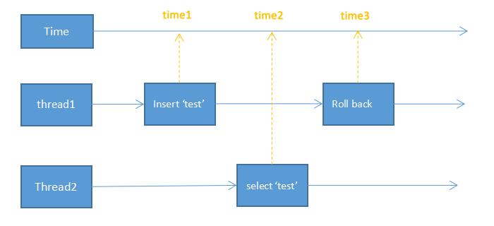
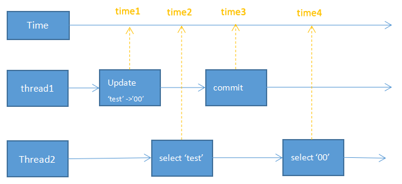
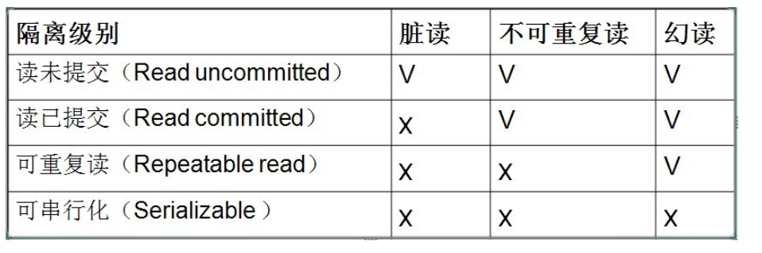
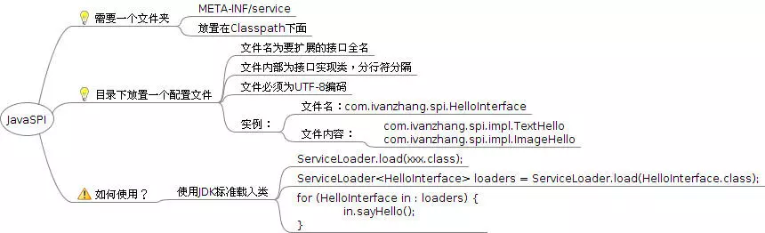
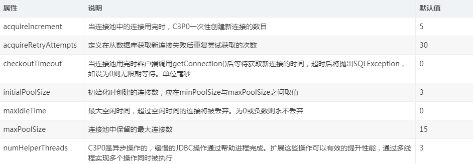
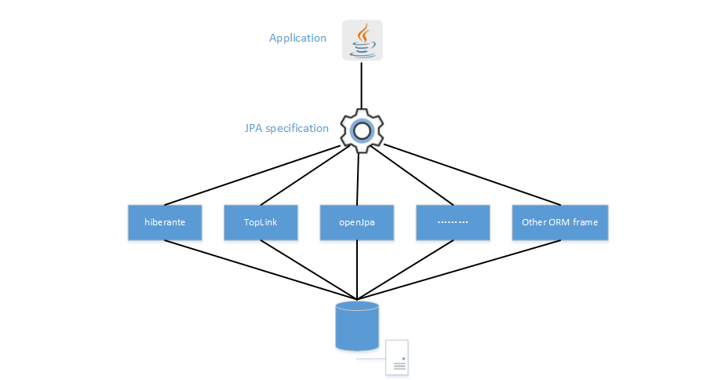

# JDBC 数据访问技术

### JDBC 数据访问技术

操作数据库技术的发展大致可以分为几个阶段：

* 首先是 JDBC 阶段，初学 JDBC 可能会使用原生的 JDBC 的 API
* 再然后可能会使用数据库连接池，比如：c3p0、dbcp，HikariCP,、druid
* 然后就是一些第三方工具类数据库访问技术，比如 dbutils ，spring jdbc等,此阶段还是自己手写 SQL 语句
* 再往后就是数据持久层的实现orm框架:遵从JPA规范的框架（ Hibernate，OpenJPA .toplink.） mybatis
JDBC 是贯穿始终的，即使到了框架部分，也会对 JDBC 进行整合

#### 一 JDBC API操作数据库

JDBC（Java Data Base Connectivity，Java数据库连接）是一种用于执行SQL语句的Java API，可以为多种关系数据库提供统一访问，它由一组用Java语言编写的类和接口组成。

##### （1） JDBC 常用对象

**1 java.sql.Driver（接口）**：数据库驱动接口，允许连接不同的数据库，由java提供接口，由各大数据库供应商实现。DriverManager类会试着加载尽可能多的已注册的的驱动程序，然后它会让每个驱动程序依次试着连接到目标URL。通过Class.forName(“foo.bah.Driver”)方法可以显式加载和注册一个驱动程序。

**注册原理：**

每个数据库厂商在实现java驱动程序的时候会实现java.sql.Driver接口，在这个接口的实现内部有一个静态方法块，在类加载时会首先执行静态代码块。静态代码块会将自己主动注册到DriverManager中。**现在一般会在项目启动时动态加载所有配置的驱动，然后根据需要自动匹配驱动使用**

例如： Class.forName(“com.mysql.jdbc.Driver”);这段代码会将一个mysql驱动类的Class加载到JVM中,在执行com.mysql.jdbc.Driver驱动类加载的过程中会执行 静态代码块，静态代码块内部实现将自己注册到DriverManager中；

**2 java.sql.DriverManager（类）**：管理一组 JDBC 驱动程序的基本服务,作为初始化的一部分，DriverManager 类会尝试加载在 “jdbc.drivers” 系统属性中引用的驱动程序类。这允许用户定制由他们的应用程序使用的 JDBC Driver。应用程序也可继续使用 Class.forName() 显式地加载 JDBC 驱动程序。

`conn = DriverManager.getConnection(DB_URL, USER, PASSWORD);`

在调用getConnection方法时，DriverManager会试着从初始化时加载的那些驱动程序以及使用与当前应用程序相同的类加载器显式加载的那些驱动程序中查找合适的驱动程序。

**3 javax.sql.DataSource（接口）**： 提供了连接到数据源的另一种更优的方法，支持数据库连接池,作为 DriverManager工具的替代项，DataSource对象是获取连接的首选方法

通过DataSource对象访问的驱动程序本身不会向DriverManager注册。通过查找操作获取DataSource对象，然后使用该对象创建Connection对象。通过DataSource对象获取的连接与通过DriverManager设施获取的连接相同

使用JNDI方式注册DataSource，然后在使用时根据名字将DataSource取出。JNDI(Java Naming and Directory Interface，Java命名和目录接口)是一组在Java应用中访问命名和目录服务的API。它将名称和对象联系起来，使得我们可以用名称访问对象。

DataSource接口由驱动程序供应商实现。共有三种类型的实现：

1. 基本实现 - 生成标准的Connection对象
2. 连接池实现 - 生成自动参与连接池的Connection对象，此实现与中间层连接池管理器一起使用。例如DBCP实现，它是Apache Commons提供的一种数据库连接池组件，也是tomcat的数据库连接池组件。
3. 分布式事务实现 - 生成一个Connection对象，该对象可用于分布式事务，大多数情况下总是参与连接池。此实现与中间层事务管理器一起使用，大多数情况下总是与连接池管理器一起使用。
**4 java.sql.Connection（接口）**：与特定数据库建立连接（会话），在连接上下文中执行 SQL 语句并返回结果。

> 注：在配置 Connection 时，JDBC 应用程序应该使用适当的Connection方法，比如setAutoCommit或setTransactionIsolation。默认情况下，Connection对象处于自动提交模式下，这意味着它在执行每个语句后都会自动提交更改。如果禁用了自动提交模式，那么要提交更改就必须显式调用commit方法；否则无法保存数据库更改。

**5 java.sql.Statement（接口）**：提供执行sql语句的API,由Connection对象创建：`Statement stmt=conn.createStatement();`

> **Statement、PreparedStatement和CallableStatement的区别:**
> 
> 继承关系：CallableStatement<PreparedStatement<Statement<Wrapper
> 
> 
> **Statement:**
> 
> 1. Statement接口提供了执行语句和获取结果的基本方法，
> 2. Statement每次执行sql语句，数据库都要执行sql语句的编译 ，最好用于仅执行一次查询并返回结果的情形，效率高于PreparedStatement。
> 3. 用于执行普通的不带参的查询SQL；
> 4. 支持批量更新,批量删除;
> **PreparedStatement:**
> 
> 1. PreparedStatement接口添加了处理 IN 参数的方法；
> 2. PreparedStatement是预编译的,在执行可变参数的一条SQL时，PreparedStatement比Statement的效率高，因为DBMS预编译一条SQL当然会比多次编译一条SQL的效率要高
> 3. 安全性好，有效防止Sql注入等问题。prepareStatement对象防止sql注入的方式是把用户非法输入的单引号用\反斜杠做了转义，从而达到了防止sql注入的目的
> **CallableStatement接口** 继承自PreparedStatement,支持带参数的SQL操作; 添加了处理 OUT 参数的方法。 支持调用存储过程,提供了对输出和输入/输出参数(INOUT)的支持;

**6 java.sql.ResultSet（接口）**：数据库查询的结果集，有一个指向当前行的光标，默认在第一行之前，通过next方法后移光标来迭代访问结果集中的数据，每列只能读取一次，也可以通过索引取值。

结果集默认是不可更新的，但是可以通过特定方法来实现更新结果集并保存至数据库。

```
//可以通过在创建Statement命令时指定额外参数来实现。
Statement stmt=conn.createStatement(ResultSet.TYPE_SCROLL_INSENSITIVE,ResultSet.CONCUR_UPDATABLE);
//执行查询
ResultSet rs = stmt.executeQuery(sql);
//在查询结果返回的基础上，执行插入一条数据到数据库
rs.moveToInsertRow(); //光标移动到新插入行的地方
rs.updateInt("user_id", 15);
rs.updateString("user_name", "牛栏山");
rs.updateString("user_address", "天方夜谭");
rs.insertRow();//添加一行到数据库

```

**一个jdbc的例子：**

```
<!-- 链接mysql数据库必须的包 -->
<dependency>
    <groupId>mysql</groupId>
    <artifactId>mysql-connector-java</artifactId>
    <version>8.0.16</version>
</dependency>
```

```
public class JdbcDemo {
/**
 * 后缀参数不加时区会报错
 * */
public static final  String DB_URL= "jdbc:mysql://localhost:3306/shuai?useUnicode=true&characterEncoding=UTF-8&useJDBCCompliantTimezoneShift=true&useLegacyDatetimeCode=false&serverTimezone=UTC";
public static final  String USER= "root";
public static final  String PASSWORD= "1qaz@WSX";
public static final  String DRIVER= "com.mysql.jdbc.Driver";

    public static void queryUser() {
        Connection conn=null;
        Statement stmt=null;
        ResultSet rs=null;
        try {
            // 1 注册驱动            
            // jdbc4之前加载注册驱动类的方式，在执行forname动态类加载进jvm时会执行com.mysql.jdbc.Driver服务实现类的静态代码块 //该com.mysql.jdbc.Driver类的静态代码块会将其注册进DriverManager中，源码中静态代码块是通过调用loadInitialDrivers()方法来完成引入和查找数据库驱动的 //如果是spi 则使用 ServiceLoader.load(Driver.class); 的方式扫描加载
            Class.forName(DRIVER);
            // 2 获取连接
            conn = DriverManager.getConnection(DB_URL, USER, PASSWORD);
            // 3 们通过Connection 创建一个Statement 对象。
            stmt = conn.createStatement();
            // 4 通过Statement 的execute()方法执行SQL。当然Statement 上面定义了非常多的方法。execute()方法返回一个ResultSet 对象，
            String sql="SELECT * FROM tb_user";
             rs= stmt.executeQuery(sql);
            // 5 我们通过ResultSet 获取数据。转换成一个POJO 对象。
            List<User> users=new ArrayList<>();
            while(rs.next()){
                //可以根据标识读取，也可以根据列索引
                int id=rs.getInt("user_id");
                String username=rs.getString("user_name");
                String user_address=rs.getString("user_address");
                User user=new User();
                user.setUser_id(id);
                user.setUser_name(username);
                user.setUser_address(user_address);
                users.add(user);
            }
            System.out.println("result size:"+users.size());
        } catch (ClassNotFoundException e) {
            e.printStackTrace();
        } catch (SQLException e) {
            e.printStackTrace();
        }
        finally {
            //6  最后，我们要关闭数据库相关的资源，包括ResultSet、Statement、Connection，它们的关闭顺序和打开的顺序正好是相反的
            try {
                rs.close();
                stmt.close();
                conn.close();
            } catch (SQLException e) {
                e.printStackTrace();
            }
        }
    }
}

```

##### （2）事务

事务基本概念一组要么同时执行成功，要么同时执行失败的SQL语句，是数据库操作的一个执行单元。需要满足ACID特性

事务开始于：**连接到数据库上，并执行一条DML语句insert、update或delete**

事务结束于：**显示/隐式执行了commit或rollback语句**

1. 执行一条DDL语句，例如create table语句，在这种情况下，会自动执行commit语句。
2. 执行了一条DML语句，该语句却失败了，在这种情况中，会为这个无效的DML语句执行rollback语句。
3. 断开与数据库的连接
**1 事物需要满足ACID特性：**

> * 原子性：所谓原子性是指本次数据处理要么都提交、要么都不提交，即不能先提交一部分，然后处理其他的程序，然后接着提交未完成提交的剩余部分。概念类似于编程语言的原子操作。
> * 一致性：所谓一致性是指数据库数据由一个一致的状态在提交事务后变为另外一个一致的状态。例如，用户确认到货操作：确认前，订单状态为待签收、客户积分为原始积分，此状态为一致的状态；在客户确认到后后，订单状态为已完成、客户积分增加本次消费的积分，这两个状态为一致状态。不能出现，订单状态为待签收，客户积分增加或者订单状态为已完成，客户积分未增加的状态，这两种均为不一致的情况。一致性与原子性息息相关。
> * 隔离性：所谓隔离性是指事物与事务之间的隔离，即在事务提交完成前，其他事务与未完成事务的数据中间状态访问权限，具体可通过设置隔离级别来控制。
> * 持久性：所谓持久性是指本次事务提交完成或者回滚完成均为持久的修改，除非其他事务进行操作否则数据库数据不能发生改变

```
Connection conn = getConnByDatasource();
/**
 * 修改jack 为tom
 * 修改tom4 为peter
 * */
String sql1 = "update tb_user set user_name='tom' where user_name='牛栏山'";
//这是一条错误的语句
String sql2 = "update tb_user settttt username='peter' where user_name='牛栏山'";
try {
    //事物第1步：设置事物是自动提交还是手动提交，默认为true 自动提交，false 为非自动提交
    conn.setAutoCommit(false);
    //设置数据库隔离级别 mysql默认就是REPEATABLE_READ 可重读 它确保同一事务的多个实例在并发读取数据时，会看到同样的数据行
    conn.setTransactionIsolation(Connection.TRANSACTION_REPEATABLE_READ);
    
    Statement stmt = conn.createStatement();
    stmt.executeLargeUpdate(sql1);
    //这是一条错误的语句
    stmt.executeLargeUpdate(sql2);
    //事物第2步:提交事物
    conn.commit();
} catch (SQLException e) {
    // TODO 自动生成的 catch 块
    e.printStackTrace();

    //事物第3步：抛出异常的时候，执行事物回滚
    try {
        conn.rollback();
    } catch (SQLException e1) {
        // TODO 自动生成的 catch 块
        e1.printStackTrace();
    }

} finally {
    closeConn(conn);
}
```

**2 数据库并发事务可能出现的几种状态:**

* **脏读(Drity Read)：** 一个事务更新数据过程中该数据被另外一个事务读取到，然后前一个事务最后回滚了对数据的更改，导致后一个数据读取到了不准确的数据。
> 一个事务读取另外一个事务尚未提交的数据。如下图，线程thread1在事务中在time1时刻向库表中新增一条数据‘test’并在time3时刻回滚数据；线程thread2在time2时刻读取，若thread2读取到‘test’，则为读脏。
> 
> 
> 

* **不可重复读(Non-repeatable read):** 在一个事务的两次查询之中，相同一条数据查询结果不一样，这可能是两次查询过程中间插入了一个事务更新的原有的数据。
> 如下图，线程thread1在事务中time1时刻将数据库中‘test’更新为‘00’，并在time3时刻提交；thread2在一个事务中分别在time2和time4两个时刻读取这条记录，若两次读取结果不同则为不可重读。（注意：1.不可重读针对已经提交的数据。2.两次或多次读取同一条数据。）
> 
> 
> 

* **幻读(Phantom Read):** 其他事务的数据操作导致某个事务两次读取数据数量不一致，在一个事务的两次查询中数据笔数不一致，例如有一个事务查询了几列(Row)数据，而另一个事务却在此时插入了新的几列数据，先前的事务在接下来的查询中，就会发现有几列数据是它先前所没有的。
> 线程thread1在事务中time1时刻向数据库中新增‘00’，并在time3时刻提交；thread2在一个事务中分别在time2和time4两个时刻扫描库表，若两次读取结果不同则为幻读。（注意：1.幻读针对已经提交的数据。2.两次或多次读取不同行数据，数量上新增或减少。）
> 
> 
> 

**3 数据库事物隔离级别：**

  针对上面3种事物并发情况，SQL标准定义了4类隔离级别，包括了一些具体规则，用来限定事务内外的哪些改变是可见的，哪些是不可见的。主要描述了多个事物并行执行（并发事物）造成的脏读，重复读，幻读的问题。例如在事务提交前后相同的sql执行结果可能不一样造成的问题。

1. **Read Uncommitted（读取未提交内容）**：在该隔离级别，所有事务都可以看到其他未提交事务的执行结果。本隔离级别很少用于实际应用，因为它的性能也不比其他级别好多少。读取未提交的数据，也被称之为脏读（Dirty Read）。例如在改隔离级别下，当前事物A在第一次查询后得到结果，1，2，3 此时另外一个事物B将1更新程10，未提交事物。然后再在事物A中执行查询得到的结果就是10，2，3，尽管B中没提交对数据记录的更新，但是事物A还是读取到了事物B未提交的更新；
2. **Read Committed（读取提交内容）**：这是大多数数据库系统的默认隔离级别（但不是MySQL默认的）。它满足了隔离的简单定义：一个事务只能看见已经提交事务所做的改变。这种隔离级别 也支持所谓的不可重复读（Nonrepeatable Read），因为同一事务的其他实例在该实例处理其间可能会有新的commit，所以同一select可能返回不同结果。
3. **Repeatable Read（可重读，不可读脏）**：这是MySQL的默认事务隔离级别，它确保同一事务的多个实例在并发读取数据时，会看到同样的数据行。不过理论上，这会导致另一个棘手的问题：幻读 （Phantom Read）。简单的说，幻读指当用户读取某一范围的数据行时，另一个事务又在该范围内插入了新行，当用户再读取该范围的数据行时，会发现有新的“幻影” 行。InnoDB和Falcon存储引擎通过多版本并发控制（MVCC，Multiversion Concurrency Control）机制解决了该事物级别下的幻读问题，也就是说在mysql中不存在这个问题了。RR级别，mysql也解决了写的幻读问题.通过间隙锁和行锁。
4. **Serializable（可串行化**） ：这是最高的隔离级别，它通过强制事务排序，使之不可能相互冲突，从而解决幻读问题。简言之，它是在每个读的数据行上加上共享锁。在这个级别，可能导致大量的超时现象和锁竞争
**4 JDBC事务隔离级别**

* TRANSACTION_NONE 无事务
* TRANSACTION_READ_UNCOMMITTED 读未提交，允许读脏，不可重读，幻读。
* TRANSACTION_READ_COMMITTED 读提交，即不能读脏，但是可能发生不可重读和幻读。
* TRANSACTION_REPEATABLE_READ 可重复读，innodb的隔离级别。可能发生幻读。
* TRANSACTION_SERIALIZABLE 直译为串行事务，保证不读脏，可重复读，不可幻读，事务隔离级别最高。


> 低级别的隔离级一般支持更高的并发处理，并拥有更低的系统开销。
> 
> 
> 隔离级别对当前事务有效，例如若当前事务设置为TRANSACTION_READ_UNCOMMITTED，则允许当前事务对其他事务未提交的数据进行读脏，而非其他事务可对当前事务未提交的数据读脏。
> 
> 
> 若未显示设置隔离级别，jdbc将采用数据库默认隔离级别
> 
> 
> 部分数据库不支持TRANSACTION_NONE，例如mysql

**5 事物的传播特性**

Spring它对JDBC的隔离级别作出了补充和扩展，其提供了7种事务传播行为。所谓事务传播行为就是多个事务方法相互调用时，事务如何在这些方法间传播。Spring 支持 7 种事务传播行为（Transaction Propagation Behavior）：

|Propagation_Required     |如果没有，就开启一个事务；如果有，就加入当前事务（方法B看到自己已经运行在 方法A的事务内部，就不再起新的事务，直接加入方法A）                    |
|Propagation_requires_new |如果没有，就开启一个事务；如果有，就将当前事务挂起。（方法A所在的事务就会挂起，方法B会起一个新的事务，等待方法B的事务完成以后，方法A才继续执行）|
|Propagation_nested       |如果没有，就开启一个事务；如果有，就在当前事务中嵌套其他事务                                                                                    |
|Propagation_supports     |如果没有，就以非事务方式执行；如果有，就加入当前事务（方法B看到自己已经运行在 方法A的事务内部，就不再起新的事务，直接加入方法A）                |
|Propagation_not_supported|没有以非事务运行,有就挂起当前事务A，B以非事务运行结束后再运行事务A                                                                              |
|Propagation_NEVER        |没有以非事务运行,有就抛出异常                                                                                                                   |
|Propagation_Mandatory    |没有就抛出异常，有就使用当前事务                                                                                                                |

**6 Java SPI 机制**

   SPI 是 Java 提供的一种服务加载方式，全名为 Service Provider Interface。根据 Java 的 SPI 规范，我们可以定义一个服务接口，具体的实现由对应的实现者去提供，即服务提供者。然后在使用的时候再根据 SPI 的规范去获取对应的服务提供者的服务实现,通过 SPI 服务加载机制进行服务的注册和发现，可以有效的避免在代码中将服务提供者写死。从而可以基于接口编程，实现模块间的解耦;

  简单来说，它就是一种动态替换发现机制。例如：有个接口想在运行时才发现具体的实现类，那么你只需要在程序运行前添加一个实现即可，并把新加的实现描述给JDK即可。此外，在程序的运行过程中，也可以随时对该描述进行修改，完成具体实现的替换。

**spi服务提供者（接口实现者）是如何完成类加载的？**

**主要使用：class.form("xxx")和ServiceLoader.load()**

  jdbc对外暴露drive数据库驱动注册接口，只有接口没有实现，实现由各大不同的数据库供应商来根据自己的情况通过实现jdbc的这个接口来实现自身的驱动，从而支持在java中访问数据库。但是当有多个服务商对接口实现时，我们如何将这些接口实现全部扫描进我的程序，然后根据情况判断使用哪一个实现呢呢？ jdbc4.0以前， 开发人员可以基于Class.forName("xxx服务实现的完全限定名")的方式来显示装载某个驱动实现。但是通过反射扫描全部的接口实现代价太大，jdk提供了一个使用配置文件的方式 ，jdbc4可以通过在METAINF/services/java.sql.Driver文件里指定所有接口实现类的方式来暴露驱动提供者， 应用程序可以通过JDK提供的ServiceLoader.load()来加载配置文件中的描述信息，完成类加载操作。

客户端使用jdbc时不需要去改变代码，直接根据需求引入不同的spi接口服务即可。例如Mysql的是com.mysql.jdbc.Drive,Oracle则是oracle.jdbc.driver.OracleDrive

**SPI机制的约定：**

1. 在META-INF/services/目录中创建以接口完全限定名命名的文件，该文件内容为Api具体实现类的全限定名
2. 使用ServiceLoader类动态加载META-INF中的实现类
3. 如SPI的实现类为Jar则需要放在主程序classPath中
4. Api具体实现类必须有一个不带参数的构造方法


在日常开发的时候我们一般会对问题就行抽象，创建接口然后进行不同的业务实现，这样子当我们有一个新的业务需要实现时，需要在原有程序中添加实现然后重新打包。而通过spi机制我们可以不用修改已经稳定的程序，而是新建一个新的jar包来完成接口规范的实现；例如一个缓存接口里面有查询，检查，删除缓存的功能。刚开始只支持本地缓存，后来支持redis缓存。通过spi就可以实现每加一个新的缓存工具就新建包单独实现其缓存功能，然后引入新的缓存包的方式。从而实现业务功能模块的解耦。

SPI 在Dubbo中的应用： http://dubbo.apache.org/zh-cn/docs/source_code_guide/dubbo-spi.html

#### 二 数据库连接池

   数据库链接的建立和关闭是极其耗费系统资源的操作。通过DriverManager获取的数据库连接，一个数据库连接对象均对应一个物理数据库连接，每次操作都打开一个物理连接，使用完后立即关闭连接。频繁的打开、关闭连接将造成系统性能的低下。

   为了解决数据库连接的频繁请求、释放，JDBC2.0引入了数据库连接池技术。数据库连接池，在系统启动时，就主动建立足够的数据库连接，并将这些连接组成一个连接池。每次应用程序请求数据库连接时，无须重新打开连接，而是从连接池中取出已有的链接使用，使用完毕后不再关闭数据库连接，而是直接将连接归还给连接池。数据库连接池是Connection对象的工厂。

**所有的池化技术原理上来说都是将每次使用才去申请的资源改为在系统启动时就先初始化一批放到池子里，在使用时直接从池子里取，从而达到节省系统开销的目的。**

跟系统远程连接相关的普遍采用池化技术，例如：数据库连接池，redis连接池，tomcat连接池，线程池等

**连接池的常用配置有：**

1. 连接池初始连接数/核心连接数
2. 连接池的最大连接数
3. 连接池的最小连接池
4. 连接池每次增加的容量
5. 失效时间
**JDBC连接池：**

JDBC的数据库连接池使用javax.sql.DataSource来表示，DataSource只是一个接口，该接口通常由驱动程序供应商提供实现，也有一些开源组织提供实现（DBCP、C3P0）。DataSource通常被称为数据源，它包含连接池和连接池管理两个部分，但习惯上也经常把DataSource称为连接池

数据源和数据库连接不同，数据源无须创建多个，它是产生数据库连接的工厂，因此整个应用只需要一个数据源即可

**DataSource接口共有三种类型的实现**：

1. 基本实现 - 生成标准的Connection对象
2. 连接池实现 - 生成自动参与连接池的Connection对象，此实现与中间层连接池管理器一起使用。例如DBCP实现，它是Apache Commons提供的一种数据库连接池组件，也是tomcat的数据库连接池组件。
3. 分布式事务实现 - 生成一个Connection对象，该对象可用于分布式事务，大多数情况下总是参与连接池。此实现与中间层事务管理器一起使用，大多数情况下总是与连接池管理器一起使用。
##### (1) DBCP数据源

tomcat的连接池正是采用该连接池实现

```
<!-- dpcp链接池需要引入 commons-pool2和commons-dbcp2两个包 -->
<dependency>
    <groupId>org.apache.commons</groupId>
    <artifactId>commons-pool2</artifactId>
    <version>2.7.0</version>
</dependency>

<!-- https://mvnrepository.com/artifact/org.apache.commons/commons-dbcp2 -->
<dependency>
    <groupId>org.apache.commons</groupId>
    <artifactId>commons-dbcp2</artifactId>
    <version>2.7.0</version>
</dependency>

<!-- 链接mysql数据库必须的包 -->
<dependency>
    <groupId>mysql</groupId>
    <artifactId>mysql-connector-java</artifactId>
    <version>8.0.16</version>
</dependency>
```

```
public static Connection getConnByDatasource() {
    try {
        BasicDataSource ds = new BasicDataSource();
        ds.setDriverClassName(DRIVER);
        ds.setUrl(DB_URL);
        ds.setUsername(USER);
        ds.setPassword(PASSWORD);
        //设置连接池的初始连接数
        ds.setInitialSize(5);
        //设置连接池中最少有两个空闲的链接
        ds.setMinIdle(2);
        Connection conn = ds.getConnection();
        System.out.println(conn);
        return conn;
    } catch (Exception e) {
        e.printStackTrace();
    }
    return null;
}
```

##### (2) C3P0数据源

相比之下，c3p0 的数据源性能更胜一筹，Hibernate推荐使用该连接池。C3P0连接池不仅可以自动清理不使用的Connection，还可以自动清理Statement和ResultSet

```
//创建连接池实例
ComboPooledDataSource ds = new ComboPooledDataSource();
//设置连接池连接数据库所需的驱动
ds.setDriverClass("com.mysql.jdbc.Driver");
//设置链接数据库的URL
ds.setJdbcUrl("jdbc:mysql://localhost:3306/javaee");
//设置连接数据库的用户名
ds.setUser("root");
//设置连接数据库的密码
ds.setPassword("pass");
//设置连接池的最大连接数
ds.setMaxPoolSize(40);
//设置连接池的最小连接数
ds.setMinPoolSize(2);
//设置连接池的初始连接数
ds.setInitialPoolSize(5);
//设置连接池的缓存Statement的最大数
ds.setMaxStatements(180);
//获取数据库连接：
Connection conn = ds.getConnection();
```



##### （3）HikariCP 连接池

地址：https://github.com/brettwooldridge/HikariCP 

常用的连接池有C3P0,DBCP,它们都比较成熟稳定，但性能不是十分好，所以有了BoneCP这个连接池,它是一个高速、免费、开源的JAVA连接池，它的性能几乎是前者的25倍，十分强悍。但BoneCP这个连接池在2013年停止更新了，就是为了让步于HikariCP这个连接池。 

**HiKariCP是一个快速，简单，可靠，轻量级，高性能的一个jdbc数据库连接池，大小只有130KB。**

**HikariCP所做的一些优化:**

1. 字节码精简：优化代码，直到编译后的字节码最少，这样，CPU缓存可以加载更多的程序代码；
2. 优化代理和拦截器：减少代码，例如HikariCP的Statement proxy只有100行代码，只有BoneCP的十分之一；
3. 自定义数组类型（FastStatementList）代替ArrayList：避免每次get()调用都要进行range check，避免调用remove()时的从头到尾的扫描；
4. 自定义集合类型（ConcurrentBag）：提高并发读写的效率；
5. 其他针对BoneCP缺陷的优化，比如对于耗时超过一个CPU时间片的方法调用的研究（但没说具体怎么优化）。
##### （4）Druid 连接池

项目地址： https://github.com/alibaba/druid

Druid阿里开源的数据库连接池，能够提供强大的监控和扩展功能，Druid 是一个 JDBC 组件库，包含数据库连接池、SQL Parser 等组件, 被大量业务和技术产品使用或集成，经历过最严苛线上业务场景考验，是你值得信赖的技术产品。

**Druid可以做什么**

1. 可以监控数据库访问性能(需要开启开发账号的ddl权限)，Druid内置提供了一个功能强大的StatFilter插件，能够详细统计SQL的执行性能，这对于线上分析数据库访问性能有帮助。
2. 替换DBCP和C3P0。Druid提供了一个高效、功能强大、可扩展性好的数据库连接池。
3. 数据库密码加密。直接把数据库密码写在配置文件中，这是不好的行为，容易导致安全问题。DruidDruiver和DruidDataSource都支持PasswordCallback。
4. SQL执行日志，Druid提供了不同的LogFilter，能够支持Common-Logging、Log4j和JdkLog，你可以按需要选择相应的LogFilter，监控你应用的数据库访问情况。
5. 扩展JDBC，如果你要对JDBC层有编程的需求，可以通过Druid提供的Filter-Chain机制，很方便编写JDBC层的扩展插件。
6. 在使用druid的时候，要将hikaricp的依赖排除掉
#### 三 数据库CRUD操作框架

**一般的数据库操作技术、框架都会自动集成上面的连接池，我们无需手动创建连接池或者创建连接。只需要配置好连接池参数即可。**

##### （1）Apache DbUtils

1. 功能：DbUtils 解决的最核心的问题就是结果集的映射， 可以把ResultSet 封装成JavaBean,结果集到实体的映射是通过反射实现的；
2. QueryRunner 类：DbUtils 提供了一个QueryRunner 类，它对数据库的增删改查的方法进行了封装，那么我们操作数据库就可以直接使用它提供的方法。
3. 数据源：在QueryRunner 的构造函数里面，我们又可以传入一个数据源(数据库连接池的实现，例如dbcp,c3p0,druid,HikariCP等),这样我们就不需要再去写各种创建和释放连接的代码了。queryRunner = new QueryRunner(dataSource);
4. 地址： https://commons.apache.org/proper/commons-dbutils/
##### （2）Spring JDBC

https://docs.spring.io/spring-cloud-gcp/docs/1.0.0.BUILD-SNAPSHOT/reference/html/_spring_jdbc.html

https://www.cnblogs.com/wangyujun/p/10687780.html

1. Spring 也对原生的JDBC 进行了封装，并且给我们提供了一个模板方法JdbcTemplate，来简化我们对数据库的操作。
2. JdbcTemplate类通过模板设计模式帮助我们消除了冗长的代码，只做需要做的事情（即可变部分），并且帮我们做哪些固定部分，如连接的创建及关闭
3. dbcTemplate类对可变部分采用回调接口方式实现，如ConnectionCallback通过回调接口返回给用户一个连接，从而可以使用该连接做任何事情、StatementCallback通过回调接口返回给用户一个Statement，从而可以使用该Statement做任何事情等等，还有其他一些回调接口
4. Spring除了提供JdbcTemplate核心类，还提供了基于JdbcTemplate实现的NamedParameterJdbcTemplate类用于支持命名参数绑定、 SimpleJdbcTemplate类用于支持Java5+的可变参数及自动装箱拆箱等特性
5. 对于结果集的处理，Spring JDBC 也提供了一个RowMapper 接口，可以把结果集转换成Java 对象
6. **数据源：支持多种数据库连接池，例如dbcp,c3p0,druid,HikariCP等**
###### Spring JDBC的连接池配置：

**(1) jdbc连接池数据源配置：**

DriverManagerDataSource没有实现连接池化连接的机制，每次调用getConnection()获取新连接时，只是简单地创建一个新的连接。所以，一般这种方式常用于开发时测试，不用于生产

```
<bean id="dataSource"
    class="org.springframework.jdbc.datasource.DriverManagerDataSource">
    <property name="driverClassName" value="com.mysql.jdbc.Driver">
    </property>
    <property name="url" value="jdbc:mysql://localhost:3307/lucene?characterEncoding=UTF8" />
    <property name="username" value="root"></property>
    <property name="password" value="guo941102"></property>
</bean>
```

**(2) c3p0连接池数据源配置**

```
<bean id="dataSource" class="com.mchange.v2.c3p0.ComboPooledDataSource" destroy-method="close">
        <property name="driverClass" value="com.mysql.jdbc.Driver" />
        <property name="jdbcUrl" value="jdbc:mysql://localhost:3307/lucene?characterEncoding=UTF8" />
        <property name="user" value="root" />
        <property name="password" value="guo941102" />
</bean>
```

**3 dbcp连接池数据源配置**

```
<bean id="dataSource" class="org.apache.commons.dbcp.BasicDataSource"
    destroy-method="close"><!--设置为close使Spring容器关闭同时数据源能够正常关闭，以免造成连接泄露  -->
    <property name="driverClassName" value="com.mysql.jdbc.Driver" />
    <property name="url" value="jdbc:mysql://localhost:3307/lucene?characterEncoding=UTF8" />
    <property name="username" value="root" />
    <property name="password" value="guo941102" />
    <property name="defaultReadOnly" value="false" /><!-- 设置为只读状态，配置读写分离时，读库可以设置为true -->
    <!-- 在连接池创建后，会初始化并维护一定数量的数据库安连接，当请求过多时，数据库会动态增加连接数，
    当请求过少时，连接池会减少连接数至一个最小空闲值 -->
    <property name="initialSize" value="5" /><!-- 在启动连接池初始创建的数据库连接，默认为0 -->
    <property name="maxActive" value="15" /><!-- 设置数据库同一时间的最大活跃连接默认为8，负数表示不闲置 -->
    <property name="maxIdle" value="10"/><!-- 在连接池空闲时的最大连接数，超过的会被释放，默认为8，负数表示不闲置 -->
    <property name="minIdle" value="2" /><!-- 空闲时的最小连接数，低于这个数量会创建新连接，默认为0 -->
    <property name="maxWait" value="10000" /><!-- 连接被用完时等待归还的最大等待时间，单位毫秒，超出时间抛异常，默认为无限等待 -->
</bean>
```

1. 为要映射的实体对象定义一个mapper对象，该mapper对象实现RowMapper接口的mapRow方法，我们在mapRow()方法里面完成对结果集的手动映射
2. 在DAO 层调用的时候就可以传入自定义的Mapper 类，最终返回映射的实体类型。
```
public class EmployeeRowMapper implements RowMapper {
@Override
public Object mapRow(ResultSet resultSet, int i) throws SQLException {
    Employee employee = new Employee();
    employee.setEmpId(resultSet.getInt("emp_id"));
    employee.setEmpName(resultSet.getString("emp_name"));
    employee.setEmail(resultSet.getString("emial"));
    return employee;
}
}

public List<Employee> query(String sql){
    //指定特定数据源 阿里的druid
    new JdbcTemplate( new DruidDataSource());
    return jdbcTemplate.query(sql,new EmployeeRowMapper());
}
```

**优点：** 通过这种方式，我们对于结果集的处理只需要写一次代码，然后在每一个需要映射的地方传入这个RowMapper 就可以了，减少了很多的重复代码。

**缺点：** 但是还是有问题：每一个实体类对象，都需要定义一个Mapper，然后要编写每个字段映射的getString()、getInt 这样的代码，还增加了类的数量；

**结果集自动映射：**

spring jdbc 需要手动映射结果集，如果要实现结果集的自动映射（数据库字段自动映射到实体对象上）需要解决两个问题：

1. 名称对应问题（数据库字段名称和实体字段名称不一定一致）
2. 数据类型对应问题（数据库的JDBC 类型和Java 对象的类型要匹配起来）
**办法：** 通过泛型和反射，我们可以创建一个BaseRowMapper<T>，通过反射的方式自动获取所有属性，把表字段全部赋值到属性。上面的方法就可以改成：`return jdbcTemplate.query(sql,new BaseRowMapper(Employee.class));`

这样，我们在使用的时候只要传入我们需要转换的类型就可以了，不用再单独创建一个RowMapper

jdbcTemplate有多种数据类型返回的api：https://www.cnblogs.com/sprinkle/p/6253663.html

##### DbUtils 和Spring JDBC对比：

1. 无论是QueryRunner 还是JdbcTemplate，都可以传入一个数据源进行初始化，也就是资源管理这一部分的事情，可以交给专门的数据源组件去做，不用我们手动创建和关闭；
2. 对操作数据的增删改查的方法进行了封装；
3. 可以帮助我们映射结果集，无论是映射成List、Map 还是实体类。

**共同缺点：**
4. SQL 语句都是写死在代码里面的，依旧存在硬编码的问题；
5. 参数只能按固定位置的顺序传入（数组），它是通过占位符去替换的，不能自动映射；
6. 在方法里面，可以把结果集映射成实体类，但是不能直接把实体类映射成数据库的记录（没有自动生成SQL 的功能）；
7. 查询没有缓存的功能。
8. 无论是QueryRunner 还是JdbcTemplate都没有实现结果集的自动映射，需要手动写数据字段到对象字段的映射。

---

##### (3) JPA - ORM框架

Java Persistence API（Java 持久层 API）：用于对象持久化的 API规范，使得应用程序以统一的方式访问持久层，是一种 ORM 规范。JPA的出现有两个原因：简化现有Java EE和Java SE应用的对象持久化的开发工作和整合ORM技术，实现持久化领域的统一.

 JPA提供的技术：

  (1)ORM映射元数据:  JPA支持XML和JDK 5.0注解两种元数据的形式，元数据描述对象和表之间的映射关系，框架据此将实体对象持 久化到数据库表中；

  (2)JPA 的API:  用来操作实体对象，执行CRUD操作，框架在后台替我们完成所有的事情，开发者从繁琐的JDBC和SQL代码中解  脱出来。

  (3)查询语言:   通过面向对象而非面向数据库的查询语言查询数据，避免程序的SQL语句紧密耦合

目前比较成熟的 JPA 框架主要包括 Jboss 的 Hibernate EntityManager、Oracle 捐献给 Eclipse 社区的 EclipseLink、Apache 的 OpenJPA 等。



1. Hibernate 实现了该规范，并对其进行了扩展.
2. Springdata JPA是在hibernate的基础上更上层的封装实现.
3. OpenJPA
##### （4）MyBatis

Hibernate 在业务复杂的项目中使用也存在一些问题：

1、比如使用get()、save() 、update()对象的这种方式，实际操作的是所有字段，没有办法指定部分字段，换句话说就是不够灵活。

2、这种自动生成SQL 的方式，如果我们要去做一些优化的话，是非常困难的，也就是说可能会出现性能比较差的问题。

3、不支持动态SQL（比如分表中的表名变化，以及条件、参数）。连表查询支持也不够友好

4、Hibernate 是全自动化的orm，操作对象就等于操作数据库，可移植性好，mybatis是半自动化的orm可以自定义sql等 比较灵活，可移植性差。一般传统公司使用Hibernate比较多，互联网公司使用mybatis比较多；

#### （3）Spring Boot数据源配置

  由于Spring Boot的自动化配置机制，大部分对于数据源的配置都可以通过配置参数的方式去改变。只有一些特殊情况，比如：更换默认数据源，多数据源共存等情况才需要去修改覆盖初始化的Bean内容。

**springboot 2.x默认使用hikari作为数据库连接池**，不需要添加额外依赖，只需在application.properties中配置即可。在Spring Boot自动化配置中，对于数据源的配置可以分为两类：

**（1）通用配置：**

以`spring.datasource.*`的形式存在，主要是对一些**即使使用不同数据源也都需要配置的一些常规内容**。比如：数据库链接地址、用户名、密码等。这里就不做过多说明了，通常就这些配置：

```
spring.datasource.url=jdbc:mysql://localhost:3306/test
spring.datasource.username=root
spring.datasource.password=123456
spring.datasource.driver-class-name=com.mysql.jdbc.Driver
```

**(2) 数据源连接池配置：**

以`spring.datasource.<数据源名称>.*`的形式存在，比如：Hikari的配置参数就是`spring.datasource.hikari.*`形式。下面这个是我们最常用的几个配置项及对应说明：

```
spring.datasource.hikari.minimum-idle=10
spring.datasource.hikari.maximum-pool-size=20
spring.datasource.hikari.idle-timeout=500000
spring.datasource.hikari.max-lifetime=540000
spring.datasource.hikari.connection-timeout=60000
spring.datasource.hikari.connection-test-query=SELECT 1
```

**这些配置的含义：**

* spring.datasource.hikari.minimum-idle: 最小空闲连接，默认值10，小于0或大于maximum-pool-size，都会重置为maximum-pool-size
* spring.datasource.hikari.maximum-pool-size: 最大连接数，小于等于0会被重置为默认值10；大于零小于1会被重置为minimum-idle的值
* spring.datasource.hikari.idle-timeout: 空闲连接超时时间，默认值600000（10分钟），大于等于max-lifetime且max-lifetime>0，会被重置为0；不等于0且小于10秒，会被重置为10秒。
* spring.datasource.hikari.max-lifetime: 连接最大存活时间，不等于0且小于30秒，会被重置为默认值30分钟.设置应该比mysql设置的超时时间短
* spring.datasource.hikari.connection-timeout: 连接超时时间：毫秒，小于250毫秒，否则被重置为默认值30秒
* spring.datasource.hikari.connection-test-query: 用于测试连接是否可用的查询语句

