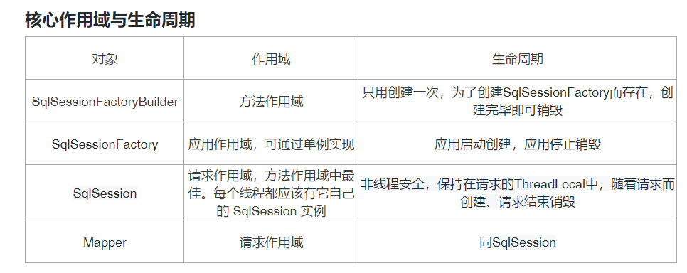
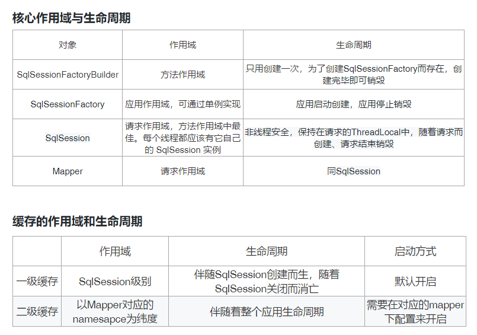
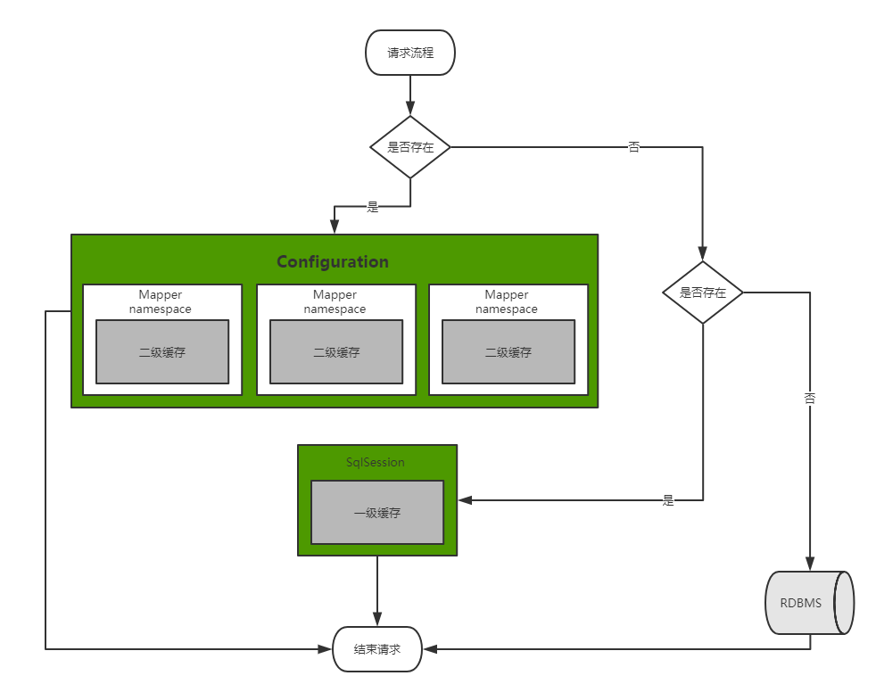
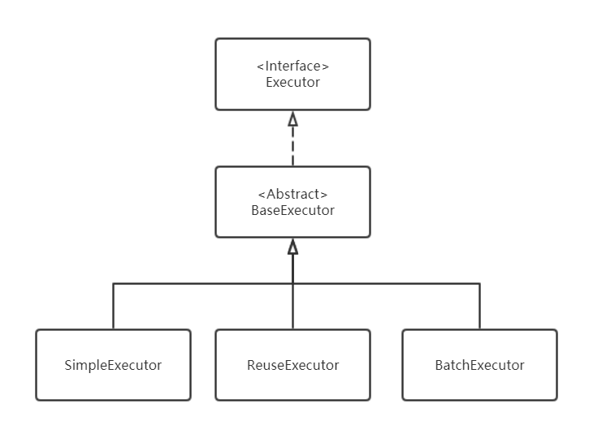
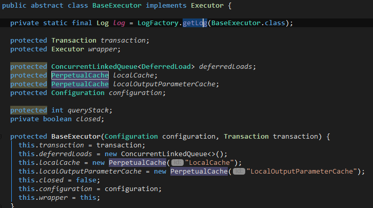
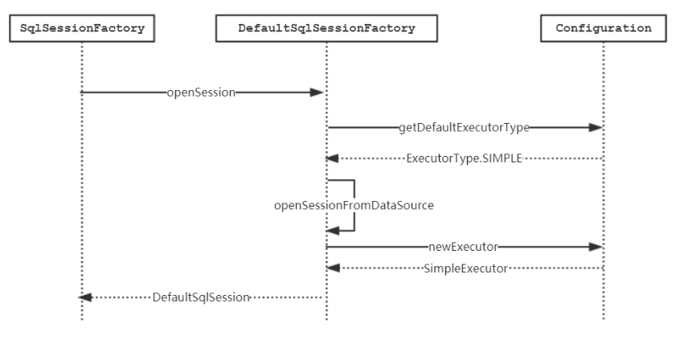
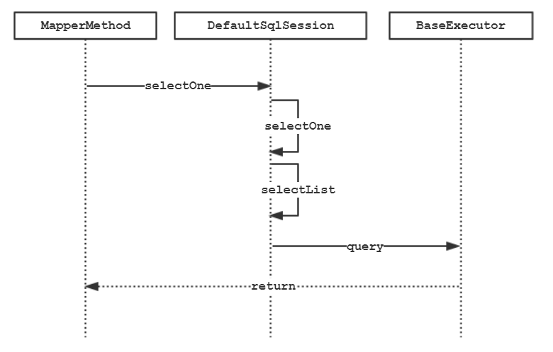
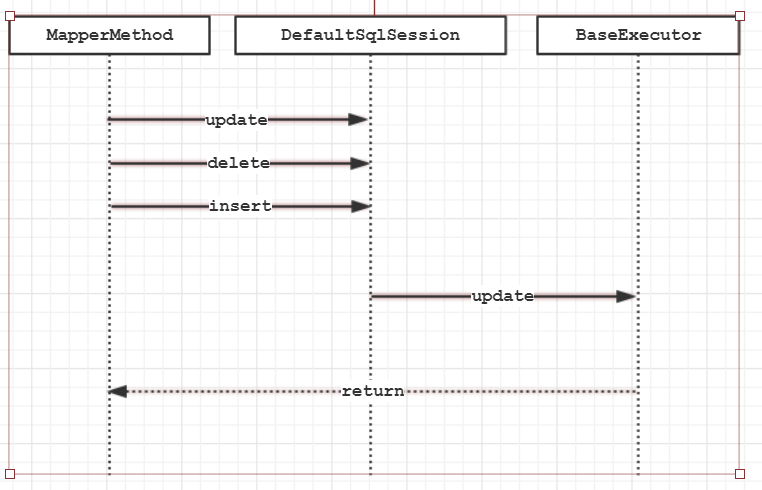
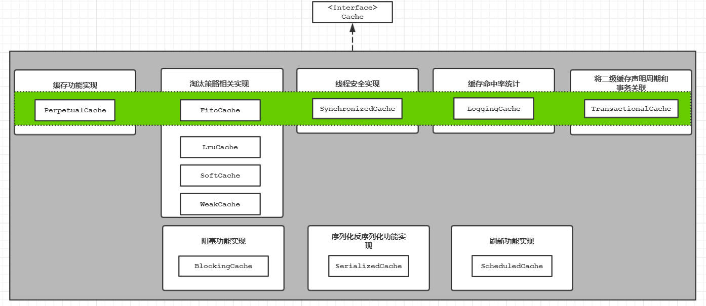
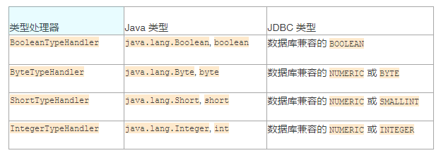

# Mybatis
[toc]

#### 一 MyBatis简介


#####  1 什么是mybatis，有什么优点？

1. MyBatis 是一款优秀的ORM持久层框架，它封装了jdbc，避免了几乎所有的 JDBC 代码和手动设置参数以及获取结果集。开发时只需要关注 SQL 语句本身，不需要花费精力去处理加载驱动、创建连接、创建statement 等繁杂的过程
2. MyBatis 支持定制化 SQL、存储过程以及高级映射。程序员可以直接编写原生态 sql，可以严格控制 sql 执行性能，灵活度高。
3. MyBatis 可以使用简单的 XML 或注解来配置和映射原生类型、接口和 Java 的 pojo对象为数据库中的记录。避免了手动写jdbc代码，设置参数和结果集映射。
##### 2 MyBatis 与 Hibernate 有哪些不同？

1. Mybatis 和 hibernate 不同，它不完全是一个 ORM 框架，因为 MyBatis 需要程序员自己编写 Sql 语句，而hibernate是全自动化的，直接操作java对象无需和sql打交道
2. Mybatis 直接编写原生态 sql，可以严格控制 sql 执行性能，灵活度高，非常适合对关系数据模型要求不高的软件开发，因为这类软件需求变化频繁，一但需求变化要求迅速输出成果。但是mybatis 无法做到数据库无关性，如果需要实现支持多种数据库的软件，则需要自定义多套 sql 映射文件，工作量大
3. Hibernate 对象/关系映射能力强，数据库无关性好，对于关系模型要求高的软件，如果用 hibernate 开发可以节省很多代码，提高效率。
4. MyBatis 专注于 SQL 本身，是一个足够灵活的 DAO 层解决方案。MyBatis 适用于对性能的要求很高，或者需求变化较多的项目，如互联网项目
**Mybatis 从执行 sql 到返回 result 的过程:**

通过 xml 文件或注解的方式将要执行的各种 statement 配置起来，并通过java 对象和 statement 中 sql 的动态参数进行映射生成最终执行的 sql 语句，最后由 mybatis 框架执行 sql 并将结果自动映射为 java 对象并返回。

#### 二 SqlSession

  每个基于 MyBatis 的应用都是以一个 SqlSessionFactory 的实例为核心的,SqlSession 完全包含了面向数据库执行 SQL 命令所需的所有方法。你可以通过 SqlSession 实例来直接执行已映射绑定（bind）的 SQL 语句：`IUserDao userMapper = sqlSession.getMapper(IUserDao.class);`

  SqlSessionFactory 的实例可以通过 SqlSessionFactoryBuilder 获得。而 SqlSessionFactoryBuilder 则可以从 XML 配置文件或一个预先定制的 Configuration 的实例构建出 SqlSessionFactory 的实例。既然有了 SqlSessionFactory，顾名思义，我们就可以从中获得 SqlSession 的实例了

**加载配置，创建SqlSessionFactory：**

```
String resource = "org/mybatis/builder/mybatis-config.xml";
InputStream inputStream = Resources.getResourceAsStream(resource);
SqlSessionFactoryBuilder builder = new SqlSessionFactoryBuilder();
SqlSessionFactory factory = builder.build(inputStream);
```

**SqlSession 可以执行如下命令：**

```
<T> T selectOne(String statement)
<E> List<E> selectList(String statement)
<T> Cursor<T> selectCursor(String statement)
<K,V> Map<K,V> selectMap(String statement, String mapKey)
int insert(String statement)
int update(String statement)
int delete(String statement)
```

##### 1 sqlsession作用域和生命周期

**（1）SqlSessionFactoryBuilder类： SqlSessionFactoryBuilder类用来创建SqlSessionFactory，只需要使用一次；**

这个类可以被实例化、使用和丢弃，一旦创建了 SqlSessionFactory，就不再需要它了。 因此 SqlSessionFactoryBuilder 实例的最佳作用域是方法作用域（也就是局部方法变量）。 你可以重用 SqlSessionFactoryBuilder 来创建多个 SqlSessionFactory 实例，但是最好还是不要让其一直存在，以保证所有的 XML 解析资源可以被释放给更重要的事情。

**（2）SqlSessionFactory类: SqlSessionFactory应该只被创建一次，应用运行期间一直使用，使用单例；**

SqlSessionFactory 一旦被创建就应该在应用的运行期间一直存在，没有任何理由丢弃它或重新创建另一个实例。 使用 SqlSessionFactory 的最佳实践是在应用运行期间不要重复创建多次，多次重建 SqlSessionFactory 被视为一种代码“坏味道（bad smell）”。因此 SqlSessionFactory 的最佳作用域是应用作用域。 有很多方法可以做到，最简单的就是使用单例模式或者静态单例模式。

**（3）SqlSession类:每个线程都应该有它自己的 SqlSession 实例，使用完毕记得关闭**

  每个线程都应该有它自己的 SqlSession 实例。SqlSession 的实例不是线程安全的，因此是不能被共享的，所以它的最佳的作用域是请求或方法作用域。

  绝对不能将 SqlSession 实例的引用放在一个类的静态域，甚至一个类的实例变量也不行。 也绝不能将 SqlSession 实例的引用放在任何类型的托管作用域中，比如 Servlet 框架中的 HttpSession。 如果你现在正在使用一种 Web 框架，要考虑 SqlSession 放在一个和 HTTP 请求对象相似的作用域中。 换句话说，每次收到的 HTTP 请求，就可以打开一个 SqlSession，返回一个响应，就关闭它。 这个关闭操作是很重要的，你应该把这个关闭操作放到 finally 块中以确保每次都能执行关闭。 下面的示例就是一个确保 SqlSession 关闭的标准模式：

```
SqlSession session = sqlSessionFactory.openSession();
try {
  // 你的应用逻辑代码
} finally {
  session.close();
}
```



##### 2对象生命周期和依赖注入框架

依赖注入框架可以创建线程安全的、基于事务的 SqlSession 和映射器，并将它们直接注入到你的 bean 中，因此可以直接忽略它们的生命周期；例如在spring中使用mybatis，你不需要关心sqlsession的创建，由框架自动完成。

##### 3 普通 java项目中使用Mybatis

（0）引入mybatis

```
<!-- https://mvnrepository.com/artifact/org.mybatis/mybatis -->
<dependency>
    <groupId>org.mybatis</groupId>
    <artifactId>mybatis</artifactId>
    <version>3.5.7</version>
</dependency>

```

(1) 定义mybatis-config.xml文件配置SqlSessionFactoryBuilder :

```
<?xml version="1.0" encoding="UTF-8" ?>
<!DOCTYPE configuration
        PUBLIC "-//mybatis.org//DTD Config 3.0//EN"
        "http://mybatis.org/dtd/mybatis-3-config.dtd">

<!--
XML 配置文件中包含了对 MyBatis 系统的核心设置，包含获取数据库连接实例的数据源
（DataSource）和决定事务作用域和控制方式的事务管理器（TransactionManager）
-->
<configuration>
    <environments default="development">
        <environment id="development">
            <transactionManager type="JDBC"/>
            <dataSource type="POOLED">
                <property name="driver" value="com.mysql.jdbc.Driver"/>
                <property name="url" value="jdbc:mysql://localhost:3306/shuai"/>
                <property name="username" value="root"/>
                <property name="password" value="1qaz@WSX"/>
            </dataSource>
        </environment>
    </environments>
    <mappers>
        <mapper resource="mapper/user-mapper.xml"/>
    </mappers>
</configuration>

<!--
还有很多可以在 XML 文件中进行配置，上面的示例指出的则是最关键的部分。 要注意 XML 头部的声明，它用来验证 XML 文档正确性。
environment 元素体中包含了事务管理和连接池的配置。
mappers 元素则是包含一组映射器（mapper），这些映射器的 XML 映射文件包含了 SQL 代码和映射定义信息-->
```

（2）定义sql映射文件

```
<?xml version="1.0" encoding="UTF-8"?>
<!DOCTYPE mapper
        PUBLIC "-//mybatis.org//DTD Mapper 3.0//EN"
        "http://mybatis.org/dtd/mybatis-3-mapper.dtd">

<!--命名空间应该是对应接口的包名+接口名 -->
<mapper namespace="com.shuailee.dao.IUserDao">
    <!--查询用户信息并分页 -->
    <select id="queryUser" resultType="com.shuailee.model.User">
        select * from tb_user
    </select>
</mapper>
```

（3）映射接口：

映射器接口不需要去实现任何接口或继承自任何类,只要方法可以被唯一标识对应的映射语句就可以了 :`com.shuailee.dao.IUserDao+queryUser`

```
// 外部直接使用该接口即可 
public interface IUserDao { 
List<User> queryUser(); 
}
```

（4）测试代码：

```
public class App 
{
    /**
     *从 XML 中构建 SqlSessionFactory, 执行查询和map
     * */
    public void queryUserTest() {
        /**
         * 每个基于 MyBatis 的应用都是以一个 SqlSessionFactory 的实例为核心的。SqlSessionFactory 的实例可以通过 SqlSessionFactoryBuilder
         * 获得。而 SqlSessionFactoryBuilder 则可以从 XML 配置文件或一个预先定制的 Configuration 的实例构建出 SqlSessionFactory 的实例
         *
         *  从 XML 文件中构建 SqlSessionFactory 的实例非常简单，建议使用类路径下的资源文件进行配置
         * 但是也可以使用任意的输入流（InputStream）实例，包括字符串形式的文件路径或者 file:// 的 URL 形式的文件路径来配置
         * MyBatis 包含一个名叫 Resources 的工具类，它包含一些实用方法，可使从 classpath 或其他位置加载资源文件更加容易
         */
        String resource = "mybatis-config.xml";
        InputStream inputStream = null;
        try {
            inputStream = Resources.getResourceAsStream(resource);
        } catch (IOException e) {
            e.printStackTrace();
        }
        //从 SqlSessionFactory 中获取 SqlSession
        //既然有了 SqlSessionFactory，顾名思义，我们就可以从中获得 SqlSession 的实例了。
        //SqlSession 完全包含了面向数据库执行 SQL 命令所需的所有方法。你可以通过 SqlSession 实例来直接执行已映射的 SQL 语句
        SqlSessionFactory sqlSessionFactory =   new SqlSessionFactoryBuilder().build(inputStream);
        SqlSession sqlSession= sqlSessionFactory.openSession();
       try {
            //执行查询和映射
            IUserDao userMapper = sqlSession.getMapper(IUserDao.class); //使用正确描述每个语句的参数和返回值的接口
            List<User> user = userMapper.queryUser();
            System.out.println(user.get(0).toString());
        }finally {
            sqlSession.close();
        }
    }

    public static void main( String[] args )
    {
        App app=new App();
        app.queryUserTest();
    }
}
```

##### 3 Springboot项目中使用Mybatis

**（0）引入mybatis**

```
<!--mybatis-->
<dependency>
    <groupId>org.mybatis.spring.boot</groupId>
    <artifactId>mybatis-spring-boot-starter</artifactId>
    <version>2.1.3</version>
</dependency>

<!--druid-->
<dependency>
    <groupId>com.alibaba</groupId>
    <artifactId>druid-spring-boot-starter</artifactId>
    <version>1.1.9</version>
</dependency>
<!--mysql driven-->
<dependency>
    <groupId>mysql</groupId>
    <artifactId>mysql-connector-java</artifactId>
    <version>8.0.19</version>
</dependency>

<!--mybatis分页插件-->
<dependency>
    <groupId>com.github.pagehelper</groupId>
    <artifactId>pagehelper-spring-boot-starter</artifactId>
    <version>1.2.3</version>
</dependency>
```

**（1）数据源配置：**

https://github.com/alibaba/druid/tree/master/druid-spring-boot-starter

```
# jdbc基本配置，在连接字符串中加入 &allowMultiQueries=true  开启批量语句执行
spring.datasource.url = jdbc:mysql://aaa.com:3306/shuai?useUnicode=true&characterEncoding=utf8&serverTimezone=GMT%2B8&zeroDateTimeBehavior=convertToNull&allowMultiQueries=true
spring.datasource.username = test
spring.datasource.password = 123456
spring.datasource.driver-class-name = com.mysql.cj.jdbc.Driver
spring.datasource.type = com.alibaba.druid.pool.DruidDataSource

# druid数据库连接池配置
# 初始连接数
spring.datasource.druid.initial-size=10
# 最大连接数
spring.datasource.druid.max-active=30
# 最小连接数
spring.datasource.druid.min-idle=5
spring.datasource.druid.max-wait=
# 获取连接等待超时时间
spring.datasource.druid.max-wait =60000
# 配置间隔多久才进行一次检测，检测需要关闭的空闲连接，单位是毫秒
spring.datasource.druid.time-between-eviction-runs-millis = 60000
# 配置一个连接在池中最小生存的时间，单位是毫秒
spring.datasource.druid.min-evictable-idle-time-millis = 300000

# 配置监控统计拦截的filters，去掉后监控界面SQL无法进行统计，’wall’用于防火墙
# spring.datasource.druid.filters=config,stat,wall,log4j 

# mybatis 配置（可以不需要）
# mybatis.mapper-locations=classpath:mapper/*.xml 
# mybatis.type-aliases-package=com.wdbyte.domain
```

**（2）定义sql映射xml文件和映射接口**

```
<!--命名空间应该是对应接口的包名+接口名-->
<mapper namespace="com.shuailee.dao.IUserDao">
    <select id="queryUserByID" parameterType="int" resultType="hashmap" >
        SELECT * FROM tb_user WHERE user_id = #{id}
    </select>
</mapper>
```

```
// 外部直接使用该接口即可
public interface IUserDao {
     List<User> queryUser();
}
```

**（3）如果接口位于不同的模块，需要在项目启动类配置bean扫描路径**

`@MapperScan(basePackages = {"com.shuailee.repository.dao"})`

#### 三 Mybatis详解

##### 1 SQL映射

（1）. xml方式

```
<!--命名空间应该是对应接口的包名+接口名-->
<mapper namespace="com.shuailee.dao.IUserDao">
    <select id="queryUserByID" parameterType="int" resultType="hashmap" >
        SELECT * FROM tb_user WHERE user_id = #{id}
    </select>
</mapper>
```

这个语句被称作 queryUserByID，接受一个 int（或 Integer）类型的参数，并返回一个 HashMap 类型的对象，其中的键是列名，值便是结果行中的对应值

> 1. parameterType 入参类型
> 2. resultType 返回数据类型，如果返回的是集合，那应该设置为集合包含的类型，而不是集合本身，resultType , resultMap，不能同时使用。
> 3. resultMap 外部 resultMap 的命名引用
> 4. flushCache 将其设置为 true 后，只要语句被调用，都会导致本地缓存和二级缓存被清空，默认值：false。
> 5. useCache 将其设置为 true 后，将会导致本条语句的结果被二级缓存缓存起来，默认值：对 select 元素为 true。

（2）. 注解方式

```

@Mapper
public interface IUserDao {
     @ResultType(User.class)
     @Select("select * from tb_user")
     List<User> queryUser();
}
```

##### 2. 命名解析

MyBatis 对所有的命名配置元素（包括语句，结果映射，缓存等）使用了如下的命名解析规则：

* **完全限定名（比如 “com.shuailee.dao.IUserDao.queryUser）** 将被直接用于查找及使用。利用更长的完全限定名来将不同的语句隔离开来，同时也实现了接口绑定
* **短名称（比如 “queryUser”）** 如果全局唯一也可以作为一个单独的引用。 如果不唯一，有两个或两个以上的相同名称（比如 “com.foo.selectAllThings” 和 “com.bar.selectAllThings”），那么使用时就会产生“短名称不唯一”的错误，这种情况下就必须使用完全限定名。
##### 3. 映射器（IUserDao接口）【重要】

是一些由你创建的、绑定你映射的语句的接口。映射器接口的实例是从 SqlSession 中获得的，它的生命周期可以同SqlSession 相同属于线程，虽然在整个请求作用域保持映射器实例不会有什么问题，但是这会让作用域管理太多资源，提升了复杂性。为了避免这种复杂性，最好把映射器放在方法作用域内，在方法执行时被创建，用过之后即可丢弃

**【重要】接口映射的原理：**

1. Dao接口即 Mapper映射接口。接口的完全限定名就是映射文件中的namespace的值。接口的方法名就是映射文件中 Mapper 的 Statement 的 id 值；映射接口内的Mapper接口是没有实现类的，当调用接口方法时接口完全限定名+方法名会拼接成一个 key 值，可唯一定位一个 MapperStatement。
2. 在 Mybatis 中，每一个<select>、<insert>、<update>、<delete> 标签，都会被解析为一个MapperStatement 对象。而参数就是传递给 sql 的参数。
3. 例如通过`com.shuailee.dao.IUserDao.queryUserByID`可以找到namespace为`com.shuailee.dao.IUserDao`的下面id为queryUserByID的MapperStatement
4. Mapper 接口的工作原理是 JDK 动态代理，Mybatis 运行时会使用 JDK动态代理为 Mapper 接口生成代理对象 proxy，代理对象会拦截接口方法，转而执行 MapperStatement 所代表的 sql，然后将 sql 执行结果返回。
##### 4 动态sql

动态sql就是支持逻辑语法的sql，主要用来解决不同条件下拼接sql语句的情况：例如拼接时要确保不能忘记添加必要的空格，还要注意去掉列表最后一个列名的逗号等。MyBatis 采用功能强大的基于 OGNL 的表达式来淘汰其它大部分元素。

`主要语法：if choose (when, otherwise) trim (where, set) foreach`

###### **(1) 多条件查询判断 if**

```
<select id="findActiveBlogWithTitleLike"   resultType="Blog">
  SELECT * FROM BLOG   WHERE state = ‘ACTIVE’
  <!--如果没有传入“title”则不拼接title查询条件：-->
  <if test="title != null">
    AND title like #{title}
  </if>
</select>
```

###### **(2) 多条件查询判断连续拼接 if+where**

“where”标签如果它包含的标签中有返回值的话，它就插入一个‘where’,如果标签返回的内容是以AND或OR开头的，则会剔除掉AND 或OR

```
<select id="queryUserinfo2" parameterType="java.util.Map"  resultType="com.shuailee.model.UserModel">
    SELECT * FROM tb_user
    <where>
        <if test="sex != null">
            AND user_sex = #{sex}
        </if>
        <if test="name != null">
            AND user_name like #{name}
        </if>
    </where>
</select>
```

###### **(3) choose when标签,当我们值需要多个条件中的一个时使用**

```
<!--
如果 sex 不为空，那么查询语句为：select * from user where user_sex=?
如果 sex 为空，name 是否为空，如果不为空，那么语句为 select * from user where user_name=?;
如果 sex 为空，name 为空，那么语句为 select * from user where user_email=?;

-->
<select id="queryUserinfo3" parameterType="java.util.Map" resultType="com.shuailee.model.UserModel">
    SELECT * FROM tb_user
    <where>
        <choose>
            <when test="sex != null">
                AND user_sex = #{sex}
            </when>
            <when test="name != null">
                AND user_name like #{name}
            </when>
            <otherwise>
                and user_email=#{email}
            </otherwise>
        </choose>
    </where>
</select>
```

###### **(4) 多字段更新判断 update if**

```
<update id="updateUserById" parameterType="com.shuailee.model.UserModel">
 update tb_user
     <set>
         <if test="userName!=null and userName!=''">
             user_name = #{userName},
         </if>
         <if test="userSex!=null and userSex!=''">
             user_sex = #{userSex}
         </if>
     </set>
        where user_id = #{userId}
</update>
```

###### **(5) trim 格式化标记**

**完成where标记的功能：**

* prefix：前缀追加
* prefixoverride：去掉第一个and或者是or
```
<select id="queryUserinfo4" parameterType="java.util.Map" resultType="com.shuailee.model.UserModel">
    SELECT * FROM tb_user
    <trim prefix="where" prefixOverrides="and | or">
        <if test="sex != null">
            AND user_sex = #{sex}
        </if>
        <if test="name != null">
            AND user_name like #{name}
        </if>
    </trim>
</select>
```

**完成set标记的功能**

* suffix：后缀追加
* suffixoverride：去掉最后一个逗号（也可以是其他的标记，就像是上面前缀中的and一样）
```
<update id="updateUserById2" parameterType="com.shuailee.model.UserModel">
    update tb_user
    <trim prefix="set" suffixOverrides=",">
        <if test="userName!=null and userName!=''">
            user_name = #{userName},
        </if>
        <if test="userSex!=null and userSex!=''">
            user_sex = #{userSex}
        </if>
    </trim>
    where user_id = #{userId}
</update>
```

###### **(6) include命令 定义sql片段在别的地方引用，可以增加代码的重用性**

```
<!--定义一个条件筛选的判断-->
<sql id="selectUserByPara">
    <if test="userName!=null and userName!=''">
        user_name = #{userName},
    </if>
    <if test="userSex!=null and userSex!=''">
        user_sex = #{userSex}
    </if>
</sql>

<!--修改引用-->
<update id="updateUserById3" parameterType="com.shuailee.model.UserModel">
    update tb_user
    <trim prefix="set" suffixOverrides=",">
        <!-- 引用 sql 片段，如果refid 指定的不在本文件中，
        那么需要在前面加上 namespace -->
        <include refid="selectUserByPara"></include>
    </trim>
    where user_id = #{userId}
</update>
```

###### **(7) foreach 标记**

```
<!--
collection:指定输入对象中的集合属性
item:每次遍历生成的对象
open:开始遍历时的拼接字符串
close:结束时拼接的字符串
separator:遍历对象之间需要拼接的字符串
-->
<!--1 多行插入-->
<insert id="batchInsertUser2" parameterType="com.shuailee.model.User"
        useGeneratedKeys="true" keyProperty="user_id">
    insert into tb_user (user_name,user_sex,user_birthday,user_address,user_email) 
    values
    <foreach item="item" collection="list" separator=",">
        (#{item.user_name}, #{item.user_sex}, #{item.user_birthday}, #{item.user_address}, #{item.user_email})
    </foreach>
</insert>

最终得到sql语句：

insert into redeem_code (batch_id, code, type, facevalue,create_user,create_time) values (?,?,?,?,?,? ),(?,?,?,?,?,? ),(?,?,?,?,?,? ),(?,?,?,?,?,? )

```

###### **(8) 拼接OR查询条件**

```
<!--2 我们用 foreach 来改写 select * from user where id=1 or id=2 or id=3
注意：
parameterType参数类型为List  collection="list"
parameterType参数类型为ArrayList  collection="values[]"
-->
<select id="queryUserbyids" resultType="com.shuailee.model.User"
 parameterType="java.util.List">
    SELECT * FROM tb_user
    <where>
        <foreach collection="list" item="id" open=" (" close=")"
         separator="or">
             user_id = #{id}
        </foreach>
    </where>
</select>
```

###### **(9) in查询**

**接口：**`int selectInformationAppid(@Param("appid") String appid,@Param("infoSourceList")List infoSourceList);`

```
<select id="selectInformationAppid" resultType="java.lang.Integer">
    select count(1) from info_source where app_id = #{appid} and information_source
    in
    <foreach item="item"  collection="infoSourceList" separator="," open="("  close=")">
        #{item.informationSource,jdbcType=VARCHAR}
    </foreach>
</select>
```

###### **(10) 批量更新：需要在连接字符串中加入 &allowMultiQueries=true 开启批量语句执行**

```
# Druid 数据源基本配置 spring.datasource.url = jdbc\:mysql\://192.168.5.15\:3306/middleware?useUnicode\=true&characterEncoding\=utf8&serverTimezone\=GMT%2B8&zeroDateTimeBehavior\=convertToNull&allowMultiQueries\=true

// 接口定义
int batchUpdate(List infoSourceList);
```

**sql映射：**

```
<update id="batchUpdate" parameterType="com.web.entity.InfoSource">

    <foreach item="item" collection="list" separator=";">
        update info_source
        <set>
            <if test="item.informationSource != null">
                information_source = #{item.informationSource,jdbcType=VARCHAR},
            </if>
            <if test="item.informationSourceName != null">
                information_source_name = #{item.informationSourceName,jdbcType=VARCHAR},
            </if>
            <if test="item.informationAppid != null">
                information_appid = #{item.informationAppid,jdbcType=VARCHAR},
            </if>
            <if test="item.informationAppkey != null">
                information_appkey = #{item.informationAppkey,jdbcType=VARCHAR},
            </if>
            <if test="item.updateUser != null">
                update_user = #{item.updateUser,jdbcType=VARCHAR},
            </if>
            <if test="item.delete != null">
                `delete` = #{item.delete,jdbcType=BIT},
            </if>
        </set>
        where id = #{item.id,jdbcType=INTEGER}
    </foreach>
</update>
```

###### **(11) MyBatis模糊查询**

**1. 直接传参**

```
public void selectBykeyWord(String keyword) {
     String roleName = "%" + keyword + "%";
     userDao.selectBykeyWord(roleName);
 }
// 接口映射定义
List<RoleEntity> selectBykeyWord(@Param("roleName") String roleName);

```

```
<select id="selectBykeyWord" parameterType="string" resultType="com.why.mybatis.entity.RoleEntity">
	SELECT * FROM t_role
	WHERE
	    role_name LIKE #{roleName}
</select>

```

**2. CONCAT（）函数**

MySQL的 CONCAT（）函数用于将多个字符串连接成一个字符串，是最重要的mysql函数之一

`List<RoleEntity> selectBykeyWord(@Param("keyword") String keyword);`

```
<select id="selectBykeyWord" parameterType="string" resultType="com.why.mybatis.entity.RoleEntity">
        SELECT  * FROM t_role
        WHERE
            role_name LIKE CONCAT('%',#{keyword},'%')
    </select>

```

###### **(12) 批量插入去重**

参考：https://www.cnblogs.com/better-farther-world2099/articles/11737376.html

对大量的数据进行写入数据库操作时，会出现这样的问题：完全不一样，一部分不一样。我们一般希望存在就更新，不存在就新增得效果。mybatis中得实现思路是通过给mysql数据表建立一个唯一索引来判断是否重复，如果重复则更新（或者返回错误），如果不重复则新增。同时再MySQL 中使用 REPLACE 和INSERT … ON DUPLICATE KEY UPDATE语法

1）需要表存在一个唯一索引作为条件，如果不希望有两条一摸一样的就建立复合唯一索引：

`alter table trading_sync_product add unique index sku_code_sync(sku_code,sync_time);`

2）INSERT … ON DUPLICATE KEY UPDATE

只需要在 INSERT 语句后面声明 ON DUPLICATE KEY UPDATE 子句，插入数据时 MySQL 就会根据唯一索引和主键进行判断，如果有唯一索引和主键有重复，则会跟新数据，否则会插入数据

**批量插入：有就更新，没有就新增**

```
<insert id="batchInsert" useGeneratedKeys="true" keyProperty="id" parameterType="com.ghub.middleware.repository.entity.TradingSyncProduct">
  insert into trading_sync_product (sync_time, sku_code,
    trade_type, stock_num_init, stock_num_new,
    remark, create_by, create_time, update_time, update_by,sync_status)
  values
  <foreach item="item" collection="list" separator=",">
    (#{item.syncTime,jdbcType=DATE}, #{item.skuCode,jdbcType=VARCHAR},
    #{item.tradeType,jdbcType=INTEGER}, #{item.stockNumInit,jdbcType=INTEGER}, #{item.stockNumNew,jdbcType=INTEGER},
    #{item.remark,jdbcType=VARCHAR}, #{item.createBy,jdbcType=VARCHAR}, #{item.createTime,jdbcType=TIMESTAMP},
    #{item.updateTime,jdbcType=TIMESTAMP}, #{item.updateBy,jdbcType=VARCHAR}, #{item.syncStatus,jdbcType=INTEGER})
  </foreach>
  ON DUPLICATE KEY UPDATE
  sync_time=VALUES(sync_time),
  sku_code=VALUES(sku_code),
  trade_type=VALUES(trade_type),
  stock_num_init=VALUES(stock_num_init),
  stock_num_new=VALUES(stock_num_new),
  remark=VALUES(remark),
  update_time=VALUES(update_time),
  update_by=VALUES(update_by),
  sync_status=VALUES(sync_status)
</insert>
```

**使用限制：**

  更新的内容中unique key或者primary key最好保证一个，不然不能保证语句执行正确(有任意一个unique key重复就会走更新,当然如果更新的语句中在表中也有重复校验的字段，那么也不会更新成功而导致报错,只有当该条语句没有任何一个unique key重复才会插入新记录)；

* 尽量不对存在多个唯一键的table使用该语句，避免可能导致数据错乱。
* 在有可能有并发事务执行的insert 语句情况下不使用该语句，可能导致产生death lock。
* 如果数据表id是自动递增的不建议使用该语句；id不连续，如果前面更新的比较多，新增的下一条会相应跳跃的更大。
* 该语句是mysql独有的语法，如果可能会设计到其他数据库语言跨库要谨慎使用。
* 如果不使用VALUES：（trade_type=trade_type）,则还是原来的数据（有就不更新，没有就新增），使用VALUES（trade_type=VALUES(trade_type)）则是（有就更新，没有就新增）
**产生death lock原理：**

insert ... on duplicate key 在执行时，innodb引擎会先判断插入的行是否产生重复key错误，如果存在，在对该现有的行加上S（共享锁）锁，如果返回该行数据给mysql,然后mysql执行完duplicate后的update操作，然后对该记录加上X（排他锁），最后进行update写入。

#### 四 缓存

Mybatis 使用到了两种缓存：本地缓存（local cache）和二级缓存（second level cache）。

##### (1) 本地缓存

* 每当一个新 session 被创建，MyBatis 就会创建一个与之相关联的本地缓存。任何在 session 执行过的查询语句本身都会被保存在本地缓存中，那么，相同的查询语句和相同的参数所产生的更改就不会二度影响数据库了。本地缓存会被增删改、提交事务、关闭事务以及关闭 session 所清空。
* 本地缓存随着session的生命周期结束而结束，也可以调用void clearCache()或session.close()都会清空缓存；
* 可以设置 localCacheScope来设置本地缓存的使用方式，STATEMENT 表示缓存仅在语句执行时有效，如果 localCacheScope 被设置为 SESSION，那么 MyBatis 所返回的引用将传递给保存在本地缓存里的相同对象。对返回的对象（例如 list）做出任何更新将会影响本地缓存的内容，进而影响存活在 session 生命周期中的缓存所返回的值。因此，不要对 MyBatis 所返回的对象作出更改，以防后患。（对返回对象的更改会影响缓存里的值）
**mybatis-config.xml 关于缓存的配置：**

```
<settings>
    <!--全局地开启或关闭配置文件中的所有映射器已经配置的任何缓存。
    全局关闭二级缓存 -->
    <setting name="cacheEnabled" value="false"/>
    <!--设置本地缓存的作用域,默认SESSION，SESSION会缓存一个会话中的所有查询，STATEMENT，
    本地会话仅用在语句执行上，对相同 SqlSession 的不同调用将不会共享数据-->
    <setting name="localCacheScope" value="SESSION"/>
</settings>
```

###### **本地缓存实现原理：**

源码中：PerpetualCache是本地缓存的实现类，实现了Cache接口；默认的本地缓存使用非线程安全集合类HashMap来实现，由于它同sqlsession相同的生命周期所以不会有并发问题；

mybatis的Executor模块是执行SQL的执行器，它有3个实现类如图：



1. SimpleExecutor是默认使用的执行器；
2. ReuseExecutor则是将Statement与SQL建立关联关系缓存起来，这样就不用每次都要重复创建新的Statement；
3. BatchExecutor则是批量执行器，通过封装底层JDBC的BATCH相关的API，来加速批量相关的操作。
**而我们关心的本地缓存PerpetualCache则以全局变量存在于BaseExecutor中**



**（1）Executor执行器的创建流程：**



当通过sqlsessionfactory调用opensession方法创建sqlsession的时候，总是会创建Executor执行器，sqlsession随着请求的线程被创建，随着请求结束而消亡，作用域在方法或线程的上下文。在并发场景下会创建多个sqlsession,Executor执行器也最是会被创建；本地缓存在BaseExecutor中，每次也都会被创建新的实例；所以不会存在并发问题；

**（2）查询流程：**



最终会调用BaseExecutor中的query方法，方法中会读取配置文件中的缓存配置来决定是否读取或清空缓存：

```
public <E> List<E> query(MappedStatement ms, Object parameter, RowBounds rowBounds, ResultHandler resultHandler, CacheKey key, BoundSql boundSql) throws SQLException {
    ErrorContext.instance().resource(ms.getResource()).activity("executing a query").object(ms.getId());
    if (closed) {
      throw new ExecutorException("Executor was closed.");
    }
    // 如果不是嵌套查询或者嵌套查询执行完毕，并且flushCache配置为true
    if (queryStack == 0 && ms.isFlushCacheRequired()) {
      // 清空一级缓存
      clearLocalCache();
    }
    List<E> list;
    try {
      // 本次查询执行查询次数+1
      queryStack++;
      //获取缓存
      list = resultHandler == null ? (List<E>) localCache.getObject(key) : null;
      if (list != null) {
        // 处理储存过程，针对OUT的参数设定缓存值
        handleLocallyCachedOutputParameters(ms, key, parameter, boundSql);
      } else {
        // 没有命中缓存则到数据库中查询
        list = queryFromDatabase(ms, parameter, rowBounds, resultHandler, key, boundSql);
      }
    } finally {
      // 本次查询执行查询次数-1
      queryStack--;
    }
    // 查询执行完毕
    if (queryStack == 0) {
      for (DeferredLoad deferredLoad : deferredLoads) {
        deferredLoad.load();
      }
      deferredLoads.clear();
      // 如果本地缓存Scope被配置为STATEMENT，则每次执行的SQL的时候都要清空缓存。
      // 因为有queryStack == 0的判断，所以查询如果是嵌套查询，缓存还是起作用的。
      if (configuration.getLocalCacheScope() == LocalCacheScope.STATEMENT) {
        clearLocalCache();
      }
    }
    return list;
  }
```

执行sql查询，并写入缓存的代码：

```
private <E> List<E> queryFromDatabase(MappedStatement ms, Object parameter, RowBounds rowBounds, ResultHandler resultHandler, CacheKey key, BoundSql boundSql) throws SQLException {
  List<E> list;
  // 缓存预占位
  localCache.putObject(key, EXECUTION_PLACEHOLDER);
  try {
    // 执行DB查询操作
    list = doQuery(ms, parameter, rowBounds, resultHandler, boundSql);
  } finally {
    // 释放预占位
    localCache.removeObject(key);
  }
  // 放入真正的缓存
  localCache.putObject(key, list);
  // 如果是存储过程的调用则将储存过程的执行的结果保存至localOutputParameterCache中
  if (ms.getStatementType() == StatementType.CALLABLE) {
    localOutputParameterCache.putObject(key, parameter);
  }
  return list;
}
```

**（3）更新流程：**



增删改不同的操作最终到执行器时仅对应到一个update的方法，只要在一个SqlSession声明周期内有执行增删改的任何一种操作，那么与SqlSession关联的所有的一级缓存内容将被清空

```
@Override
public int update(MappedStatement ms, Object parameter) throws SQLException {
  ErrorContext.instance().resource(ms.getResource()).activity("executing an update").object(ms.getId());
  if (closed) {
    throw new ExecutorException("Executor was closed.");
  }
  // 清空一级缓存、清空存储过程缓存
  clearLocalCache();
  // 执行DB操作
  return doUpdate(ms, parameter);
}
```



##### (2) 二级缓存

**mapper 映射xml中的配置：**

```
<mapper namespace="com.shuailee.dao.IUserDao">
    <!--开启二级缓存-->
    <cache />
    <!--mapper语句
    1  SQL语句中的flushCache="true"，可以理解为每次执行SQL之前都会主动清空缓存，
    然后再从数据库中查询结果，在查询语句中默认值为false，其他情况下为true
    2 SQL语句中的useCache="true" 默认为true 执行语句时使用缓存
    -->
    <select id="queryUser" resultType="com.shuailee.model.User" flushCache="true">
    SELECT * FROM tb_user
    </select>
</mapper>
```



  二级缓存在Mybatis是默认关闭，我们通过配置首先启用它。启用它的配置很简单只要在Mapper文件中配置中加入<cache/>即可。

二级缓存属于某个mapper的，一级缓存属于某个sqlsession, 开启二级缓存会：

1. Mapper中所有的查询结果将会被缓存。
2. insert、update、delete语句会刷新缓存。
3. 默认使用LRU算法来刷新缓存。
4. 缓存不会定时进行刷新。
5. 缓存对象的上限默认设置为1024（不管返回的结果是对象和还是列表）
6. 缓存结果是线程安全的。
**全局配置**

* cacheEnabled，可选项为true或者false，默认为true。当设置为false时，SQL执行器由默认的CachingExecutor转变为SimpleExecutor，而二级缓存又依赖于CachingExecutor执行器。废话了这么其实就是设置为false时二级缓存就没了。
* localCacheScope，可选项为SESSION 或者STATEMENT，默认为SESSION。如果配置为STATEMENT本地会话仅用在语句执行上（嵌套查询可以使用到缓存），对相同 SqlSession 的不同调用将不会共享数据。
**Mapper中的配置**

* 可以通过cache定制二级缓存的行为，具体的选项可以参照上面详细描述。
* 可以通过<cache-ref namespace=""/>来引用其他Mapper的二级缓存
* SQL语句中的flushCache="true"，可以理解为每次执行SQL之前都会主动清空缓存，然后再从数据库中查询结果，在查询语句中默认值为false，其他情况下为true。
* SQL语句中的useCache="true"，每次执行这条SQL的时候都会主动的使用缓存，在查询语句中默认值为true,其他情况下为false。
**缓存使用流程**



#### 五 Mybatis插件

  MyBatis 允许你在已映射语句执行过程中的某一点进行拦截调用。默认情况下，MyBatis 允许使用插件来拦截的方法调用包括：

1. `Executor (update, query, flushStatements, commit, rollback, getTransaction, close, isClosed)`，**Executor 扮演者执行器的角色，是所有的SQL执行的总入口；**
2. `ParameterHandler (getParameterObject, setParameters)`，**ParameterHandler负责对SQL语句的输入参数进行处理；**
3. `StatementHandler (prepare, parameterize, batch, update, query)`，**StatementHandler 负责SQL语句执行调用、Statement的初始化、调用ParameterHandler将输入参数绑定到Statement上；**
4. `ResultSetHandler (handleResultSets, handleOutputParameters)`，**ResultSetHandler 对执行的结果集和实体进行映射处理**。
  可以看出Mybatis在SQL执行前、输入参数处理、SQL执行、结果集处理等这些重要的步骤中都预留了丰富的拦截点。即便我们平时用到的分页插件PageHelper也是基于这些基本的拦截点开发的。需要注意的是如果在试图修改或重写已有方法的行为的时候，你很可能在破坏 MyBatis 的核心模块。 这些都是更低层的类和方法，所以使用插件的时候要特别当心。

**自定义插件：**

通过 MyBatis 提供的强大机制，使用插件是非常简单的，只需实现 Interceptor 接口，并指定想要拦截的方法签名即可。

```
/**
 * @program: study-gupao
 * @description: 开发一个自己的监控的插件，用于监控每个SQL执行的真正时长
 * 使用插件是非常简单的，只需实现 Interceptor 接口，并指定想要拦截的方法签名即可
 * @author: shuai.li
 * @create: 2019-06-18 21:09
 **/

//插件将会拦截在 Executor 实例中所有的 “update”,"query" 方法调用， 这里的 Executor 是负责执行低层映射语句的内部对象
@Intercepts({
@Signature(type = Executor.class,
        method = "query",
        args = {MappedStatement.class, Object.class, RowBounds.class, ResultHandler.class}),
@Signature(type = Executor.class,
        method = "query",
        args = {MappedStatement.class, Object.class, RowBounds.class, ResultHandler.class, CacheKey.class, BoundSql.class}),
@Signature(type = Executor.class,
        method = "update",
        args = {MappedStatement.class, Object.class})
})
@Component
public class MonitorSQLExecutionTimePlugin implements Interceptor {

    @Override
    public Object intercept(Invocation invocation) throws Throwable {
        //获取invocation中执行的sql
        Object[] args = invocation.getArgs();
        MappedStatement mappedStatement = (MappedStatement) args[0];
        Object param = args[1];
        BoundSql boundSql = mappedStatement.getBoundSql(param);
        String sql = boundSql.getSql();

        //计算时间并打印
        long beginTime = System.currentTimeMillis();
        Object result = invocation.proceed();
        long endTime = System.currentTimeMillis();
        System.out.println(MessageFormat.format("sql : {0}, 自定义插件elapsed time {1} ms", sql, endTime - beginTime));
        return result;
    }

    @Override
    public Object plugin(Object o) {
        return Plugin.wrap(o,this);
    }

    @Override
    public void setProperties(Properties properties) {

    }
}
```

上面的插件将会拦截在 Executor 实例中所有的 “update”，“select” 方法调用， 这里的 Executor 是负责执行低层映射语句的内部对象。在springboot项目中 自定义插件与mybatis集成只需要在插件类上打上@Component 即可

https://github.com/EvanDylan/article/blob/master/mybatis/plugin.md

#### 六 字段类型处理器（typeHandlers）

无论是 MyBatis 在预处理语句（PreparedStatement）中设置一个参数时，还是从结果集中取出一个值时， 都会用类型处理器将获取的值以合适的方式转换成 Java 类型



你可以重写类型处理器或创建你自己的类型处理器来处理不支持的或非标准的类型, 具体做法为：实现 org.apache.ibatis.type.TypeHandler 接口， 或继承一个很便利的类 org.apache.ibatis.type.BaseTypeHandler， 然后可以选择性地将它映射到一个 JDBC 类型。

```
/**
 * @program: study-gupao
 * @description: 你可以重写类型处理器或创建你自己的类型处理器来处理不支持的或非标准的类型
 * 具体做法为：实现 org.apache.ibatis.type.TypeHandler 接口， 或继承一个很便利的类 org.apache.ibatis.type.BaseTypeHandler，
 * 然后可以选择性地将它映射到一个 JDBC 类型。
 * @author: shuai.li
 * @create: 2019-06-17 21:44
 **/
@MappedJdbcTypes(JdbcType.VARCHAR)
public class ExampleTypeHandler extends BaseTypeHandler<String> {
    @Override
    public void setNonNullParameter(PreparedStatement preparedStatement, int i, String s, JdbcType jdbcType) throws SQLException {
        preparedStatement.setString(i, s);
    }

    @Override
    public String getNullableResult(ResultSet resultSet, String s) throws SQLException {
        return resultSet.getString(s);
    }

    @Override
    public String getNullableResult(ResultSet resultSet, int i) throws SQLException {
        return resultSet.getString(i);
    }

    @Override
    public String getNullableResult(CallableStatement callableStatement, int i) throws SQLException {
        return callableStatement.getString(i);
    }
}
```

使用上述的类型处理器将会覆盖已经存在的处理 Java 的 String 类型属性和 VARCHAR 参数及结果的类型处理器。 要注意 MyBatis 不会通过窥探数据库元信息来决定使用哪种类型，所以你必须在参数和结果映射中指明那是 VARCHAR 类型的字段， 以使其能够绑定到正确的类型处理器上。这是因为 MyBatis 直到语句被执行时才清楚数据类型。

#### 七 其他知识点

##### 1. <![CDATA[" ... "]]> 语法

XML 元素中，"<" 和 "&" 是非法的，"<" 会产生错误，因为xml解析器会把该字符解释为新元素的开始。"&" 也会产生错误，因为解析器会把该字符解释为字符实体的开始。而脚本代码中经常含有这些特殊字符，为了避免错误，可以将脚本代码定义在 CDATA标签中，CDATA 中的所有内容都会被解析器忽略。CDATA 由 "<![CDATA[" 开始，由 "]]>" 结束

例如一个批量更新，将时间作为比较条件的例子：

```
<update id="batchUpdate" parameterType="com.ghub.middleware.repository.entity.TradingSyncProduct">
  <foreach item="item" collection="list" separator=";">
    update trading_sync_product
    <set>
      <if test="item.syncStatus != null">
        sync_status = #{item.syncStatus,jdbcType=INTEGER},
      </if>
    </set>
    WHERE sku_code = #{item.skuCode,jdbcType=VARCHAR} AND
    <![CDATA[ sync_time <= #{item.syncTime,jdbcType=DATE} ]]>
  </foreach>
</update>
```

##### 2. #{} 和 ${}的区别

* Mybatis 在处理#{}时，会将 sql 中的#{}替换为?号，然后调用 PreparedStatement 的set 方法来赋值（会把？号替换为参数值的同时会加上转义符，从而避免了sql注入）
* ${}仅仅是字符串替换，无法避免sql注入
##### 3. 结果集映射（数据库字段和实体字段映射）

**1. sql语句中 as 定义别名

2. 通过 <resultMap> 来映射字段名和实体类属性名的一一对应的关系**

```
<mapper namespace="com.shuailee.dao.IUserDao">
    <select id="getOrder" parameterType="int" resultMap="orderresultmap">
        select * from orders where order_id=#{id}
    </select>
    <resultMap type=”me.gacl.domain.order” id=”orderresultmap”>
        <!–用 id 属性来映射主键字段–>
        <id property=”id” column=”order_id”>
        <!–用 result 属性来映射非主键字段，property 为实体类属性名，column
        为数据表中的属性–>
        <result property = “orderno” column =”order_no”/>
        <result property=”price” column=”order_price” />
    </reslutMap>
</mapper>
```

**3. 自动映射**

* 当自动映射查询结果时，MyBatis 会获取结果中返回的列名并在 Java 类中查找相同名字的属性（忽略大小写）。 这意味着如果发现了 ID 列和 id 属性，MyBatis 会将列 ID 的值赋给 id 属性。
* 通常数据库列使用大写字母组成的单词命名，单词间用下划线分隔；而 Java 属性一般遵循驼峰命名法约定。为了在这两种命名方式之间启用自动映射，需要将 mapUnderscoreToCamelCase 设置为 true
* 甚至在提供了结果映射后，自动映射也能工作。在这种情况下，对于每一个结果映射，在 ResultSet 出现的列，如果没有设置手动映射，将被自动映射。在自动映射处理完毕后，再处理手动映射。
###### 4 Mybatis日志

Mybatis 的内置日志工厂提供日志功能，内置日志工厂将日志交给以下其中一种工具作代理：`SLF4J ,Apache Commons Logging ， Log4j2 ，Log4j， JDK logging`它会使用第一个查找得到的工具（按上文列举的顺序查找）。如果一个都未找到，日志功能就会被禁用；如果你指定了日志但是没有找到，则会忽略继续按照顺序查找；

#### 八 多数据源配置

多数据源就是配置多个数据库连接，不同账号和密码，每个数据库使用不同的数据源。

还要手动配置Datasouce和Sqlsessionfactory。其他就和单数据库使用一样了

**Mybatis结合Druid数据连接池实现多数据源配置**

**1 配置文件配置多数据源**

```
# 基本配置
############## 数据库 1#############
spring.datasource.db1.url = jdbc:mysql://127.0.0.1:4000/db1?useUnicode=true&characterEncoding=UTF-8&autoReconnect=true&autoReconnectForPools=true&noAccessToProcedureBodies=true
spring.datasource.db1.username = test
spring.datasource.db1.password = 123
spring.datasource.db1.driver-class-name = com.mysql.jdbc.Driver
spring.datasource.db1.initialSize = 5
spring.datasource.db1.minIdle = 5
spring.datasource.db1.maxActive = 100
# 配置获取连接等待超时的时间
spring.datasource.db1.maxWait = 60000
# 配置间隔多久才进行一次检测，检测需要关闭的空闲连接，单位是毫秒
spring.datasource.db1.timeBetweenEvictionRunsMillis = 60000
# 配置一个连接在池中最小生存的时间，单位是毫秒
spring.datasource.db1.minEvictableIdleTimeMillis = 300000
spring.datasource.db1.maxEvictableIdleTimeMillis = 1200000
spring.datasource.db1.validationQuery = SELECT 1 FROM DUAL
spring.datasource.db1.testWhileIdle = true
spring.datasource.db1.testOnBorrow = true
spring.datasource.db1.testOnReturn = false
spring.datasource.db1.keepAlive = true
# 打开PSCache，并且指定每个连接上PSCache的大小
spring.datasource.db1.poolPreparedStatements = true
spring.datasource.db1.maxPoolPreparedStatementPerConnectionSize = 20
# 配置监控统计拦截的filters，去掉后监控界面sql无法统计，'wall'用于防火墙
spring.datasource.db1.filters = stat,wall
# 通过connectProperties属性来打开mergeSql功能；慢SQL记录
spring.datasource.db1.connectionProperties = druid.stat.mergeSql=true;druid.stat.slowSqlMillis=5000

spring.datasource.db1.mapperLocation = classpath*:db1/mapper/*.xml
spring.datasource.db1.typeAliasesPackage = com.shuailee.repository.model.db1

################数据库 2#########
#数据库 2 配置只需要修改数据库连接和账号密码即可
spring.datasource.db2.url = jdbc:mysql://127.0.0.1:4000/db2?useUnicode=true&characterEncoding=UTF-8&autoReconnect=true&autoReconnectForPools=true&noAccessToProcedureBodies=true
spring.datasource.db2.username = test2
spring.datasource.db2.password = 1234
...
spring.datasource.db2.mapperLocation = classpath*:db2/mapper/*.xml
spring.datasource.db2.typeAliasesPackage = com.shuailee.repository.model.db2
```

**2 为每个数据库配置独立的数据源bean**

**db1数据库**

```
@Data
@Configuration
@ConfigurationProperties(prefix = "spring.datasource.db1")
@MapperScan(basePackages = "com.shuailee.repository.mapper", sqlSessionFactoryRef = "db1SqlSessionFactory")
@Slf4j
public class DB1DataSource {

    private String url;
    private String username;
    private String password;
    private String driverClassName;
    private int initialSize;
    private int minIdle;
    private int maxActive;
    private long maxWait;
    private long timeBetweenEvictionRunsMillis;
    private long minEvictableIdleTimeMillis;
    private long maxEvictableIdleTimeMillis;
    private String validationQuery;
    private boolean testWhileIdle;
    private boolean testOnBorrow;
    private boolean testOnReturn;
    private boolean poolPreparedStatements;
    private int maxPoolPreparedStatementPerConnectionSize;
    private String connectionProperties;
    private String filters;
    private boolean keepAlive;

    private String mapperLocation;
    private String typeAliasesPackage;

    /**
     *  DB
     *
     * @return
     */
    @Bean(name = "db1Ds")
    public DataSource gsuperDataSourceConfig() throws Exception {
        log.info("db1Ds db build");
        DruidDataSource druid = new DruidDataSource();
        // 监控统计拦截的filters
        druid.setFilters(filters);

        // 配置基本属性
        druid.setDriverClassName(driverClassName);
        druid.setUsername(username);
        druid.setPassword(password);
        druid.setUrl(url);

        //初始化时建立物理连接的个数
        druid.setInitialSize(initialSize);
        //最大连接池数量
        druid.setMaxActive(maxActive);
        //最小连接池数量
        druid.setMinIdle(minIdle);
        //获取连接时最大等待时间，单位毫秒。
        druid.setMaxWait(maxWait);
        //间隔多久进行一次检测，检测需要关闭的空闲连接
        druid.setTimeBetweenEvictionRunsMillis(timeBetweenEvictionRunsMillis);
        //一个连接在池中最小生存的时间
        druid.setMinEvictableIdleTimeMillis(minEvictableIdleTimeMillis);
        druid.setMaxEvictableIdleTimeMillis(maxEvictableIdleTimeMillis);
        //用来检测连接是否有效的sql
        druid.setValidationQuery(validationQuery);
        //建议配置为true，不影响性能，并且保证安全性。
        druid.setTestWhileIdle(testWhileIdle);
        //申请连接时执行validationQuery检测连接是否有效
        druid.setTestOnBorrow(testOnBorrow);
        druid.setTestOnReturn(testOnReturn);
        druid.setKeepAlive(keepAlive);
        //是否缓存preparedStatement，也就是PSCache，oracle设为true，mysql设为false。分库分表较多推荐设置为false
        druid.setPoolPreparedStatements(poolPreparedStatements);
        // 打开PSCache时，指定每个连接上PSCache的大小
        druid.setMaxPoolPreparedStatementPerConnectionSize(maxPoolPreparedStatementPerConnectionSize);
        druid.setConnectionProperties(connectionProperties);
        return druid;
    }

    /**
     * @return
     * @throws Exception
     */
    @Bean(name = "db1SqlSessionFactory")
    public SqlSessionFactory sqlSessionFactory() throws Exception {
        SqlSessionFactoryBean factoryBean = new SqlSessionFactoryBean();
        factoryBean.setDataSource(gsuperDataSourceConfig());
        val resolver = new PathMatchingResourcePatternResolver();
        factoryBean.setMapperLocations(resolver.getResources(mapperLocation));
        factoryBean.setTypeAliasesPackage(typeAliasesPackage);
        PageInterceptor pageInterceptor = new PageInterceptor();
        Properties properties = new Properties();
        properties.setProperty("helperDialect", "mysql");
        properties.setProperty("reasonable", "true");
        properties.setProperty("supportMethodsArguments", "true");
        properties.setProperty("autoRuntimeDialect", "true");
        pageInterceptor.setProperties(properties);
        PageInterceptor[] pageInterceptors = {pageInterceptor};
        factoryBean.setPlugins(pageInterceptors);
        return factoryBean.getObject();
    }

    /**
     * @return
     * @throws Exception
     */
    @Bean(name = "db1SessionTemplate")
    public SqlSessionTemplate sqlSessionTemplate() throws Exception {
        SqlSessionTemplate template = new SqlSessionTemplate(sqlSessionFactory());
        return template;

    }

    /**
     * @return
     * @throws Exception
     */
    @Bean(name = "db1Transaction")
    public DataSourceTransactionManager transactionManager() throws Exception {
        return new DataSourceTransactionManager(gsuperDataSourceConfig());
    }

}
```

**db2数据库**DB2数据库配置只需要修改对应bean名称和路径即可。

#### 九 Mybatis-Plus

**文档:** https://mp.baomidou.com/guide/

**mybatis-plus和mybatis的不同：**

* mybatis-plus是对mybatis的增强，未对mybatis做修改，所以mybatis的所有配置和使用方式都保持不变。使用时只需要引入mybatis-plus的maven依赖即可。
* 在不需要自定义sql的情况下mybatis-plus不需要配置xml，只需要定义mapper接口继承BaseMapper 即可实现大部分CRUD操作
* 关于分页，mybatis分页需要使用PageHelper 插件完成分页，而mybatis-plus内置了分页拦截器PaginationInnerInterceptor实现，需要配置在MybatisPlusInterceptor 类
* 条件构造器：通过EntityWrapper<T>（实体包装类），可以用于拼接SQL 语句，并且支持排序、分组查询等复杂的SQL。

pom:
```
<!--druid连接池-->
<dependency>
    <groupId>com.alibaba</groupId>
    <artifactId>druid-spring-boot-starter</artifactId>
    <version>1.1.9</version>
</dependency>
<!--mybatis-plus-->
<dependency>
    <groupId>com.baomidou</groupId>
    <artifactId>mybatis-plus-boot-starter</artifactId>
    <version>3.4.2</version>
</dependency>
<!--mysql-->
<dependency>
    <groupId>mysql</groupId>
    <artifactId>mysql-connector-java</artifactId>
    <version>${mysql-connecto.version}</version>
</dependency>
```

**分页拦截器**

```
/**
 * @package: com.klein.config
 * @description: 分页拦截器配置  3.4之前使用PaginationInterceptor  3.4之后使用MybatisPlusInterceptor
 * @author: klein
 * @date: 2021-06-10 10:36
 **/
@Configuration
public class MyBatisPlusConfig {

    @Bean
    public MybatisPlusInterceptor paginationInterceptor() {
        MybatisPlusInterceptor interceptor = new MybatisPlusInterceptor();
        PaginationInnerInterceptor paginationInnerInterceptor = new PaginationInnerInterceptor();
        paginationInnerInterceptor.setOverflow(false);
        paginationInnerInterceptor.setMaxLimit(500L);
        interceptor.addInnerInterceptor(paginationInnerInterceptor);
        return interceptor;
    }
}
```

**接口映射器**

```
/**
 * @package: com.klein.dao.mapper
 * @description: mybatisplus mapper接口定义
 * @author: klein
 * @date: 2021-06-09 18:13
 **/
public interface UserMapper extends BaseMapper<User> {

}
```

**实体对象**

```
@Data
@TableName(value = "User")//指定表名
public class User {
    /**
     * value与数据库主键列名一致，若实体类属性名与表主键列名一致可省略value
     * 指定自增策略
     * */
    @TableId(value = "id",type = IdType.AUTO)
    private Long id;
    /**
     * 若没有开启驼峰命名，或者表中列名不符合驼峰规则，可通过该注解指定数据库表中的列名，exist标明数据表中有没有对应列
     * */
    @TableField(value = "name",exist = true)
    private String name;
    private Integer age;
    private String email;
}
```

**分页查询**

```
 @Test
    public void testSelectPage() {

        System.out.println(("----- selectList method process ------"));
        List<User> userList = userMapper.selectList(null);
        userList.forEach(System.out::println);

        System.out.println(("----- selectPage method test ------"));

        // 分页需要配置 MybatisPlusInterceptor 分页拦截器
        // 使用QueryWrapper条件构造器进行分页，物理分页
        Page<User> userPage = userMapper.selectPage(new Page<User>(1, 2),
                new QueryWrapper<User>()
                        .between("age", 18, 50)
                        .in("id", Arrays.asList(1, 2, 3, 4, 5))
        );

        List<User> userPageList = userPage.getRecords();
        userPageList.forEach(System.out::println);
    }
```

**git源码：[lab-01-springboot-hub]()**

