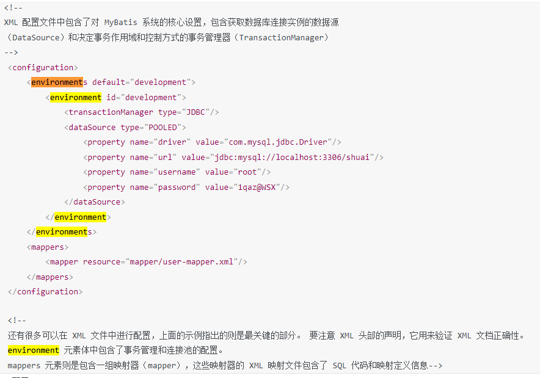
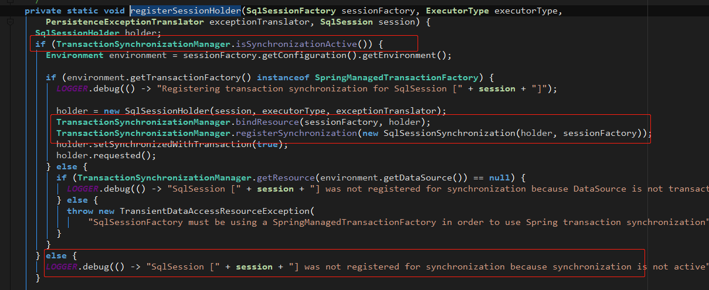

###  先说结论

​	Spring整合mybatis之后，所使用的sqlsession并不是mybatis的sqlsession，而是通过操作SqlSessionTemplate对象来处理的sqlsession（SqlSessionTemplate 实现了SqlSession接口），该SqlSessionTemplate对象是通过动态代理的方式经过它的代理类SqlSessionInterceptor增强后的，才来执行真正的sql操作（mapper映射）的，同时还会执行一些代码增强，例如创建sqlsession和关闭sqlsession。所以在整合之后是不需要我们手动关闭sqlsession的

1. ​	如果是非事务操作数据库的时候，例如查询，每执行完一条语句都会创建和关闭新的sqlsession，不会从会话保持器中复用sqlsession。同时还会强制提交commit

2. 如果是事务操作则可能会复用sqlsession（事务如果执行很快也会存在后续事务操作无法复用sqlsession的情况），同时commit和关闭操作交由事务同步管理器负责。

3. 待验证理论：由于本地一级缓存是sqlsession级别的，而非事务的查询每次都会创建新的sqlsession，是不是意味着在为开启事物的时候不会应用一起缓存？

   

### （1） SqlSessionTemplate 代理的源码分析：

​	SqlSessionTemplate 实现了sqlSession的接口，因此我们可以把它当做sqlSeesion来使用：

```java
public class SqlSessionTemplate implements SqlSession, DisposableBean {
    ...
// SqlSessionTemplate类的构造函数
public SqlSessionTemplate(SqlSessionFactory sqlSessionFactory, ExecutorType executorType,
      PersistenceExceptionTranslator exceptionTranslator) {

    notNull(sqlSessionFactory, "Property 'sqlSessionFactory' is required");
    notNull(executorType, "Property 'executorType' is required");

    this.sqlSessionFactory = sqlSessionFactory;
    this.executorType = executorType;
    this.exceptionTranslator = exceptionTranslator;
    
    // java 接口代理 SqlSessionFactory为被代理对象 SqlSessionInterceptor为代理对象，实现了InvocationHandler代理处理接口
    this.sqlSessionProxy = (SqlSession) newProxyInstance(
        SqlSessionFactory.class.getClassLoader(),
        new Class[] { SqlSession.class },
        new SqlSessionInterceptor());
  }
    ...
}
```

### （2）SqlSessionInterceptor代理类源码分析	

   **SqlSessionInterceptor** 是 SqlSessionTemplate 的内部代理类，负责完成对SqlSessionTemplate 的代理，目的只有一个，就是处理多个 session 的db操作。所有请求都被 invoke() 拦截,从而做相应处理

　			1. 进入请求，先生成一个新的sqlSession，为本次db操作做准备；

　　　　2. 通过反射调用请求进来的方法，将 sqlSession 回调，进行复杂查询及结果映射；

　　　　*3. 如果会话是被spring管理的则返回true，否则返回false，意味着不被spring事务管理的sqlsession此处会被强制提交。*

　　　　4.  如果出现异常，包装异常信息，重新抛出；

　　　　5. 最后在finally中调用closeSqlSession关闭本次sqlsession；

```java
private class SqlSessionInterceptor implements InvocationHandler {
  @Override
  public Object invoke(Object proxy, Method method, Object[] args) throws Throwable {
      // 1进入请求，先生成一个新的sqlSession，为本次db操作做准备
    SqlSession sqlSession = getSqlSession(
        SqlSessionTemplate.this.sqlSessionFactory,
        SqlSessionTemplate.this.executorType,
        SqlSessionTemplate.this.exceptionTranslator);
      
      
    try {        
        // 2 通过反射调用请求进来的方法，将 sqlSession 回调，进行复杂查询及结果映射（原sql操作）
      Object result = method.invoke(sqlSession, args);
        // 3 如果会话是被spring管理的则返回true，否则返回false，意味着不被spring事务管理的sqlsession此处会被强制提交
      if (!isSqlSessionTransactional(sqlSession, SqlSessionTemplate.this.sqlSessionFactory)) {
        sqlSession.commit(true);
      }
        // 4 返回执行结果，下面也会执行finally里的closeSqlSession操作
      return result;
    }     
      catch (Throwable t) {
          
          // 5 如果出现异常，包装异常信息，重新抛出；
      Throwable unwrapped = unwrapThrowable(t);
      if (SqlSessionTemplate.this.exceptionTranslator != null && unwrapped instanceof PersistenceException) {
        closeSqlSession(sqlSession, SqlSessionTemplate.this.sqlSessionFactory);
        sqlSession = null;
        Throwable translated = SqlSessionTemplate.this.exceptionTranslator.translateExceptionIfPossible((PersistenceException) unwrapped);
        if (translated != null) {
          unwrapped = translated;
        }
      }
      throw unwrapped;
    } finally {
      if (sqlSession != null) {
        // 6 最后的最后会调用 closeSqlSession 方法关闭sqlsession
        closeSqlSession(sqlSession, SqlSessionTemplate.this.sqlSessionFactory);
      }
    }
  }
}

  /**
   如果会话是事务性的且被spring管理的则返回true，否则返回false
   */
  public static boolean isSqlSessionTransactional(SqlSession session, SqlSessionFactory sessionFactory) {
    notNull(session, NO_SQL_SESSION_SPECIFIED);
    notNull(sessionFactory, NO_SQL_SESSION_FACTORY_SPECIFIED);

    SqlSessionHolder holder = (SqlSessionHolder) TransactionSynchronizationManager.getResource(sessionFactory);

    return (holder != null) && (holder.getSqlSession() == session);
  }

```

### （3）获取/创建sqlsession逻辑：

getSqlSession逻辑简单概括为：如果SqlSessionHolder中有sqlsession就从中取（达到复用链接的目的，但是其内部判断了只有事务性操作才返回holder，所以意味着非事务性操作永远返回没有），没有就通过DefaultSqlSessionFactory工厂创建新的sqlsession实例

1. 在調用進來時首先會調用同步事务管理器中的getResource方法获取SqlSessionHolder会话保持器中，然后拿到会话保持器的sqlsession，如果沒有获取到会话保持器，才會去創建新的sqlsession（**創建新的sqlsession時必打印創建日志Creating a new SqlSession**）
2. 创建sqlsession是通过DefaultSqlSessionFactory进行创建的（sqlsessionfatory一般是属于应用程序生命周期，通过配置创建）
3. 调用registerSessionHolder方法,将sqlSession 绑定到sqlSessionHolder会话保持器中，然后将会话保持器构造成SqlSessionSynchronization对象放进TransactionSynchronizationManager同步事务管理器中的Threadlocal容器中（所以事务操作是线程安全的）（发生这一切的前提是存在事务的定义，否则就直接返回sqlsession）
4. 最后返回sqlsession

```java
// getSqlSession 源碼逻辑
public static SqlSession getSqlSession(SqlSessionFactory sessionFactory, ExecutorType executorType, PersistenceExceptionTranslator exceptionTranslator) {

  notNull(sessionFactory, NO_SQL_SESSION_FACTORY_SPECIFIED);
  notNull(executorType, NO_EXECUTOR_TYPE_SPECIFIED);
//1 在調用進來時首先會調用getResource獲取SqlSessionHolder会话保持器（然后获取之前被绑定的sqlsession），如果没有会话保持器材才去創建新的sqlsession，如果有就直接返回该sqlsession 。达到复用目的
  SqlSessionHolder holder = (SqlSessionHolder) TransactionSynchronizationManager.getResource(sessionFactory);
  SqlSession session = sessionHolder(executorType, holder);
  if (session != null) {
    return session;
  }
//2 如果沒有才會去創建sqlsession（創建時必打印創建日志）
  LOGGER.debug(() -> "Creating a new SqlSession");
//3 创建sqlsession是通过DefaultSqlSessionFactory进行创建的（sqlsessionfatory一般是属于应用程序生命周期，通过配置创建）
  session = sessionFactory.openSession(executorType);
//4 方法内部会判断当前是否存在事务（Environment环境变量），如果存在就将sqlSession 绑定到sqlSessionHolder会话保持器中，然后将会话保持器构造成SqlSessionSynchronization对象放进TransactionSynchronizationManager同步事务管理器中的Threadlocal中 
  registerSessionHolder(sessionFactory, executorType, exceptionTranslator, session);
//5 最後返回創建的sqlsession
  return session;
}
```


### (4）创建新的sqlsession源码分析：sessionFactory.openSession()方法

（1）先看一个mybatis的配置：



（2）分析 DefaultSqlSessionFactory工厂类创建sqlsession的 sessionFactory.openSession(executorType)方法，最终该方法会调用到openSessionFromDataSource方法中。该方法做了几件事：

1. 根据环境配置Environment，开启一个新事务，该事务管理器会负责后续jdbc连接管理工作；

  2. 根据事务创建一个 Executor，备用；
  3. 创建一个DefaultSqlSession对象（该类实现了sqlsession接口所以是一个sqlsession），并将 executor 包装后返回，用于后续真正的db操作；至此sqlsession被创建了。

```java
public class DefaultSqlSessionFactory implements SqlSessionFactory {
    .....
    private SqlSession openSessionFromDataSource(ExecutorType execType, TransactionIsolationLevel level, boolean autoCommit) {
      Transaction tx = null;
      try {
        // 1 根据环境配置Environment，开启一个新事务，该事务管理器会负责后续jdbc连接管理工作；
        final Environment environment = configuration.getEnvironment();
        final TransactionFactory transactionFactory = getTransactionFactoryFromEnvironment(environment);
        tx = transactionFactory.newTransaction(environment.getDataSource(), level, autoCommit);
          // 2 根据事务创建一个 Executor，备用
        final Executor executor = configuration.newExecutor(tx, execType);
          // 3 创建一个DefaultSqlSession对象，并将 executor 包装后返回，用于后续真正的db操作；至此sqlsession被创建了。
        return new DefaultSqlSession(configuration, executor, autoCommit);
      } catch (Exception e) {
        closeTransaction(tx); // may have fetched a connection so lets call close()
        throw ExceptionFactory.wrapException("Error opening session.  Cause: " + e, e);
      } finally {
        ErrorContext.instance().reset();
      }
    }
    ...
}
```


​	

###  (5) SqlSessionHolder 会话保持器 和  TransactionSynchronizationManager 事务同步管理类以及RegisterSessionHolder 方法详解：

​	在创建完sqlsession之后会调用**registerSessionHolder**方法，该内部会判断当前是否存在事务（Environment环境变量），如果存在就将sqlSession 绑定到sqlSessionHolder会话保持器中，然后将会话保持器构造成SqlSessionSynchronization对象放进TransactionSynchronizationManager同步事务管理器中的Threadlocal容器中 



​	**TransactionSynchronizationManager 同步事务管理类**代码内部维护了一个Threadlocal的同步列表：

```java
public abstract class TransactionSynchronizationManager {
...
private static final ThreadLocal<Map<Object, Object>> resources =
			new NamedThreadLocal<>("Transactional resources");
// Threadlocal的同步容器，线程安全，存放事务类型的sqlsession会话保持其 hodel
private static final ThreadLocal<Set<TransactionSynchronization>> synchronizations =
			new NamedThreadLocal<>("Transaction synchronizations");
...
	public static void registerSynchronization(TransactionSynchronization synchronization)
			throws IllegalStateException {

		Assert.notNull(synchronization, "TransactionSynchronization must not be null");
		if (!isSynchronizationActive()) {
			throw new IllegalStateException("Transaction synchronization is not active");
		}
		synchronizations.get().add(synchronization);
	}
	
...

}
```

### (6）代理类中closeSqlSession 源码分析：

```java
//关闭sqlsession的代码
 public static void closeSqlSession(SqlSession session, SqlSessionFactory sessionFactory) {
    notNull(session, NO_SQL_SESSION_SPECIFIED);
    notNull(sessionFactory, NO_SQL_SESSION_FACTORY_SPECIFIED);

    //如果SqlSession是被Spring的TransactionSynchronizationManager管理的只会调用holder的holder.released()方法更新引用计数器（-1），让Spring在托管事务结束时调用close回调.
    //如果不是被spring的TransactionSynchronizationManager管理的就直接关闭
    SqlSessionHolder holder = (SqlSessionHolder) TransactionSynchronizationManager.getResource(sessionFactory);
    
    if ((holder != null) && (holder.getSqlSession() == session)) {
      LOGGER.debug(() -> "Releasing transactional SqlSession [" + session + "]");
      holder.released();
    } else {
      LOGGER.debug(() -> "Closing non transactional SqlSession [" + session + "]");
      session.close();
    }

  }
```


时序图：


1. 


